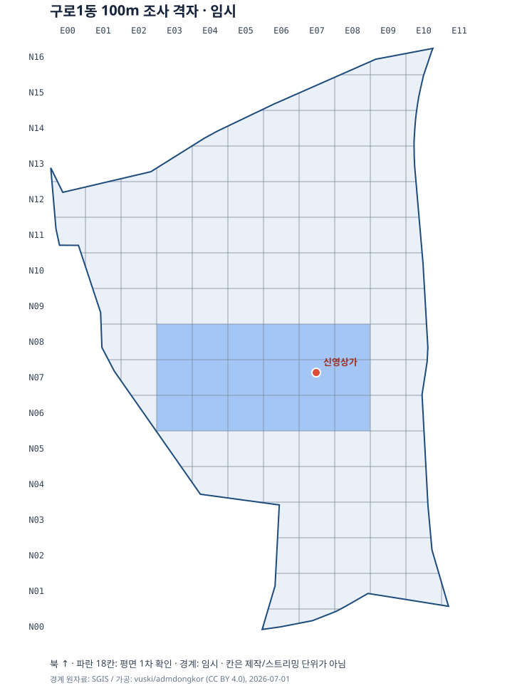

# 구로1동 100m 조사 격자

이 문서는 Korea 2050의 구일 맵을 구로1동 행정동 범위에서 조사하기 위한 좌표 색인이다. **행정경계 안을 가능한 한 플레이 가능하게 만든다**는 사용자 결정을 반영한다. 다만 100m 칸은 누락 없이 조사하기 위한 구획일 뿐, 건물·도로를 자르는 제작 단위나 Unreal의 스트리밍 셀이 아니다. 도로와 교차로는 칸을 넘어 하나의 연결망으로 관리한다.

## 현재 조사 상태

- 2026-09-30 전체 2D 작업 기준, 기존 **137칸 모두** 새 평면·항공 화면 1차 훑기 근거를 붙여 `plan_view_first_pass`로 갱신했다. 이전 신영상가 주변·서쪽 18칸 확인/119칸 미조사 상태는 각 칸의 역사 필드에 보존했다. 작은 경계 조각을 포함한 전체 평면도 색인은 **138칸**이며 추가 `G1-E03-N14`의 별도 판독은 미확인이다. `plan_view_first_pass`는 지도에 그려진 큰 배치를 확인했다는 뜻이며, 출입구·도로 높이·정확한 시설 귀속이나 실제 통행을 검증한 완료 상태가 아니다. **지상 상세 검증 완료는 0칸**이다.
- [전체 칸의 좌표와 경계 겹침 비율](guro1_grid_100m.json)에 각 칸의 ID, 100m 현지 평면좌표 범위, WGS84 중심 경도·위도, 조사 상태를 기록했다.
- 경계는 [SGIS 원자료를 가공한 2026-07-01 행정동 GeoJSON](https://github.com/vuski/admdongkor/blob/master/ver20260701/HangJeongDong_ver20260701.geojson)의 코드 `1153052000`을 임시로 사용했다. 같은 저장소의 2025-07-01판에서도 이 구역의 도형·간이 면적 계산값은 같았다. 계산값은 약 **1.083km²**인데, [구로구청 안내의 1.02km²](https://www.guro.go.kr/www/contents.do?key=1956)와 약 6% 다르다. 두 값의 산정 기준 차이인지 경계 자료 문제인지는 아직 해소되지 않았다. 공식 [SGIS 2025 기준 SHP](https://www.data.go.kr/data/15129688/fileData.do)와 코드를 대조하기 전까지 경계 끝 칸의 포함 여부와 실제 제작 배치의 근거로 확정하지 않는다.

## 좌표와 칸 번호

### 전체 2D 평면 구성도 · 2026-09-30

[전체 벡터 평면도 SVG](구로1동_2D평면도.svg), [데이터가 내장된 오프라인 HTML](구로1동_2D평면도.html), [기하·출처·칸별 건물/도로 색인 GeoJSON](guro1_plan_2d.geojson)을 만들었다. 조사 격자 그림과 달리 건물 외곽, 도로·보행로 중심선, 철도·하천, 학교와 단지 부지, 판독한 주차·운동장·도로면을 실제 위치에 표시한 **전체 배치 작업본**이다.

[공식 OSM 읽기 전용 지도 API](https://api.openstreetmap.org/api/0.6/map?bbox=126.867,37.4845,126.882,37.501)의 공개 원형 벡터 727개와 수기 보완 28개를 통합했다. 건물 분류 123개 가운데 **122개는 외곽 Polygon/MultiPolygon**, 1개는 외곽 없는 시설점이다. 도로 중심선 **153개**, 보행·자전거 선 91개, 철도 선 119개를 보존했으며, 추가 도로점 46개·철도점 56개는 신호·정류장·역 등 원본 태그에 따른 별도 점이다. 수기 보완의 건물 외곽은 북부 4개와 남부 3개이며, 나머지는 지면·포장면·철도 띠·판독 불가 영역이다. 수기 2개가 기존 건물들과 겹치는 구역은 대표 OSM 기하를 보존하고 대응 관찰만 별도로 기록했다. [OSM 하천 관계 4482990 전체](https://api.openstreetmap.org/api/0.6/relation/4482990/full)를 보충하여 잘린 원본 멤버 누락도 해소했다.

북부 70칸은 네이버 기본·항공 타일과 카카오 지도/항공을 새로 대조했고, 남부 67칸은 카카오 20/30/50m 및 네이버 위성 화면을 새로 관찰했다. Google 지도 일반·위성 화면에서는 북부·중앙·남부의 하천·간선도로·아파트/학교 띠·차량기지 큰 배치를 추가로 대조했다. 이는 **137칸의 화면 훑기**로 지상 상세 조사 완료는 0칸이다. JSON의 기존 `plan_view_first_pass` 18칸·`unscanned` 119칸 상태는 `survey_status_before_2026_09_30_full_plan`에 보존하고, 현재 137칸은 근거 있는 `plan_view_first_pass`로 갱신했다. 새 관찰 근거는 원 격자 JSON의 `plan_view_observations_2026_09_30` 및 2D GeoJSON의 `reference_map_observations`에 분리했다. 영상 촬영일과 세 서비스 원천의 독립성은 확인하지 않았다.

기존 칸 생성의 작은 면적 제외를 재계산하여 `G1-E03-N14`의 **0.37194973㎡** 경계 조각을 추가 색인했다. 따라서 전체 평면도의 경계 교차 칸은 **138칸**이고 기존 137개 ID는 모두 보존된다. 칸별 교차면적 합계 **1,083,276.0988536㎡**는 같은 원경계의 면적과 일치한다. 추가 조각의 개별 지도 판독은 미확인이다. 경계 자체의 구청 면적 차이는 해결한 것으로 표시하지 않는다.

보라색 작은 점은 **시설·점포·설비의 참고 위치**다. 우체국·주민센터·도서관·편의점·미용실·따릉이·쓰레기통 등 OSM 점 98개가 포함되며, 건물 외곽·정문·층수 표시가 아니다. 주황 외곽은 수기 추정이고 주황 사선 패치는 북부 항공 내부 판독 불가 영역이다. 서부간선지하도로 등 `tunnel=yes`는 지상 포장면과 구분한 회청색 점선이다. 남부 신구로유수지의 지면은 항공에서 식생·초지 형태로 판독한 추정 범위이며 조사일 수면이나 항상 통행 가능한 땅으로 확정하지 않는다. 도로 선의 굵기는 표시용이고 실제 차도·보도 폭은 미확인이다.

기하 폐합·유한 좌표·중복 ID·모든 칸의 색인·합계를 검사했고, 정적 SVG를 PNG로 렌더하여 전체 경계와 주요 명칭·남북 끝·범례가 잘리지 않는지 직접 확인했다. 실제 도로/철도 연결점은 원형을 보존하며, 공유 꼭짓점 없이 평면상 교차하는 223쌍은 높이·접속을 자동 확정하지 않는다. HTML의 스크립트 문법과 외부 의존성 없음은 검사했으나 브라우저의 `file:` 보안 제한 때문에 실제 팝업·확대·레이어 조작은 실행 검증하지 못했다. 높이·출입구·지반 높이·도로 폭은 `null`/미확인으로 유지했다. 공백의 누락 건물 수는 확정할 수 없으며 138칸 모두 완전성 미확인이다. 공개/외부 재배포 시 ODbL 출처 표시와 수기 참고 서비스의 이용 조건을 별도로 확인해야 한다.

`python tools/build_guro1_plan.py`로 보존된 `exports/guro1_2d/source.osm`·하천 보충 원본과 북/남 보완 입력으로 재생성한다. 이번 작업에서는 게임 텍스처용 지도/항공 타일, 추가 3D 기능, Git 커밋·푸시를 생성하지 않았다.

경도 126.868°, 위도 37.485°를 임시 남서쪽 원점으로 잡았다. 동쪽을 `E`, 북쪽을 `N`으로 하고, 각 방향을 100m씩 나눈다. `G1-E07-N07`은 동쪽 700–800m, 북쪽 700–800m인 칸이다. 이 평면 환산은 좁은 조사 범위에서 쓰는 근사값이며 공식 투영좌표계 EPSG:5179나 지적 측량값이 아니다. Unreal에 넣을 때는 공식 도로·경계 자료의 좌표계와 공통 원점을 다시 맞춘다.

| 기준 | 값 |
| --- | --- |
| 원점 WGS84 경도·위도 | 126.8680000, 37.4850000 |
| 현지 환산 | 경도 1° ≈ 88,433.6666m, 위도 1° ≈ 110,986.8801m |
| 칸 번호 | `E = floor((경도 − 126.868) × 88433.6666 / 100)`; `N = floor((위도 − 37.485) × 110986.8801 / 100)` |
| 신영상가 주소 기준점 | 경도 126.8764581, 위도 37.4918818 → `G1-E07-N07` |

신영상가 기준점은 [구일로4길 30 주소 위치](https://findby.co.kr/details/08325-115304148291-st-652b6a728c641f9e38a5f21d)와 세 지도 검색 결과의 건물 위치가 부합하는지를 확인한 것이다. **점 하나가 건물의 외곽·정문 위치나 실측 크기를 확정하지는 않는다.** 경계가 걸치는 칸은 JSON의 `boundary_overlap_pct`로 구분하며, 경계 밖으로 이어지는 도로·시야는 필요한 만큼 함께 조사한다.

## 신영상가 주변 첫 9칸

아래 시설의 칸 귀속은 확대 지도에서 기준점과 주변 상대 위치를 읽은 **1차 추정**이다. 칸 경계에 걸친 시설을 한 칸의 소유물로 고정하지 않는다. 표의 좌표는 시설 좌표가 아니라 **칸 중심 좌표**다. 관찰된 명칭은 현재 지도 표기이며 2050년 게임의 상호·간판 결정이 아니다.

| 칸 ID | 중심 경도, 위도 | 2026-09-30 평면지도에서 보이는 특징 | 아직 확인할 것 |
| --- | --- | --- | --- |
| `G1-E06-N08` | 126.875350, 37.492659 | 신영상가 북서쪽. 네이버·카카오 지도에 GS25·구일쇼핑 등 소규모 점포와 아파트동 사이의 공간이 표시됨. | 점포동 외곽, 보행·차량 진출입, 실제 업종 시점 |
| `G1-E07-N08` | 126.876481, 37.492659 | 신영상가 북쪽 주 도로와 파리바게뜨·의원 표기가 있는 남북 방향 점포동, 횡단 표시가 보임. | 횡단 위치의 정확한 좌표, 점포동과 차도 폭 |
| `G1-E08-N08` | 126.877612, 37.492659 | 주 도로 동쪽의 현대연예인아파트 205동 일대와 단지 안쪽 도로·주차 공간이 보임. | 단지 도로의 실제 연결·통행 제약 |
| `G1-E06-N07` | 126.875350, 37.491758 | 신영상가 서쪽의 구로주공아파트 113동 및 점포·주차 공간 일부가 보임. | 건물 외곽과 보도 경계, 남쪽 도로 연결 |
| `G1-E07-N07` | 126.876481, 37.491758 | **신영상가 주소 기준점**이 이 칸에 있다. 네이버·카카오 평면도는 동서로 긴 건물 윤곽과 서쪽 남북 도로를, 구글어스 항공 화면은 건물 지붕과 주변 단지 배치를 보여 준다. | 정확한 외곽·높이·정문/옆문/지하 입구 좌표는 별도 사진·현장 확인 |
| `G1-E08-N07` | 126.877612, 37.491758 | 신영상가의 동쪽으로 단지 내부 도로·주차 공간이 이어지는 구역이 보임. | 신영상가 건물이 칸 경계를 넘는지, 접근 가능한 길인지 |
| `G1-E06-N06` | 126.875350, 37.490857 | 신영상가 남서쪽의 아파트 가장자리와 굽은 동서 방향 도로가 보임. | 횡단·보행 연결과 경사 |
| `G1-E07-N06` | 126.876481, 37.490857 | 신영상가 남쪽 이마트24 표기와 구로주공2차아파트 114동 접근로가 보임. | 점포동 정확한 위치와 차량·보행 동선 |
| `G1-E08-N06` | 126.877612, 37.490857 | 114동 및 단지 주차·내부도로가 계속되는 구역으로 보임. | 단지 동선이 동쪽·남쪽에서 어떻게 연결되는지 |

위 표는 지도에 보이는 **평면 배치**를 기록한 것이다. 신영상가 정문 밖에 계단이 없고, 문 안쪽에서 왼쪽으로 꺾어 계단으로 간다는 사용자 확인은 [기존 제작설계](2050_신영상가_제작설계.md)에 보존한다. 평면지도만으로 출입구·간판 수·층고·보도 턱을 확정하지 않는다.

## 지도별 대조 결과와 한계

| 자료 | 이번에 확인한 내용 | 이번 자료만으로 확정하지 않는 내용 |
| --- | --- | --- |
| [카카오맵 신영상가 장소](https://place.map.kakao.com/14969389) | 신영상가 위치, 주변 점포·아파트 표기, 건물과 도로의 상대 배치 | 외벽·출입구 치수, 점포 현재 영업 여부 |
| [네이버지도 신영상가 검색](https://map.naver.com/p/search/%EC%8B%A0%EC%98%81%EC%83%81%EA%B0%80%20%EA%B5%AC%EB%A1%9C%EB%8F%99) | 가장 가까운 평면 배율에서 건물 윤곽, 111·113·114·205동, GS25·파리바게뜨·이마트24 표기와 단지 도로 | 건물 외곽의 실측 좌표, 모든 통행 가능 여부 |
| [구글지도 신영상가 검색](https://www.google.com/maps/search/%EC%8B%A0%EC%98%81%EC%83%81%EA%B0%80+%EA%B5%AC%EB%A1%9C%EB%8F%99) | 구일로4길과 남부순환로 쪽 연결 방향, 건물 주소 검색 | 이 배율의 세부 건물 외곽. 화면에는 TMap Mobility 지도 데이터 표기가 있어 세 지도가 완전히 독립된 근거라고 가정하지 않음 |
| [구글어스 신영상가 주소 검색](https://earth.google.com/web/search/%EC%84%9C%EC%9A%B8%20%EA%B5%AC%EB%A1%9C%EA%B5%AC%20%EA%B5%AC%EC%9D%BC%EB%A1%9C4%EA%B8%B8%2030) | 위에서 본 신영상가·아파트 지붕, 안양천 쪽 간선도로, 동쪽 철도 시설의 상대 배치 | 시설 내부, 가려진 보행통로, 2050년 변화. 화면의 날짜 표기만으로 개별 영상 촬영일을 단정하지 않음 |

세 평면지도 대조는 9칸의 **첫 훑기**이지 전 칸의 정밀 스캔 완료가 아니다. 로드뷰/거리뷰는 각 길의 양쪽, 촬영 시점, 바라본 방향을 따로 기록한다. 접근 불가 공간은 구글어스 등 위성·항공 시점으로 지붕·외곽을 조사하지만, 보이지 않는 내부 동선은 `미확인` 또는 `2050년 창작`으로 둔다. 지도 화면과 항공 영상을 원본 게임 텍스처로 저장하거나 복제하지 않는다.

### 서쪽 인접 구역: 이전 확대 지도 예비 관찰

신영상가에서 서쪽으로 지도를 이동해 네이버·카카오의 20m 축척 화면과 구글의 50m 축척 화면을 확인했다. 세 화면에서 공통으로 신영상가 서쪽 아파트 단지, 구로1동 우체국 부근, 남서쪽의 큰 도로 연결이 보인다. 네이버·카카오에서는 110·111·112·113동, 놀이터, 단지 내 주차 구획이 더 구체적으로 표시된다. 카카오는 남서쪽 큰 도로에 `남부순환로`, 그 곁 도로에 `구일로`를 표시하고, 구글은 `남부순환로`와 `구일로4길`의 연결 방향을 보여 준다.

이 예비 관찰은 서쪽의 `G1-E03~E05-N06~N08`을 조사할 때 사용할 **구역 단위 메모**였다. 각 시설의 칸 귀속, 교차로의 높이 차이, 도로·보도의 정확한 폭, 단지 밖으로 통하는 출입구를 확인하지 않아 당시 9칸의 JSON 상태는 `unscanned`으로 유지했다. 구글어스는 앞서 신영상가 주변의 지붕·큰 배치를 확인하는 데 사용했으나, 서쪽 9칸을 독립적으로 세부 판독한 근거는 아니다. 아래 기록은 이 예비 메모와 별도로 좌표를 맞춰 수행한 서쪽 9칸의 1차 조사다.

### 서쪽 9칸: 좌표를 맞춘 지도별 1차 조사 · 2026-09-30

**대상은 아파트 단지만이 아니다.** JSON의 범위는 동쪽 300–600m, 북쪽 600–900m이고 WGS84로 경도 **126.8713924–126.8747847**, 위도 **37.4904060–37.4931091**이다. 이 범위에 간선도로·학교 부지·아파트 주변·유수지 주변의 지도 표현이 함께 보인다. 이전 메모의 111·113동 등 서쪽 주변 시설 목록을 이 9칸에 일괄 배정하지 않는다.

이번 환경에서는 지도 브라우저 연결을 사용할 수 없어 **공개 지도 타일을 임시 폴더에서 이어 보고, JSON의 칸 모서리를 지도 투영으로 환산해 겹쳐 판독했다.** 네이버·구글은 Web Mercator, 카카오는 [공개 지도 좌표 정의 4.5.26](https://t1.kakaocdn.net/mapjsapi/js/main/4.5.26/v3.js)를 적용했다. 학교 부지, 사성교 쪽 도로, 우체국 주변의 상대 배치를 서로 대조했다. 이것은 임시 선형 격자와 지도 그림의 대조이지 지적·도로경계 측량이 아니다. 지도 글자·POI 아이콘 위치를 실제 시설의 중심·외곽·출입구 좌표로 옮기지 않는다.

#### 이번에 읽은 자료와 재확인 범위

아래 N·K·G·A는 이 절의 출처 구분이다. 접근일은 모두 2026-09-30이며 지도 갱신일·항공 촬영일과 구분한다. 타일 원본과 격자를 겹친 판독용 이미지는 임시 폴더에만 두었고 저장소·게임 에셋에 포함하지 않았다.

| 출처 | 직접 판독한 자료와 범위 | 확인 범위·한계 |
| --- | --- | --- |
| N: 네이버 평면지도 | [공개 기본지도 타일 정의](https://map.pstatic.net/nrb/styles/basic.json?fmt=png), 버전 `1790162807`, z18, x223455–223460 / y101582–101586. [학교 주변 타일 예](https://map.pstatic.net/nrb/styles/basic/1790162807/18/223457/101583.png), [남쪽 타일 예](https://map.pstatic.net/nrb/styles/basic/1790162807/18/223458/101585.png) | 건물·도로·시설 표기와 유수지 주변의 녹색 면 표현. 버전 번호를 조사일이나 지형의 현황일로 해석하지 않음 |
| K: 카카오 평면지도 | `PNGSD02/v24_i96n0/latest`, L2, x1707–1711 / y3932–3936. [학교 주변 타일 예](https://mts.kakaocdn.net/api/v1/tile/PNGSD02/v24_i96n0/latest/2/3935/1709.png), [우체국 주변 타일 예](https://mts.kakaocdn.net/api/v1/tile/PNGSD02/v24_i96n0/latest/2/3934/1709.png), [남쪽 타일 예](https://mts.kakaocdn.net/api/v1/tile/PNGSD02/v24_i96n0/latest/2/3933/1709.png) | 학교 운동장·아파트동·주차 구획·유수지의 파란 면 표현. `latest` 자료는 이후 갱신될 수 있음 |
| G: 구글 평면지도 | 기본지도 `lyrs=m`, 한국어, z18, x223455–223460 / y101582–101586. [학교 주변 타일 예](https://mt1.google.com/vt/lyrs=m&hl=ko&x=223457&y=101583&z=18), [남쪽 타일 예](https://mt1.google.com/vt/lyrs=m&hl=ko&x=223458&y=101585&z=18) | 학교·우체국·도로와 유수지의 큰 배치. 세부 동 번호·단지 주차 구획은 N·K보다 덜 구체적이며, 도로명이 놓이는 면도 다름 |
| A: 카카오 항공 | `map_skyview/L2`, x1707–1711 / y3932–3936, URL의 `v=160114`. [도로 교차부 타일 예](https://map.kakaocdn.net/map_skyview/L2/3934/1708.jpg?v=160114), [유수지 주변 타일 예](https://map.kakaocdn.net/map_skyview/L2/3933/1709.jpg?v=160114) | 지붕·운동장·도로 띠·식생이 보이는 저지대의 큰 형태. **촬영일 미확인**이며 URL 버전을 촬영 날짜로 읽지 않음. 건물 그림자·수목 때문에 지상 경계와 통로 판독에 한계가 있음 |
| 보조 공식 자료 | [우정사업본부 관할우체국 안내](https://www.koreapost.go.kr/154/subIndex/4291.do) | 서울구로1동우체국의 주소 **서울 구로구 구일로 64**를 확인. 주소는 출입구나 건물 외곽의 좌표 근거가 아님 |

N·K·G는 서로 다른 서비스의 지도 표현을 대조한 것이다. 이번 타일만으로 원천 데이터 제공처의 독립성을 확인하지 못했고, A도 카카오의 별도 항공 레이어이지 독립된 현장 조사나 높이 측정이 아니다. 구글어스·네이버 거리뷰·카카오 로드뷰의 서쪽 9칸 신규 판독은 수행하지 않았다.

#### 칸별 관찰

좌표는 기존 JSON의 **칸 중심**이며 시설 좌표가 아니다. 표는 해당 칸에서 판독한 **지도 그림과 영상의 큰 배치**를 기록한다. 건물 번호·시설명은 보이는 표기를 인용하며, 시설 전체를 특정 칸에 귀속하거나 경계에 걸친 시설의 범위를 확정하지 않는다.

| 칸 ID | 중심 경도, 위도 | N: 네이버 | K: 카카오 | G: 구글 | A: 카카오 항공 / 대조 결과 |
| --- | --- | --- | --- | --- | --- |
| `G1-E03-N08` | 126.871958, 37.492659 | 남북 서부간선도로 띠와 구일초교앞 쪽 굽은 연결도로, 동쪽 학교 부지 가장자리 표현 | 남북 도로와 굽은 연결도로, 구일초교앞 교차로 표기 | 남북 간선도로와 구일초교앞 쪽 연결 방향, 학교 부지 서쪽 표현 | 남북 차로와 굽은 도로 띠, 학교 쪽 건물·수목이 보임. 큰 배치는 부합하나 도로명이 붙는 면과 실제 차로 연결은 별도 확인 필요 |
| `G1-E04-N08` | 126.873089, 37.492659 | 구일초등학교 표기와 학교 부지의 큰 윤곽, 남쪽 사선 도로 표현 | 서울구일초등학교 표기, 운동장과 둘레 건물 표현 | 서울구일초등학교 표기와 부지 윤곽 | 운동장 형태의 밝은 면과 둘레 지붕이 보임. 학교 부지의 큰 배치는 부합하며 담장·교문·보도 연결은 미확인 |
| `G1-E05-N08` | 126.874219, 37.492659 | 108·110동 표기와 동 사이 주차·내부도로 표현 | 108·110동 표기, 주차 구획과 둘레 내부도로 표현 | 긴 아파트 건물 윤곽은 보이나 동 번호 판독은 부족 | 동서로 긴 지붕 두 줄과 그 사이 차량·포장 공간이 보임. 각 동 외곽의 실제 격자 교차 범위와 단지 통행 조건은 미확인 |
| `G1-E03-N07` | 126.871958, 37.491758 | 사성교/남부순환로의 동서 도로 표현과 남북 도로 표현이 겹침 | 사성교·남부순환로 표기와 남북 도로 표현이 겹침 | 사성교·남부순환로와 남북 간선도로 표현이 겹침 | 교량 형태와 남북 차로가 보임. 교차하는 큰 형태는 부합하지만 각 차로의 상하 관계·높이·진입 가능성은 확정하지 않음 |
| `G1-E04-N07` | 126.873089, 37.491758 | 북서→남동의 넓은 도로 띠와 그 남쪽 녹색 면·좁은 선형 통로 표현 | 같은 방향 도로 띠, 남쪽 유수지 가장자리와 선형 통로 표현 | 남부순환로·구일로 표기가 있는 평행 도로 띠, 남쪽 유수지 표현 | 여러 도로 띠와 저지대 경계가 보임. 어떤 띠가 본선·옆길·보행로인지, 연결되는 높이와 통행은 미확인 |
| `G1-E05-N07` | 126.874219, 37.491758 | 우체국 표기 주변 작은 건물·놀이터·112동 표기와 남서쪽 도로 띠 | 서울구로1동우체국·놀이터·112동 표기와 남서쪽 도로 띠 | 서울구로1동우체국 표기와 건물 윤곽, 사선 도로 띠 | 작은 지붕과 아파트 주변 식재·포장 공간, 남서쪽 도로가 보임. 우체국 주변 큰 배치는 부합하며 POI 아이콘으로 정확한 시설 귀속·출입구를 정하지 않음 |
| `G1-E03-N06` | 126.871958, 37.490857 | 남북 간선도로와 하천변·녹지 띠가 이어짐 | 남북 간선도로와 하천변 띠가 이어짐 | 서부간선도로·서부간선지하도로 등의 표기와 하천변 띠 | 남북 차로와 하천변 식생·선형 통로가 보임. 지하도로 표기를 지상 출입 지점이나 보행 가능 통로로 바꾸지 않음 |
| `G1-E04-N06` | 126.873089, 37.490857 | 서쪽 가장자리의 신구로빗물펌프장 표기·건물 표현, 넓은 녹색 면 | 서쪽 건물/설비 형태와 넓은 파란 유수지 면 | 신구로빗물펌프장 표기·건물 표현과 파란 유수지 면 | 서쪽 긴 건물/설비와 식생이 보이는 저지대. **녹지/수면 표현 차이 미해소**. 설비 용도·외곽·시설 전체의 칸 귀속은 미확인 |
| `G1-E05-N06` | 126.874219, 37.490857 | 넓은 녹색 면과 북동쪽 사선 도로 표현 | 넓은 파란 유수지 면과 북동쪽 사선 도로 표현 | 파란 유수지 면과 동쪽 사선 도로 표현 | 넓은 식생 면과 도로 띠가 보임. **녹지/수면 표현 차이 미해소**. 조사일 실제 수면 범위·지반 높이·접근 가능한 길은 미확인 |

#### 확정하지 않은 값과 남은 대조

- **출입구·통행:** 교문, 아파트 차량문·보행문, 우체국 출입구, 하천·유수지 접근로의 정확한 위치와 개방 여부는 9칸 모두 미확인이다. 그림의 빈틈·내부도로·항공의 포장면을 실제 출입구나 공공 보행로로 지정하지 않는다.
- **도로 높이:** 사성교/남부순환로, 남북 간선도로, 평행 옆길·램프의 높이 값과 경사, 차로별 상하 연결은 미확인이다. 도로명이 중복되거나 평면상 겹친다고 같은 높이의 교차로·직접 연결로 만들지 않는다. 향후 거리 수준 영상과 공식 도로·구조물 자료가 필요하다.
- **시설 위치:** 학교·108/110/112동·놀이터·우체국·펌프장의 정확한 외곽과 각 칸에 걸치는 범위는 미확인이다. 칸 중심을 시설 좌표로 쓰거나 지도 글자·주소 하나로 시설의 소속 칸을 확정하지 않는다.
- **유수지 표현 차이:** N의 녹색 면, K·G의 파란 면, A의 식생 면은 자료 시점·지도 표현 방식의 차이일 수 있으나 원인은 확인하지 못했다. 항공 촬영일과 조사일 수위가 없으므로 '항상 물', '현재 마른 땅', '통행 가능' 중 어느 것으로도 확정하지 않는다.

이번 9칸은 JSON에서 `unscanned` → `plan_view_first_pass`로만 변경한다. 미확인 높이를 0, 미확인 출입구를 '없음', 미확인 시설 위치를 임의 좌표로 채우지 않았다. 임시 행정경계의 면적 차이와 최종 제작 좌표계 문제도 그대로 남아 있다.

## 다음 조사와 제작 연결

1. 공식 행정동 SHP와 도로 중심선·도로경계 자료를 확보해 이 임시 100m 격자와 여러 떨어진 기준점을 대조한다. 특히 1.083km²와 1.02km² 차이를 해결한다.
2. 첫 9칸의 도로·교차로를 칸과 별개의 `R`·`J` ID로 잇고, 도로 양쪽 보도·횡단·진출입·큰 높낮이를 확인한다. 미확인값은 0이나 '없음'으로 채우지 않는다.
3. 신영상가를 포함한 이동 경로만 단순 배치하고, 게임에서 왕복 이동과 외부 미션을 시험한다. 이 시험 뒤 인접 칸을 같은 형식으로 조사해 붙인다. 전체 137칸을 먼저 상세 모델링하지 않는다.

경계 안은 가능한 한 플레이 구역으로 계획한다. 다만 실제 철도·차량기지, 하천, 사유 단지 등의 현실 접근 제한을 **현재 통행 가능**으로 오기하지 않는다. 2050년 게임에서 통행 가능하게 바꾸면 해당 구간에 `창작/플레이용 변경`을 표시한다.

## 경계 데이터 출처와 이용 조건

본 격자의 경계는 통계청 통계지리정보서비스([SGIS](https://sgis.kostat.go.kr))에서 공공누리 제1유형으로 개방한 행정동 경계를 가공한 [vuski/admdongkor](https://github.com/vuski/admdongkor)의 2026-07-01 자료를 사용했다. 가공 부분은 [CC BY 4.0](https://github.com/vuski/admdongkor/blob/master/LICENSE-DATA)으로 배포된다. 경계 정확성·완전성은 보증되지 않으며 본 문서는 공식 경계 대조 전의 작업 색인이다.

<!-- GURO1_BLOCK_DETAILS_BEGIN -->
## 블록별 상세 기록 · 2026-09-30

[138칸 전체 상세 JSON](guro1_block_details.json)에 모든 기하 목록·셀 내 상대 위치·용도 태그·교량/지하 단서·방향별 인접 칸 지속·출처·미확인 값을 기록했다. 아래는 각 칸을 읽기 위한 요약이며 원경위도/현지좌표와 개별 기하의 전체 상세는 JSON을 기준으로 한다.

전체 **138칸**, 원형 기하 **755개**를 빠짐없이 색인했다. 길이·면적·주축·상대위치는 기존 지도 벡터를 계산한 **파생값**이고, 북/남 담당의 문장은 출처 기록을 해석한 **개별 메모**로 분리했다. 상세 지상 조사 완료는 **0칸**이다. 경계 밖 문맥 기하도 셀 사각형에 걸칠 수 있으므로 JSON의 `admin_part_relationship`을 함께 읽는다. 원본 이름·태그 없음이나 외곽 누락은 실제 공터·건물 없음의 증거가 아니다.

북/남 개별 메모 수신: **138칸**. 미수신 칸: 없음. 신규 `G1-E03-N14`의 0.37194973㎡ 조각은 별도 미관찰 상태를 유지한다. 모든 동일 원형의 옆 칸 지속은 **평면 기하의 지속**이며 같은 높이·실제 교차로·통행 가능을 확인한 것이 아니다. 높이·층수·도로/보도 폭·지하 깊이·출입구는 미확인으로 두었으며 이 단계에서 3D 또는 임시 높이를 만들지 않았다.

높이·층수 관련 원본 태그가 있는 기하는 **72개**이다. 이는 미검증 원본 표기로 JSON에 보존한 것이며 실제 높이·층수 확인값과 다르다. 원형 전체의 PCA 장축은 L/U형의 익 방향이나 3D 회전값으로 쓰지 않는다. 칸 내 길 방향은 경계 교집합의 개별 직선분 계산으로 별도 기록했다.

개별 메모 본문·문장별 출처·판독 한계는 상세 JSON에 내장했다. `exports`의 지역 입력 캐시가 없는 PC에서는 같은 평면도 SHA의 기존 JSON에서 메모와 출처 명세를 복구해 재생성하며, 복구할 수 없거나 평면도 SHA가 다르면 상세 문서를 덮어쓰기 전에 오류로 중단한다.

### G1-E08-N16

좌표: E 800–900m / N 1600–1700m; WGS84 (126.8770463, 37.4994161)–(126.8781771, 37.5003171). 임시 경계 교차 1560.8590㎡ (15.608590%). 셀 내 행정경계 부분: 건물 외곽 0개 / 도로선 0개 / 보행선 0개 / 철도선 1개. 사각형에만 걸치는 경계 밖 참고 기하 4개는 위 수와 구별했다. 각 수는 원형 ID의 교차 색인이며 시설 개수를 중복 합산하는 기준이 아니다.

- **지도·항공 판독:** 경계 안쪽은 칸 남쪽의 가는 삼각 띠이며, 남서에서 북동으로 뻗는 철도 회랑 가장자리가 지나갑니다.
- **지도·항공 판독:** 북서쪽의 큰 지붕은 청록색 행정경계 밖에 있으므로 이 칸의 내부 건물로 귀속하지 않았습니다.
- **기하 계산 보조:** 경계 교집합 계산에서 원형의 '수도권광역급행철도비선'의 이 칸 내부 부분은 동쪽·남쪽에 놓이고 원형 전체의 계산 장축은 북동↔남서입니다. 동일 원형이 G1-E09-N16·G1-E08-N15에도 걸칩니다. 이는 지리 원형의 연속이며 실제 출입·같은 높이·통행 연결을 뜻하지 않습니다.
- **계산 배치 보조:** 동 구역: 수도권광역급행철도비선; 남 구역: 수도권광역급행철도비선, 명칭 미기재 단지·토지 부지 1개; 중앙 구역: 명칭 미기재 단지·토지 부지 1개. 기하 부분의 상대 위치이며 시설 중심·출입구는 아니다.
- **이 칸 미확인:** 선로별 운영·정차 상태, 부속 지붕의 시설 귀속, 공개도로에서의 진입·통행 여부는 항공영상으로 확정하지 않았습니다.; 임시 행정경계 포함 비율 15.6086%를 기준으로 하였으며, 경계 밖 화면의 시설을 칸 내부로 귀속하지 않습니다..
- **후속 3D 확인 대상:** 향후 공개도로 로드뷰에서 철도 회랑의 보이는 외곽, 부속 지붕 형상과 도로 경계 외형을 확인합니다. 내부 진입은 전제하지 않습니다.. 지금 제작하거나 값을 확정한 기록은 아니다.
- **근거:** 상세 JSON의 `G1-E08-N16`에 원형 출처 URL 6개와 지역 메모·판독 출처를 완전 내장했다.

### G1-E09-N16

좌표: E 900–1000m / N 1600–1700m; WGS84 (126.8781771, 37.4994161)–(126.8793079, 37.5003171). 임시 경계 교차 5005.7026㎡ (50.057026%). 셀 내 행정경계 부분: 건물 외곽 0개 / 도로선 0개 / 보행선 0개 / 철도선 8개. 사각형에만 걸치는 경계 밖 참고 기하 2개는 위 수와 구별했다. 각 수는 원형 ID의 교차 색인이며 시설 개수를 중복 합산하는 기준이 아니다.

- **지도·항공 판독:** 경계 아래쪽 포함 부분에서 북동 방향 철도와 남북 선로군이 만나는 구도가 보입니다.
- **지도·항공 판독:** 서남쪽 선로 사이의 좁은 빈 지면과 수목 띠가 함께 보이며, 북쪽 공장 지붕은 경계 밖입니다.
- **기하 계산 보조:** 경계 교집합 계산에서 원형의 '구로기지선'의 이 칸 내부 부분은 중앙·남쪽에 놓이고 원형 전체의 계산 장축은 북동↔남서입니다. 동일 원형이 G1-E10-N16·G1-E09-N15에도 걸칩니다. 이는 지리 원형의 연속이며 실제 출입·같은 높이·통행 연결을 뜻하지 않습니다.
- **계산 배치 보조:** 동 구역: 경부제2선; 남 구역: 경부제2선, 경부선, 구로기지선, 명칭 미기재 단지·토지 부지 1개; 서 구역: 경부선, 수도권광역급행철도비선, 명칭 미기재 단지·토지 부지 1개; 중앙 구역: 경부제2선, 경부선, 구로기지선, 수도권광역급행철도비선, 명칭 미기재 단지·토지 부지 2개. 기하 부분의 상대 위치이며 시설 중심·출입구는 아니다.
- **이 칸 미확인:** 선로별 운영·정차 상태, 부속 지붕의 시설 귀속, 공개도로에서의 진입·통행 여부는 항공영상으로 확정하지 않았습니다.; 임시 행정경계 포함 비율 50.0570%를 기준으로 하였으며, 경계 밖 화면의 시설을 칸 내부로 귀속하지 않습니다..
- **후속 3D 확인 대상:** 향후 공개도로 로드뷰에서 철도 회랑의 보이는 외곽, 부속 지붕 형상과 도로 경계 외형을 확인합니다. 내부 진입은 전제하지 않습니다.. 지금 제작하거나 값을 확정한 기록은 아니다.
- **근거:** 상세 JSON의 `G1-E09-N16`에 원형 출처 URL 12개와 지역 메모·판독 출처를 완전 내장했다.

### G1-E10-N16

좌표: E 1000–1100m / N 1600–1700m; WGS84 (126.8793079, 37.4994161)–(126.8804387, 37.5003171). 임시 경계 교차 4097.1084㎡ (40.971084%). 셀 내 행정경계 부분: 건물 외곽 1개 / 도로선 0개 / 보행선 0개 / 철도선 3개. 사각형에만 걸치는 경계 밖 참고 기하 4개는 위 수와 구별했다. 각 수는 원형 ID의 교차 색인이며 시설 개수를 중복 합산하는 기준이 아니다.

- **지도·항공 판독:** 행정경계는 칸 북동쪽에서 꺾여 남쪽으로 내려가며 선로 띠의 서쪽 부분을 남깁니다.
- **지도·항공 판독:** 남북 선로 사이의 수목 띠가 남쪽 칸으로 이어지고, 동쪽의 신동아미래지움 표기는 경계 밖 참고입니다.
- **기하 계산 보조:** 경계 교집합 계산에서 원형 의 이 칸 내부 부분은 서쪽·남쪽에 놓이고 원형 전체의 계산 장축은 남북입니다. 동일 원형이 G1-E10-N15에도 걸칩니다. 이는 지리 원형의 연속이며 실제 출입·같은 높이·통행 연결을 뜻하지 않습니다.
- **계산 배치 보조:** 남 구역: 명칭 미기재 건물 1개; 서 구역: 경부제2선, 명칭 미기재 건물 1개; 중앙 구역: 경부선, 경부제2선, 명칭 미기재 단지·토지 부지 1개. 기하 부분의 상대 위치이며 시설 중심·출입구는 아니다.
- **이 칸 미확인:** 선로별 운영·정차 상태, 부속 지붕의 시설 귀속, 공개도로에서의 진입·통행 여부는 항공영상으로 확정하지 않았습니다.; 임시 행정경계 포함 비율 40.9711%를 기준으로 하였으며, 경계 밖 화면의 시설을 칸 내부로 귀속하지 않습니다..
- **후속 3D 확인 대상:** 향후 공개도로 로드뷰에서 철도 회랑의 보이는 외곽, 부속 지붕 형상과 도로 경계 외형을 확인합니다. 내부 진입은 전제하지 않습니다.. 지금 제작하거나 값을 확정한 기록은 아니다.
- **근거:** 상세 JSON의 `G1-E10-N16`에 원형 출처 URL 9개와 지역 메모·판독 출처를 완전 내장했다.

### G1-E05-N15

좌표: E 500–600m / N 1500–1600m; WGS84 (126.8736540, 37.4985151)–(126.8747847, 37.4994161). 임시 경계 교차 15.7336㎡ (0.157336%). 셀 내 행정경계 부분: 건물 외곽 0개 / 도로선 0개 / 보행선 0개 / 철도선 1개. 사각형에만 걸치는 경계 밖 참고 기하 2개는 위 수와 구별했다. 각 수는 원형 ID의 교차 색인이며 시설 개수를 중복 합산하는 기준이 아니다.

- **지도·항공 판독:** 포함 면적은 칸 남동 모서리 약 15.73㎡로, 대각선 철도 회랑과 행정경계가 거의 포개진 미세한 부분입니다.
- **지도·항공 판독:** 칸의 대부분에 보이는 대형 산업 지붕은 경계 밖이며, 작은 포함 조각의 세부 시설은 항공영상으로 분리 판독하지 못했습니다.
- **기하 계산 보조:** 경계 교집합 계산에서 원형의 '경인선'의 이 칸 내부 부분은 동쪽·남쪽에 놓이고 원형 전체의 계산 장축은 북동↔남서입니다. 동일 원형이 G1-E06-N15·G1-E05-N14에도 걸칩니다. 이는 지리 원형의 연속이며 실제 출입·같은 높이·통행 연결을 뜻하지 않습니다.
- **계산 배치 보조:** 동 구역: 경인선, 명칭 미기재 단지·토지 부지 1개; 남 구역: 경인선, 명칭 미기재 단지·토지 부지 1개. 기하 부분의 상대 위치이며 시설 중심·출입구는 아니다.
- **이 칸 미확인:** 포함 면적이 작은 경계 조각이므로 주변 화면은 판독했으나 조각 내부만의 건물·포장·시설 귀속은 분리 확인하지 못했습니다.; 임시 행정경계 포함 비율 0.1573%를 기준으로 하였으며, 경계 밖 화면의 시설을 칸 내부로 귀속하지 않습니다..
- **후속 3D 확인 대상:** 향후 공개도로 로드뷰에서 해당 주거동·상가의 외벽 재료, 지붕·기단 형태와 주차·도로 가장자리 외형을 확인합니다.. 지금 제작하거나 값을 확정한 기록은 아니다.
- **근거:** 상세 JSON의 `G1-E05-N15`에 원형 출처 URL 4개와 지역 메모·판독 출처를 완전 내장했다.

### G1-E06-N15

좌표: E 600–700m / N 1500–1600m; WGS84 (126.8747847, 37.4985151)–(126.8759155, 37.4994161). 임시 경계 교차 2681.8760㎡ (26.818760%). 셀 내 행정경계 부분: 건물 외곽 0개 / 도로선 1개 / 보행선 0개 / 철도선 4개. 사각형에만 걸치는 경계 밖 참고 기하 2개는 위 수와 구별했다. 각 수는 원형 ID의 교차 색인이며 시설 개수를 중복 합산하는 기준이 아니다.

- **지도·항공 판독:** 경계 아래 삼각 부분을 따라 경인선 회랑이 남서에서 북동으로 지나갑니다.
- **지도·항공 판독:** 포함 부분의 남쪽 끝에는 굽은 별도 선로와 도로 가장자리의 작은 지붕들이 가까이 보이지만 각각의 소유 시설은 정하지 않았습니다.
- **기하 계산 보조:** 경계 교집합 계산에서 원형의 '구로삼각선'의 이 칸 내부 부분은 중앙·남쪽에 놓이고 원형 전체의 계산 장축은 북서↔남동입니다. 동일 원형이 G1-E07-N15·G1-E06-N14에도 걸칩니다. 이는 지리 원형의 연속이며 실제 출입·같은 높이·통행 연결을 뜻하지 않습니다.
- **계산 배치 보조:** 동 구역: 구일로, 수도권광역급행철도비선; 남 구역: 구로삼각선, 구일로, 경인선, 수도권광역급행철도비선, 명칭 미기재 단지·토지 부지 1개; 서 구역: 경인선; 중앙 구역: 구로삼각선, 경인선, 명칭 미기재 단지·토지 부지 1개. 기하 부분의 상대 위치이며 시설 중심·출입구는 아니다.
- **이 칸 미확인:** 지도 명칭은 표기 위치의 관찰입니다. 점포·어린이시설의 실제 입점 외관, 건물별 소유 귀속, 담장·출입·통행 여부는 확인하지 않았습니다.; 임시 행정경계 포함 비율 26.8188%를 기준으로 하였으며, 경계 밖 화면의 시설을 칸 내부로 귀속하지 않습니다..
- **후속 3D 확인 대상:** 향후 공개도로 로드뷰에서 해당 주거동·상가의 외벽 재료, 지붕·기단 형태와 주차·도로 가장자리 외형을 확인합니다.. 지금 제작하거나 값을 확정한 기록은 아니다.
- **근거:** 상세 JSON의 `G1-E06-N15`에 원형 출처 URL 8개와 지역 메모·판독 출처를 완전 내장했다.

### G1-E07-N15

좌표: E 700–800m / N 1500–1600m; WGS84 (126.8759155, 37.4985151)–(126.8770463, 37.4994161). 임시 경계 교차 7101.1445㎡ (71.011445%). 셀 내 행정경계 부분: 건물 외곽 1개 / 도로선 3개 / 보행선 0개 / 철도선 2개. 사각형에만 걸치는 경계 밖 참고 기하 4개는 위 수와 구별했다. 각 수는 원형 ID의 교차 색인이며 시설 개수를 중복 합산하는 기준이 아니다.

- **지도·항공 판독:** 북쪽 대각선 철도 띠 아래에 남동쪽으로 휘는 구로삼각선이 가로지르는 구도가 보입니다.
- **지도·항공 판독:** 남쪽 경계 부근에는 현대의보 표기 주거동의 북측 끝과 주변 차로가 들어오며, 철도 위쪽 산업 지붕은 대부분 경계 밖입니다.
- **기하 계산 보조:** 경계 교집합 계산에서 원형의 '구일현대아파트'의 이 칸 내부 부분은 중앙·남쪽에 놓이고 원형 전체의 계산 장축은 북동↔남서입니다. 동일 원형이 G1-E07-N14에도 걸칩니다. 이는 지리 원형의 연속이며 실제 출입·같은 높이·통행 연결을 뜻하지 않습니다.
- **계산 배치 보조:** 동 구역: 구일로8길, 구일로8길 단지 사이 대각선 도로 면; 남 구역: 구로삼각선, 구일현대아파트, 구일로8길, 구일로8길 단지 사이 대각선 도로 면, 명칭 미기재 도로 1개; 중앙 구역: 구로삼각선, 구일로, 구일현대아파트, 수도권광역급행철도비선, 명칭 미기재 도로 1개, 명칭 미기재 단지·토지 부지 1개. 기하 부분의 상대 위치이며 시설 중심·출입구는 아니다.
- **이 칸 미확인:** 지도 명칭은 표기 위치의 관찰입니다. 점포·어린이시설의 실제 입점 외관, 건물별 소유 귀속, 담장·출입·통행 여부는 확인하지 않았습니다.; 임시 행정경계 포함 비율 71.0114%를 기준으로 하였으며, 경계 밖 화면의 시설을 칸 내부로 귀속하지 않습니다..
- **후속 3D 확인 대상:** 향후 공개도로 로드뷰에서 해당 주거동·상가의 외벽 재료, 지붕·기단 형태와 주차·도로 가장자리 외형을 확인합니다.. 지금 제작하거나 값을 확정한 기록은 아니다.
- **근거:** 상세 JSON의 `G1-E07-N15`에 원형 출처 URL 12개와 지역 메모·판독 출처를 완전 내장했다.

### G1-E08-N15

좌표: E 800–900m / N 1500–1600m; WGS84 (126.8770463, 37.4985151)–(126.8781771, 37.4994161). 임시 경계 교차 9944.9261㎡ (99.449261%). 셀 내 행정경계 부분: 건물 외곽 1개 / 도로선 3개 / 보행선 0개 / 철도선 2개. 사각형에만 걸치는 경계 밖 참고 기하 1개는 위 수와 구별했다. 각 수는 원형 ID의 교차 색인이며 시설 개수를 중복 합산하는 기준이 아니다.

- **지도·항공 판독:** 서쪽에서 들어온 도로가 작은 지붕들 사이에서 북쪽과 남동쪽 방향으로 나뉩니다.
- **지도·항공 판독:** 남쪽으로 굽는 철도 선형을 기준으로 동쪽에는 포장된 열린 공간과 자잘한 지붕들이 있고, 넓은 남북 선로군은 다음 동쪽 칸에 집중됩니다.
- **기하 계산 보조:** 경계 교집합 계산에서 원형 의 이 칸 내부 부분은 동쪽·남쪽에 놓이고 원형 전체의 계산 장축은 동서입니다. 동일 원형이 G1-E08-N14에도 걸칩니다. 이는 지리 원형의 연속이며 실제 출입·같은 높이·통행 연결을 뜻하지 않습니다.
- **계산 배치 보조:** 북 구역: 구일로, 수도권광역급행철도비선, 명칭 미기재 단지·토지 부지 1개; 동 구역: 구로차량기지 북부 선로 띠, 명칭 미기재 도로 1개, 명칭 미기재 건물 1개; 남 구역: 구로삼각선, 구로차량사업소, 구일로8길, 구일로8길 단지 사이 대각선 도로 면, 구로차량기지 북부 선로 띠, 명칭 미기재 도로 1개, 명칭 미기재 건물 1개; 서 구역: 구로삼각선, 구일로, 구일로8길, 수도권광역급행철도비선, 구일로8길 단지 사이 대각선 도로 면, 명칭 미기재 단지·토지 부지 1개; 중앙 구역: 구로차량사업소, 구로운수. 기하 부분의 상대 위치이며 시설 중심·출입구는 아니다.
- **이 칸 미확인:** 선로별 운영·정차 상태, 부속 지붕의 시설 귀속, 공개도로에서의 진입·통행 여부는 항공영상으로 확정하지 않았습니다.; 임시 행정경계 포함 비율 99.4493%를 기준으로 하였으며, 경계 밖 화면의 시설을 칸 내부로 귀속하지 않습니다..
- **후속 3D 확인 대상:** 향후 공개도로 로드뷰에서 철도 회랑의 보이는 외곽, 부속 지붕 형상과 도로 경계 외형을 확인합니다. 내부 진입은 전제하지 않습니다.. 지금 제작하거나 값을 확정한 기록은 아니다.
- **근거:** 상세 JSON의 `G1-E08-N15`에 원형 출처 URL 12개와 지역 메모·판독 출처를 완전 내장했다.

### G1-E09-N15

좌표: E 900–1000m / N 1500–1600m; WGS84 (126.8781771, 37.4985151)–(126.8793079, 37.4994161). 임시 경계 교차 10000.0000㎡ (100.000000%). 셀 내 행정경계 부분: 건물 외곽 1개 / 도로선 0개 / 보행선 0개 / 철도선 6개. 사각형에만 걸치는 경계 밖 참고 기하 0개는 위 수와 구별했다. 각 수는 원형 ID의 교차 색인이며 시설 개수를 중복 합산하는 기준이 아니다.

- **지도·항공 판독:** 여러 남북 선로가 칸 전체를 길게 차지하며 서쪽 가장자리에는 휘어 들어오는 분기 선로가 보입니다.
- **지도·항공 판독:** 선로 사이에는 선형 수목·빈 지면 띠가 남아 있고, 북쪽보다 남쪽에서 분기선 간 간격이 달라지는 형태입니다.
- **기하 계산 보조:** 경계 교집합 계산에서 원형 의 이 칸 내부 부분은 동쪽·북쪽에 놓이고 원형 전체의 계산 장축은 남북입니다. 동일 원형이 G1-E10-N15에도 걸칩니다. 이는 지리 원형의 연속이며 실제 출입·같은 높이·통행 연결을 뜻하지 않습니다.
- **계산 배치 보조:** 북 구역: 명칭 미기재 건물 1개; 동 구역: 경부제2선, 명칭 미기재 건물 1개; 남 구역: 구로차량사업소, 구로차량기지 북부 선로 띠; 서 구역: 경부선, 구로기지선, 구로차량사업소, 구로차량기지 북부 선로 띠; 중앙 구역: 경부제2선, 경부선, 구로기지선, 명칭 미기재 단지·토지 부지 1개. 기하 부분의 상대 위치이며 시설 중심·출입구는 아니다.
- **이 칸 미확인:** 선로별 운영·정차 상태, 부속 지붕의 시설 귀속, 공개도로에서의 진입·통행 여부는 항공영상으로 확정하지 않았습니다..
- **후속 3D 확인 대상:** 향후 공개도로 로드뷰에서 철도 회랑의 보이는 외곽, 부속 지붕 형상과 도로 경계 외형을 확인합니다. 내부 진입은 전제하지 않습니다.. 지금 제작하거나 값을 확정한 기록은 아니다.
- **근거:** 상세 JSON의 `G1-E09-N15`에 원형 출처 URL 10개와 지역 메모·판독 출처를 완전 내장했다.

### G1-E10-N15

좌표: E 1000–1100m / N 1500–1600m; WGS84 (126.8793079, 37.4985151)–(126.8804387, 37.4994161). 임시 경계 교차 3904.9001㎡ (39.049001%). 셀 내 행정경계 부분: 건물 외곽 2개 / 도로선 0개 / 보행선 0개 / 철도선 2개. 사각형에만 걸치는 경계 밖 참고 기하 0개는 위 수와 구별했다. 각 수는 원형 ID의 교차 색인이며 시설 개수를 중복 합산하는 기준이 아니다.

- **지도·항공 판독:** 경계 안쪽은 칸 서쪽 약 39%의 남북 철도 띠이며, 서쪽에는 길쭉한 흰색 지붕이 보입니다.
- **지도·항공 판독:** 동쪽의 아파트 103·104동과 내부 차로는 경계 밖으로 분리하고, 지붕의 철도 시설 귀속은 영상만으로 확정하지 않았습니다.
- **기하 계산 보조:** 경계 교집합 계산에서 원형 의 이 칸 내부 부분은 서쪽·북쪽에 놓이고 원형 전체의 계산 장축은 남북입니다. 동일 원형이 G1-E10-N16에도 걸칩니다. 이는 지리 원형의 연속이며 실제 출입·같은 높이·통행 연결을 뜻하지 않습니다.
- **계산 배치 보조:** 북 구역: 명칭 미기재 건물 2개; 서 구역: 경부선, 명칭 미기재 단지·토지 부지 1개, 명칭 미기재 건물 2개; 중앙 구역: 경부선, 명칭 미기재 단지·토지 부지 1개. 기하 부분의 상대 위치이며 시설 중심·출입구는 아니다.
- **이 칸 미확인:** 선로별 운영·정차 상태, 부속 지붕의 시설 귀속, 공개도로에서의 진입·통행 여부는 항공영상으로 확정하지 않았습니다.; 임시 행정경계 포함 비율 39.0490%를 기준으로 하였으며, 경계 밖 화면의 시설을 칸 내부로 귀속하지 않습니다..
- **후속 3D 확인 대상:** 향후 공개도로 로드뷰에서 철도 회랑의 보이는 외곽, 부속 지붕 형상과 도로 경계 외형을 확인합니다. 내부 진입은 전제하지 않습니다.. 지금 제작하거나 값을 확정한 기록은 아니다.
- **근거:** 상세 JSON의 `G1-E10-N15`에 원형 출처 URL 5개와 지역 메모·판독 출처를 완전 내장했다.

### G1-E03-N14

좌표: E 300–400m / N 1400–1500m; WGS84 (126.8713924, 37.4976141)–(126.8725232, 37.4985151). 임시 경계 교차 0.3719㎡ (0.003720%). 셀 내 행정경계 부분: 건물 외곽 0개 / 도로선 0개 / 보행선 0개 / 철도선 0개. 사각형에만 걸치는 경계 밖 참고 기하 8개는 위 수와 구별했다. 각 수는 원형 ID의 교차 색인이며 시설 개수를 중복 합산하는 기준이 아니다.

- **기하 계산 보조:** 행정경계와 격자 모서리의 교차로 생성된 약 0.37195㎡ 조각이며, 칸 전체 100m 사각형과 전혀 다른 범위입니다.
- **미관찰 한계:** 이 포함 조각은 지도·항공 해상도에서 고유 시설을 분리 관찰할 수 없어 주변 도로·공장·건물을 귀속하지 않았습니다.
- **계산 배치 보조:** 동 구역: 명칭 미기재 단지·토지 부지 1개; 남 구역: 명칭 미기재 단지·토지 부지 1개. 기하 부분의 상대 위치이며 시설 중심·출입구는 아니다.
- **이 칸 미확인:** 약 0.37195㎡ 경계 조각은 영상에서 시설을 분리할 수 없습니다. 격자 사각형 전체의 바깥 도로·건물 교차를 내부 관찰로 전환하지 않습니다..
- **후속 3D 확인 대상:** 향후 더 정밀한 행정경계와 영상 해상도로 조각의 포함 여부부터 재검토합니다. 이 조각을 임의 시설로 만들지 않습니다.. 지금 제작하거나 값을 확정한 기록은 아니다.
- **근거:** 상세 JSON의 `G1-E03-N14`에 원형 출처 URL 9개와 지역 메모·판독 출처를 완전 내장했다.

### G1-E04-N14

좌표: E 400–500m / N 1400–1500m; WGS84 (126.8725232, 37.4976141)–(126.8736540, 37.4985151). 임시 경계 교차 2994.0830㎡ (29.940830%). 셀 내 행정경계 부분: 건물 외곽 0개 / 도로선 1개 / 보행선 0개 / 철도선 5개. 사각형에만 걸치는 경계 밖 참고 기하 1개는 위 수와 구별했다. 각 수는 원형 ID의 교차 색인이며 시설 개수를 중복 합산하는 기준이 아니다.

- **지도·항공 판독:** 칸 남동쪽 포함 삼각 부분을 대각선 철도 회랑이 가로지르며 경계선이 그 북측 가장자리를 따릅니다.
- **지도·항공 판독:** 생각공장 구로의 큰 지붕은 경계 북서쪽 밖에 있으므로 블록 안의 건물 특징으로 기록하지 않았습니다.
- **기하 계산 보조:** 경계 교집합 계산에서 원형의 '경인선'의 이 칸 내부 부분은 중앙·남쪽에 놓이고 원형 전체의 계산 장축은 북동↔남서입니다. 동일 원형이 G1-E05-N14·G1-E04-N13에도 걸칩니다. 이는 지리 원형의 연속이며 실제 출입·같은 높이·통행 연결을 뜻하지 않습니다.
- **계산 배치 보조:** 동 구역: 구일로, 수도권광역급행철도비선, 명칭 미기재 단지·토지 부지 1개, 명칭 미기재 철도 1개; 남 구역: 구일로, 경인선, 수도권광역급행철도비선, 명칭 미기재 철도 2개, 명칭 미기재 단지·토지 부지 2개; 서 구역: 명칭 미기재 철도 1개; 중앙 구역: 경인선, 명칭 미기재 철도 2개, 명칭 미기재 단지·토지 부지 1개. 기하 부분의 상대 위치이며 시설 중심·출입구는 아니다.
- **이 칸 미확인:** 지도 명칭은 표기 위치의 관찰입니다. 점포·어린이시설의 실제 입점 외관, 건물별 소유 귀속, 담장·출입·통행 여부는 확인하지 않았습니다.; 임시 행정경계 포함 비율 29.9408%를 기준으로 하였으며, 경계 밖 화면의 시설을 칸 내부로 귀속하지 않습니다..
- **후속 3D 확인 대상:** 향후 공개도로 로드뷰에서 해당 주거동·상가의 외벽 재료, 지붕·기단 형태와 주차·도로 가장자리 외형을 확인합니다.. 지금 제작하거나 값을 확정한 기록은 아니다.
- **근거:** 상세 JSON의 `G1-E04-N14`에 원형 출처 URL 11개와 지역 메모·판독 출처를 완전 내장했다.

### G1-E05-N14

좌표: E 500–600m / N 1400–1500m; WGS84 (126.8736540, 37.4976141)–(126.8747847, 37.4985151). 임시 경계 교차 7978.1017㎡ (79.781017%). 셀 내 행정경계 부분: 건물 외곽 1개 / 도로선 5개 / 보행선 0개 / 철도선 5개. 사각형에만 걸치는 경계 밖 참고 기하 1개는 위 수와 구별했다. 각 수는 원형 ID의 교차 색인이며 시설 개수를 중복 합산하는 기준이 아니다.

- **지도·항공 판독:** 철도 띠 아래쪽에 구로우방 1동의 꺾인 긴 외곽과 동쪽으로 이어지는 주거단지 차로가 보입니다.
- **지도·항공 판독:** 주거동 안쪽 공간에는 줄지은 차량·주차 구획이 보이며, 이 공간을 녹지공원으로 해석하지 않았습니다.
- **기하 계산 보조:** 경계 교집합 계산에서 원형의 '우방아파트 내부 주차·차로 면'(north/woobang-parking)의 이 칸 내부 부분은 동쪽·남쪽에 놓이고 원형 전체의 계산 장축은 동서입니다. 동일 원형이 G1-E06-N14에도 걸칩니다. 이는 지리 원형의 연속이며 실제 출입·같은 높이·통행 연결을 뜻하지 않습니다.
- **계산 배치 보조:** 북 구역: 구로삼각선, 경인선; 동 구역: 우방아파트 내부 주차·차로 면, 명칭 미기재 도로 2개; 남 구역: 구일로, 1, 우방아파트, CU 구일우방점, 우방아파트 내부 주차·차로 면, 명칭 미기재 도로 3개, 명칭 미기재 단지·토지 부지 1개; 서 구역: 구일로, 경인선, 구로경인분기, 명칭 미기재 도로 1개, 명칭 미기재 단지·토지 부지 1개, 명칭 미기재 철도 1개; 중앙 구역: 구일로, 1, 구로삼각선, 경인선, 우방아파트, 명칭 미기재 단지·토지 부지 1개, 명칭 미기재 철도 1개, 그 외 이름 있는 원형 3개. 기하 부분의 상대 위치이며 시설 중심·출입구는 아니다.
- **이 칸 미확인:** 지도 명칭은 표기 위치의 관찰입니다. 점포·어린이시설의 실제 입점 외관, 건물별 소유 귀속, 담장·출입·통행 여부는 확인하지 않았습니다.; 임시 행정경계 포함 비율 79.7810%를 기준으로 하였으며, 경계 밖 화면의 시설을 칸 내부로 귀속하지 않습니다..
- **후속 3D 확인 대상:** 향후 공개도로 로드뷰에서 해당 주거동·상가의 외벽 재료, 지붕·기단 형태와 주차·도로 가장자리 외형을 확인합니다.. 지금 제작하거나 값을 확정한 기록은 아니다.
- **근거:** 상세 JSON의 `G1-E05-N14`에 원형 출처 URL 19개와 지역 메모·판독 출처를 완전 내장했다.

### G1-E06-N14

좌표: E 600–700m / N 1400–1500m; WGS84 (126.8747847, 37.4976141)–(126.8759155, 37.4985151). 임시 경계 교차 10000.0000㎡ (100.000000%). 셀 내 행정경계 부분: 건물 외곽 3개 / 도로선 7개 / 보행선 0개 / 철도선 4개. 사각형에만 걸치는 경계 밖 참고 기하 0개는 위 수와 구별했다. 각 수는 원형 ID의 교차 색인이며 시설 개수를 중복 합산하는 기준이 아니다.

- **지도·항공 판독:** 북쪽에는 근상프리즘, 남쪽에는 한국현대 표기 건물이 놓이며 중앙을 가로지르는 차로와 주차 띠가 두 지붕군을 나눕니다.
- **지도·항공 판독:** 구일로8길의 대각선 도로가 칸 동쪽을 지나고, 서쪽에는 우방 동의 끝부분과 단지 포장 공간이 이어집니다.
- **기하 계산 보조:** 경계 교집합 계산에서 원형의 '근상프리즘아파트'의 이 칸 내부 부분은 동쪽·북쪽에 놓이고 원형 전체의 계산 장축은 북서↔남동입니다. 동일 원형의 인접 칸 연결은 선택된 기록에서 확인되지 않습니다. 이는 지리 원형의 연속이며 실제 출입·같은 높이·통행 연결을 뜻하지 않습니다.
- **계산 배치 보조:** 북 구역: 구로삼각선, 구일로, 근상프리즘아파트, 경인선, 수도권광역급행철도비선, 명칭 미기재 단지·토지 부지 1개; 동 구역: 근상프리즘아파트, 중앙 구로 하이츠아파트, 구일로8길, 중앙구로하이츠 6·5동 사이 주차면, 구일로8길 단지 사이 대각선 도로 면, 명칭 미기재 도로 2개; 남 구역: 한국현대아파트, 우방아파트, 중앙 구로 하이츠아파트, 구일로8길, 우방아파트 내부 주차·차로 면, 명칭 미기재 도로 4개, 그 외 이름 있는 원형 2개; 서 구역: 구로삼각선, 구일로, 1, 경인선, 우방아파트, 명칭 미기재 도로 2개, 명칭 미기재 단지·토지 부지 1개, 그 외 이름 있는 원형 2개; 중앙 구역: 1, 한국현대아파트, 명칭 미기재 도로 2개. 기하 부분의 상대 위치이며 시설 중심·출입구는 아니다.
- **이 칸 미확인:** 지도 명칭은 표기 위치의 관찰입니다. 점포·어린이시설의 실제 입점 외관, 건물별 소유 귀속, 담장·출입·통행 여부는 확인하지 않았습니다..
- **후속 3D 확인 대상:** 향후 공개도로 로드뷰에서 해당 주거동·상가의 외벽 재료, 지붕·기단 형태와 주차·도로 가장자리 외형을 확인합니다.. 지금 제작하거나 값을 확정한 기록은 아니다.
- **근거:** 상세 JSON의 `G1-E06-N14`에 원형 출처 URL 20개와 지역 메모·판독 출처를 완전 내장했다.

### G1-E07-N14

좌표: E 700–800m / N 1400–1500m; WGS84 (126.8759155, 37.4976141)–(126.8770463, 37.4985151). 임시 경계 교차 10000.0000㎡ (100.000000%). 셀 내 행정경계 부분: 건물 외곽 3개 / 도로선 3개 / 보행선 0개 / 철도선 0개. 사각형에만 걸치는 경계 밖 참고 기하 0개는 위 수와 구별했다. 각 수는 원형 ID의 교차 색인이며 시설 개수를 중복 합산하는 기준이 아니다.

- **지도·항공 판독:** 북서쪽 현대의보 표기 동과 남쪽 중앙구로하이츠 6동이 대각선 도로 양쪽에 나뉘어 있습니다.
- **지도·항공 판독:** 6동 북쪽·동쪽에 주차 줄이 보이고, 동측 가장자리부터 항공의 인위적 가림 표현이 시작됩니다.
- **기하 계산 보조:** 경계 교집합 계산에서 원형 의 이 칸 내부 부분은 동쪽·남쪽에 놓이고 원형 전체의 계산 장축은 동서입니다. 동일 원형이 G1-E08-N14에도 걸칩니다. 이는 지리 원형의 연속이며 실제 출입·같은 높이·통행 연결을 뜻하지 않습니다.
- **계산 배치 보조:** 북 구역: 구일현대아파트; 동 구역: 구로차량사업소, 한국철도공사 철도교통관제센터, 중앙구로하이츠 동쪽 내부 차로 띠, 항공에서 내부 판독 불가한 영역, 명칭 미기재 건물 1개; 남 구역: 6, 구로차량사업소, 중앙 구로 하이츠아파트, 한국철도공사 철도교통관제센터, 중앙구로하이츠 6·5동 사이 주차면, 명칭 미기재 도로 1개, 명칭 미기재 건물 1개, 그 외 이름 있는 원형 2개; 서 구역: 구일현대아파트, 중앙 구로 하이츠아파트, 중앙구로하이츠 6·5동 사이 주차면, 명칭 미기재 도로 1개; 중앙 구역: 6, 구일로8길, 구일로8길 단지 사이 대각선 도로 면, 명칭 미기재 도로 2개. 기하 부분의 상대 위치이며 시설 중심·출입구는 아니다.
- **이 칸 미확인:** 항공 가림 영역 내부의 OSM 건물·시설·도로는 원형 자료일 뿐 직접 판독 확인이 아닙니다. 영상 무늬를 실제 조경으로 해석하지 않습니다..
- **후속 3D 확인 대상:** 향후 공개도로 로드뷰에서 가림 영역 바깥의 도로 가장자리·인접 지붕 외형만 확인하고, 보이지 않는 내부는 미확인으로 유지합니다.. 지금 제작하거나 값을 확정한 기록은 아니다.
- **근거:** 상세 JSON의 `G1-E07-N14`에 원형 출처 URL 12개와 지역 메모·판독 출처를 완전 내장했다.

### G1-E08-N14

좌표: E 800–900m / N 1400–1500m; WGS84 (126.8770463, 37.4976141)–(126.8781771, 37.4985151). 임시 경계 교차 10000.0000㎡ (100.000000%). 셀 내 행정경계 부분: 건물 외곽 3개 / 도로선 1개 / 보행선 0개 / 철도선 1개. 사각형에만 걸치는 경계 밖 참고 기하 0개는 위 수와 구별했다. 각 수는 원형 ID의 교차 색인이며 시설 개수를 중복 합산하는 기준이 아니다.

- **지도·항공 판독:** 북쪽에는 두 길쭉한 지붕과 포장 지면이 보이고 구로삼각선의 굽은 띠가 북서에서 남동으로 통과합니다.
- **지도·항공 판독:** 칸 남쪽 대부분은 항공영상의 인위적 가림 영역이며 보이는 무늬를 실제 녹지·건물·운동시설로 판정하지 않았습니다.
- **기하 계산 보조:** 경계 교집합 계산에서 원형 의 이 칸 내부 부분은 서쪽·남쪽에 놓이고 원형 전체의 계산 장축은 동서입니다. 동일 원형이 G1-E07-N14에도 걸칩니다. 이는 지리 원형의 연속이며 실제 출입·같은 높이·통행 연결을 뜻하지 않습니다.
- **계산 배치 보조:** 북 구역: 구로삼각선, 명칭 미기재 건물 1개; 동 구역: 구로차량기지 북부 선로 띠, 명칭 미기재 도로 1개, 명칭 미기재 건물 2개, 명칭 미기재 시설·점포 1개; 남 구역: 한국철도공사 철도교통관제센터, 항공에서 내부 판독 불가한 영역, 명칭 미기재 건물 2개, 명칭 미기재 시설·점포 1개; 서 구역: 항공에서 내부 판독 불가한 영역, 명칭 미기재 건물 1개; 중앙 구역: 구로삼각선, 구로차량사업소, 한국철도공사 철도교통관제센터, 구로차량기지 북부 선로 띠, 명칭 미기재 도로 1개. 기하 부분의 상대 위치이며 시설 중심·출입구는 아니다.
- **이 칸 미확인:** 항공 가림 영역 내부의 OSM 건물·시설·도로는 원형 자료일 뿐 직접 판독 확인이 아닙니다. 영상 무늬를 실제 조경으로 해석하지 않습니다..
- **후속 3D 확인 대상:** 향후 공개도로 로드뷰에서 가림 영역 바깥의 도로 가장자리·인접 지붕 외형만 확인하고, 보이지 않는 내부는 미확인으로 유지합니다.. 지금 제작하거나 값을 확정한 기록은 아니다.
- **근거:** 상세 JSON의 `G1-E08-N14`에 원형 출처 URL 10개와 지역 메모·판독 출처를 완전 내장했다.

### G1-E09-N14

좌표: E 900–1000m / N 1400–1500m; WGS84 (126.8781771, 37.4976141)–(126.8793079, 37.4985151). 임시 경계 교차 10000.0000㎡ (100.000000%). 셀 내 행정경계 부분: 건물 외곽 0개 / 도로선 0개 / 보행선 0개 / 철도선 12개. 사각형에만 걸치는 경계 밖 참고 기하 0개는 위 수와 구별했다. 각 수는 원형 ID의 교차 색인이며 시설 개수를 중복 합산하는 기준이 아니다.

- **지도·항공 판독:** 서쪽에서 휘어 들어온 선로가 중앙의 남북 선로군으로 접근하며 분기 형상이 촘촘하게 모입니다.
- **지도·항공 판독:** 선로 사이의 긴 수목 띠가 북쪽 칸으로 이어지고, 서쪽 열린 지면과 동쪽 주행 선로 띠가 구분됩니다.
- **기하 계산 보조:** 경계 교집합 계산에서 원형의 '경부선'의 이 칸 내부 부분은 중앙·중간에 놓이고 원형 전체의 계산 장축은 남북입니다. 동일 원형이 G1-E09-N15·G1-E09-N13에도 걸칩니다. 이는 지리 원형의 연속이며 실제 출입·같은 높이·통행 연결을 뜻하지 않습니다.
- **계산 배치 보조:** 북 구역: 경부제2선; 동 구역: 경부제2선; 남 구역: 구로삼각선, 경부제2선, 명칭 미기재 철도 9개; 서 구역: 구로삼각선, 구로기지선, 구로차량사업소, 구로차량기지 북부 선로 띠, 명칭 미기재 철도 9개; 중앙 구역: 경부제2선, 경부선, 구로기지선, 구로차량사업소, 구로차량기지 북부 선로 띠, 명칭 미기재 단지·토지 부지 1개. 기하 부분의 상대 위치이며 시설 중심·출입구는 아니다.
- **이 칸 미확인:** 선로별 운영·정차 상태, 부속 지붕의 시설 귀속, 공개도로에서의 진입·통행 여부는 항공영상으로 확정하지 않았습니다..
- **후속 3D 확인 대상:** 향후 공개도로 로드뷰에서 철도 회랑의 보이는 외곽, 부속 지붕 형상과 도로 경계 외형을 확인합니다. 내부 진입은 전제하지 않습니다.. 지금 제작하거나 값을 확정한 기록은 아니다.
- **근거:** 상세 JSON의 `G1-E09-N14`에 원형 출처 URL 20개와 지역 메모·판독 출처를 완전 내장했다.

### G1-E10-N14

좌표: E 1000–1100m / N 1400–1500m; WGS84 (126.8793079, 37.4976141)–(126.8804387, 37.4985151). 임시 경계 교차 2548.3778㎡ (25.483778%). 셀 내 행정경계 부분: 건물 외곽 0개 / 도로선 0개 / 보행선 0개 / 철도선 2개. 사각형에만 걸치는 경계 밖 참고 기하 0개는 위 수와 구별했다. 각 수는 원형 ID의 교차 색인이며 시설 개수를 중복 합산하는 기준이 아니다.

- **지도·항공 판독:** 행정구역 포함 부분은 서쪽 약 25%의 좁은 남북 철도 가장자리입니다.
- **지도·항공 판독:** 동쪽의 아파트 105동 및 화원어린이공원 표기와 녹색 공간은 경계 밖이므로 이 블록 내부 시설로 기록하지 않았습니다.
- **기하 계산 보조:** 경계 교집합 계산에서 원형의 '경부선'의 이 칸 내부 부분은 서쪽·중간에 놓이고 원형 전체의 계산 장축은 남북입니다. 동일 원형이 G1-E10-N15·G1-E10-N13에도 걸칩니다. 이는 지리 원형의 연속이며 실제 출입·같은 높이·통행 연결을 뜻하지 않습니다.
- **계산 배치 보조:** 서 구역: 경부선, 명칭 미기재 단지·토지 부지 1개; 중앙 구역: 경부선, 명칭 미기재 단지·토지 부지 1개. 기하 부분의 상대 위치이며 시설 중심·출입구는 아니다.
- **이 칸 미확인:** 선로별 운영·정차 상태, 부속 지붕의 시설 귀속, 공개도로에서의 진입·통행 여부는 항공영상으로 확정하지 않았습니다.; 임시 행정경계 포함 비율 25.4838%를 기준으로 하였으며, 경계 밖 화면의 시설을 칸 내부로 귀속하지 않습니다..
- **후속 3D 확인 대상:** 향후 공개도로 로드뷰에서 철도 회랑의 보이는 외곽, 부속 지붕 형상과 도로 경계 외형을 확인합니다. 내부 진입은 전제하지 않습니다.. 지금 제작하거나 값을 확정한 기록은 아니다.
- **근거:** 상세 JSON의 `G1-E10-N14`에 원형 출처 URL 3개와 지역 메모·판독 출처를 완전 내장했다.

### G1-E00-N13

좌표: E 0–100m / N 1300–1400m; WGS84 (126.8680000, 37.4967131)–(126.8691308, 37.4976141). 임시 경계 교차 304.3316㎡ (3.043316%). 셀 내 행정경계 부분: 건물 외곽 0개 / 도로선 1개 / 보행선 0개 / 철도선 0개. 사각형에만 걸치는 경계 밖 참고 기하 2개는 위 수와 구별했다. 각 수는 원형 ID의 교차 색인이며 시설 개수를 중복 합산하는 기준이 아니다.

- **지도·항공 판독:** 포함 부분은 남서쪽의 작은 강변 가장자리 조각이며 칸 전체의 약 3.04%입니다.
- **지도·항공 판독:** 개봉2 빗물펌프장 표기와 주변 도로는 경계에 매우 가까워 포함 조각 안의 정확한 시설 귀속은 판독하지 않았습니다.
- **기하 계산 보조:** 경계 교집합 계산에서 원형의 '광명고가교'의 이 칸 내부 부분은 서쪽·남쪽에 놓이고 원형 전체의 계산 장축은 남북입니다. 동일 원형이 G1-E00-N12에도 걸칩니다. 이는 지리 원형의 연속이며 실제 출입·같은 높이·통행 연결을 뜻하지 않습니다.
- **계산 배치 보조:** 남 구역: 안양천 체육 생태공원, 광명고가교, 명칭 미기재 도로 1개; 서 구역: 안양천 체육 생태공원, 광명고가교, 명칭 미기재 도로 1개. 기하 부분의 상대 위치이며 시설 중심·출입구는 아니다.
- **이 칸 미확인:** 포함 면적이 작은 경계 조각이므로 주변 화면은 판독했으나 조각 내부만의 건물·포장·시설 귀속은 분리 확인하지 못했습니다.; 임시 행정경계 포함 비율 3.0433%를 기준으로 하였으며, 경계 밖 화면의 시설을 칸 내부로 귀속하지 않습니다..
- **후속 3D 확인 대상:** 향후 공개도로 로드뷰에서 해당 주거동·상가의 외벽 재료, 지붕·기단 형태와 주차·도로 가장자리 외형을 확인합니다.. 지금 제작하거나 값을 확정한 기록은 아니다.
- **근거:** 상세 JSON의 `G1-E00-N13`에 원형 출처 URL 5개와 지역 메모·판독 출처를 완전 내장했다.

### G1-E01-N13

좌표: E 100–200m / N 1300–1400m; WGS84 (126.8691308, 37.4967131)–(126.8702616, 37.4976141). 임시 경계 교차 146.6185㎡ (1.466185%). 셀 내 행정경계 부분: 건물 외곽 0개 / 도로선 0개 / 보행선 1개 / 철도선 1개. 사각형에만 걸치는 경계 밖 참고 기하 1개는 위 수와 구별했다. 각 수는 원형 ID의 교차 색인이며 시설 개수를 중복 합산하는 기준이 아니다.

- **지도·항공 판독:** 경계는 칸 남쪽에서 완만하게 꺾이며 수면 가까운 가는 부분만 구로1동에 포함됩니다.
- **지도·항공 판독:** 칸 대부분의 안양천 수면·서쪽 둔치는 경계 밖 참고이며, 포함 조각만의 세부 수변 구조는 분리 판독하기 어렵습니다.
- **기하 계산 보조:** 경계 교집합 계산에서 원형 의 이 칸 내부 부분은 동쪽·남쪽에 놓이고 원형 전체의 계산 장축은 남북입니다. 동일 원형이 G1-E01-N12에도 걸칩니다. 이는 지리 원형의 연속이며 실제 출입·같은 높이·통행 연결을 뜻하지 않습니다.
- **계산 배치 보조:** 동 구역: 안양천 체육 생태공원, 수도권광역급행철도비선, 명칭 미기재 하천·물 1개, 명칭 미기재 보행·자전거선 1개; 남 구역: 안양천 체육 생태공원, 수도권광역급행철도비선, 명칭 미기재 하천·물 1개, 명칭 미기재 보행·자전거선 1개. 기하 부분의 상대 위치이며 시설 중심·출입구는 아니다.
- **이 칸 미확인:** 포함 면적이 작은 경계 조각이므로 주변 화면은 판독했으나 조각 내부만의 건물·포장·시설 귀속은 분리 확인하지 못했습니다.; 임시 행정경계 포함 비율 1.4662%를 기준으로 하였으며, 경계 밖 화면의 시설을 칸 내부로 귀속하지 않습니다..
- **후속 3D 확인 대상:** 향후 공개 산책로·도로 로드뷰에서 수변 포장 재료, 보행교 난간·접근부 및 운동장 외곽 외형을 확인합니다.. 지금 제작하거나 값을 확정한 기록은 아니다.
- **근거:** 상세 JSON의 `G1-E01-N13`에 원형 출처 URL 5개와 지역 메모·판독 출처를 완전 내장했다.

### G1-E02-N13

좌표: E 200–300m / N 1300–1400m; WGS84 (126.8702616, 37.4967131)–(126.8713924, 37.4976141). 임시 경계 교차 2050.5091㎡ (20.505091%). 셀 내 행정경계 부분: 건물 외곽 1개 / 도로선 6개 / 보행선 2개 / 철도선 6개. 사각형에만 걸치는 경계 밖 참고 기하 0개는 위 수와 구별했다. 각 수는 원형 ID의 교차 색인이며 시설 개수를 중복 합산하는 기준이 아니다.

- **지도·항공 판독:** 남쪽 포함 삼각 부분에서 강변의 세로 보행 띠와 구일역 철도 회랑의 동측 접근부가 가까이 만납니다.
- **지도·항공 판독:** 안양천 동쪽 둔치의 굽은 산책선이 보이나 칸 북쪽 대부분은 행정경계 밖으로 잘려 나갑니다.
- **기하 계산 보조:** 경계 교집합 계산에서 원형의 '구일역'의 이 칸 내부 부분은 서쪽·남쪽에 놓이고 원형 전체의 계산 장축은 동서입니다. 동일 원형이 G1-E02-N12에도 걸칩니다. 이는 지리 원형의 연속이며 실제 출입·같은 높이·통행 연결을 뜻하지 않습니다.
- **계산 배치 보조:** 동 구역: 경인선, 서부간선로, 수도권광역급행철도비선, 명칭 미기재 도로 2개, 명칭 미기재 보행·자전거선 1개; 남 구역: 구일역, 경인선, 1, 안양천 자전거길, 서부간선로, 명칭 미기재 도로 2개, 명칭 미기재 보행·자전거선 1개, 명칭 미기재 단지·토지 부지 1개, 그 외 이름 있는 원형 4개; 서 구역: 구일역, 1, 안양천 자전거길, 안양천 체육 생태공원, 서부간선지하도로, 그 외 이름 있는 원형 2개; 중앙 구역: 경인선, 서부간선지하도로, 명칭 미기재 단지·토지 부지 1개. 기하 부분의 상대 위치이며 시설 중심·출입구는 아니다.
- **이 칸 미확인:** 지도 명칭은 표기 위치의 관찰입니다. 점포·어린이시설의 실제 입점 외관, 건물별 소유 귀속, 담장·출입·통행 여부는 확인하지 않았습니다.; 임시 행정경계 포함 비율 20.5051%를 기준으로 하였으며, 경계 밖 화면의 시설을 칸 내부로 귀속하지 않습니다..
- **후속 3D 확인 대상:** 향후 공개도로 로드뷰에서 해당 주거동·상가의 외벽 재료, 지붕·기단 형태와 주차·도로 가장자리 외형을 확인합니다.. 지금 제작하거나 값을 확정한 기록은 아니다.
- **근거:** 상세 JSON의 `G1-E02-N13`에 원형 출처 URL 19개와 지역 메모·판독 출처를 완전 내장했다.

### G1-E03-N13

좌표: E 300–400m / N 1300–1400m; WGS84 (126.8713924, 37.4967131)–(126.8725232, 37.4976141). 임시 경계 교차 6937.8359㎡ (69.378359%). 셀 내 행정경계 부분: 건물 외곽 1개 / 도로선 4개 / 보행선 1개 / 철도선 7개. 사각형에만 걸치는 경계 밖 참고 기하 3개는 위 수와 구별했다. 각 수는 원형 ID의 교차 색인이며 시설 개수를 중복 합산하는 기준이 아니다.

- **지도·항공 판독:** 포함 부분에는 대각선 철도 띠와 남북 서부간선도로 회랑이 겹쳐 지나가는 구도가 보입니다.
- **지도·항공 판독:** 구일역 동쪽 접근 방향과 남동 모서리 퀸즈파크 건물 일부가 가까이 있지만 통로의 실제 출입·연결 가능 여부는 확인하지 않았습니다.
- **기하 계산 보조:** 경계 교집합 계산에서 원형의 '구일역영동퀸즈파크'(north/queens-main)의 이 칸 내부 부분은 중앙·남쪽에 놓이고 원형 전체의 계산 장축은 북서↔남동입니다. 동일 원형이 G1-E03-N12에도 걸칩니다. 이는 지리 원형의 연속이며 실제 출입·같은 높이·통행 연결을 뜻하지 않습니다.
- **계산 배치 보조:** 북 구역: 경인선; 동 구역: 명칭 미기재 단지·토지 부지 1개; 남 구역: 구일로, 경인선, 퀸즈파크 구일, 삼성전자 물류센터 앞, 구일역영동퀸즈파크, 명칭 미기재 도로 2개, 명칭 미기재 보행·자전거선 1개, 명칭 미기재 단지·토지 부지 2개; 서 구역: 경인선, 구일로, 명칭 미기재 도로 2개, 명칭 미기재 보행·자전거선 1개, 명칭 미기재 단지·토지 부지 1개; 중앙 구역: 구일로, 경인선, 퀸즈파크 구일, 수도권광역급행철도비선, 삼성전자 물류센터 앞, 명칭 미기재 단지·토지 부지 1개, 그 외 이름 있는 원형 1개. 기하 부분의 상대 위치이며 시설 중심·출입구는 아니다.
- **이 칸 미확인:** 지도 명칭은 표기 위치의 관찰입니다. 점포·어린이시설의 실제 입점 외관, 건물별 소유 귀속, 담장·출입·통행 여부는 확인하지 않았습니다.; 임시 행정경계 포함 비율 69.3784%를 기준으로 하였으며, 경계 밖 화면의 시설을 칸 내부로 귀속하지 않습니다..
- **후속 3D 확인 대상:** 향후 공개도로 로드뷰에서 해당 주거동·상가의 외벽 재료, 지붕·기단 형태와 주차·도로 가장자리 외형을 확인합니다.. 지금 제작하거나 값을 확정한 기록은 아니다.
- **근거:** 상세 JSON의 `G1-E03-N13`에 원형 출처 URL 22개와 지역 메모·판독 출처를 완전 내장했다.

### G1-E04-N13

좌표: E 400–500m / N 1300–1400m; WGS84 (126.8725232, 37.4967131)–(126.8736540, 37.4976141). 임시 경계 교차 10000.0000㎡ (100.000000%). 셀 내 행정경계 부분: 건물 외곽 1개 / 도로선 3개 / 보행선 0개 / 철도선 4개. 사각형에만 걸치는 경계 밖 참고 기하 0개는 위 수와 구별했다. 각 수는 원형 ID의 교차 색인이며 시설 개수를 중복 합산하는 기준이 아니다.

- **지도·항공 판독:** 칸 북쪽을 남서↔북동 철도 띠가 가로지르고 그 남쪽에는 긴 직사각형 산업형 지붕과 포장 공간이 있습니다.
- **지도·항공 판독:** 남동쪽에서는 영화참마음 단지 도로가 시작되며 철도 주변과 주거단지 공간의 배치가 나뉩니다.
- **기하 계산 보조:** 경계 교집합 계산에서 원형의 '1'의 이 칸 내부 부분은 동쪽·남쪽에 놓이고 원형 전체의 계산 장축은 북동↔남서입니다. 동일 원형이 G1-E05-N13·G1-E04-N12에도 걸칩니다. 이는 지리 원형의 연속이며 실제 출입·같은 높이·통행 연결을 뜻하지 않습니다.
- **계산 배치 보조:** 북 구역: 구일로, 경인선, 수도권광역급행철도비선, 명칭 미기재 단지·토지 부지 1개; 동 구역: 구일로, 1, 구로한신아파트, 구로영화참마음아파트, 명칭 미기재 도로 1개; 남 구역: 구일로, 1, 구로한신아파트, 퀸즈파크 구일, 명칭 미기재 도로 1개; 서 구역: 경인선, 퀸즈파크 구일, 명칭 미기재 단지·토지 부지 1개; 중앙 구역: 구일로, 구로영화참마음아파트, 수도권광역급행철도비선, 명칭 미기재 단지·토지 부지 1개. 기하 부분의 상대 위치이며 시설 중심·출입구는 아니다.
- **이 칸 미확인:** 지도 명칭은 표기 위치의 관찰입니다. 점포·어린이시설의 실제 입점 외관, 건물별 소유 귀속, 담장·출입·통행 여부는 확인하지 않았습니다..
- **후속 3D 확인 대상:** 향후 공개도로 로드뷰에서 해당 주거동·상가의 외벽 재료, 지붕·기단 형태와 주차·도로 가장자리 외형을 확인합니다.. 지금 제작하거나 값을 확정한 기록은 아니다.
- **근거:** 상세 JSON의 `G1-E04-N13`에 원형 출처 URL 13개와 지역 메모·판독 출처를 완전 내장했다.

### G1-E05-N13

좌표: E 500–600m / N 1300–1400m; WGS84 (126.8736540, 37.4967131)–(126.8747847, 37.4976141). 임시 경계 교차 10000.0000㎡ (100.000000%). 셀 내 행정경계 부분: 건물 외곽 4개 / 도로선 7개 / 보행선 0개 / 철도선 0개. 사각형에만 걸치는 경계 밖 참고 기하 0개는 위 수와 구별했다. 각 수는 원형 ID의 교차 색인이며 시설 개수를 중복 합산하는 기준이 아니다.

- **지도·항공 판독:** 북쪽에는 우방 2동의 꺾인 지붕, 남쪽에는 영화참마음 101동의 긴 지붕이 놓입니다.
- **지도·항공 판독:** 두 주거동 사이로 휘는 차로와 줄지은 주차면이 지나며 단지 중앙 포장 공간이 서쪽 칸으로 이어집니다.
- **기하 계산 보조:** 경계 교집합 계산에서 원형의 '1'의 이 칸 내부 부분은 중앙·북쪽에 놓이고 원형 전체의 계산 장축은 북동↔남서입니다. 동일 원형이 G1-E05-N14에도 걸칩니다. 이는 지리 원형의 연속이며 실제 출입·같은 높이·통행 연결을 뜻하지 않습니다.
- **계산 배치 보조:** 북 구역: 구일로, 1, 2, 우방아파트, 명칭 미기재 도로 3개, 명칭 미기재 단지·토지 부지 1개; 동 구역: 2, 명칭 미기재 도로 2개; 남 구역: 1, 구로한신아파트, 명칭 미기재 도로 2개; 서 구역: 구일로, 1, 구로한신아파트, 명칭 미기재 도로 1개, 명칭 미기재 단지·토지 부지 1개; 중앙 구역: 구일로, 1, 구로영화참마음아파트, 우방아파트, 명칭 미기재 건물 1개, 명칭 미기재 도로 2개. 기하 부분의 상대 위치이며 시설 중심·출입구는 아니다.
- **이 칸 미확인:** 지도 명칭은 표기 위치의 관찰입니다. 점포·어린이시설의 실제 입점 외관, 건물별 소유 귀속, 담장·출입·통행 여부는 확인하지 않았습니다..
- **후속 3D 확인 대상:** 향후 공개도로 로드뷰에서 해당 주거동·상가의 외벽 재료, 지붕·기단 형태와 주차·도로 가장자리 외형을 확인합니다.. 지금 제작하거나 값을 확정한 기록은 아니다.
- **근거:** 상세 JSON의 `G1-E05-N13`에 원형 출처 URL 15개와 지역 메모·판독 출처를 완전 내장했다.

### G1-E06-N13

좌표: E 600–700m / N 1300–1400m; WGS84 (126.8747847, 37.4967131)–(126.8759155, 37.4976141). 임시 경계 교차 10000.0000㎡ (100.000000%). 셀 내 행정경계 부분: 건물 외곽 3개 / 도로선 6개 / 보행선 0개 / 철도선 0개. 사각형에만 걸치는 경계 밖 참고 기하 0개는 위 수와 구별했다. 각 수는 원형 ID의 교차 색인이며 시설 개수를 중복 합산하는 기준이 아니다.

- **지도·항공 판독:** 구일로8길이 남서에서 북동으로 지나면서 서북쪽 우방 2동 끝과 동쪽 중앙구로하이츠 주거동을 나눕니다.
- **지도·항공 판독:** 동쪽에는 하이츠 5동·3동 주변 주차 줄과 내부 포장 띠가 보이고 도로변 소규모 지도 표기는 외곽 귀속과 구분했습니다.
- **기하 계산 보조:** 경계 교집합 계산에서 원형의 '중앙구로하이츠 5·3동 사이 주차면'(north/heights-parking-5)의 이 칸 내부 부분은 동쪽·남쪽에 놓이고 원형 전체의 계산 장축은 동서입니다. 동일 원형이 G1-E07-N13에도 걸칩니다. 이는 지리 원형의 연속이며 실제 출입·같은 높이·통행 연결을 뜻하지 않습니다.
- **계산 배치 보조:** 북 구역: 2, 우방아파트, 구일로8길, 쎄븐헤어아트, 중앙구로하이츠 6·5동 사이 주차면, 명칭 미기재 도로 1개; 동 구역: 5, 중앙불가마사우나, 중앙구로하이츠 6·5동 사이 주차면, 중앙구로하이츠 5·3동 사이 주차면, 명칭 미기재 도로 1개; 남 구역: 구일로8길, 3, 구로영화참마음아파트, 이마트에브리데이 구로점, 하이츠.영화.우방.한국현대, 명칭 미기재 도로 1개, 그 외 이름 있는 원형 1개; 서 구역: 구일로8길, 구일로, 2, 구로영화참마음아파트, 이마트에브리데이 구로점, 명칭 미기재 도로 1개, 그 외 이름 있는 원형 2개; 중앙 구역: 구일로, 5, 3, 우방아파트, 중앙 구로 하이츠아파트, 명칭 미기재 도로 2개, 그 외 이름 있는 원형 3개. 기하 부분의 상대 위치이며 시설 중심·출입구는 아니다.
- **이 칸 미확인:** 지도 명칭은 표기 위치의 관찰입니다. 점포·어린이시설의 실제 입점 외관, 건물별 소유 귀속, 담장·출입·통행 여부는 확인하지 않았습니다..
- **후속 3D 확인 대상:** 향후 공개도로 로드뷰에서 해당 주거동·상가의 외벽 재료, 지붕·기단 형태와 주차·도로 가장자리 외형을 확인합니다.. 지금 제작하거나 값을 확정한 기록은 아니다.
- **근거:** 상세 JSON의 `G1-E06-N13`에 원형 출처 URL 19개와 지역 메모·판독 출처를 완전 내장했다.

### G1-E07-N13

좌표: E 700–800m / N 1300–1400m; WGS84 (126.8759155, 37.4967131)–(126.8770463, 37.4976141). 임시 경계 교차 10000.0000㎡ (100.000000%). 셀 내 행정경계 부분: 건물 외곽 6개 / 도로선 3개 / 보행선 0개 / 철도선 0개. 사각형에만 걸치는 경계 밖 참고 기하 0개는 위 수와 구별했다. 각 수는 원형 ID의 교차 색인이며 시설 개수를 중복 합산하는 기준이 아니다.

- **지도·항공 판독:** 중앙구로하이츠 5동의 동서 장변 지붕이 칸 북쪽, 3·4동 지붕 일부가 남쪽에 보입니다.
- **지도·항공 판독:** 주거동 사이에는 동서 주차 줄이 촘촘하며 동측 남북 차로 너머는 가림 영상으로 내부 특징을 판독할 수 없습니다.
- **기하 계산 보조:** 경계 교집합 계산에서 원형의 '5'의 이 칸 내부 부분은 서쪽·중간에 놓이고 원형 전체의 계산 장축은 동서입니다. 동일 원형이 G1-E06-N13에도 걸칩니다. 이는 지리 원형의 연속이며 실제 출입·같은 높이·통행 연결을 뜻하지 않습니다.
- **계산 배치 보조:** 북 구역: 중앙구로하이츠 6·5동 사이 주차면, 명칭 미기재 건물 1개; 동 구역: 구로차량사업소, 한국철도공사 철도교통관제센터, 중앙구로하이츠 동쪽 내부 차로 띠, 항공에서 내부 판독 불가한 영역, 명칭 미기재 건물 3개; 남 구역: 3, 4, 명칭 미기재 도로 2개, 명칭 미기재 건물 1개; 서 구역: 5, 3, 4, 중앙구로하이츠 6·5동 사이 주차면, 중앙구로하이츠 5·3동 사이 주차면, 명칭 미기재 도로 1개; 중앙 구역: 5, 구로차량사업소, 중앙 구로 하이츠아파트, 한국철도공사 철도교통관제센터, 중앙구로하이츠 5·3동 사이 주차면, 명칭 미기재 도로 2개, 명칭 미기재 건물 1개, 그 외 이름 있는 원형 2개. 기하 부분의 상대 위치이며 시설 중심·출입구는 아니다.
- **이 칸 미확인:** 항공 가림 영역 내부의 OSM 건물·시설·도로는 원형 자료일 뿐 직접 판독 확인이 아닙니다. 영상 무늬를 실제 조경으로 해석하지 않습니다..
- **후속 3D 확인 대상:** 향후 공개도로 로드뷰에서 가림 영역 바깥의 도로 가장자리·인접 지붕 외형만 확인하고, 보이지 않는 내부는 미확인으로 유지합니다.. 지금 제작하거나 값을 확정한 기록은 아니다.
- **근거:** 상세 JSON의 `G1-E07-N13`에 원형 출처 URL 15개와 지역 메모·판독 출처를 완전 내장했다.

### G1-E08-N13

좌표: E 800–900m / N 1300–1400m; WGS84 (126.8770463, 37.4967131)–(126.8781771, 37.4976141). 임시 경계 교차 10000.0000㎡ (100.000000%). 셀 내 행정경계 부분: 건물 외곽 4개 / 도로선 1개 / 보행선 0개 / 철도선 6개. 사각형에만 걸치는 경계 밖 참고 기하 0개는 위 수와 구별했다. 각 수는 원형 ID의 교차 색인이며 시설 개수를 중복 합산하는 기준이 아니다.

- **지도·항공 판독:** 서쪽·중앙은 인위적으로 가려진 항공 영역이며 기본도에서는 넓은 빈 표현으로 표시됩니다.
- **지도·항공 판독:** 동쪽 가장자리에서는 차량기지 선로의 굽은 띠가 보이지만 가림 안쪽 OSM 건물 외곽을 직접 확인했다고 기록하지 않았습니다.
- **기하 계산 보조:** 경계 교집합 계산에서 원형 의 이 칸 내부 부분은 중앙·중간에 놓이고 원형 전체의 계산 장축은 남북입니다. 동일 원형이 G1-E07-N13·G1-E08-N14에도 걸칩니다. 이는 지리 원형의 연속이며 실제 출입·같은 높이·통행 연결을 뜻하지 않습니다.
- **계산 배치 보조:** 북 구역: 명칭 미기재 시설·점포 1개, 명칭 미기재 건물 1개; 동 구역: 철도교통관제센터 정문 앞, 구로차량기지 북부 선로 띠, 명칭 미기재 도로 1개, 명칭 미기재 철도 6개, 명칭 미기재 시설·점포 1개; 남 구역: 명칭 미기재 철도 6개, 명칭 미기재 건물 1개; 서 구역: 항공에서 내부 판독 불가한 영역, 명칭 미기재 건물 3개; 중앙 구역: 구로차량사업소, 한국철도공사 철도교통관제센터, 철도교통관제센터 정문 앞, 항공에서 내부 판독 불가한 영역, 구로차량기지 북부 선로 띠, 명칭 미기재 도로 1개, 명칭 미기재 건물 2개. 기하 부분의 상대 위치이며 시설 중심·출입구는 아니다.
- **이 칸 미확인:** 항공 가림 영역 내부의 OSM 건물·시설·도로는 원형 자료일 뿐 직접 판독 확인이 아닙니다. 영상 무늬를 실제 조경으로 해석하지 않습니다..
- **후속 3D 확인 대상:** 향후 공개도로 로드뷰에서 가림 영역 바깥의 도로 가장자리·인접 지붕 외형만 확인하고, 보이지 않는 내부는 미확인으로 유지합니다.. 지금 제작하거나 값을 확정한 기록은 아니다.
- **근거:** 상세 JSON의 `G1-E08-N13`에 원형 출처 URL 18개와 지역 메모·판독 출처를 완전 내장했다.

### G1-E09-N13

좌표: E 900–1000m / N 1300–1400m; WGS84 (126.8781771, 37.4967131)–(126.8793079, 37.4976141). 임시 경계 교차 10000.0000㎡ (100.000000%). 셀 내 행정경계 부분: 건물 외곽 1개 / 도로선 1개 / 보행선 0개 / 철도선 22개. 사각형에만 걸치는 경계 밖 참고 기하 0개는 위 수와 구별했다. 각 수는 원형 ID의 교차 색인이며 시설 개수를 중복 합산하는 기준이 아니다.

- **지도·항공 판독:** 서쪽 선로 띠 사이에 짧은 직사각형 지붕 두 개와 주변 포장 지면이 보입니다.
- **지도·항공 판독:** 중앙·동쪽의 남북 선로들은 서로 다른 곡률로 휘어 내려가며 남쪽의 더 조밀한 차량기지 선로군으로 이어집니다.
- **기하 계산 보조:** 경계 교집합 계산에서 원형 의 이 칸 내부 부분은 중앙·중간에 놓이고 원형 전체의 계산 장축은 북서↔남동입니다. 동일 원형의 인접 칸 연결은 선택된 기록에서 확인되지 않습니다. 이는 지리 원형의 연속이며 실제 출입·같은 높이·통행 연결을 뜻하지 않습니다.
- **계산 배치 보조:** 북 구역: 경부제2선, 명칭 미기재 도로 1개, 명칭 미기재 철도 2개; 동 구역: 경부선, 경부제2선, 명칭 미기재 단지·토지 부지 1개; 남 구역: 경부선, 명칭 미기재 철도 10개; 서 구역: 구로차량기지 북부 선로 띠, 명칭 미기재 철도 18개, 명칭 미기재 도로 1개; 중앙 구역: 구로삼각선, 경부선, 경부제2선, 구로차량사업소, 구로차량기지 북부 선로 띠, 명칭 미기재 철도 12개, 명칭 미기재 건물 1개, 명칭 미기재 단지·토지 부지 1개. 기하 부분의 상대 위치이며 시설 중심·출입구는 아니다.
- **이 칸 미확인:** 선로별 운영·정차 상태, 부속 지붕의 시설 귀속, 공개도로에서의 진입·통행 여부는 항공영상으로 확정하지 않았습니다..
- **후속 3D 확인 대상:** 향후 공개도로 로드뷰에서 철도 회랑의 보이는 외곽, 부속 지붕 형상과 도로 경계 외형을 확인합니다. 내부 진입은 전제하지 않습니다.. 지금 제작하거나 값을 확정한 기록은 아니다.
- **근거:** 상세 JSON의 `G1-E09-N13`에 원형 출처 URL 32개와 지역 메모·판독 출처를 완전 내장했다.

### G1-E10-N13

좌표: E 1000–1100m / N 1300–1400m; WGS84 (126.8793079, 37.4967131)–(126.8804387, 37.4976141). 임시 경계 교차 2472.7227㎡ (24.727227%). 셀 내 행정경계 부분: 건물 외곽 0개 / 도로선 0개 / 보행선 0개 / 철도선 3개. 사각형에만 걸치는 경계 밖 참고 기하 0개는 위 수와 구별했다. 각 수는 원형 ID의 교차 색인이며 시설 개수를 중복 합산하는 기준이 아니다.

- **지도·항공 판독:** 경계 안쪽은 칸 서측 철도 띠 약 24.73%이며 남북 선로와 수목 띠가 이어집니다.
- **지도·항공 판독:** 화원종합사회복지관·구로2동5마을마당 표기는 경계 동쪽 밖 참고로 남기고 이 블록의 내부 명칭으로 사용하지 않았습니다.
- **기하 계산 보조:** 경계 교집합 계산에서 원형의 '경부선'의 이 칸 내부 부분은 서쪽·중간에 놓이고 원형 전체의 계산 장축은 남북입니다. 동일 원형이 G1-E10-N14·G1-E10-N12에도 걸칩니다. 이는 지리 원형의 연속이며 실제 출입·같은 높이·통행 연결을 뜻하지 않습니다.
- **계산 배치 보조:** 남 구역: 경부제2선; 서 구역: 경부제2선, 경부선, 명칭 미기재 단지·토지 부지 1개; 중앙 구역: 경부선, 명칭 미기재 단지·토지 부지 1개. 기하 부분의 상대 위치이며 시설 중심·출입구는 아니다.
- **이 칸 미확인:** 선로별 운영·정차 상태, 부속 지붕의 시설 귀속, 공개도로에서의 진입·통행 여부는 항공영상으로 확정하지 않았습니다.; 임시 행정경계 포함 비율 24.7272%를 기준으로 하였으며, 경계 밖 화면의 시설을 칸 내부로 귀속하지 않습니다..
- **후속 3D 확인 대상:** 향후 공개도로 로드뷰에서 철도 회랑의 보이는 외곽, 부속 지붕 형상과 도로 경계 외형을 확인합니다. 내부 진입은 전제하지 않습니다.. 지금 제작하거나 값을 확정한 기록은 아니다.
- **근거:** 상세 JSON의 `G1-E10-N13`에 원형 출처 URL 4개와 지역 메모·판독 출처를 완전 내장했다.

### G1-E00-N12

좌표: E 0–100m / N 1200–1300m; WGS84 (126.8680000, 37.4958121)–(126.8691308, 37.4967131). 임시 경계 교차 7332.0121㎡ (73.320121%). 셀 내 행정경계 부분: 건물 외곽 0개 / 도로선 1개 / 보행선 2개 / 철도선 5개. 사각형에만 걸치는 경계 밖 참고 기하 0개는 위 수와 구별했다. 각 수는 원형 ID의 교차 색인이며 시설 개수를 중복 합산하는 기준이 아니다.

- **지도·항공 판독:** 서쪽의 좁은 경계선을 따라 남북 도로·선형 수목 띠가 있고, 구일역 회랑이 남서에서 북동으로 칸 남쪽을 가로지릅니다.
- **지도·항공 판독:** 경계 북쪽 밖의 펌프장 주변과 달리 포함 부분에는 역 접근 회랑과 강변 포장 지면이 보입니다.
- **기하 계산 보조:** 경계 교집합 계산에서 원형의 '광명고가교'의 이 칸 내부 부분은 서쪽·중간에 놓이고 원형 전체의 계산 장축은 남북입니다. 동일 원형이 G1-E00-N13·G1-E00-N11에도 걸칩니다. 이는 지리 원형의 연속이며 실제 출입·같은 높이·통행 연결을 뜻하지 않습니다.
- **계산 배치 보조:** 동 구역: 경인선, 2, 1, 안양천 자전거길, 3, 명칭 미기재 단지·토지 부지 1개, 그 외 이름 있는 원형 1개; 남 구역: 안양천로, 경인선, 2, 1, 3, 명칭 미기재 단지·토지 부지 1개, 그 외 이름 있는 원형 3개; 서 구역: 안양천로, 광명고가교; 중앙 구역: 안양천 자전거길, 안양천 체육 생태공원, 광명고가교, 수도권광역급행철도비선. 기하 부분의 상대 위치이며 시설 중심·출입구는 아니다.
- **이 칸 미확인:** 지도 명칭은 표기 위치의 관찰입니다. 점포·어린이시설의 실제 입점 외관, 건물별 소유 귀속, 담장·출입·통행 여부는 확인하지 않았습니다.; 임시 행정경계 포함 비율 73.3201%를 기준으로 하였으며, 경계 밖 화면의 시설을 칸 내부로 귀속하지 않습니다..
- **후속 3D 확인 대상:** 향후 공개도로 로드뷰에서 해당 주거동·상가의 외벽 재료, 지붕·기단 형태와 주차·도로 가장자리 외형을 확인합니다.. 지금 제작하거나 값을 확정한 기록은 아니다.
- **근거:** 상세 JSON의 `G1-E00-N12`에 원형 출처 URL 15개와 지역 메모·판독 출처를 완전 내장했다.

### G1-E01-N12

좌표: E 100–200m / N 1200–1300m; WGS84 (126.8691308, 37.4958121)–(126.8702616, 37.4967131). 임시 경계 교차 9512.1877㎡ (95.121877%). 셀 내 행정경계 부분: 건물 외곽 0개 / 도로선 0개 / 보행선 4개 / 철도선 6개. 사각형에만 걸치는 경계 밖 참고 기하 0개는 위 수와 구별했다. 각 수는 원형 ID의 교차 색인이며 시설 개수를 중복 합산하는 기준이 아니다.

- **지도·항공 판독:** 구일역의 긴 철도·플랫폼 회랑이 안양천 수면 위를 남서에서 북동으로 대각선 통과합니다.
- **지도·항공 판독:** 수면은 회랑의 양쪽으로 나뉘어 보이며 동쪽 둔치와 이어지는 구조이나 출입문 위치는 평면영상으로 확인하지 않았습니다.
- **기하 계산 보조:** 경계 교집합 계산에서 원형의 '안춘철교'의 이 칸 내부 부분은 중앙·중간에 놓이고 원형 전체의 계산 장축은 북동↔남서입니다. 동일 원형이 G1-E02-N12·G1-E00-N12에도 걸칩니다. 이는 지리 원형의 연속이며 실제 출입·같은 높이·통행 연결을 뜻하지 않습니다.
- **계산 배치 보조:** 북 구역: 안양천 자전거길, 안양천 체육 생태공원, 수도권광역급행철도비선, 명칭 미기재 보행·자전거선 1개; 동 구역: 안양천 자전거길, 명칭 미기재 보행·자전거선 2개; 남 구역: 경인선, 4, 수도권광역급행철도비선, 명칭 미기재 녹지·유수지 지면 1개; 중앙 구역: 경인선, 4, 2, 1, 안양천, 명칭 미기재 하천·물 1개, 명칭 미기재 보행·자전거선 1개, 명칭 미기재 녹지·유수지 지면 1개, 명칭 미기재 단지·토지 부지 1개, 그 외 이름 있는 원형 5개. 기하 부분의 상대 위치이며 시설 중심·출입구는 아니다.
- **이 칸 미확인:** 수변 포장선·교량의 실제 난간, 진입 위치, 통행 가능 여부 및 영상 촬영 시점의 수위는 확인하지 않았습니다.; 임시 행정경계 포함 비율 95.1219%를 기준으로 하였으며, 경계 밖 화면의 시설을 칸 내부로 귀속하지 않습니다..
- **후속 3D 확인 대상:** 향후 공개 산책로·도로 로드뷰에서 수변 포장 재료, 보행교 난간·접근부 및 운동장 외곽 외형을 확인합니다.. 지금 제작하거나 값을 확정한 기록은 아니다.
- **근거:** 상세 JSON의 `G1-E01-N12`에 원형 출처 URL 21개와 지역 메모·판독 출처를 완전 내장했다.

### G1-E02-N12

좌표: E 200–300m / N 1200–1300m; WGS84 (126.8702616, 37.4958121)–(126.8713924, 37.4967131). 임시 경계 교차 10000.0000㎡ (100.000000%). 셀 내 행정경계 부분: 건물 외곽 1개 / 도로선 8개 / 보행선 9개 / 철도선 5개. 사각형에만 걸치는 경계 밖 참고 기하 0개는 위 수와 구별했다. 각 수는 원형 ID의 교차 색인이며 시설 개수를 중복 합산하는 기준이 아니다.

- **지도·항공 판독:** 구일역 회랑의 동쪽 꺾인 끝과 작은 긴 지붕이 칸 중앙·북쪽에 들어옵니다.
- **지도·항공 판독:** 그 동쪽으로 여러 남북 도로 띠가 나란히 지나며 강변 산책선과 차량도로는 별개의 평면선으로 보입니다.
- **기하 계산 보조:** 경계 교집합 계산에서 원형의 '구일역'의 이 칸 내부 부분은 중앙·중간에 놓이고 원형 전체의 계산 장축은 동서입니다. 동일 원형이 G1-E02-N13에도 걸칩니다. 이는 지리 원형의 연속이며 실제 출입·같은 높이·통행 연결을 뜻하지 않습니다.
- **계산 배치 보조:** 북 구역: 경인선, 4, 2, 1, 안양천 자전거길, 명칭 미기재 도로 2개, 명칭 미기재 보행·자전거선 1개, 명칭 미기재 단지·토지 부지 1개, 그 외 이름 있는 원형 6개; 동 구역: 서부간선로, 명칭 미기재 도로 2개, 명칭 미기재 보행·자전거선 1개; 남 구역: 서부간선로, 안양천 자전거길, 1, 명칭 미기재 보행·자전거선 4개; 서 구역: 경인선, 4, 2, 1, 안양천 자전거길, 명칭 미기재 보행·자전거선 1개, 그 외 이름 있는 원형 5개; 중앙 구역: 구일역, 서부간선지하도로, 안양천 자전거길, 수도권광역급행철도비선, 1, 명칭 미기재 보행·자전거선 3개, 명칭 미기재 녹지·유수지 지면 1개, 명칭 미기재 단지·토지 부지 1개. 기하 부분의 상대 위치이며 시설 중심·출입구는 아니다.
- **이 칸 미확인:** 지도 명칭은 표기 위치의 관찰입니다. 점포·어린이시설의 실제 입점 외관, 건물별 소유 귀속, 담장·출입·통행 여부는 확인하지 않았습니다..
- **후속 3D 확인 대상:** 향후 공개도로 로드뷰에서 해당 주거동·상가의 외벽 재료, 지붕·기단 형태와 주차·도로 가장자리 외형을 확인합니다.. 지금 제작하거나 값을 확정한 기록은 아니다.
- **근거:** 상세 JSON의 `G1-E02-N12`에 원형 출처 URL 34개와 지역 메모·판독 출처를 완전 내장했다.

### G1-E03-N12

좌표: E 300–400m / N 1200–1300m; WGS84 (126.8713924, 37.4958121)–(126.8725232, 37.4967131). 임시 경계 교차 10000.0000㎡ (100.000000%). 셀 내 행정경계 부분: 건물 외곽 3개 / 도로선 6개 / 보행선 0개 / 철도선 0개. 사각형에만 걸치는 경계 밖 참고 기하 0개는 위 수와 구별했다. 각 수는 원형 ID의 교차 색인이며 시설 개수를 중복 합산하는 기준이 아니다.

- **지도·항공 판독:** 북쪽에는 구일역영동퀸즈파크의 본체와 서쪽 별동 지붕이 보이고 대각선 구일로가 중앙을 나눕니다.
- **지도·항공 판독:** 남쪽에는 SK허브수 건물 외곽이 시작되며 서측 남북 도로와 대각선 도로 사이 포장 공간이 삼각 구도를 만듭니다.
- **기하 계산 보조:** 경계 교집합 계산에서 원형의 '퀸즈파크 서쪽 부속동(용도 미확인)'(north/queens-west-annex)의 이 칸 내부 부분은 중앙·북쪽에 놓이고 원형 전체의 계산 장축은 남북입니다. 동일 원형의 인접 칸 연결은 선택된 기록에서 확인되지 않습니다. 이는 지리 원형의 연속이며 실제 출입·같은 높이·통행 연결을 뜻하지 않습니다.
- **계산 배치 보조:** 북 구역: 퀸즈파크 구일, 하다브로우, CU 구일퀸즈파크점, 구일역영동퀸즈파크, 퀸즈파크 서쪽 부속동(용도 미확인); 동 구역: A, 춘자쌀롱, 미장원에이, 소마토테라피피부미용실, 이정옥피부관리실, 명칭 미기재 도로 1개, 그 외 이름 있는 원형 4개; 남 구역: A, 구일 SK허브수아파트, 구일로, 춘자쌀롱, 미장원에이, 명칭 미기재 도로 1개, 그 외 이름 있는 원형 6개; 서 구역: 구일로, 명칭 미기재 도로 1개; 중앙 구역: 구일로, 구일 SK허브수아파트, 퀸즈파크 구일, 하다브로우, CU 구일퀸즈파크점, 명칭 미기재 도로 3개, 그 외 이름 있는 원형 2개. 기하 부분의 상대 위치이며 시설 중심·출입구는 아니다.
- **이 칸 미확인:** 지도 명칭은 표기 위치의 관찰입니다. 점포·어린이시설의 실제 입점 외관, 건물별 소유 귀속, 담장·출입·통행 여부는 확인하지 않았습니다..
- **후속 3D 확인 대상:** 향후 공개도로 로드뷰에서 해당 주거동·상가의 외벽 재료, 지붕·기단 형태와 주차·도로 가장자리 외형을 확인합니다.. 지금 제작하거나 값을 확정한 기록은 아니다.
- **근거:** 상세 JSON의 `G1-E03-N12`에 원형 출처 URL 21개와 지역 메모·판독 출처를 완전 내장했다.

### G1-E04-N12

좌표: E 400–500m / N 1200–1300m; WGS84 (126.8725232, 37.4958121)–(126.8736540, 37.4967131). 임시 경계 교차 10000.0000㎡ (100.000000%). 셀 내 행정경계 부분: 건물 외곽 3개 / 도로선 3개 / 보행선 0개 / 철도선 0개. 사각형에만 걸치는 경계 밖 참고 기하 0개는 위 수와 구별했다. 각 수는 원형 ID의 교차 색인이며 시설 개수를 중복 합산하는 기준이 아니다.

- **지도·항공 판독:** 칸 남쪽 대부분은 SK허브수의 큰 외곽과 안쪽 오목한 부분이 차지합니다.
- **지도·항공 판독:** 북쪽에는 한신 1동 끝과 단지 주차 줄이 들어와 큰 복합건물과 아파트 단지의 방향이 서로 다르게 보입니다.
- **기하 계산 보조:** 경계 교집합 계산에서 원형의 '1'의 이 칸 내부 부분은 동쪽·북쪽에 놓이고 원형 전체의 계산 장축은 북동↔남서입니다. 동일 원형이 G1-E05-N12·G1-E04-N13에도 걸칩니다. 이는 지리 원형의 연속이며 실제 출입·같은 높이·통행 연결을 뜻하지 않습니다.
- **계산 배치 보조:** 북 구역: 구일로, 1, 퀸즈파크 구일, 세꼬시회집, 명칭 미기재 단지·토지 부지 1개; 동 구역: 1, 세꼬시회집, 명칭 미기재 건물 1개; 남 구역: 구일 SK허브수아파트, 명칭 미기재 도로 1개, 명칭 미기재 건물 1개; 서 구역: 구일로, A, 퀸즈파크 구일, 명칭 미기재 단지·토지 부지 1개; 중앙 구역: A, 구일 SK허브수아파트, 구로한신아파트, 명칭 미기재 도로 2개. 기하 부분의 상대 위치이며 시설 중심·출입구는 아니다.
- **이 칸 미확인:** 지도 명칭은 표기 위치의 관찰입니다. 점포·어린이시설의 실제 입점 외관, 건물별 소유 귀속, 담장·출입·통행 여부는 확인하지 않았습니다..
- **후속 3D 확인 대상:** 향후 공개도로 로드뷰에서 해당 주거동·상가의 외벽 재료, 지붕·기단 형태와 주차·도로 가장자리 외형을 확인합니다.. 지금 제작하거나 값을 확정한 기록은 아니다.
- **근거:** 상세 JSON의 `G1-E04-N12`에 원형 출처 URL 11개와 지역 메모·판독 출처를 완전 내장했다.

### G1-E05-N12

좌표: E 500–600m / N 1200–1300m; WGS84 (126.8736540, 37.4958121)–(126.8747847, 37.4967131). 임시 경계 교차 10000.0000㎡ (100.000000%). 셀 내 행정경계 부분: 건물 외곽 5개 / 도로선 8개 / 보행선 0개 / 철도선 0개. 사각형에만 걸치는 경계 밖 참고 기하 0개는 위 수와 구별했다. 각 수는 원형 ID의 교차 색인이며 시설 개수를 중복 합산하는 기준이 아니다.

- **지도·항공 판독:** 구로한신 1·2동과 휘는 내부 차로·주차 줄이 칸 북쪽·중앙에 놓입니다.
- **지도·항공 판독:** 남동쪽의 다원그린빌 표기 지붕은 구일로8길의 대각선 도로와 가깝고, 그 북쪽 열린 공간은 원형에 가까운 포장·조경 배치로 보입니다.
- **기하 계산 보조:** 경계 교집합 계산에서 원형 의 이 칸 내부 부분은 동쪽·남쪽에 놓이고 원형 전체의 계산 장축은 동서입니다. 동일 원형이 G1-E05-N11에도 걸칩니다. 이는 지리 원형의 연속이며 실제 출입·같은 높이·통행 연결을 뜻하지 않습니다.
- **계산 배치 보조:** 북 구역: 1, 2, 구로영화참마음아파트, 중앙 구로 하이츠아파트, 머리못하는집, 명칭 미기재 도로 2개; 동 구역: 102, 구로영화참마음아파트, 현대상선아파트, 중앙 구로 하이츠아파트, 배꼽빠지는도서관, 명칭 미기재 도로 5개, 명칭 미기재 건물 1개; 남 구역: 구일 SK허브수아파트, 배꼽빠지는도서관, SK허브수.구로우성아파트, 명칭 미기재 도로 4개, 명칭 미기재 건물 2개; 서 구역: 1, 구일 SK허브수아파트, 머리못하는집, 명칭 미기재 도로 2개, 명칭 미기재 건물 1개; 중앙 구역: 구일로8길, 102, 2, 구로한신아파트, 현대상선아파트, 명칭 미기재 도로 1개, 그 외 이름 있는 원형 2개. 기하 부분의 상대 위치이며 시설 중심·출입구는 아니다.
- **이 칸 미확인:** 지도 명칭은 표기 위치의 관찰입니다. 점포·어린이시설의 실제 입점 외관, 건물별 소유 귀속, 담장·출입·통행 여부는 확인하지 않았습니다..
- **후속 3D 확인 대상:** 향후 공개도로 로드뷰에서 해당 주거동·상가의 외벽 재료, 지붕·기단 형태와 주차·도로 가장자리 외형을 확인합니다.. 지금 제작하거나 값을 확정한 기록은 아니다.
- **근거:** 상세 JSON의 `G1-E05-N12`에 원형 출처 URL 22개와 지역 메모·판독 출처를 완전 내장했다.

### G1-E06-N12

좌표: E 600–700m / N 1200–1300m; WGS84 (126.8747847, 37.4958121)–(126.8759155, 37.4967131). 임시 경계 교차 10000.0000㎡ (100.000000%). 셀 내 행정경계 부분: 건물 외곽 4개 / 도로선 6개 / 보행선 0개 / 철도선 0개. 사각형에만 걸치는 경계 밖 참고 기하 0개는 위 수와 구별했다. 각 수는 원형 ID의 교차 색인이며 시설 개수를 중복 합산하는 기준이 아니다.

- **지도·항공 판독:** 현대성신 표기 단지의 102동 지붕이 서쪽·중앙에 들어오며 동쪽 가장자리에는 남북 차로가 놓입니다.
- **지도·항공 판독:** 주거동 북측의 주차 줄과 작은 놀이공간 표기가 보이지만 어린이시설의 실제 담장·출입 위치는 판독하지 않았습니다.
- **기하 계산 보조:** 경계 교집합 계산에서 원형의 '3'의 이 칸 내부 부분은 중앙·북쪽에 놓이고 원형 전체의 계산 장축은 동서입니다. 동일 원형이 G1-E06-N13에도 걸칩니다. 이는 지리 원형의 연속이며 실제 출입·같은 높이·통행 연결을 뜻하지 않습니다.
- **계산 배치 보조:** 북 구역: 구일로8길, 3, 구로영화참마음아파트, 중앙구로하이츠 3·2동 사이 주차면, 구일로8길 단지 사이 대각선 도로 면, 명칭 미기재 도로 3개; 동 구역: 101, 현대종합상가, 중앙구로하이츠 2·1동 사이 주차면, 명칭 미기재 도로 1개; 남 구역: 101, 현대종합상가, 중앙구로하이츠 2·1동 사이 주차면, 현대상선아파트 102·101동 사이 차로·주차면, 명칭 미기재 도로 1개; 서 구역: 구일로8길, 102, 구로영화참마음아파트, 구일로8길 단지 사이 대각선 도로 면, 명칭 미기재 도로 2개; 중앙 구역: 3, 102, 현대상선아파트, 중앙 구로 하이츠아파트, 중앙구로하이츠 3·2동 사이 주차면, 명칭 미기재 도로 2개, 그 외 이름 있는 원형 1개. 기하 부분의 상대 위치이며 시설 중심·출입구는 아니다.
- **이 칸 미확인:** 지도 명칭은 표기 위치의 관찰입니다. 점포·어린이시설의 실제 입점 외관, 건물별 소유 귀속, 담장·출입·통행 여부는 확인하지 않았습니다..
- **후속 3D 확인 대상:** 향후 공개도로 로드뷰에서 해당 주거동·상가의 외벽 재료, 지붕·기단 형태와 주차·도로 가장자리 외형을 확인합니다.. 지금 제작하거나 값을 확정한 기록은 아니다.
- **근거:** 상세 JSON의 `G1-E06-N12`에 원형 출처 URL 15개와 지역 메모·판독 출처를 완전 내장했다.

### G1-E07-N12

좌표: E 700–800m / N 1200–1300m; WGS84 (126.8759155, 37.4958121)–(126.8770463, 37.4967131). 임시 경계 교차 10000.0000㎡ (100.000000%). 셀 내 행정경계 부분: 건물 외곽 6개 / 도로선 4개 / 보행선 0개 / 철도선 0개. 사각형에만 걸치는 경계 밖 참고 기하 0개는 위 수와 구별했다. 각 수는 원형 ID의 교차 색인이며 시설 개수를 중복 합산하는 기준이 아니다.

- **지도·항공 판독:** 중앙구로하이츠 2동의 동서 장변 지붕과 그 남북 주차 줄이 칸을 채웁니다.
- **지도·항공 판독:** 동쪽에는 단지 끝의 남북 차로가 보이고 그 너머 북동부는 가림 영상의 가장자리로 전환됩니다.
- **기하 계산 보조:** 경계 교집합 계산에서 원형 의 이 칸 내부 부분은 동쪽·북쪽에 놓이고 원형 전체의 계산 장축은 남북입니다. 동일 원형이 G1-E08-N12·G1-E07-N13에도 걸칩니다. 이는 지리 원형의 연속이며 실제 출입·같은 높이·통행 연결을 뜻하지 않습니다.
- **계산 배치 보조:** 북 구역: 구로차량사업소, 한국철도공사 철도교통관제센터, NAIL530, 샤인피부관리, 이경희 헤어샵, 명칭 미기재 도로 1개, 명칭 미기재 건물 2개, 그 외 이름 있는 원형 3개; 동 구역: 구로차량사업소, 한국철도공사 철도교통관제센터, 사모아쇼핑, 중앙구로하이츠 동쪽 내부 차로 띠, 항공에서 내부 판독 불가한 영역, 명칭 미기재 건물 2개; 남 구역: 1, 사모아쇼핑, 하이츠프라자, 중앙구로하이츠 2·1동 사이 주차면, 명칭 미기재 도로 1개; 서 구역: 하이츠프라자, NAIL530, 샤인피부관리, 이경희 헤어샵, 유니나 스킨, 명칭 미기재 도로 2개, 그 외 이름 있는 원형 3개; 중앙 구역: 2, 1, 중앙 구로 하이츠아파트, 중앙구로하이츠 동쪽 내부 차로 띠, 항공에서 내부 판독 불가한 영역, 명칭 미기재 도로 2개. 기하 부분의 상대 위치이며 시설 중심·출입구는 아니다.
- **이 칸 미확인:** 항공 가림 영역 내부의 OSM 건물·시설·도로는 원형 자료일 뿐 직접 판독 확인이 아닙니다. 영상 무늬를 실제 조경으로 해석하지 않습니다..
- **후속 3D 확인 대상:** 향후 공개도로 로드뷰에서 가림 영역 바깥의 도로 가장자리·인접 지붕 외형만 확인하고, 보이지 않는 내부는 미확인으로 유지합니다.. 지금 제작하거나 값을 확정한 기록은 아니다.
- **근거:** 상세 JSON의 `G1-E07-N12`에 원형 출처 URL 20개와 지역 메모·판독 출처를 완전 내장했다.

### G1-E08-N12

좌표: E 800–900m / N 1200–1300m; WGS84 (126.8770463, 37.4958121)–(126.8781771, 37.4967131). 임시 경계 교차 10000.0000㎡ (100.000000%). 셀 내 행정경계 부분: 건물 외곽 3개 / 도로선 1개 / 보행선 0개 / 철도선 12개. 사각형에만 걸치는 경계 밖 참고 기하 0개는 위 수와 구별했다. 각 수는 원형 ID의 교차 색인이며 시설 개수를 중복 합산하는 기준이 아니다.

- **지도·항공 판독:** 북서쪽에는 가림 항공 영역의 끝부분, 동쪽에는 차량기지 선로의 곡선 띠가 함께 보입니다.
- **지도·항공 판독:** 남서쪽 경계 부근의 작은 지붕·차량 줄은 가림 영역 바깥에서만 판독되며 안쪽 시설 귀속은 미확인입니다.
- **기하 계산 보조:** 경계 교집합 계산에서 원형의 '항공에서 내부 판독 불가한 영역'(north/north-masked-area)의 이 칸 내부 부분은 서쪽·중간에 놓이고 원형 전체의 계산 장축은 남북입니다. 동일 원형이 G1-E07-N12·G1-E08-N13에도 걸칩니다. 이는 지리 원형의 연속이며 실제 출입·같은 높이·통행 연결을 뜻하지 않습니다.
- **계산 배치 보조:** 북 구역: 한국철도공사 철도교통관제센터, 명칭 미기재 건물 2개; 동 구역: 구로차량기지 북부 선로 띠, 명칭 미기재 철도 10개; 남 구역: 사모아쇼핑, 명칭 미기재 철도 1개; 서 구역: 한국철도공사 철도교통관제센터, 사모아쇼핑, 항공에서 내부 판독 불가한 영역, 명칭 미기재 건물 2개; 중앙 구역: 구로차량사업소, 항공에서 내부 판독 불가한 영역, 구로차량기지 북부 선로 띠, 명칭 미기재 도로 1개, 명칭 미기재 철도 11개. 기하 부분의 상대 위치이며 시설 중심·출입구는 아니다.
- **이 칸 미확인:** 항공 가림 영역 내부의 OSM 건물·시설·도로는 원형 자료일 뿐 직접 판독 확인이 아닙니다. 영상 무늬를 실제 조경으로 해석하지 않습니다..
- **후속 3D 확인 대상:** 향후 공개도로 로드뷰에서 가림 영역 바깥의 도로 가장자리·인접 지붕 외형만 확인하고, 보이지 않는 내부는 미확인으로 유지합니다.. 지금 제작하거나 값을 확정한 기록은 아니다.
- **근거:** 상세 JSON의 `G1-E08-N12`에 원형 출처 URL 20개와 지역 메모·판독 출처를 완전 내장했다.

### G1-E09-N12

좌표: E 900–1000m / N 1200–1300m; WGS84 (126.8781771, 37.4958121)–(126.8793079, 37.4967131). 임시 경계 교차 10000.0000㎡ (100.000000%). 셀 내 행정경계 부분: 건물 외곽 0개 / 도로선 0개 / 보행선 0개 / 철도선 24개. 사각형에만 걸치는 경계 밖 참고 기하 0개는 위 수와 구별했다. 각 수는 원형 ID의 교차 색인이며 시설 개수를 중복 합산하는 기준이 아니다.

- **지도·항공 판독:** 길게 늘어선 선로와 정차 차량의 띠가 남북 방향으로 평행하게 반복됩니다.
- **지도·항공 판독:** 서쪽 선로군은 바깥쪽으로 완만하게 휘고 동쪽 선로군은 상대적으로 곧게 지나가는 대비가 있습니다.
- **기하 계산 보조:** 경계 교집합 계산에서 원형 의 이 칸 내부 부분은 동쪽·중간에 놓이고 원형 전체의 계산 장축은 남북입니다. 동일 원형이 G1-E09-N13·G1-E09-N11에도 걸칩니다. 이는 지리 원형의 연속이며 실제 출입·같은 높이·통행 연결을 뜻하지 않습니다.
- **계산 배치 보조:** 북 구역: 경부선, 경부제2선, 명칭 미기재 철도 2개; 동 구역: 구로삼각선, 경부선, 경부제2선, 명칭 미기재 철도 5개, 명칭 미기재 단지·토지 부지 1개; 남 구역: 명칭 미기재 철도 3개; 서 구역: 명칭 미기재 철도 7개; 중앙 구역: 구로삼각선, 구로차량사업소, 경부선, 구로차량기지 북부 선로 띠, 명칭 미기재 철도 18개, 명칭 미기재 단지·토지 부지 1개. 기하 부분의 상대 위치이며 시설 중심·출입구는 아니다.
- **이 칸 미확인:** 선로별 운영·정차 상태, 부속 지붕의 시설 귀속, 공개도로에서의 진입·통행 여부는 항공영상으로 확정하지 않았습니다..
- **후속 3D 확인 대상:** 향후 공개도로 로드뷰에서 철도 회랑의 보이는 외곽, 부속 지붕 형상과 도로 경계 외형을 확인합니다. 내부 진입은 전제하지 않습니다.. 지금 제작하거나 값을 확정한 기록은 아니다.
- **근거:** 상세 JSON의 `G1-E09-N12`에 원형 출처 URL 28개와 지역 메모·판독 출처를 완전 내장했다.

### G1-E10-N12

좌표: E 1000–1100m / N 1200–1300m; WGS84 (126.8793079, 37.4958121)–(126.8804387, 37.4967131). 임시 경계 교차 3250.9911㎡ (32.509911%). 셀 내 행정경계 부분: 건물 외곽 0개 / 도로선 0개 / 보행선 0개 / 철도선 6개. 사각형에만 걸치는 경계 밖 참고 기하 0개는 위 수와 구별했다. 각 수는 원형 ID의 교차 색인이며 시설 개수를 중복 합산하는 기준이 아니다.

- **지도·항공 판독:** 경계 서쪽의 좁은 포함 부분에는 경부선 계열 남북 철도 띠가 반복됩니다.
- **지도·항공 판독:** 동측 구로5동의 작은 도로·건물은 행정경계 밖에 있으며 이 블록의 시설 목록에 귀속하지 않았습니다.
- **기하 계산 보조:** 경계 교집합 계산에서 원형의 '경부선'의 이 칸 내부 부분은 서쪽·중간에 놓이고 원형 전체의 계산 장축은 남북입니다. 동일 원형이 G1-E10-N13·G1-E10-N11에도 걸칩니다. 이는 지리 원형의 연속이며 실제 출입·같은 높이·통행 연결을 뜻하지 않습니다.
- **계산 배치 보조:** 남 구역: 경부제2선, 경부선; 서 구역: 경부선, 경부제2선, 명칭 미기재 단지·토지 부지 1개; 중앙 구역: 경부선, 경부제2선, 명칭 미기재 단지·토지 부지 1개. 기하 부분의 상대 위치이며 시설 중심·출입구는 아니다.
- **이 칸 미확인:** 선로별 운영·정차 상태, 부속 지붕의 시설 귀속, 공개도로에서의 진입·통행 여부는 항공영상으로 확정하지 않았습니다.; 임시 행정경계 포함 비율 32.5099%를 기준으로 하였으며, 경계 밖 화면의 시설을 칸 내부로 귀속하지 않습니다..
- **후속 3D 확인 대상:** 향후 공개도로 로드뷰에서 철도 회랑의 보이는 외곽, 부속 지붕 형상과 도로 경계 외형을 확인합니다. 내부 진입은 전제하지 않습니다.. 지금 제작하거나 값을 확정한 기록은 아니다.
- **근거:** 상세 JSON의 `G1-E10-N12`에 원형 출처 URL 7개와 지역 메모·판독 출처를 완전 내장했다.

### G1-E00-N11

좌표: E 0–100m / N 1100–1200m; WGS84 (126.8680000, 37.4949111)–(126.8691308, 37.4958121). 임시 경계 교차 6685.3046㎡ (66.853046%). 셀 내 행정경계 부분: 건물 외곽 1개 / 도로선 1개 / 보행선 11개 / 철도선 9개. 사각형에만 걸치는 경계 밖 참고 기하 0개는 위 수와 구별했다. 각 수는 원형 ID의 교차 색인이며 시설 개수를 중복 합산하는 기준이 아니다.

- **지도·항공 판독:** 칸 북쪽에는 구일역 구조물의 서측 접근부와 철도 띠가 보이고 동쪽에는 수변 지면이 남습니다.
- **지도·항공 판독:** 청록색 경계는 남쪽에서 동쪽으로 꺾여 강변 일부를 잘라내며, 낮은 대각선 보행교는 남동쪽 모서리에 가깝습니다.
- **기하 계산 보조:** 경계 교집합 계산에서 원형의 '구일역'의 이 칸 내부 부분은 중앙·북쪽에 놓이고 원형 전체의 계산 장축은 동서입니다. 동일 원형의 인접 칸 연결은 선택된 기록에서 확인되지 않습니다. 이는 지리 원형의 연속이며 실제 출입·같은 높이·통행 연결을 뜻하지 않습니다.
- **계산 배치 보조:** 북 구역: 구일역, 경인선, 4, 2, 1, 명칭 미기재 단지·토지 부지 2개, 명칭 미기재 보행·자전거선 1개, 그 외 이름 있는 원형 6개; 동 구역: 4, 안양천 자전거길, 안춘철교, 구일, 명칭 미기재 보행·자전거선 3개, 명칭 미기재 시설·점포 1개, 명칭 미기재 녹지·유수지 지면 1개; 남 구역: 안양천 자전거길, 명칭 미기재 보행·자전거선 2개, 명칭 미기재 시설·점포 1개; 서 구역: 안양천로, 안양천 체육 생태공원, 경인선, 수도권광역급행철도비선, 명칭 미기재 단지·토지 부지 1개; 중앙 구역: 구일역, 안양천로, 경인선, 2, 1, 명칭 미기재 하천·물 1개, 명칭 미기재 보행·자전거선 2개, 명칭 미기재 녹지·유수지 지면 1개, 명칭 미기재 단지·토지 부지 1개, 그 외 이름 있는 원형 6개. 기하 부분의 상대 위치이며 시설 중심·출입구는 아니다.
- **이 칸 미확인:** 수변 포장선·교량의 실제 난간, 진입 위치, 통행 가능 여부 및 영상 촬영 시점의 수위는 확인하지 않았습니다.; 임시 행정경계 포함 비율 66.8530%를 기준으로 하였으며, 경계 밖 화면의 시설을 칸 내부로 귀속하지 않습니다..
- **후속 3D 확인 대상:** 향후 공개 산책로·도로 로드뷰에서 수변 포장 재료, 보행교 난간·접근부 및 운동장 외곽 외형을 확인합니다.. 지금 제작하거나 값을 확정한 기록은 아니다.
- **근거:** 상세 JSON의 `G1-E00-N11`에 원형 출처 URL 37개와 지역 메모·판독 출처를 완전 내장했다.

### G1-E01-N11

좌표: E 100–200m / N 1100–1200m; WGS84 (126.8691308, 37.4949111)–(126.8702616, 37.4958121). 임시 경계 교차 10000.0000㎡ (100.000000%). 셀 내 행정경계 부분: 건물 외곽 0개 / 도로선 0개 / 보행선 2개 / 철도선 1개. 사각형에만 걸치는 경계 밖 참고 기하 0개는 위 수와 구별했다. 각 수는 원형 ID의 교차 색인이며 시설 개수를 중복 합산하는 기준이 아니다.

- **지도·항공 판독:** 안양천 수면이 칸 대부분을 차지하며 남서에서 북동으로 별도 가느다란 보행교가 통과합니다.
- **지도·항공 판독:** 보행교 남쪽 서측에는 굽은 수변 지형과 포장 공간이 보이고 북쪽 구일역 철도 회랑과는 평면상 별개입니다.
- **기하 계산 보조:** 경계 교집합 계산에서 원형 의 이 칸 내부 부분은 중앙·중간에 놓이고 원형 전체의 계산 장축은 북동↔남서입니다. 동일 원형이 G1-E02-N11·G1-E00-N11에도 걸칩니다. 이는 지리 원형의 연속이며 실제 출입·같은 높이·통행 연결을 뜻하지 않습니다.
- **계산 배치 보조:** 북 구역: 4, 목감천, 수도권광역급행철도비선, 명칭 미기재 하천·물 1개, 명칭 미기재 단지·토지 부지 1개; 동 구역: 안양천; 남 구역: 명칭 미기재 보행·자전거선 1개, 명칭 미기재 시설·점포 1개; 서 구역: 4, 목감천, 수도권광역급행철도비선, 명칭 미기재 하천·물 1개, 명칭 미기재 보행·자전거선 1개, 명칭 미기재 시설·점포 1개, 명칭 미기재 단지·토지 부지 1개; 중앙 구역: 안양천, 명칭 미기재 하천·물 1개, 명칭 미기재 보행·자전거선 1개, 명칭 미기재 녹지·유수지 지면 1개. 기하 부분의 상대 위치이며 시설 중심·출입구는 아니다.
- **이 칸 미확인:** 수변 포장선·교량의 실제 난간, 진입 위치, 통행 가능 여부 및 영상 촬영 시점의 수위는 확인하지 않았습니다..
- **후속 3D 확인 대상:** 향후 공개 산책로·도로 로드뷰에서 수변 포장 재료, 보행교 난간·접근부 및 운동장 외곽 외형을 확인합니다.. 지금 제작하거나 값을 확정한 기록은 아니다.
- **근거:** 상세 JSON의 `G1-E01-N11`에 원형 출처 URL 11개와 지역 메모·판독 출처를 완전 내장했다.

### G1-E02-N11

좌표: E 200–300m / N 1100–1200m; WGS84 (126.8702616, 37.4949111)–(126.8713924, 37.4958121). 임시 경계 교차 10000.0000㎡ (100.000000%). 셀 내 행정경계 부분: 건물 외곽 0개 / 도로선 4개 / 보행선 9개 / 철도선 0개. 사각형에만 걸치는 경계 밖 참고 기하 0개는 위 수와 구별했다. 각 수는 원형 ID의 교차 색인이며 시설 개수를 중복 합산하는 기준이 아니다.

- **지도·항공 판독:** 안양천 동쪽 둔치에 보행교의 동측 접근 띠와 남북 보행선이 만나고, 동쪽에는 차량도로가 평행하게 놓입니다.
- **지도·항공 판독:** 칸 남쪽에는 타원형 트랙의 북측 곡선이 시작되어 다음 남쪽 칸의 운동 공간으로 이어집니다.
- **기하 계산 보조:** 경계 교집합 계산에서 원형 의 이 칸 내부 부분은 서쪽·중간에 놓이고 원형 전체의 계산 장축은 남북입니다. 동일 원형이 G1-E02-N12·G1-E02-N10에도 걸칩니다. 이는 지리 원형의 연속이며 실제 출입·같은 높이·통행 연결을 뜻하지 않습니다.
- **계산 배치 보조:** 북 구역: 서부간선로, 명칭 미기재 보행·자전거선 2개; 동 구역: 서부간선로, 명칭 미기재 보행·자전거선 5개; 남 구역: 명칭 미기재 보행·자전거선 3개; 서 구역: 서부간선지하도로, 명칭 미기재 하천·물 1개, 명칭 미기재 보행·자전거선 2개; 중앙 구역: 서부간선로, 안양천 자전거길, 서부간선지하도로, 구일역 1번 출입구 앞, 명칭 미기재 하천·물 1개, 명칭 미기재 보행·자전거선 4개, 명칭 미기재 녹지·유수지 지면 1개. 기하 부분의 상대 위치이며 시설 중심·출입구는 아니다.
- **이 칸 미확인:** 수변 포장선·교량의 실제 난간, 진입 위치, 통행 가능 여부 및 영상 촬영 시점의 수위는 확인하지 않았습니다..
- **후속 3D 확인 대상:** 향후 공개 산책로·도로 로드뷰에서 수변 포장 재료, 보행교 난간·접근부 및 운동장 외곽 외형을 확인합니다.. 지금 제작하거나 값을 확정한 기록은 아니다.
- **근거:** 상세 JSON의 `G1-E02-N11`에 원형 출처 URL 17개와 지역 메모·판독 출처를 완전 내장했다.

### G1-E03-N11

좌표: E 300–400m / N 1100–1200m; WGS84 (126.8713924, 37.4949111)–(126.8725232, 37.4958121). 임시 경계 교차 10000.0000㎡ (100.000000%). 셀 내 행정경계 부분: 건물 외곽 4개 / 도로선 6개 / 보행선 4개 / 철도선 0개. 사각형에만 걸치는 경계 밖 참고 기하 0개는 위 수와 구별했다. 각 수는 원형 ID의 교차 색인이며 시설 개수를 중복 합산하는 기준이 아니다.

- **지도·항공 판독:** 서쪽 남북 도로와 중앙의 구일로10길이 직각에 가까운 평면 구도를 만듭니다.
- **지도·항공 판독:** 북쪽 SK허브수 상가 방향에는 파리바게뜨·GS25 표기가, 남쪽에는 해원리버파크와 우성 101동 일부가 보이지만 개별 점포의 실제 외관·영업은 확인하지 않았습니다.
- **기하 계산 보조:** 경계 교집합 계산에서 원형의 'A'의 이 칸 내부 부분은 중앙·북쪽에 놓이고 원형 전체의 계산 장축은 북동↔남서입니다. 동일 원형이 G1-E03-N12에도 걸칩니다. 이는 지리 원형의 연속이며 실제 출입·같은 높이·통행 연결을 뜻하지 않습니다.
- **계산 배치 보조:** 북 구역: A, 구일 SK허브수아파트, 구일로, 명칭 미기재 도로 1개, 명칭 미기재 건물 1개; 동 구역: 101, 구로우성아파트, 1호선구일역, 해원리바파크 육교 밑, 명칭 미기재 건물 1개, 명칭 미기재 도로 1개, 명칭 미기재 보행·자전거선 1개; 남 구역: 101, 해원리버파크, 구로우성아파트, 구일로, 서부간선로, 명칭 미기재 도로 1개, 그 외 이름 있는 원형 6개; 서 구역: 구일로, 서부간선로, 명칭 미기재 보행·자전거선 1개; 중앙 구역: 구일로10길, A, 해원리버파크, 구일 SK허브수아파트, 맥주만땅, 명칭 미기재 도로 2개, 명칭 미기재 보행·자전거선 4개, 그 외 이름 있는 원형 9개. 기하 부분의 상대 위치이며 시설 중심·출입구는 아니다.
- **이 칸 미확인:** 지도 명칭은 표기 위치의 관찰입니다. 점포·어린이시설의 실제 입점 외관, 건물별 소유 귀속, 담장·출입·통행 여부는 확인하지 않았습니다..
- **후속 3D 확인 대상:** 향후 공개도로 로드뷰에서 해당 주거동·상가의 외벽 재료, 지붕·기단 형태와 주차·도로 가장자리 외형을 확인합니다.. 지금 제작하거나 값을 확정한 기록은 아니다.
- **근거:** 상세 JSON의 `G1-E03-N11`에 원형 출처 URL 30개와 지역 메모·판독 출처를 완전 내장했다.

### G1-E04-N11

좌표: E 400–500m / N 1100–1200m; WGS84 (126.8725232, 37.4949111)–(126.8736540, 37.4958121). 임시 경계 교차 10000.0000㎡ (100.000000%). 셀 내 행정경계 부분: 건물 외곽 4개 / 도로선 6개 / 보행선 3개 / 철도선 0개. 사각형에만 걸치는 경계 밖 참고 기하 0개는 위 수와 구별했다. 각 수는 원형 ID의 교차 색인이며 시설 개수를 중복 합산하는 기준이 아니다.

- **지도·항공 판독:** 구일로10길이 칸 북쪽을 동서로 지나고 구일로8길의 대각선 도로가 북동 모서리로 연결됩니다.
- **지도·항공 판독:** 남쪽에는 우성 101동의 긴 지붕, 북쪽에는 SK허브수 상가 줄이 보여 도로를 사이에 두고 두 건물군이 마주합니다.
- **기하 계산 보조:** 경계 교집합 계산에서 원형의 '구일중학교 운동장'(north/middle-pitch)의 이 칸 내부 부분은 동쪽·남쪽에 놓이고 원형 전체의 계산 장축은 동서입니다. 동일 원형이 G1-E05-N11·G1-E04-N10에도 걸칩니다. 이는 지리 원형의 연속이며 실제 출입·같은 높이·통행 연결을 뜻하지 않습니다.
- **계산 배치 보조:** 북 구역: 구일 SK허브수아파트, 호치킨, 홈플러스익스프레스 구로점, 명칭 미기재 건물 1개; 동 구역: 구일중학교, 구일로8길, 구일로10길, 홈플러스익스프레스 구로점, 구일중학교 운동장, 명칭 미기재 건물 1개, 명칭 미기재 보행·자전거선 2개, 명칭 미기재 도로 1개, 그 외 이름 있는 원형 3개; 남 구역: 구일중학교, 구일로8길, 101, 구로우성아파트, 우성상가 표시 부근 건물, 명칭 미기재 건물 1개, 명칭 미기재 도로 2개, 명칭 미기재 시설·점포 1개, 그 외 이름 있는 원형 2개; 서 구역: 101, 호치킨, 우성상가 표시 부근 건물, 명칭 미기재 도로 2개, 명칭 미기재 시설·점포 1개; 중앙 구역: 구일로10길, 구일로8길, 구로우성아파트, 구일 SK허브수아파트, SK허브수.한신아파트, 명칭 미기재 건물 1개, 명칭 미기재 보행·자전거선 3개, 명칭 미기재 도로 1개, 그 외 이름 있는 원형 3개. 기하 부분의 상대 위치이며 시설 중심·출입구는 아니다.
- **이 칸 미확인:** 지도 명칭은 표기 위치의 관찰입니다. 점포·어린이시설의 실제 입점 외관, 건물별 소유 귀속, 담장·출입·통행 여부는 확인하지 않았습니다..
- **후속 3D 확인 대상:** 향후 공개도로 로드뷰에서 해당 주거동·상가의 외벽 재료, 지붕·기단 형태와 주차·도로 가장자리 외형을 확인합니다.. 지금 제작하거나 값을 확정한 기록은 아니다.
- **근거:** 상세 JSON의 `G1-E04-N11`에 원형 출처 URL 23개와 지역 메모·판독 출처를 완전 내장했다.

### G1-E05-N11

좌표: E 500–600m / N 1100–1200m; WGS84 (126.8736540, 37.4949111)–(126.8747847, 37.4958121). 임시 경계 교차 10000.0000㎡ (100.000000%). 셀 내 행정경계 부분: 건물 외곽 3개 / 도로선 7개 / 보행선 1개 / 철도선 0개. 사각형에만 걸치는 경계 밖 참고 기하 0개는 위 수와 구별했다. 각 수는 원형 ID의 교차 색인이며 시설 개수를 중복 합산하는 기준이 아니다.

- **지도·항공 판독:** 구일중학교의 동서 본관과 동쪽 남북 별관이 꺾인 배치를 이루며 칸 남쪽에 운동 공간의 북측이 들어옵니다.
- **지도·항공 판독:** 북쪽 구일로10길과 동쪽 남북 도로가 학교 외곽을 둘러싸는 평면 구도이나 실제 학교 정문·통행은 확인하지 않았습니다.
- **기하 계산 보조:** 경계 교집합 계산에서 원형의 '구일중학교 운동장'(north/middle-pitch)의 이 칸 내부 부분은 서쪽·남쪽에 놓이고 원형 전체의 계산 장축은 동서입니다. 동일 원형이 G1-E04-N11·G1-E05-N10에도 걸칩니다. 이는 지리 원형의 연속이며 실제 출입·같은 높이·통행 연결을 뜻하지 않습니다.
- **계산 배치 보조:** 북 구역: 구일로8길, 구일 SK허브수아파트, 현대상선아파트, 미니스탑, 온누리한라약국, 명칭 미기재 도로 3개, 명칭 미기재 건물 2개, 그 외 이름 있는 원형 3개; 동 구역: 구일로, 현대상선아파트, 구일로10길, 미니스탑, 현대상선.구일중학교, 명칭 미기재 도로 1개, 명칭 미기재 건물 1개, 그 외 이름 있는 원형 1개; 남 구역: 구일중학교, 구일로, 구일중학교 운동장, 학교·구로주공 사이 남북 도로 면, 명칭 미기재 건물 1개; 서 구역: 구일로8길, 구일 SK허브수아파트, GS25.한신아파트, 구일중학교 운동장, 구일로8길 단지 사이 대각선 도로 면, 명칭 미기재 도로 2개, 명칭 미기재 건물 1개; 중앙 구역: 구일중학교, 구일로10길, 온누리한라약국, 현대상선.구일중학교, 나이스 가이, 명칭 미기재 건물 1개, 명칭 미기재 보행·자전거선 1개, 그 외 이름 있는 원형 1개. 기하 부분의 상대 위치이며 시설 중심·출입구는 아니다.
- **이 칸 미확인:** 교사·운동장·체육관의 평면 배치까지만 판독했습니다. 학교 간 내부 연결, 담장과 정문·개방 여부는 미확인입니다..
- **후속 3D 확인 대상:** 향후 공개도로 로드뷰에서 교사·체육관의 외벽 재료, 운동장 가장자리와 실제 담장·출입부 외형을 확인합니다.. 지금 제작하거나 값을 확정한 기록은 아니다.
- **근거:** 상세 JSON의 `G1-E05-N11`에 원형 출처 URL 21개와 지역 메모·판독 출처를 완전 내장했다.

### G1-E06-N11

좌표: E 600–700m / N 1100–1200m; WGS84 (126.8747847, 37.4949111)–(126.8759155, 37.4958121). 임시 경계 교차 10000.0000㎡ (100.000000%). 셀 내 행정경계 부분: 건물 외곽 3개 / 도로선 1개 / 보행선 1개 / 철도선 0개. 사각형에만 걸치는 경계 밖 참고 기하 0개는 위 수와 구별했다. 각 수는 원형 ID의 교차 색인이며 시설 개수를 중복 합산하는 기준이 아니다.

- **지도·항공 판독:** 구로주공 104동의 동서 지붕이 남쪽에 있고 북쪽에는 현대성신 단지 끝과 구일로10길이 놓입니다.
- **지도·항공 판독:** 도로 남쪽 주차 띠와 건물 남측 수목 띠가 다른 방향의 줄로 보이며, 바다어린이집 명칭은 지도 표기입니다.
- **기하 계산 보조:** 경계 교집합 계산에서 원형의 '101'의 이 칸 내부 부분은 중앙·북쪽에 놓이고 원형 전체의 계산 장축은 북동↔남서입니다. 동일 원형이 G1-E06-N12에도 걸칩니다. 이는 지리 원형의 연속이며 실제 출입·같은 높이·통행 연결을 뜻하지 않습니다.
- **계산 배치 보조:** 북 구역: 101, 현대상선아파트, 현대종합상가; 동 구역: 현대종합상가; 남 구역: 104, 구로주공아파트, 구로주공 104동 남쪽 차로·주차면, 학교·구로주공 사이 남북 도로 면; 서 구역: 학교·구로주공 사이 남북 도로 면; 중앙 구역: 101, 104, 구로주공아파트, 현대상선아파트, 구일로10길, 명칭 미기재 보행·자전거선 1개, 그 외 이름 있는 원형 2개. 기하 부분의 상대 위치이며 시설 중심·출입구는 아니다.
- **이 칸 미확인:** 지도 명칭은 표기 위치의 관찰입니다. 점포·어린이시설의 실제 입점 외관, 건물별 소유 귀속, 담장·출입·통행 여부는 확인하지 않았습니다..
- **후속 3D 확인 대상:** 향후 공개도로 로드뷰에서 해당 주거동·상가의 외벽 재료, 지붕·기단 형태와 주차·도로 가장자리 외형을 확인합니다.. 지금 제작하거나 값을 확정한 기록은 아니다.
- **근거:** 상세 JSON의 `G1-E06-N11`에 원형 출처 URL 9개와 지역 메모·판독 출처를 완전 내장했다.

### G1-E07-N11

좌표: E 700–800m / N 1100–1200m; WGS84 (126.8759155, 37.4949111)–(126.8770463, 37.4958121). 임시 경계 교차 10000.0000㎡ (100.000000%). 셀 내 행정경계 부분: 건물 외곽 4개 / 도로선 4개 / 보행선 1개 / 철도선 0개. 사각형에만 걸치는 경계 밖 참고 기하 0개는 위 수와 구별했다. 각 수는 원형 ID의 교차 색인이며 시설 개수를 중복 합산하는 기준이 아니다.

- **지도·항공 판독:** 구로주공 103동의 긴 동서 지붕과 북측 주차 구획이 칸 중앙·남쪽을 차지합니다.
- **지도·항공 판독:** 북쪽 구일로10길과 동측 단지 차로가 직각에 가까운 구도를 이루며 남측에는 작은 녹색 놀이공간 표현이 있습니다.
- **기하 계산 보조:** 경계 교집합 계산에서 원형의 '1'의 이 칸 내부 부분은 중앙·북쪽에 놓이고 원형 전체의 계산 장축은 동서입니다. 동일 원형이 G1-E07-N12에도 걸칩니다. 이는 지리 원형의 연속이며 실제 출입·같은 높이·통행 연결을 뜻하지 않습니다.
- **계산 배치 보조:** 북 구역: 1, 중앙 구로 하이츠아파트, 구일로10길, 사모아쇼핑, 하이츠프라자, 명칭 미기재 도로 2개, 명칭 미기재 보행·자전거선 1개, 그 외 이름 있는 원형 3개; 동 구역: 사모아쇼핑, 중앙구로하이츠 동쪽 내부 차로 띠, 항공에서 내부 판독 불가한 영역, 명칭 미기재 도로 1개; 남 구역: 103, 구로주공 104동 남쪽 차로·주차면; 서 구역: 하이츠프라자, 구로주공 104동 남쪽 차로·주차면, 명칭 미기재 도로 2개; 중앙 구역: 1, 103, 구로주공아파트, 중앙 구로 하이츠아파트, 구일로10길, 명칭 미기재 도로 1개, 명칭 미기재 보행·자전거선 1개, 그 외 이름 있는 원형 1개. 기하 부분의 상대 위치이며 시설 중심·출입구는 아니다.
- **이 칸 미확인:** 항공 가림 영역 내부의 OSM 건물·시설·도로는 원형 자료일 뿐 직접 판독 확인이 아닙니다. 영상 무늬를 실제 조경으로 해석하지 않습니다..
- **후속 3D 확인 대상:** 향후 공개도로 로드뷰에서 가림 영역 바깥의 도로 가장자리·인접 지붕 외형만 확인하고, 보이지 않는 내부는 미확인으로 유지합니다.. 지금 제작하거나 값을 확정한 기록은 아니다.
- **근거:** 상세 JSON의 `G1-E07-N11`에 원형 출처 URL 14개와 지역 메모·판독 출처를 완전 내장했다.

### G1-E08-N11

좌표: E 800–900m / N 1100–1200m; WGS84 (126.8770463, 37.4949111)–(126.8781771, 37.4958121). 임시 경계 교차 10000.0000㎡ (100.000000%). 셀 내 행정경계 부분: 건물 외곽 3개 / 도로선 1개 / 보행선 1개 / 철도선 12개. 사각형에만 걸치는 경계 밖 참고 기하 0개는 위 수와 구별했다. 각 수는 원형 ID의 교차 색인이며 시설 개수를 중복 합산하는 기준이 아니다.

- **지도·항공 판독:** 서쪽에는 단지 끝의 남북 차로와 작은 지붕들이, 동쪽에는 차량기지의 조밀한 선로 띠가 보입니다.
- **지도·항공 판독:** 칸 북서쪽의 가림 영역 끝과 남쪽의 수목·포장 지면을 구분했으며 가림 내부 건물은 재확인하지 못했습니다.
- **기하 계산 보조:** 경계 교집합 계산에서 원형의 '103'의 이 칸 내부 부분은 서쪽·남쪽에 놓이고 원형 전체의 계산 장축은 동서입니다. 동일 원형이 G1-E07-N11에도 걸칩니다. 이는 지리 원형의 연속이며 실제 출입·같은 높이·통행 연결을 뜻하지 않습니다.
- **계산 배치 보조:** 북 구역: 구일로10길, 사모아쇼핑, 구일로10길 동쪽 차도·보도 띠, 항공에서 내부 판독 불가한 영역, 명칭 미기재 철도 1개, 명칭 미기재 보행·자전거선 1개; 동 구역: 구로차량기지 북부 선로 띠, 명칭 미기재 철도 7개; 남 구역: 103; 서 구역: 103, 구로주공아파트, 구일로10길, 사모아쇼핑, 구일로10길 동쪽 차도·보도 띠, 명칭 미기재 보행·자전거선 1개, 명칭 미기재 건물 1개, 그 외 이름 있는 원형 1개; 중앙 구역: 구로차량사업소, 구로주공아파트, 구로차량기지 북부 선로 띠, 명칭 미기재 철도 11개, 명칭 미기재 건물 1개. 기하 부분의 상대 위치이며 시설 중심·출입구는 아니다.
- **이 칸 미확인:** 항공 가림 영역 내부의 OSM 건물·시설·도로는 원형 자료일 뿐 직접 판독 확인이 아닙니다. 영상 무늬를 실제 조경으로 해석하지 않습니다..
- **후속 3D 확인 대상:** 향후 공개도로 로드뷰에서 가림 영역 바깥의 도로 가장자리·인접 지붕 외형만 확인하고, 보이지 않는 내부는 미확인으로 유지합니다.. 지금 제작하거나 값을 확정한 기록은 아니다.
- **근거:** 상세 JSON의 `G1-E08-N11`에 원형 출처 URL 22개와 지역 메모·판독 출처를 완전 내장했다.

### G1-E09-N11

좌표: E 900–1000m / N 1100–1200m; WGS84 (126.8781771, 37.4949111)–(126.8793079, 37.4958121). 임시 경계 교차 10000.0000㎡ (100.000000%). 셀 내 행정경계 부분: 건물 외곽 0개 / 도로선 0개 / 보행선 0개 / 철도선 20개. 사각형에만 걸치는 경계 밖 참고 기하 0개는 위 수와 구별했다. 각 수는 원형 ID의 교차 색인이며 시설 개수를 중복 합산하는 기준이 아니다.

- **지도·항공 판독:** 차량기지 선로군이 거의 남북 방향으로 칸을 가득 채우며 길쭉한 정차 차량들이 여러 줄 보입니다.
- **지도·항공 판독:** 서쪽 외곽 선로는 완만한 곡선이고 중앙·동쪽은 더 곧은 띠로 나뉘며 일반 보행로로 해석하지 않았습니다.
- **기하 계산 보조:** 경계 교집합 계산에서 원형 의 이 칸 내부 부분은 동쪽·중간에 놓이고 원형 전체의 계산 장축은 남북입니다. 동일 원형이 G1-E09-N12·G1-E09-N10에도 걸칩니다. 이는 지리 원형의 연속이며 실제 출입·같은 높이·통행 연결을 뜻하지 않습니다.
- **계산 배치 보조:** 북 구역: 구로삼각선; 동 구역: 구로삼각선, 명칭 미기재 철도 6개; 서 구역: 명칭 미기재 철도 6개; 중앙 구역: 구로차량사업소, 구로차량기지 북부 선로 띠, 명칭 미기재 철도 19개. 기하 부분의 상대 위치이며 시설 중심·출입구는 아니다.
- **이 칸 미확인:** 선로별 운영·정차 상태, 부속 지붕의 시설 귀속, 공개도로에서의 진입·통행 여부는 항공영상으로 확정하지 않았습니다..
- **후속 3D 확인 대상:** 향후 공개도로 로드뷰에서 철도 회랑의 보이는 외곽, 부속 지붕 형상과 도로 경계 외형을 확인합니다. 내부 진입은 전제하지 않습니다.. 지금 제작하거나 값을 확정한 기록은 아니다.
- **근거:** 상세 JSON의 `G1-E09-N11`에 원형 출처 URL 22개와 지역 메모·판독 출처를 완전 내장했다.

### G1-E10-N11

좌표: E 1000–1100m / N 1100–1200m; WGS84 (126.8793079, 37.4949111)–(126.8804387, 37.4958121). 임시 경계 교차 4113.0440㎡ (41.130440%). 셀 내 행정경계 부분: 건물 외곽 0개 / 도로선 0개 / 보행선 0개 / 철도선 6개. 사각형에만 걸치는 경계 밖 참고 기하 1개는 위 수와 구별했다. 각 수는 원형 ID의 교차 색인이며 시설 개수를 중복 합산하는 기준이 아니다.

- **지도·항공 판독:** 행정구역 포함 부분은 서쪽 약 41%로, 남북 주행 선로와 그 사이의 좁은 지면 띠입니다.
- **지도·항공 판독:** 동측 예다지 101·102동 및 원형 광장 모양은 경계 밖의 비교 배치일 뿐 이 블록 내부 시설이 아닙니다.
- **기하 계산 보조:** 경계 교집합 계산에서 원형의 '경부선'의 이 칸 내부 부분은 서쪽·중간에 놓이고 원형 전체의 계산 장축은 남북입니다. 동일 원형이 G1-E10-N12·G1-E10-N10에도 걸칩니다. 이는 지리 원형의 연속이며 실제 출입·같은 높이·통행 연결을 뜻하지 않습니다.
- **계산 배치 보조:** 서 구역: 구로삼각선, 경부선, 경부제2선, 구로차량사업소, 명칭 미기재 단지·토지 부지 1개; 중앙 구역: 구로삼각선, 경부선, 경부제2선, 구로차량사업소, 명칭 미기재 단지·토지 부지 1개. 기하 부분의 상대 위치이며 시설 중심·출입구는 아니다.
- **이 칸 미확인:** 선로별 운영·정차 상태, 부속 지붕의 시설 귀속, 공개도로에서의 진입·통행 여부는 항공영상으로 확정하지 않았습니다.; 임시 행정경계 포함 비율 41.1304%를 기준으로 하였으며, 경계 밖 화면의 시설을 칸 내부로 귀속하지 않습니다..
- **후속 3D 확인 대상:** 향후 공개도로 로드뷰에서 철도 회랑의 보이는 외곽, 부속 지붕 형상과 도로 경계 외형을 확인합니다. 내부 진입은 전제하지 않습니다.. 지금 제작하거나 값을 확정한 기록은 아니다.
- **근거:** 상세 JSON의 `G1-E10-N11`에 원형 출처 URL 9개와 지역 메모·판독 출처를 완전 내장했다.

### G1-E00-N10

좌표: E 0–100m / N 1000–1100m; WGS84 (126.8680000, 37.4940101)–(126.8691308, 37.4949111). 임시 경계 교차 245.9807㎡ (2.459807%). 셀 내 행정경계 부분: 건물 외곽 0개 / 도로선 0개 / 보행선 1개 / 철도선 0개. 사각형에만 걸치는 경계 밖 참고 기하 4개는 위 수와 구별했다. 각 수는 원형 ID의 교차 색인이며 시설 개수를 중복 합산하는 기준이 아니다.

- **지도·항공 판독:** 포함 면적 약 246㎡는 칸 북동 모서리의 작은 수변 조각이며 대부분은 경계 밖입니다.
- **지도·항공 판독:** 대각선 보행교 접근부가 가까이 보이지만 서쪽 철산주공 건물과 넓은 포장 시설을 내부 특징으로 귀속하지 않았습니다.
- **기하 계산 보조:** 경계 교집합 계산에서 원형 의 이 칸 내부 부분은 동쪽·북쪽에 놓이고 원형 전체의 계산 장축은 북동↔남서입니다. 동일 원형이 G1-E00-N11에도 걸칩니다. 이는 지리 원형의 연속이며 실제 출입·같은 높이·통행 연결을 뜻하지 않습니다.
- **계산 배치 보조:** 북 구역: 명칭 미기재 보행·자전거선 1개, 명칭 미기재 시설·점포 1개, 명칭 미기재 녹지·유수지 지면 1개; 동 구역: 명칭 미기재 보행·자전거선 1개, 명칭 미기재 시설·점포 1개, 명칭 미기재 녹지·유수지 지면 1개. 기하 부분의 상대 위치이며 시설 중심·출입구는 아니다.
- **이 칸 미확인:** 포함 면적이 작은 경계 조각이므로 주변 화면은 판독했으나 조각 내부만의 건물·포장·시설 귀속은 분리 확인하지 못했습니다.; 임시 행정경계 포함 비율 2.4598%를 기준으로 하였으며, 경계 밖 화면의 시설을 칸 내부로 귀속하지 않습니다..
- **후속 3D 확인 대상:** 향후 공개 산책로·도로 로드뷰에서 수변 포장 재료, 보행교 난간·접근부 및 운동장 외곽 외형을 확인합니다.. 지금 제작하거나 값을 확정한 기록은 아니다.
- **근거:** 상세 JSON의 `G1-E00-N10`에 원형 출처 URL 7개와 지역 메모·판독 출처를 완전 내장했다.

### G1-E01-N10

좌표: E 100–200m / N 1000–1100m; WGS84 (126.8691308, 37.4940101)–(126.8702616, 37.4949111). 임시 경계 교차 9377.4862㎡ (93.774862%). 셀 내 행정경계 부분: 건물 외곽 0개 / 도로선 0개 / 보행선 1개 / 철도선 0개. 사각형에만 걸치는 경계 밖 참고 기하 1개는 위 수와 구별했다. 각 수는 원형 ID의 교차 색인이며 시설 개수를 중복 합산하는 기준이 아니다.

- **지도·항공 판독:** 포함 부분의 동쪽은 안양천 수면이고 서쪽 가장자리에는 둔치의 포장·수목 띠가 이어집니다.
- **지도·항공 판독:** 경계는 칸 서측에서 남동쪽으로 기울어 가며 서쪽 큰 흰색 구조물의 상당 부분은 경계 밖에 남습니다.
- **기하 계산 보조:** 경계 교집합 계산에서 원형의 '안양천'의 이 칸 내부 부분은 동쪽·중간에 놓이고 원형 전체의 계산 장축은 남북입니다. 동일 원형이 G1-E01-N11·G1-E01-N09에도 걸칩니다. 이는 지리 원형의 연속이며 실제 출입·같은 높이·통행 연결을 뜻하지 않습니다.
- **계산 배치 보조:** 동 구역: 안양천, 명칭 미기재 하천·물 1개; 남 구역: 광명안양천 어린이물놀이장; 서 구역: 명칭 미기재 시설·점포 1개; 중앙 구역: 안양천, 광명안양천 어린이물놀이장, 명칭 미기재 하천·물 1개, 명칭 미기재 보행·자전거선 1개, 명칭 미기재 시설·점포 1개, 명칭 미기재 녹지·유수지 지면 1개. 기하 부분의 상대 위치이며 시설 중심·출입구는 아니다.
- **이 칸 미확인:** 수변 포장선·교량의 실제 난간, 진입 위치, 통행 가능 여부 및 영상 촬영 시점의 수위는 확인하지 않았습니다.; 임시 행정경계 포함 비율 93.7749%를 기준으로 하였으며, 경계 밖 화면의 시설을 칸 내부로 귀속하지 않습니다..
- **후속 3D 확인 대상:** 향후 공개 산책로·도로 로드뷰에서 수변 포장 재료, 보행교 난간·접근부 및 운동장 외곽 외형을 확인합니다.. 지금 제작하거나 값을 확정한 기록은 아니다.
- **근거:** 상세 JSON의 `G1-E01-N10`에 원형 출처 URL 7개와 지역 메모·판독 출처를 완전 내장했다.

### G1-E02-N10

좌표: E 200–300m / N 1000–1100m; WGS84 (126.8702616, 37.4940101)–(126.8713924, 37.4949111). 임시 경계 교차 10000.0000㎡ (100.000000%). 셀 내 행정경계 부분: 건물 외곽 0개 / 도로선 3개 / 보행선 6개 / 철도선 0개. 사각형에만 걸치는 경계 밖 참고 기하 0개는 위 수와 구별했다. 각 수는 원형 ID의 교차 색인이며 시설 개수를 중복 합산하는 기준이 아니다.

- **지도·항공 판독:** 북쪽에는 타원형 트랙의 남측 굽은 부분, 남쪽에는 구일역 풋살장 표기 사각 코트가 이어집니다.
- **지도·항공 판독:** 수면과 운동 공간 사이에 남북 산책선이 있고 동쪽 도로 띠와도 평행하나 실제 횡단 연결·개방 여부는 확인하지 않았습니다.
- **기하 계산 보조:** 경계 교집합 계산에서 원형 의 이 칸 내부 부분은 서쪽·중간에 놓이고 원형 전체의 계산 장축은 남북입니다. 동일 원형이 G1-E02-N11·G1-E02-N09에도 걸칩니다. 이는 지리 원형의 연속이며 실제 출입·같은 높이·통행 연결을 뜻하지 않습니다.
- **계산 배치 보조:** 북 구역: 서부간선로, 안양천 자전거길, 명칭 미기재 보행·자전거선 1개, 명칭 미기재 시설·점포 1개; 동 구역: 서부간선로, 명칭 미기재 보행·자전거선 2개; 남 구역: 안양천 자전거길, 명칭 미기재 보행·자전거선 1개; 서 구역: 명칭 미기재 하천·물 1개, 명칭 미기재 보행·자전거선 1개; 중앙 구역: 안양천 자전거길, 서부간선지하도로, 명칭 미기재 하천·물 1개, 명칭 미기재 보행·자전거선 3개, 명칭 미기재 녹지·유수지 지면 1개, 명칭 미기재 시설·점포 1개. 기하 부분의 상대 위치이며 시설 중심·출입구는 아니다.
- **이 칸 미확인:** 수변 포장선·교량의 실제 난간, 진입 위치, 통행 가능 여부 및 영상 촬영 시점의 수위는 확인하지 않았습니다..
- **후속 3D 확인 대상:** 향후 공개 산책로·도로 로드뷰에서 수변 포장 재료, 보행교 난간·접근부 및 운동장 외곽 외형을 확인합니다.. 지금 제작하거나 값을 확정한 기록은 아니다.
- **근거:** 상세 JSON의 `G1-E02-N10`에 원형 출처 URL 12개와 지역 메모·판독 출처를 완전 내장했다.

### G1-E03-N10

좌표: E 300–400m / N 1000–1100m; WGS84 (126.8713924, 37.4940101)–(126.8725232, 37.4949111). 임시 경계 교차 10000.0000㎡ (100.000000%). 셀 내 행정경계 부분: 건물 외곽 4개 / 도로선 9개 / 보행선 0개 / 철도선 0개. 사각형에만 걸치는 경계 밖 참고 기하 0개는 위 수와 구별했다. 각 수는 원형 ID의 교차 색인이며 시설 개수를 중복 합산하는 기준이 아니다.

- **지도·항공 판독:** 서쪽 남북 도로의 동쪽에 우성 102동의 동서 지붕과 103동의 남북 지붕이 서로 다른 방향으로 놓입니다.
- **지도·항공 판독:** 두 동 사이와 남쪽에 주차 줄이 보이며 칸 동쪽으로 구일로8길 대각선 도로가 접근합니다.
- **기하 계산 보조:** 경계 교집합 계산에서 원형의 '102'의 이 칸 내부 부분은 동쪽·북쪽에 놓이고 원형 전체의 계산 장축은 동서입니다. 동일 원형이 G1-E04-N10에도 걸칩니다. 이는 지리 원형의 연속이며 실제 출입·같은 높이·통행 연결을 뜻하지 않습니다.
- **계산 배치 보조:** 북 구역: 102, 해원리버파크, 서부간선로, 꾸메; 동 구역: 구일로8길, 102, 구로우성아파트, 꾸메, 학교 서쪽 대각선 도로 면, 명칭 미기재 도로 1개, 명칭 미기재 건물 1개; 남 구역: 구일로8길, 서부간선로, 학교 서쪽 대각선 도로 면, 명칭 미기재 건물 1개, 명칭 미기재 도로 2개, 명칭 미기재 녹지·유수지 지면 1개; 서 구역: 서부간선로, 명칭 미기재 도로 2개, 명칭 미기재 녹지·유수지 지면 1개; 중앙 구역: 103, 해원리버파크, 구로우성아파트, 구일로, 서부간선로, 명칭 미기재 도로 1개. 기하 부분의 상대 위치이며 시설 중심·출입구는 아니다.
- **이 칸 미확인:** 지도 명칭은 표기 위치의 관찰입니다. 점포·어린이시설의 실제 입점 외관, 건물별 소유 귀속, 담장·출입·통행 여부는 확인하지 않았습니다..
- **후속 3D 확인 대상:** 향후 공개도로 로드뷰에서 해당 주거동·상가의 외벽 재료, 지붕·기단 형태와 주차·도로 가장자리 외형을 확인합니다.. 지금 제작하거나 값을 확정한 기록은 아니다.
- **근거:** 상세 JSON의 `G1-E03-N10`에 원형 출처 URL 17개와 지역 메모·판독 출처를 완전 내장했다.

### G1-E04-N10

좌표: E 400–500m / N 1000–1100m; WGS84 (126.8725232, 37.4940101)–(126.8736540, 37.4949111). 임시 경계 교차 10000.0000㎡ (100.000000%). 셀 내 행정경계 부분: 건물 외곽 6개 / 도로선 3개 / 보행선 1개 / 철도선 0개. 사각형에만 걸치는 경계 밖 참고 기하 0개는 위 수와 구별했다. 각 수는 원형 ID의 교차 색인이며 시설 개수를 중복 합산하는 기준이 아니다.

- **지도·항공 판독:** 구일로8길이 칸을 남서↔북동으로 나누고 남서쪽 현진그린빌 B동과 북서쪽 우성상가 표기 지붕이 도로를 따릅니다.
- **지도·항공 판독:** 동쪽에는 구일중학교 체육관·부속 공간과 운동장의 서측 가장자리가 들어와 주거·상가와 학교 배치가 갈립니다.
- **기하 계산 보조:** 경계 교집합 계산에서 원형 의 이 칸 내부 부분은 동쪽·남쪽에 놓이고 원형 전체의 계산 장축은 동서입니다. 동일 원형이 G1-E05-N10에도 걸칩니다. 이는 지리 원형의 연속이며 실제 출입·같은 높이·통행 연결을 뜻하지 않습니다.
- **계산 배치 보조:** 북 구역: 구일중학교, 구일로8길, 102, 구로우성아파트, 우성상가 표시 부근 건물, 명칭 미기재 건물 1개, 명칭 미기재 도로 2개, 그 외 이름 있는 원형 1개; 동 구역: 구일고등학교, 구일중학교, 구일중학교 운동장, 구일중학교 남쪽 내부 포장공간, 명칭 미기재 건물 2개, 명칭 미기재 보행·자전거선 1개; 남 구역: 구일고등학교, 천주교 구로1동성당, 명칭 미기재 건물 2개, 명칭 미기재 보행·자전거선 1개; 서 구역: 구일로8길, 102, 구로우성아파트, 우성상가 표시 부근 건물, 학교 서쪽 대각선 도로 면, 명칭 미기재 도로 2개, 명칭 미기재 건물 1개; 중앙 구역: 천주교 구로1동성당, CU 구일점, 현진그린빌 B 표시동, 구일중학교 남쪽 내부 포장공간, 학교 서쪽 대각선 도로 면. 기하 부분의 상대 위치이며 시설 중심·출입구는 아니다.
- **이 칸 미확인:** 교사·운동장·체육관의 평면 배치까지만 판독했습니다. 학교 간 내부 연결, 담장과 정문·개방 여부는 미확인입니다..
- **후속 3D 확인 대상:** 향후 공개도로 로드뷰에서 교사·체육관의 외벽 재료, 운동장 가장자리와 실제 담장·출입부 외형을 확인합니다.. 지금 제작하거나 값을 확정한 기록은 아니다.
- **근거:** 상세 JSON의 `G1-E04-N10`에 원형 출처 URL 17개와 지역 메모·판독 출처를 완전 내장했다.

### G1-E05-N10

좌표: E 500–600m / N 1000–1100m; WGS84 (126.8736540, 37.4940101)–(126.8747847, 37.4949111). 임시 경계 교차 10000.0000㎡ (100.000000%). 셀 내 행정경계 부분: 건물 외곽 2개 / 도로선 1개 / 보행선 0개 / 철도선 0개. 사각형에만 걸치는 경계 밖 참고 기하 0개는 위 수와 구별했다. 각 수는 원형 ID의 교차 색인이며 시설 개수를 중복 합산하는 기준이 아니다.

- **지도·항공 판독:** 북쪽은 구일중학교의 사각 축구장, 남쪽은 구일고등학교의 긴 동서 교사 외곽으로 서로 구분됩니다.
- **지도·항공 판독:** 두 학교 사이에는 동서 포장 띠가 보이고 중학교 운동장 동쪽에는 남북 별관의 끝이 이어집니다.
- **기하 계산 보조:** 경계 교집합 계산에서 원형 의 이 칸 내부 부분은 중앙·남쪽에 놓이고 원형 전체의 계산 장축은 동서입니다. 동일 원형이 G1-E04-N10에도 걸칩니다. 이는 지리 원형의 연속이며 실제 출입·같은 높이·통행 연결을 뜻하지 않습니다.
- **계산 배치 보조:** 북 구역: 구일중학교, 구일중학교 운동장, 명칭 미기재 건물 1개; 동 구역: 구일로, 학교·구로주공 사이 남북 도로 면, 명칭 미기재 건물 1개; 남 구역: 구일고등학교, 명칭 미기재 건물 1개; 중앙 구역: 구일고등학교, 구일중학교, 구일로, 구일중학교 운동장, 구일중학교 남쪽 내부 포장공간, 명칭 미기재 건물 1개, 그 외 이름 있는 원형 1개. 기하 부분의 상대 위치이며 시설 중심·출입구는 아니다.
- **이 칸 미확인:** 교사·운동장·체육관의 평면 배치까지만 판독했습니다. 학교 간 내부 연결, 담장과 정문·개방 여부는 미확인입니다..
- **후속 3D 확인 대상:** 향후 공개도로 로드뷰에서 교사·체육관의 외벽 재료, 운동장 가장자리와 실제 담장·출입부 외형을 확인합니다.. 지금 제작하거나 값을 확정한 기록은 아니다.
- **근거:** 상세 JSON의 `G1-E05-N10`에 원형 출처 URL 8개와 지역 메모·판독 출처를 완전 내장했다.

### G1-E06-N10

좌표: E 600–700m / N 1000–1100m; WGS84 (126.8747847, 37.4940101)–(126.8759155, 37.4949111). 임시 경계 교차 10000.0000㎡ (100.000000%). 셀 내 행정경계 부분: 건물 외곽 2개 / 도로선 3개 / 보행선 0개 / 철도선 0개. 사각형에만 걸치는 경계 밖 참고 기하 0개는 위 수와 구별했다. 각 수는 원형 ID의 교차 색인이며 시설 개수를 중복 합산하는 기준이 아니다.

- **지도·항공 판독:** 구로주공 105동의 동서 장변 지붕이 칸 중앙에 있고 남북으로 주차 줄과 수목 띠가 반복됩니다.
- **지도·항공 판독:** 서쪽은 학교 쪽 남북 도로와 가까우며 북동쪽 단지 차로를 기준으로 102동 쪽 배열과 나뉩니다.
- **기하 계산 보조:** 경계 교집합 계산에서 원형의 '106'의 이 칸 내부 부분은 중앙·남쪽에 놓이고 원형 전체의 계산 장축은 동서입니다. 동일 원형이 G1-E06-N09에도 걸칩니다. 이는 지리 원형의 연속이며 실제 출입·같은 높이·통행 연결을 뜻하지 않습니다.
- **계산 배치 보조:** 북 구역: 구로주공 104동 남쪽 차로·주차면, 명칭 미기재 도로 1개; 남 구역: 구일로, 106, 명칭 미기재 도로 1개; 서 구역: 구일로, 학교·구로주공 사이 남북 도로 면; 중앙 구역: 106, 105, 구로주공아파트, 구로주공 104동 남쪽 차로·주차면, 구로주공 105동 남쪽 차로·주차면, 명칭 미기재 도로 2개, 그 외 이름 있는 원형 1개. 기하 부분의 상대 위치이며 시설 중심·출입구는 아니다.
- **이 칸 미확인:** 지도 명칭은 표기 위치의 관찰입니다. 점포·어린이시설의 실제 입점 외관, 건물별 소유 귀속, 담장·출입·통행 여부는 확인하지 않았습니다..
- **후속 3D 확인 대상:** 향후 공개도로 로드뷰에서 해당 주거동·상가의 외벽 재료, 지붕·기단 형태와 주차·도로 가장자리 외형을 확인합니다.. 지금 제작하거나 값을 확정한 기록은 아니다.
- **근거:** 상세 JSON의 `G1-E06-N10`에 원형 출처 URL 8개와 지역 메모·판독 출처를 완전 내장했다.

### G1-E07-N10

좌표: E 700–800m / N 1000–1100m; WGS84 (126.8759155, 37.4940101)–(126.8770463, 37.4949111). 임시 경계 교차 10000.0000㎡ (100.000000%). 셀 내 행정경계 부분: 건물 외곽 2개 / 도로선 3개 / 보행선 0개 / 철도선 0개. 사각형에만 걸치는 경계 밖 참고 기하 0개는 위 수와 구별했다. 각 수는 원형 ID의 교차 색인이며 시설 개수를 중복 합산하는 기준이 아니다.

- **지도·항공 판독:** 북쪽에는 102동, 남쪽에는 101동의 동서 지붕이 평행하게 놓입니다.
- **지도·항공 판독:** 중앙의 넓은 수목·녹색 띠를 사이에 두고 주차 줄이 각각 건물 쪽에 붙어 있으며 동쪽 단지 차로는 남쪽으로 휘어 내려갑니다.
- **기하 계산 보조:** 경계 교집합 계산에서 원형의 '101'의 이 칸 내부 부분은 중앙·남쪽에 놓이고 원형 전체의 계산 장축은 동서입니다. 동일 원형이 G1-E08-N10·G1-E07-N09에도 걸칩니다. 이는 지리 원형의 연속이며 실제 출입·같은 높이·통행 연결을 뜻하지 않습니다.
- **계산 배치 보조:** 북 구역: 구로주공 104동 남쪽 차로·주차면, 명칭 미기재 도로 1개; 남 구역: 101, 명칭 미기재 도로 1개; 서 구역: 구로주공 104동 남쪽 차로·주차면, 구로주공 105동 남쪽 차로·주차면, 명칭 미기재 도로 1개; 중앙 구역: 101, 102, 구로주공아파트, 구로주공 105동 남쪽 차로·주차면, 명칭 미기재 도로 3개. 기하 부분의 상대 위치이며 시설 중심·출입구는 아니다.
- **이 칸 미확인:** 지도 명칭은 표기 위치의 관찰입니다. 점포·어린이시설의 실제 입점 외관, 건물별 소유 귀속, 담장·출입·통행 여부는 확인하지 않았습니다..
- **후속 3D 확인 대상:** 향후 공개도로 로드뷰에서 해당 주거동·상가의 외벽 재료, 지붕·기단 형태와 주차·도로 가장자리 외형을 확인합니다.. 지금 제작하거나 값을 확정한 기록은 아니다.
- **근거:** 상세 JSON의 `G1-E07-N10`에 원형 출처 URL 8개와 지역 메모·판독 출처를 완전 내장했다.

### G1-E08-N10

좌표: E 800–900m / N 1000–1100m; WGS84 (126.8770463, 37.4940101)–(126.8781771, 37.4949111). 임시 경계 교차 10000.0000㎡ (100.000000%). 셀 내 행정경계 부분: 건물 외곽 2개 / 도로선 2개 / 보행선 0개 / 철도선 11개. 사각형에만 걸치는 경계 밖 참고 기하 0개는 위 수와 구별했다. 각 수는 원형 ID의 교차 색인이며 시설 개수를 중복 합산하는 기준이 아니다.

- **지도·항공 판독:** 서쪽에는 101·102동 동측 끝과 단지의 굽은 차로가, 동쪽에는 차량기지 외곽 선로가 보입니다.
- **지도·항공 판독:** 차로와 선로 사이에는 수목 띠 및 좁은 포장 공간이 남아 있지만 출입 가능한 연결로라고 확정하지 않았습니다.
- **기하 계산 보조:** 경계 교집합 계산에서 원형의 '101'의 이 칸 내부 부분은 서쪽·남쪽에 놓이고 원형 전체의 계산 장축은 동서입니다. 동일 원형이 G1-E07-N10·G1-E08-N09에도 걸칩니다. 이는 지리 원형의 연속이며 실제 출입·같은 높이·통행 연결을 뜻하지 않습니다.
- **계산 배치 보조:** 북 구역: 명칭 미기재 도로 1개, 명칭 미기재 철도 1개; 동 구역: 구로차량기지 북부 선로 띠, 명칭 미기재 철도 8개; 남 구역: 101, 명칭 미기재 도로 1개; 서 구역: 101, 102, 구로주공아파트, 명칭 미기재 도로 2개; 중앙 구역: 102, 구로차량사업소, 구로주공아파트, 구로차량기지 북부 선로 띠, 명칭 미기재 철도 10개. 기하 부분의 상대 위치이며 시설 중심·출입구는 아니다.
- **이 칸 미확인:** 선로별 운영·정차 상태, 부속 지붕의 시설 귀속, 공개도로에서의 진입·통행 여부는 항공영상으로 확정하지 않았습니다..
- **후속 3D 확인 대상:** 향후 공개도로 로드뷰에서 철도 회랑의 보이는 외곽, 부속 지붕 형상과 도로 경계 외형을 확인합니다. 내부 진입은 전제하지 않습니다.. 지금 제작하거나 값을 확정한 기록은 아니다.
- **근거:** 상세 JSON의 `G1-E08-N10`에 원형 출처 URL 18개와 지역 메모·판독 출처를 완전 내장했다.

### G1-E09-N10

좌표: E 900–1000m / N 1000–1100m; WGS84 (126.8781771, 37.4940101)–(126.8793079, 37.4949111). 임시 경계 교차 10000.0000㎡ (100.000000%). 셀 내 행정경계 부분: 건물 외곽 0개 / 도로선 0개 / 보행선 0개 / 철도선 23개. 사각형에만 걸치는 경계 밖 참고 기하 0개는 위 수와 구별했다. 각 수는 원형 ID의 교차 색인이며 시설 개수를 중복 합산하는 기준이 아니다.

- **지도·항공 판독:** 칸 서쪽 가장자리의 선로는 남쪽으로 내려갈수록 서쪽으로 휘고 중앙에는 더 곧은 선로와 차량 띠가 남습니다.
- **지도·항공 판독:** 북쪽 칸과 비교해 외곽 선로 사이 폭이 달라지는 분기·곡선 구도이며 내부 보행선은 판독하지 않았습니다.
- **기하 계산 보조:** 경계 교집합 계산에서 원형 의 이 칸 내부 부분은 동쪽·중간에 놓이고 원형 전체의 계산 장축은 남북입니다. 동일 원형이 G1-E09-N11·G1-E09-N09에도 걸칩니다. 이는 지리 원형의 연속이며 실제 출입·같은 높이·통행 연결을 뜻하지 않습니다.
- **계산 배치 보조:** 북 구역: 명칭 미기재 철도 2개; 동 구역: 명칭 미기재 철도 9개; 남 구역: 명칭 미기재 철도 2개; 서 구역: 명칭 미기재 철도 7개; 중앙 구역: 구로차량사업소, 구로차량기지 북부 선로 띠, 명칭 미기재 철도 20개. 기하 부분의 상대 위치이며 시설 중심·출입구는 아니다.
- **이 칸 미확인:** 선로별 운영·정차 상태, 부속 지붕의 시설 귀속, 공개도로에서의 진입·통행 여부는 항공영상으로 확정하지 않았습니다..
- **후속 3D 확인 대상:** 향후 공개도로 로드뷰에서 철도 회랑의 보이는 외곽, 부속 지붕 형상과 도로 경계 외형을 확인합니다. 내부 진입은 전제하지 않습니다.. 지금 제작하거나 값을 확정한 기록은 아니다.
- **근거:** 상세 JSON의 `G1-E09-N10`에 원형 출처 URL 25개와 지역 메모·판독 출처를 완전 내장했다.

### G1-E10-N10

좌표: E 1000–1100m / N 1000–1100m; WGS84 (126.8793079, 37.4940101)–(126.8804387, 37.4949111). 임시 경계 교차 4905.4729㎡ (49.054729%). 셀 내 행정경계 부분: 건물 외곽 0개 / 도로선 0개 / 보행선 0개 / 철도선 10개. 사각형에만 걸치는 경계 밖 참고 기하 0개는 위 수와 구별했다. 각 수는 원형 ID의 교차 색인이며 시설 개수를 중복 합산하는 기준이 아니다.

- **지도·항공 판독:** 경계 서쪽 약 절반에 남북 주행 선로와 곡선 분기 선로의 일부가 들어옵니다.
- **지도·항공 판독:** 동쪽 경계 밖의 빛꽃로74길 및 작은 필지 지붕들은 주변 방향 참고로만 분리했습니다.
- **기하 계산 보조:** 경계 교집합 계산에서 원형의 '구로삼각선'의 이 칸 내부 부분은 서쪽·중간에 놓이고 원형 전체의 계산 장축은 북서↔남동입니다. 동일 원형이 G1-E10-N11·G1-E10-N09에도 걸칩니다. 이는 지리 원형의 연속이며 실제 출입·같은 높이·통행 연결을 뜻하지 않습니다.
- **계산 배치 보조:** 남 구역: 명칭 미기재 철도 3개; 서 구역: 구로삼각선, 경부제2선, 구로차량사업소, 경부선, 명칭 미기재 철도 3개, 명칭 미기재 단지·토지 부지 1개; 중앙 구역: 구로삼각선, 경부선, 경부제2선, 구로차량사업소, 명칭 미기재 단지·토지 부지 1개. 기하 부분의 상대 위치이며 시설 중심·출입구는 아니다.
- **이 칸 미확인:** 선로별 운영·정차 상태, 부속 지붕의 시설 귀속, 공개도로에서의 진입·통행 여부는 항공영상으로 확정하지 않았습니다.; 임시 행정경계 포함 비율 49.0547%를 기준으로 하였으며, 경계 밖 화면의 시설을 칸 내부로 귀속하지 않습니다..
- **후속 3D 확인 대상:** 향후 공개도로 로드뷰에서 철도 회랑의 보이는 외곽, 부속 지붕 형상과 도로 경계 외형을 확인합니다. 내부 진입은 전제하지 않습니다.. 지금 제작하거나 값을 확정한 기록은 아니다.
- **근거:** 상세 JSON의 `G1-E10-N10`에 원형 출처 URL 12개와 지역 메모·판독 출처를 완전 내장했다.

### G1-E01-N09

좌표: E 100–200m / N 900–1000m; WGS84 (126.8691308, 37.4931091)–(126.8702616, 37.4940101). 임시 경계 교차 6475.3934㎡ (64.753934%). 셀 내 행정경계 부분: 건물 외곽 0개 / 도로선 0개 / 보행선 1개 / 철도선 0개. 사각형에만 걸치는 경계 밖 참고 기하 2개는 위 수와 구별했다. 각 수는 원형 ID의 교차 색인이며 시설 개수를 중복 합산하는 기준이 아니다.

- **지도·항공 판독:** 행정경계가 칸 서쪽 수변 지면을 비스듬히 잘라내며 포함 부분의 동쪽은 안양천 수면입니다.
- **지도·항공 판독:** 서측의 긴 흰색 지붕·포장 시설은 경계에 걸치므로 건물의 전체 외곽이나 시설 귀속을 이 칸 안으로 단정하지 않았습니다.
- **기하 계산 보조:** 경계 교집합 계산에서 원형 의 이 칸 내부 부분은 동쪽·중간에 놓이고 원형 전체의 계산 장축은 남북입니다. 동일 원형이 G1-E01-N10·G1-E01-N08에도 걸칩니다. 이는 지리 원형의 연속이며 실제 출입·같은 높이·통행 연결을 뜻하지 않습니다.
- **계산 배치 보조:** 북 구역: 안양천; 동 구역: 안양천, 명칭 미기재 하천·물 1개, 명칭 미기재 보행·자전거선 1개; 중앙 구역: 광명안양천 어린이물놀이장, 명칭 미기재 하천·물 1개, 명칭 미기재 보행·자전거선 1개, 명칭 미기재 녹지·유수지 지면 1개. 기하 부분의 상대 위치이며 시설 중심·출입구는 아니다.
- **이 칸 미확인:** 수변 포장선·교량의 실제 난간, 진입 위치, 통행 가능 여부 및 영상 촬영 시점의 수위는 확인하지 않았습니다.; 임시 행정경계 포함 비율 64.7539%를 기준으로 하였으며, 경계 밖 화면의 시설을 칸 내부로 귀속하지 않습니다..
- **후속 3D 확인 대상:** 향후 공개 산책로·도로 로드뷰에서 수변 포장 재료, 보행교 난간·접근부 및 운동장 외곽 외형을 확인합니다.. 지금 제작하거나 값을 확정한 기록은 아니다.
- **근거:** 상세 JSON의 `G1-E01-N09`에 원형 출처 URL 7개와 지역 메모·판독 출처를 완전 내장했다.

### G1-E02-N09

좌표: E 200–300m / N 900–1000m; WGS84 (126.8702616, 37.4931091)–(126.8713924, 37.4940101). 임시 경계 교차 10000.0000㎡ (100.000000%). 셀 내 행정경계 부분: 건물 외곽 0개 / 도로선 2개 / 보행선 5개 / 철도선 0개. 사각형에만 걸치는 경계 밖 참고 기하 0개는 위 수와 구별했다. 각 수는 원형 ID의 교차 색인이며 시설 개수를 중복 합산하는 기준이 아니다.

- **지도·항공 판독:** 안양천 동측 수변에 남북 산책선과 길쭉한 녹색 코트가 수면과 평행하게 이어집니다.
- **지도·항공 판독:** 동쪽에는 또 다른 세로 도로 띠가 분리되어 보이며 구일역 풋살장 공간의 남측 끝이 북쪽 칸에서 이어집니다.
- **기하 계산 보조:** 경계 교집합 계산에서 원형 의 이 칸 내부 부분은 중앙·중간에 놓이고 원형 전체의 계산 장축은 남북입니다. 동일 원형이 G1-E02-N08에도 걸칩니다. 이는 지리 원형의 연속이며 실제 출입·같은 높이·통행 연결을 뜻하지 않습니다.
- **계산 배치 보조:** 북 구역: 명칭 미기재 보행·자전거선 3개; 동 구역: 안양천 자전거길, 서부간선지하도로, 명칭 미기재 보행·자전거선 1개; 남 구역: 안양천; 서 구역: 안양천, 명칭 미기재 하천·물 1개; 중앙 구역: 안양천 자전거길, 서부간선지하도로, 명칭 미기재 하천·물 1개, 명칭 미기재 보행·자전거선 3개, 명칭 미기재 녹지·유수지 지면 1개. 기하 부분의 상대 위치이며 시설 중심·출입구는 아니다.
- **이 칸 미확인:** 수변 포장선·교량의 실제 난간, 진입 위치, 통행 가능 여부 및 영상 촬영 시점의 수위는 확인하지 않았습니다..
- **후속 3D 확인 대상:** 향후 공개 산책로·도로 로드뷰에서 수변 포장 재료, 보행교 난간·접근부 및 운동장 외곽 외형을 확인합니다.. 지금 제작하거나 값을 확정한 기록은 아니다.
- **근거:** 상세 JSON의 `G1-E02-N09`에 원형 출처 URL 10개와 지역 메모·판독 출처를 완전 내장했다.

### G1-E03-N09

좌표: E 300–400m / N 900–1000m; WGS84 (126.8713924, 37.4931091)–(126.8725232, 37.4940101). 임시 경계 교차 10000.0000㎡ (100.000000%). 셀 내 행정경계 부분: 건물 외곽 2개 / 도로선 9개 / 보행선 1개 / 철도선 0개. 사각형에만 걸치는 경계 밖 참고 기하 0개는 위 수와 구별했다. 각 수는 원형 ID의 교차 색인이며 시설 개수를 중복 합산하는 기준이 아니다.

- **지도·항공 판독:** 서쪽 남북 도로와 동쪽 대각선 구일로8길 사이의 삼각 필지에 작은 지붕·포장 지면이 모입니다.
- **지도·항공 판독:** 현대오일뱅크·자동세차·전기차충전소 표기가 이 열린 포장 공간 근처에 있으나 설비 외곽·차량 동선은 확인하지 않았습니다.
- **기하 계산 보조:** 경계 교집합 계산에서 원형 의 이 칸 내부 부분은 동쪽·남쪽에 놓이고 원형 전체의 계산 장축은 북동↔남서입니다. 동일 원형이 G1-E04-N09·G1-E03-N08에도 걸칩니다. 이는 지리 원형의 연속이며 실제 출입·같은 높이·통행 연결을 뜻하지 않습니다.
- **계산 배치 보조:** 북 구역: 구일로8길, 구로우성아파트, 구일로, 학교 서쪽 대각선 도로 면, 명칭 미기재 건물 1개, 명칭 미기재 도로 1개; 동 구역: 서울구일초등학교, 구일로, 명칭 미기재 건물 2개; 남 구역: 서울구일초등학교, 구일로, 명칭 미기재 건물 1개; 서 구역: 서부간선로, 명칭 미기재 도로 1개, 명칭 미기재 보행·자전거선 1개, 명칭 미기재 녹지·유수지 지면 1개; 중앙 구역: 구일로8길, 서부간선로, 구로우성아파트, 구일로, SK구로주유소, 명칭 미기재 도로 2개, 명칭 미기재 보행·자전거선 1개, 명칭 미기재 녹지·유수지 지면 1개, 그 외 이름 있는 원형 1개. 기하 부분의 상대 위치이며 시설 중심·출입구는 아니다.
- **이 칸 미확인:** 지도 명칭은 표기 위치의 관찰입니다. 점포·어린이시설의 실제 입점 외관, 건물별 소유 귀속, 담장·출입·통행 여부는 확인하지 않았습니다..
- **후속 3D 확인 대상:** 향후 공개도로 로드뷰에서 해당 주거동·상가의 외벽 재료, 지붕·기단 형태와 주차·도로 가장자리 외형을 확인합니다.. 지금 제작하거나 값을 확정한 기록은 아니다.
- **근거:** 상세 JSON의 `G1-E03-N09`에 원형 출처 URL 17개와 지역 메모·판독 출처를 완전 내장했다.

### G1-E04-N09

좌표: E 400–500m / N 900–1000m; WGS84 (126.8725232, 37.4931091)–(126.8736540, 37.4940101). 임시 경계 교차 10000.0000㎡ (100.000000%). 셀 내 행정경계 부분: 건물 외곽 6개 / 도로선 1개 / 보행선 1개 / 철도선 0개. 사각형에만 걸치는 경계 밖 참고 기하 0개는 위 수와 구별했다. 각 수는 원형 ID의 교차 색인이며 시설 개수를 중복 합산하는 기준이 아니다.

- **지도·항공 판독:** 서쪽·중앙에는 근상프리즘팰리스의 여러 지붕 조각이, 북동쪽에는 구일고 체육관의 큰 외곽이 놓입니다.
- **지도·항공 판독:** 남쪽에는 동서 도로 띠가 지나며 그 아래 구일초 지붕이 다음 칸에서 시작되므로 학교 부지들을 한 시설로 합치지 않았습니다.
- **기하 계산 보조:** 경계 교집합 계산에서 원형 의 이 칸 내부 부분은 중앙·남쪽에 놓이고 원형 전체의 계산 장축은 북동↔남서입니다. 동일 원형이 G1-E03-N09·G1-E04-N08에도 걸칩니다. 이는 지리 원형의 연속이며 실제 출입·같은 높이·통행 연결을 뜻하지 않습니다.
- **계산 배치 보조:** 북 구역: 명칭 미기재 건물 3개, 명칭 미기재 보행·자전거선 1개; 동 구역: 구일고등학교, 명칭 미기재 건물 1개, 명칭 미기재 보행·자전거선 1개; 남 구역: 서울구일초등학교, 구일로, 명칭 미기재 건물 1개; 서 구역: 명칭 미기재 건물 2개; 중앙 구역: 서울구일초등학교, 구일고등학교, 구일로, 명칭 미기재 건물 3개. 기하 부분의 상대 위치이며 시설 중심·출입구는 아니다.
- **이 칸 미확인:** 교사·운동장·체육관의 평면 배치까지만 판독했습니다. 학교 간 내부 연결, 담장과 정문·개방 여부는 미확인입니다..
- **후속 3D 확인 대상:** 향후 공개도로 로드뷰에서 교사·체육관의 외벽 재료, 운동장 가장자리와 실제 담장·출입부 외형을 확인합니다.. 지금 제작하거나 값을 확정한 기록은 아니다.
- **근거:** 상세 JSON의 `G1-E04-N09`에 원형 출처 URL 10개와 지역 메모·판독 출처를 완전 내장했다.

### G1-E05-N09

좌표: E 500–600m / N 900–1000m; WGS84 (126.8736540, 37.4931091)–(126.8747847, 37.4940101). 임시 경계 교차 10000.0000㎡ (100.000000%). 셀 내 행정경계 부분: 건물 외곽 1개 / 도로선 3개 / 보행선 1개 / 철도선 0개. 사각형에만 걸치는 경계 밖 참고 기하 0개는 위 수와 구별했다. 각 수는 원형 ID의 교차 색인이며 시설 개수를 중복 합산하는 기준이 아니다.

- **지도·항공 판독:** 구일고등학교의 사각 흙색 운동장이 칸 북쪽·동쪽에 펼쳐지고 남측에는 수목 띠가 이어집니다.
- **지도·항공 판독:** 칸 남쪽의 동서 도로가 고교와 남쪽 구일초 공간을 나누며 체육관 일부는 서쪽 칸에 걸쳐 있습니다.
- **기하 계산 보조:** 경계 교집합 계산에서 원형의 '108'의 이 칸 내부 부분은 동쪽·남쪽에 놓이고 원형 전체의 계산 장축은 동서입니다. 동일 원형이 G1-E05-N08에도 걸칩니다. 이는 지리 원형의 연속이며 실제 출입·같은 높이·통행 연결을 뜻하지 않습니다.
- **계산 배치 보조:** 북 구역: 구일고등학교, 구일고등학교 운동장; 동 구역: 구일로, 108, 학교·구로주공 사이 남북 도로 면, 명칭 미기재 도로 1개; 남 구역: 구일로, 108, 구로주공아파트, 구일초등학교.구일고등학교, 구일고등학교 정문, 명칭 미기재 도로 1개; 중앙 구역: 구일고등학교, 구일로, 구로주공아파트, 구일초등학교.구일고등학교, 구일고등학교 정문, 명칭 미기재 보행·자전거선 1개, 그 외 이름 있는 원형 2개. 기하 부분의 상대 위치이며 시설 중심·출입구는 아니다.
- **이 칸 미확인:** 교사·운동장·체육관의 평면 배치까지만 판독했습니다. 학교 간 내부 연결, 담장과 정문·개방 여부는 미확인입니다..
- **후속 3D 확인 대상:** 향후 공개도로 로드뷰에서 교사·체육관의 외벽 재료, 운동장 가장자리와 실제 담장·출입부 외형을 확인합니다.. 지금 제작하거나 값을 확정한 기록은 아니다.
- **근거:** 상세 JSON의 `G1-E05-N09`에 원형 출처 URL 12개와 지역 메모·판독 출처를 완전 내장했다.

### G1-E06-N09

좌표: E 600–700m / N 900–1000m; WGS84 (126.8747847, 37.4931091)–(126.8759155, 37.4940101). 임시 경계 교차 10000.0000㎡ (100.000000%). 셀 내 행정경계 부분: 건물 외곽 2개 / 도로선 4개 / 보행선 0개 / 철도선 0개. 사각형에만 걸치는 경계 밖 참고 기하 0개는 위 수와 구별했다. 각 수는 원형 ID의 교차 색인이며 시설 개수를 중복 합산하는 기준이 아니다.

- **지도·항공 판독:** 구로주공 106동의 지붕 끝과 남측 주차 띠가 북쪽, 107동의 동서 지붕이 중앙·남쪽에 놓입니다.
- **지도·항공 판독:** 주거동 사이에는 수목과 놀이공간 표현이 섞여 있고 서쪽 학교 방향 도로와 별도의 내부 포장 줄이 보입니다.
- **기하 계산 보조:** 경계 교집합 계산에서 원형의 '107'의 이 칸 내부 부분은 중앙·중간에 놓이고 원형 전체의 계산 장축은 동서입니다. 동일 원형의 인접 칸 연결은 선택된 기록에서 확인되지 않습니다. 이는 지리 원형의 연속이며 실제 출입·같은 높이·통행 연결을 뜻하지 않습니다.
- **계산 배치 보조:** 북 구역: 구일로, 106, 구로주공 106동 남쪽 차로·주차면; 남 구역: 명칭 미기재 도로 2개; 서 구역: 구일고등학교, 구일로, 학교·구로주공 사이 남북 도로 면, 명칭 미기재 도로 1개; 중앙 구역: 구일고등학교, 107, 106, 구로주공아파트, 구로주공 106동 남쪽 차로·주차면, 명칭 미기재 도로 2개, 그 외 이름 있는 원형 1개. 기하 부분의 상대 위치이며 시설 중심·출입구는 아니다.
- **이 칸 미확인:** 지도 명칭은 표기 위치의 관찰입니다. 점포·어린이시설의 실제 입점 외관, 건물별 소유 귀속, 담장·출입·통행 여부는 확인하지 않았습니다..
- **후속 3D 확인 대상:** 향후 공개도로 로드뷰에서 해당 주거동·상가의 외벽 재료, 지붕·기단 형태와 주차·도로 가장자리 외형을 확인합니다.. 지금 제작하거나 값을 확정한 기록은 아니다.
- **근거:** 상세 JSON의 `G1-E06-N09`에 원형 출처 URL 10개와 지역 메모·판독 출처를 완전 내장했다.

### G1-E07-N09

좌표: E 700–800m / N 900–1000m; WGS84 (126.8759155, 37.4931091)–(126.8770463, 37.4940101). 임시 경계 교차 10000.0000㎡ (100.000000%). 셀 내 행정경계 부분: 건물 외곽 3개 / 도로선 6개 / 보행선 0개 / 철도선 0개. 사각형에만 걸치는 경계 밖 참고 기하 0개는 위 수와 구별했다. 각 수는 원형 ID의 교차 색인이며 시설 개수를 중복 합산하는 기준이 아니다.

- **지도·항공 판독:** 북쪽 101동의 일부 아래에 작은 부속 지붕·포장 공간이 있고, 남쪽에는 201동 긴 지붕이 시작됩니다.
- **지도·항공 판독:** 주공1차 쪽 배열과 남쪽 주공2차 쪽 배열 사이에 주차 줄·차로가 놓이며 세븐일레븐·경로당 표기는 건물 외곽 확정과 구분했습니다.
- **기하 계산 보조:** 경계 교집합 계산에서 원형의 '201'의 이 칸 내부 부분은 중앙·남쪽에 놓이고 원형 전체의 계산 장축은 동서입니다. 동일 원형의 인접 칸 연결은 선택된 기록에서 확인되지 않습니다. 이는 지리 원형의 연속이며 실제 출입·같은 높이·통행 연결을 뜻하지 않습니다.
- **계산 배치 보조:** 북 구역: 101, 구로주공 106동 남쪽 차로·주차면; 동 구역: 202; 남 구역: 구일로4길, 201, 202, 현대 연예인아파트, 구로1동주민센터.연예인APT, 명칭 미기재 도로 2개; 서 구역: 구일로4길, 구로1동주민센터.연예인APT, 구로주공 106동 남쪽 차로·주차면, 명칭 미기재 도로 3개; 중앙 구역: 201, 101, 현대 연예인아파트, 구로주공아파트, 명칭 미기재 도로 4개. 기하 부분의 상대 위치이며 시설 중심·출입구는 아니다.
- **이 칸 미확인:** 지도 명칭은 표기 위치의 관찰입니다. 점포·어린이시설의 실제 입점 외관, 건물별 소유 귀속, 담장·출입·통행 여부는 확인하지 않았습니다..
- **후속 3D 확인 대상:** 향후 공개도로 로드뷰에서 해당 주거동·상가의 외벽 재료, 지붕·기단 형태와 주차·도로 가장자리 외형을 확인합니다.. 지금 제작하거나 값을 확정한 기록은 아니다.
- **근거:** 상세 JSON의 `G1-E07-N09`에 원형 출처 URL 13개와 지역 메모·판독 출처를 완전 내장했다.

### G1-E08-N09

좌표: E 800–900m / N 900–1000m; WGS84 (126.8770463, 37.4931091)–(126.8781771, 37.4940101). 임시 경계 교차 10000.0000㎡ (100.000000%). 셀 내 행정경계 부분: 건물 외곽 3개 / 도로선 3개 / 보행선 0개 / 철도선 9개. 사각형에만 걸치는 경계 밖 참고 기하 0개는 위 수와 구별했다. 각 수는 원형 ID의 교차 색인이며 시설 개수를 중복 합산하는 기준이 아니다.

- **지도·항공 판독:** 서쪽에는 101동 끝과 남쪽 202동 지붕 일부, 동쪽에는 차량기지로 휘어드는 선로 외곽이 함께 들어옵니다.
- **지도·항공 판독:** 아파트와 선로 사이의 삼각 포장 공간에 차량 줄이 보이며 남쪽의 어린이시설 명칭은 지도 표기 범위로만 기록했습니다.
- **기하 계산 보조:** 경계 교집합 계산에서 원형의 '204'의 이 칸 내부 부분은 동쪽·남쪽에 놓이고 원형 전체의 계산 장축은 동서입니다. 동일 원형이 G1-E08-N08에도 걸칩니다. 이는 지리 원형의 연속이며 실제 출입·같은 높이·통행 연결을 뜻하지 않습니다.
- **계산 배치 보조:** 북 구역: 101, 구로주공아파트, 명칭 미기재 철도 5개; 동 구역: 204, 구로차량사업소, 구로차량기지 북부 선로 띠, 명칭 미기재 도로 1개, 명칭 미기재 철도 9개, 명칭 미기재 시설·점포 1개; 남 구역: 204, 202, 현대 연예인아파트, 명칭 미기재 도로 2개, 명칭 미기재 시설·점포 1개; 서 구역: 202, 101, 구로주공아파트, 명칭 미기재 도로 2개; 중앙 구역: 구로차량사업소, 현대 연예인아파트, 구로차량기지 북부 선로 띠, 명칭 미기재 도로 1개, 명칭 미기재 철도 4개. 기하 부분의 상대 위치이며 시설 중심·출입구는 아니다.
- **이 칸 미확인:** 선로별 운영·정차 상태, 부속 지붕의 시설 귀속, 공개도로에서의 진입·통행 여부는 항공영상으로 확정하지 않았습니다..
- **후속 3D 확인 대상:** 향후 공개도로 로드뷰에서 철도 회랑의 보이는 외곽, 부속 지붕 형상과 도로 경계 외형을 확인합니다. 내부 진입은 전제하지 않습니다.. 지금 제작하거나 값을 확정한 기록은 아니다.
- **근거:** 상세 JSON의 `G1-E08-N09`에 원형 출처 URL 20개와 지역 메모·판독 출처를 완전 내장했다.

### G1-E09-N09

좌표: E 900–1000m / N 900–1000m; WGS84 (126.8781771, 37.4931091)–(126.8793079, 37.4940101). 임시 경계 교차 10000.0000㎡ (100.000000%). 셀 내 행정경계 부분: 건물 외곽 0개 / 도로선 0개 / 보행선 0개 / 철도선 33개. 사각형에만 걸치는 경계 밖 참고 기하 0개는 위 수와 구별했다. 각 수는 원형 ID의 교차 색인이며 시설 개수를 중복 합산하는 기준이 아니다.

- **지도·항공 판독:** 서쪽에서 여러 곡선 선로가 칸 남쪽 중앙으로 모이고 동쪽에는 더 곧은 남북 선로 띠가 남습니다.
- **지도·항공 판독:** 북쪽보다 남쪽에서 선로군이 좁아지는 분기 구도로 보이며 선로 사이의 빈 지면을 도로·보행 통로로 해석하지 않았습니다.
- **기하 계산 보조:** 경계 교집합 계산에서 원형 의 이 칸 내부 부분은 동쪽·중간에 놓이고 원형 전체의 계산 장축은 남북입니다. 동일 원형이 G1-E09-N10·G1-E09-N08에도 걸칩니다. 이는 지리 원형의 연속이며 실제 출입·같은 높이·통행 연결을 뜻하지 않습니다.
- **계산 배치 보조:** 북 구역: 명칭 미기재 철도 9개; 동 구역: 명칭 미기재 철도 7개; 남 구역: 명칭 미기재 철도 9개; 서 구역: 명칭 미기재 철도 16개; 중앙 구역: 구로차량사업소, 구로차량기지 북부 선로 띠, 명칭 미기재 철도 21개. 기하 부분의 상대 위치이며 시설 중심·출입구는 아니다.
- **이 칸 미확인:** 선로별 운영·정차 상태, 부속 지붕의 시설 귀속, 공개도로에서의 진입·통행 여부는 항공영상으로 확정하지 않았습니다..
- **후속 3D 확인 대상:** 향후 공개도로 로드뷰에서 철도 회랑의 보이는 외곽, 부속 지붕 형상과 도로 경계 외형을 확인합니다. 내부 진입은 전제하지 않습니다.. 지금 제작하거나 값을 확정한 기록은 아니다.
- **근거:** 상세 JSON의 `G1-E09-N09`에 원형 출처 URL 35개와 지역 메모·판독 출처를 완전 내장했다.

### G1-E10-N09

좌표: E 1000–1100m / N 900–1000m; WGS84 (126.8793079, 37.4931091)–(126.8804387, 37.4940101). 임시 경계 교차 5493.7702㎡ (54.937702%). 셀 내 행정경계 부분: 건물 외곽 0개 / 도로선 0개 / 보행선 0개 / 철도선 11개. 사각형에만 걸치는 경계 밖 참고 기하 0개는 위 수와 구별했다. 각 수는 원형 ID의 교차 색인이며 시설 개수를 중복 합산하는 기준이 아니다.

- **지도·항공 판독:** 행정구역 포함 부분은 서쪽 약 54.94%로, 경부선 계열 남북 선로와 분기선 일부입니다.
- **지도·항공 판독:** 동쪽의 구로동로44길·작은 건물들은 경계 밖이고, 서쪽 차량기지 곡선 군과 주행 선로 군은 평면상 분리되어 보입니다.
- **기하 계산 보조:** 경계 교집합 계산에서 원형의 '경부선'의 이 칸 내부 부분은 중앙·중간에 놓이고 원형 전체의 계산 장축은 남북입니다. 동일 원형이 G1-E10-N10·G1-E10-N08에도 걸칩니다. 이는 지리 원형의 연속이며 실제 출입·같은 높이·통행 연결을 뜻하지 않습니다.
- **계산 배치 보조:** 북 구역: 경부제2선, 경부선, 명칭 미기재 철도 2개; 남 구역: 구로삼각선; 서 구역: 구로삼각선, 경부제2선, 구로차량사업소, 경부선, 명칭 미기재 철도 3개; 중앙 구역: 구로삼각선, 경부선, 경부제2선, 구로차량사업소, 명칭 미기재 철도 1개, 명칭 미기재 단지·토지 부지 1개. 기하 부분의 상대 위치이며 시설 중심·출입구는 아니다.
- **이 칸 미확인:** 선로별 운영·정차 상태, 부속 지붕의 시설 귀속, 공개도로에서의 진입·통행 여부는 항공영상으로 확정하지 않았습니다.; 임시 행정경계 포함 비율 54.9377%를 기준으로 하였으며, 경계 밖 화면의 시설을 칸 내부로 귀속하지 않습니다..
- **후속 3D 확인 대상:** 향후 공개도로 로드뷰에서 철도 회랑의 보이는 외곽, 부속 지붕 형상과 도로 경계 외형을 확인합니다. 내부 진입은 전제하지 않습니다.. 지금 제작하거나 값을 확정한 기록은 아니다.
- **근거:** 상세 JSON의 `G1-E10-N09`에 원형 출처 URL 14개와 지역 메모·판독 출처를 완전 내장했다.

### G1-E01-N08

좌표: E 100–200m / N 800–900m; WGS84 (126.8691308, 37.4922081)–(126.8702616, 37.4931091). 임시 경계 교차 5151.0718㎡ (51.510718%). 셀 내 행정경계 부분: 건물 외곽 0개 / 도로선 2개 / 보행선 2개 / 철도선 0개. 사각형에만 걸치는 경계 밖 참고 기하 4개는 위 수와 구별했다. 각 수는 원형 ID의 교차 색인이며 시설 개수를 중복 합산하는 기준이 아니다.

- **기하 계산 보조:** 이 칸에서는 동쪽·중간의 하천 원형 (원형 전체 계산 장축은 남북); 중앙·중간의 광명안양천 어린이물놀이장(원형 전체 계산 장축은 남북); 동쪽·중간의 녹지 분류 면 (원형 전체 계산 장축은 남북)이 겹칩니다.
- **기하 계산 보조:** 도로 중심선 원형 2개는 동쪽·남쪽의 남부순환로(원형 전체 계산 장축은 동서); 동쪽·남쪽의 남부순환로(원형 전체 계산 장축은 동서)으로 구분됩니다. 화면 선 두께는 실제 차도·보도 폭이 아닙니다. 같은 원형은 조사격자 기준 동쪽 G1-E02-N08에도 이어집니다.
- **기하 계산 보조:** 보행·자전거 분류 선 2개 중 동쪽·중간의 보행·자전거 선 (원형 전체 계산 장축은 남북); 동쪽·남쪽의 보행·자전거 선 (원형 전체 계산 장축은 동서)이 이 칸의 선형 요소입니다. 차도 원형과 별개로 보존하고, 선이 만나는 모습만으로 횡단·출입·통행 연결을 확정하지 않습니다. 같은 원형은 조사격자 기준 북쪽 G1-E01-N09에도 이어집니다.
- **원본 태그:** 동쪽·남쪽의 남부순환로(way/71503007): bridge=yes; 동쪽·남쪽의 남부순환로(way/71503072): bridge=yes; 동쪽·남쪽의 way/1019348675: bridge=yes 태그가 있습니다. 교량/고가 형식의 원본 태그 참고이며 바닥 높이·하부통행·서로 다른 원형의 램프 연결 여부를 정하지 않습니다.
- **계산 배치 보조:** 동 구역: 남부순환로, 안양교, 명칭 미기재 하천·물 1개, 명칭 미기재 보행·자전거선 2개, 명칭 미기재 녹지·유수지 지면 1개; 남 구역: 남부순환로, 안양교, 명칭 미기재 보행·자전거선 1개; 중앙 구역: 광명안양천 어린이물놀이장, 명칭 미기재 하천·물 1개, 명칭 미기재 보행·자전거선 1개, 명칭 미기재 녹지·유수지 지면 1개. 기하 부분의 상대 위치이며 시설 중심·출입구는 아니다.
- **이 칸 미확인:** 도로·보도 폭, 횡단 지점, 차량문·보행문·담장과 실제 통행 연결은 미확인입니다. 같은 원형의 옆칸 연속과 서로 다른 선의 교차를 구분해야 합니다.; 동서 교량 구간은 OSM·Google의 ‘안양교’ 표기와 기존 카카오 관찰의 ‘사성교’ 표기가 다릅니다. 같은 구조인지 확인 전 명칭을 일괄 교체하지 않습니다..
- **근거:** 상세 JSON의 `G1-E01-N08`에 원형 출처 URL 12개와 지역 메모·판독 출처를 완전 내장했다.

### G1-E02-N08

좌표: E 200–300m / N 800–900m; WGS84 (126.8702616, 37.4922081)–(126.8713924, 37.4931091). 임시 경계 교차 10000.0000㎡ (100.000000%). 셀 내 행정경계 부분: 건물 외곽 0개 / 도로선 3개 / 보행선 5개 / 철도선 0개. 사각형에만 걸치는 경계 밖 참고 기하 0개는 위 수와 구별했다. 각 수는 원형 ID의 교차 색인이며 시설 개수를 중복 합산하는 기준이 아니다.

- **기하 계산 보조:** 이 칸에서는 서쪽·중간의 하천 원형 (원형 전체 계산 장축은 남북); 중앙·중간의 녹지 분류 면 (원형 전체 계산 장축은 남북)이 겹칩니다.
- **기하 계산 보조:** 도로 중심선 원형 1개는 중앙·남쪽의 남부순환로(원형 전체 계산 장축은 동서)으로 구분됩니다. 화면 선 두께는 실제 차도·보도 폭이 아닙니다. 같은 원형은 조사격자 기준 서쪽 G1-E01-N08·남쪽 G1-E02-N07에도 이어집니다.
- **원본 태그:** 동쪽·중간의 서부간선지하도로(원본 layer=-4); 동쪽·중간의 서부간선지하도로(원본 layer=-4)은 tunnel=yes 원형입니다. 지상 차도면으로 붙이거나 평면에서 교차한 선과 곧바로 연결하지 않습니다. 같은 원형은 조사격자 기준 북쪽 G1-E02-N09·남쪽 G1-E02-N07에도 이어집니다.
- **기하 계산 보조:** 보행·자전거 분류 선 5개 중 동쪽·중간의 안양천 자전거길(원형 전체 계산 장축은 남북); 중앙·남쪽의 보행·자전거 선 (원형 전체 계산 장축은 동서); 중앙·중간의 보행·자전거 선 (원형 전체 계산 장축은 남북); 동쪽·남쪽의 보행·자전거 선 (원형 전체 계산 장축은 남북); 동쪽·남쪽의 보행·자전거 선 (원형 전체 계산 장축은 남북)이 이 칸의 선형 요소입니다. 차도 원형과 별개로 보존하고, 선이 만나는 모습만으로 횡단·출입·통행 연결을 확정하지 않습니다. 같은 원형은 조사격자 기준 북쪽 G1-E02-N09·남쪽 G1-E02-N07에도 이어집니다.
- **원본 태그:** 중앙·남쪽의 남부순환로(way/71503072): bridge=yes; 중앙·남쪽의 way/1019348675: bridge=yes 태그가 있습니다. 교량/고가 형식의 원본 태그 참고이며 바닥 높이·하부통행·서로 다른 원형의 램프 연결 여부를 정하지 않습니다.
- **계산 배치 보조:** 동 구역: 안양천 자전거길, 서부간선지하도로, 명칭 미기재 보행·자전거선 2개; 남 구역: 남부순환로, 안양교, 명칭 미기재 보행·자전거선 3개; 서 구역: 안양천, 명칭 미기재 하천·물 1개; 중앙 구역: 남부순환로, 안양천, 안양천 자전거길, 서부간선지하도로, 안양교, 명칭 미기재 하천·물 1개, 명칭 미기재 보행·자전거선 2개, 명칭 미기재 녹지·유수지 지면 1개. 기하 부분의 상대 위치이며 시설 중심·출입구는 아니다.
- **이 칸 미확인:** 도로·보도 폭, 횡단 지점, 차량문·보행문·담장과 실제 통행 연결은 미확인입니다. 같은 원형의 옆칸 연속과 서로 다른 선의 교차를 구분해야 합니다.; 동서 교량 구간은 OSM·Google의 ‘안양교’ 표기와 기존 카카오 관찰의 ‘사성교’ 표기가 다릅니다. 같은 구조인지 확인 전 명칭을 일괄 교체하지 않습니다..
- **근거:** 상세 JSON의 `G1-E02-N08`에 원형 출처 URL 12개와 지역 메모·판독 출처를 완전 내장했다.

### G1-E03-N08

좌표: E 300–400m / N 800–900m; WGS84 (126.8713924, 37.4922081)–(126.8725232, 37.4931091). 임시 경계 교차 10000.0000㎡ (100.000000%). 셀 내 행정경계 부분: 건물 외곽 1개 / 도로선 8개 / 보행선 4개 / 철도선 0개. 사각형에만 걸치는 경계 밖 참고 기하 0개는 위 수와 구별했다. 각 수는 원형 ID의 교차 색인이며 시설 개수를 중복 합산하는 기준이 아니다.

- **기하 계산 보조:** 이 칸에서는 동쪽·중간의 서울구일초등학교(원형 전체 계산 장축은 북서↔남동); 서쪽·중간의 녹지 분류 면 (원형 전체 계산 장축은 남북)이 겹칩니다. 부지 벡터와 100m 조사 색인선은 시설 소유경계·담장 위치를 확정하지 않습니다.
- **기하 계산 보조:** 경계 안과 교차하는 건물 외곽 1개 가운데 동쪽·북쪽의 건물 외곽 (원형 전체 계산 장축은 북동↔남서)이 배치됩니다. 같은 원형은 조사격자 기준 동쪽 G1-E04-N08·북쪽 G1-E03-N09에도 이어집니다.
- **기하 계산 보조:** 도로 중심선 원형 8개는 중앙·중간의 서부간선로(원형 전체 계산 장축은 남북); 중앙·중간의 서부간선로(원형 전체 계산 장축은 남북); 동쪽·중간의 구일로(원형 전체 계산 장축은 북서↔남동); 동쪽·남쪽의 서부샛길(원형 전체 계산 장축은 남북); 중앙·중간의 도로 중심선 (원형 전체 계산 장축은 북서↔남동); 동쪽·남쪽의 도로 중심선 (원형 전체 계산 장축은 남북) 등을 포함합니다. 화면 선 두께는 실제 차도·보도 폭이 아닙니다. 같은 원형은 조사격자 기준 북쪽 G1-E03-N09·남쪽 G1-E03-N07에도 이어집니다.
- **기하 계산 보조:** 보행·자전거 분류 선 4개 중 서쪽·남쪽의 보행·자전거 선 (원형 전체 계산 장축은 남북); 서쪽·남쪽의 보행·자전거 선 (원형 전체 계산 장축은 남북); 서쪽·북쪽의 보행·자전거 선 (원형 전체 계산 장축은 남북); 서쪽·남쪽의 보행·자전거 선 (원형 전체 계산 장축은 동서)이 이 칸의 선형 요소입니다. 차도 원형과 별개로 보존하고, 선이 만나는 모습만으로 횡단·출입·통행 연결을 확정하지 않습니다. 같은 원형은 조사격자 기준 남쪽 G1-E03-N07에도 이어집니다.
- **지도·항공 판독:** 학교 전체의 네이버20m 평면·카카오20m 항공·구글50m 일반지도 대조에서는 북·서 교사의 L형과 동측 별관/안쪽 운동장이 부합합니다. 이 칸의 동쪽·북쪽에 교차하는 way/250489314는 서측 교사 원형의 좁은 일부이며 학교 전체 배치를 이 조각에 복제하지 않습니다. 북측 ‘입구/후문’ 표기는 정확 좌표나 개방 여부로 사용하지 않았습니다.
- **원본 태그:** 중앙·중간의 way/439886805: bridge=yes; 서쪽·남쪽의 way/1019348675: bridge=yes; 서쪽·남쪽의 way/1019348676: bridge=yes 태그가 있습니다. 교량/고가 형식의 원본 태그 참고이며 바닥 높이·하부통행·서로 다른 원형의 램프 연결 여부를 정하지 않습니다.
- **계산 배치 보조:** 북 구역: 명칭 미기재 건물 1개, 명칭 미기재 도로 1개, 명칭 미기재 보행·자전거선 1개; 동 구역: 서울구일초등학교, 서부샛길, 구일로, 명칭 미기재 건물 1개, 명칭 미기재 도로 2개; 남 구역: 서부샛길, 안양교, 명칭 미기재 보행·자전거선 3개, 명칭 미기재 도로 2개; 서 구역: 안양교, 명칭 미기재 도로 1개, 명칭 미기재 보행·자전거선 4개, 명칭 미기재 녹지·유수지 지면 1개; 중앙 구역: 서울구일초등학교, 서부간선로, 구일로, 구일고가차도교, 명칭 미기재 도로 1개, 명칭 미기재 녹지·유수지 지면 1개. 기하 부분의 상대 위치이며 시설 중심·출입구는 아니다.
- **이 칸 미확인:** 건물 세부 돌출부·항공 가림·지상 외곽 편차는 아직 확인되지 않았습니다. 장축은 원형 전체 정점에서 계산한 값이며, 칸 안 구간방향·L형 교사의 익 방향·실제 외벽 방향·3D 회전값이 아닙니다.; 도로·보도 폭, 횡단 지점, 차량문·보행문·담장과 실제 통행 연결은 미확인입니다. 같은 원형의 옆칸 연속과 서로 다른 선의 교차를 구분해야 합니다.; 동서 교량 구간은 OSM·Google의 ‘안양교’ 표기와 기존 카카오 관찰의 ‘사성교’ 표기가 다릅니다. 같은 구조인지 확인 전 명칭을 일괄 교체하지 않습니다..
- **근거:** 상세 JSON의 `G1-E03-N08`에 원형 출처 URL 17개와 지역 메모·판독 출처를 완전 내장했다.

### G1-E04-N08

좌표: E 400–500m / N 800–900m; WGS84 (126.8725232, 37.4922081)–(126.8736540, 37.4931091). 임시 경계 교차 10000.0000㎡ (100.000000%). 셀 내 행정경계 부분: 건물 외곽 2개 / 도로선 2개 / 보행선 0개 / 철도선 0개. 사각형에만 걸치는 경계 밖 참고 기하 0개는 위 수와 구별했다. 각 수는 원형 ID의 교차 색인이며 시설 개수를 중복 합산하는 기준이 아니다.

- **기하 계산 보조:** 이 칸에서는 중앙·중간의 서울구일초등학교(원형 전체 계산 장축은 북서↔남동)이 겹칩니다. 부지 벡터와 100m 조사 색인선은 시설 소유경계·담장 위치를 확정하지 않습니다.
- **기하 계산 보조:** 경계 안과 교차하는 건물 외곽 2개 가운데 중앙·북쪽의 건물 외곽 (원형 전체 계산 장축은 북동↔남서); 동쪽·중간의 건물 외곽 (원형 전체 계산 장축은 남북)이 배치됩니다. 같은 원형은 조사격자 기준 서쪽 G1-E03-N08·북쪽 G1-E04-N09에도 이어집니다.
- **기하 계산 보조:** 도로 중심선 원형 2개는 서쪽·남쪽의 구일로(원형 전체 계산 장축은 북서↔남동); 서쪽·남쪽의 도로 중심선 (원형 전체 계산 장축은 북서↔남동)으로 구분됩니다. 화면 선 두께는 실제 차도·보도 폭이 아닙니다. 같은 원형은 조사격자 기준 서쪽 G1-E03-N08·남쪽 G1-E04-N07에도 이어집니다.
- **지도·항공 판독:** 새 3서비스 학교 대조에서 보이는 L형 교사·동측 별관/운동장 배치와 연결해 보면 이 칸에는 중앙·북쪽의 way/250489314 교사 일부와 동쪽·중간의 way/250489313 별관 원형이 함께 걸립니다. 북측 동서 교사 전체는 북쪽 인접칸까지 이어지는 시설 맥락이며, 지도 ‘입구/후문’ 글자만으로 이 칸의 출입좌표를 만들지 않았습니다.
- **지도·항공 판독:** 카카오 학교 항공 장면에는 운동장 남동 가장자리 차량열과 동측 교사 바로 동쪽의 긴 포장·주차형상/차량열이 보입니다. 이 모습은 학교 주변 참고 관찰이며 학교부지 또는 인접단지로 정확 귀속한 별도 주차 폴리곤은 만들지 않았습니다.
- **원본 태그:** 서쪽·남쪽의 way/439886805: bridge=yes 태그가 있습니다. 교량/고가 형식의 원본 태그 참고이며 바닥 높이·하부통행·서로 다른 원형의 램프 연결 여부를 정하지 않습니다.
- **계산 배치 보조:** 북 구역: 명칭 미기재 건물 1개; 동 구역: 명칭 미기재 건물 1개; 남 구역: 구일로, 구일고가차도교, 명칭 미기재 도로 1개; 서 구역: 구일로, 구일고가차도교, 명칭 미기재 도로 1개; 중앙 구역: 서울구일초등학교, 명칭 미기재 건물 2개. 기하 부분의 상대 위치이며 시설 중심·출입구는 아니다.
- **이 칸 미확인:** 건물 세부 돌출부·항공 가림·지상 외곽 편차는 아직 확인되지 않았습니다. 장축은 원형 전체 정점에서 계산한 값이며, 칸 안 구간방향·L형 교사의 익 방향·실제 외벽 방향·3D 회전값이 아닙니다.; 도로·보도 폭, 횡단 지점, 차량문·보행문·담장과 실제 통행 연결은 미확인입니다. 같은 원형의 옆칸 연속과 서로 다른 선의 교차를 구분해야 합니다..
- **근거:** 상세 JSON의 `G1-E04-N08`에 원형 출처 URL 6개와 지역 메모·판독 출처를 완전 내장했다.

### G1-E05-N08

좌표: E 500–600m / N 800–900m; WGS84 (126.8736540, 37.4922081)–(126.8747847, 37.4931091). 임시 경계 교차 10000.0000㎡ (100.000000%). 셀 내 행정경계 부분: 건물 외곽 3개 / 도로선 4개 / 보행선 0개 / 철도선 0개. 사각형에만 걸치는 경계 밖 참고 기하 0개는 위 수와 구별했다. 각 수는 원형 ID의 교차 색인이며 시설 개수를 중복 합산하는 기준이 아니다.

- **기하 계산 보조:** 이 칸에서는 서쪽·중간의 서울구일초등학교(원형 전체 계산 장축은 북서↔남동); 중앙·중간의 구로주공아파트(원형 전체 계산 장축은 북동↔남서)이 겹칩니다. 부지 벡터와 100m 조사 색인선은 시설 소유경계·담장 위치를 확정하지 않습니다.
- **기하 계산 보조:** 경계 안과 교차하는 건물 외곽 3개 가운데 중앙·남쪽의 110동 표기 외곽(원형 전체 계산 장축은 동서); 중앙·북쪽의 108동 표기 외곽(원형 전체 계산 장축은 동서); 동쪽·북쪽의 109동 표기 외곽(원형 전체 계산 장축은 동서)이 배치됩니다.
- **기하 계산 보조:** 도로 중심선 원형 4개는 동쪽·중간의 도로 중심선 (원형 전체 계산 장축은 북서↔남동); 중앙·북쪽의 도로 중심선 (원형 전체 계산 장축은 동서); 동쪽·남쪽의 도로 중심선 (원형 전체 계산 장축은 동서); 동쪽·북쪽의 도로 중심선 (원형 전체 계산 장축은 동서)으로 구분됩니다. 화면 선 두께는 실제 차도·보도 폭이 아닙니다. 같은 원형은 조사격자 기준 동쪽 G1-E06-N08에도 이어집니다.
- **원본 태그:** 이 칸의 중앙·북쪽 way/252922851·동쪽·남쪽 way/252922852·동쪽·북쪽 way/253000698에는 service=parking_aisle 태그가 붙어 있습니다. 주차면 자체를 측량한 폴리곤이 아니라 주차 통로로 분류된 중심선 3개이며 차량 진입 허용 여부는 별도 미확인입니다.
- **계산 배치 보조:** 북 구역: 108, 109, 명칭 미기재 도로 2개; 동 구역: 109, 명칭 미기재 도로 3개; 남 구역: 110, 명칭 미기재 도로 1개; 서 구역: 서울구일초등학교; 중앙 구역: 서울구일초등학교, 108, 110, 구로주공아파트, 명칭 미기재 도로 2개. 기하 부분의 상대 위치이며 시설 중심·출입구는 아니다.
- **이 칸 미확인:** 건물 세부 돌출부·항공 가림·지상 외곽 편차는 아직 확인되지 않았습니다. 장축은 원형 전체 정점에서 계산한 값이며, 칸 안 구간방향·L형 교사의 익 방향·실제 외벽 방향·3D 회전값이 아닙니다.; 도로·보도 폭, 횡단 지점, 차량문·보행문·담장과 실제 통행 연결은 미확인입니다. 같은 원형의 옆칸 연속과 서로 다른 선의 교차를 구분해야 합니다..
- **근거:** 상세 JSON의 `G1-E05-N08`에 원형 출처 URL 9개와 지역 메모·판독 출처를 완전 내장했다.

### G1-E06-N08

좌표: E 600–700m / N 800–900m; WGS84 (126.8747847, 37.4922081)–(126.8759155, 37.4931091). 임시 경계 교차 10000.0000㎡ (100.000000%). 셀 내 행정경계 부분: 건물 외곽 2개 / 도로선 3개 / 보행선 0개 / 철도선 0개. 사각형에만 걸치는 경계 밖 참고 기하 0개는 위 수와 구별했다. 각 수는 원형 ID의 교차 색인이며 시설 개수를 중복 합산하는 기준이 아니다.

- **기하 계산 보조:** 이 칸에서는 중앙·중간의 구로주공아파트(원형 전체 계산 장축은 북동↔남서)이 겹칩니다. 부지 벡터와 100m 조사 색인선은 시설 소유경계·담장 위치를 확정하지 않습니다.
- **기하 계산 보조:** 경계 안과 교차하는 건물 외곽 2개 가운데 중앙·남쪽의 111동 표기 외곽(원형 전체 계산 장축은 동서); 중앙·북쪽의 109동 표기 외곽(원형 전체 계산 장축은 동서)이 배치됩니다.
- **기하 계산 보조:** 도로 중심선 원형 3개는 중앙·중간의 도로 중심선 (원형 전체 계산 장축은 북서↔남동); 서쪽·북쪽의 도로 중심선 (원형 전체 계산 장축은 동서); 서쪽·남쪽의 도로 중심선 (원형 전체 계산 장축은 동서)으로 구분됩니다. 화면 선 두께는 실제 차도·보도 폭이 아닙니다. 같은 원형은 조사격자 기준 서쪽 G1-E05-N08·북쪽 G1-E06-N09·남쪽 G1-E06-N07에도 이어집니다.
- **원본 태그:** 참고점 5개에는 동쪽·북쪽의 구로1동문고(amenity=library, 도서관); 동쪽·북쪽의 구로1동주민센터(amenity=townhall, 주민센터); 동쪽·중간의 서울참빛교회(amenity=place_of_worship, 종교시설); 동쪽·중간의 우리은행(amenity=bank, 은행); 동쪽·북쪽의 node/13872630562(amenity=waste_basket, 쓰레기통)이 있습니다. 점은 시설 외곽·문 위치가 아니며 태그가 조사일 현재 영업·설비 상태를 보장하지 않습니다.
- **원본 태그:** 이 칸의 서쪽·남쪽 way/252922852·서쪽·북쪽 way/253000698에는 service=parking_aisle 태그가 붙어 있습니다. 주차면 자체를 측량한 폴리곤이 아니라 주차 통로로 분류된 중심선 2개이며 차량 진입 허용 여부는 별도 미확인입니다.
- **계산 배치 보조:** 북 구역: 109, 구로1동문고, 구로1동주민센터, 명칭 미기재 도로 1개, 명칭 미기재 시설·점포 1개; 동 구역: 구로1동문고, 구로1동주민센터, 서울참빛교회, 우리은행, 명칭 미기재 시설·점포 1개; 남 구역: 111, 명칭 미기재 도로 1개; 서 구역: 명칭 미기재 도로 2개; 중앙 구역: 109, 111, 구로주공아파트, 서울참빛교회, 우리은행, 명칭 미기재 도로 1개. 기하 부분의 상대 위치이며 시설 중심·출입구는 아니다.
- **이 칸 미확인:** 건물 세부 돌출부·항공 가림·지상 외곽 편차는 아직 확인되지 않았습니다. 장축은 원형 전체 정점에서 계산한 값이며, 칸 안 구간방향·L형 교사의 익 방향·실제 외벽 방향·3D 회전값이 아닙니다.; 도로·보도 폭, 횡단 지점, 차량문·보행문·담장과 실제 통행 연결은 미확인입니다. 같은 원형의 옆칸 연속과 서로 다른 선의 교차를 구분해야 합니다.; 시설·상점 점의 현재 업종과 개별 건물 귀속은 재확인이 필요합니다. POI를 출입구나 건물 footprint로 만들지 않습니다..
- **근거:** 상세 JSON의 `G1-E06-N08`에 원형 출처 URL 11개와 지역 메모·판독 출처를 완전 내장했다.

### G1-E07-N08

좌표: E 700–800m / N 800–900m; WGS84 (126.8759155, 37.4922081)–(126.8770463, 37.4931091). 임시 경계 교차 10000.0000㎡ (100.000000%). 셀 내 행정경계 부분: 건물 외곽 3개 / 도로선 4개 / 보행선 0개 / 철도선 0개. 사각형에만 걸치는 경계 밖 참고 기하 0개는 위 수와 구별했다. 각 수는 원형 ID의 교차 색인이며 시설 개수를 중복 합산하는 기준이 아니다.

- **기하 계산 보조:** 이 칸에서는 중앙·중간의 현대 연예인아파트(원형 전체 계산 장축은 동서); 서쪽·중간의 구로주공아파트(원형 전체 계산 장축은 북동↔남서)이 겹칩니다. 부지 벡터와 100m 조사 색인선은 시설 소유경계·담장 위치를 확정하지 않습니다.
- **기하 계산 보조:** 경계 안과 교차하는 건물 외곽 3개 가운데 중앙·북쪽의 203동 표기 외곽(원형 전체 계산 장축은 동서); 동쪽·남쪽의 205동 표기 외곽(원형 전체 계산 장축은 동서); 동쪽·남쪽의 건물 외곽 (원형 전체 계산 장축은 동서)이 배치됩니다. 같은 원형은 조사격자 기준 동쪽 G1-E08-N08에도 이어집니다.
- **기하 계산 보조:** 도로 중심선 원형 4개는 서쪽·중간의 구일로4길(원형 전체 계산 장축은 남북); 중앙·남쪽의 도로 중심선 (원형 전체 계산 장축은 동서); 중앙·북쪽의 도로 중심선 (원형 전체 계산 장축은 동서); 중앙·남쪽의 도로 중심선 (원형 전체 계산 장축은 동서)으로 구분됩니다. 화면 선 두께는 실제 차도·보도 폭이 아닙니다. 같은 원형은 조사격자 기준 북쪽 G1-E07-N09·남쪽 G1-E07-N07에도 이어집니다.
- **원본 태그:** 참고점 8개에는 중앙·남쪽의 초록약국(amenity=pharmacy, 약국); 서쪽·남쪽의 환도약국(amenity=pharmacy, 약국); 중앙·남쪽의 송소아과의원(amenity=doctors, 의원); 중앙·남쪽의 가위소리헤어(shop=hairdresser, 미용실); 서쪽·남쪽의 파리바게뜨(shop=bakery, 제과점); 중앙·남쪽의 현대마트(shop=supermarket, 마트); 서쪽·북쪽의 구로1동주민센터.연예인APT(highway=bus_stop, 버스정류장) 등이 있습니다. 점은 시설 외곽·문 위치가 아니며 태그가 조사일 현재 영업·설비 상태를 보장하지 않습니다.
- **원본 태그:** 이 칸의 중앙·남쪽 way/252997600·중앙·남쪽 way/252997601·중앙·북쪽 way/252997602에는 service=parking_aisle 태그가 붙어 있습니다. 주차면 자체를 측량한 폴리곤이 아니라 주차 통로로 분류된 중심선 3개이며 차량 진입 허용 여부는 별도 미확인입니다.
- **계산 배치 보조:** 북 구역: 203, 구로1동주민센터.연예인APT, 명칭 미기재 도로 1개; 동 구역: 205, 명칭 미기재 건물 1개; 남 구역: 205, 초록약국, 환도약국, 송소아과의원, 가위소리헤어, 명칭 미기재 도로 2개, 명칭 미기재 건물 1개, 그 외 이름 있는 원형 3개; 서 구역: 구일로4길, 구로주공아파트, 환도약국, 파리바게뜨, 구로1동주민센터.연예인APT; 중앙 구역: 구일로4길, 203, 현대 연예인아파트, 구로주공아파트, 초록약국, 명칭 미기재 도로 3개, 그 외 이름 있는 원형 4개. 기하 부분의 상대 위치이며 시설 중심·출입구는 아니다.
- **이 칸 미확인:** 건물 세부 돌출부·항공 가림·지상 외곽 편차는 아직 확인되지 않았습니다. 장축은 원형 전체 정점에서 계산한 값이며, 칸 안 구간방향·L형 교사의 익 방향·실제 외벽 방향·3D 회전값이 아닙니다.; 도로·보도 폭, 횡단 지점, 차량문·보행문·담장과 실제 통행 연결은 미확인입니다. 같은 원형의 옆칸 연속과 서로 다른 선의 교차를 구분해야 합니다.; 시설·상점 점의 현재 업종과 개별 건물 귀속은 재확인이 필요합니다. POI를 출입구나 건물 footprint로 만들지 않습니다..
- **근거:** 상세 JSON의 `G1-E07-N08`에 원형 출처 URL 17개와 지역 메모·판독 출처를 완전 내장했다.

### G1-E08-N08

좌표: E 800–900m / N 800–900m; WGS84 (126.8770463, 37.4922081)–(126.8781771, 37.4931091). 임시 경계 교차 10000.0000㎡ (100.000000%). 셀 내 행정경계 부분: 건물 외곽 5개 / 도로선 3개 / 보행선 0개 / 철도선 0개. 사각형에만 걸치는 경계 밖 참고 기하 0개는 위 수와 구별했다. 각 수는 원형 ID의 교차 색인이며 시설 개수를 중복 합산하는 기준이 아니다.

- **기하 계산 보조:** 이 칸에서는 동쪽·중간의 구로차량사업소(원형 전체 계산 장축은 남북); 중앙·중간의 현대 연예인아파트(원형 전체 계산 장축은 동서)이 겹칩니다. 부지 벡터와 100m 조사 색인선은 시설 소유경계·담장 위치를 확정하지 않습니다.
- **기하 계산 보조:** 경계 안과 교차하는 건물 외곽 5개 가운데 중앙·남쪽의 206동 표기 외곽(원형 전체 계산 장축은 북동↔남서); 중앙·북쪽의 204동 표기 외곽(원형 전체 계산 장축은 동서); 서쪽·남쪽의 205동 표기 외곽(원형 전체 계산 장축은 동서); 서쪽·북쪽의 203동 표기 외곽(원형 전체 계산 장축은 동서); 서쪽·남쪽의 건물 외곽 (원형 전체 계산 장축은 동서)이 배치됩니다.
- **기하 계산 보조:** 도로 중심선 원형 3개는 서쪽·남쪽의 도로 중심선 (원형 전체 계산 장축은 동서); 동쪽·북쪽의 도로 중심선 (원형 전체 계산 장축은 남북); 서쪽·북쪽의 도로 중심선 (원형 전체 계산 장축은 동서)으로 구분됩니다. 화면 선 두께는 실제 차도·보도 폭이 아닙니다. 같은 원형은 조사격자 기준 서쪽 G1-E07-N08에도 이어집니다.
- **원본 태그:** 참고점 2개에는 서쪽·중간의 가위소리 헤어(shop=hairdresser, 미용실); 서쪽·중간의 doo boon (두분)(shop=hairdresser, 미용실)이 있습니다. 점은 시설 외곽·문 위치가 아니며 태그가 조사일 현재 영업·설비 상태를 보장하지 않습니다.
- **원본 태그:** 이 칸의 서쪽·남쪽 way/252997600·서쪽·북쪽 way/252997602·동쪽·북쪽 way/252997603에는 service=parking_aisle 태그가 붙어 있습니다. 주차면 자체를 측량한 폴리곤이 아니라 주차 통로로 분류된 중심선 3개이며 차량 진입 허용 여부는 별도 미확인입니다.
- **계산 배치 보조:** 북 구역: 203, 204, 명칭 미기재 도로 2개; 동 구역: 구로차량사업소, 명칭 미기재 도로 1개; 남 구역: 205, 206, 명칭 미기재 도로 1개, 명칭 미기재 건물 1개; 서 구역: 205, 203, 가위소리 헤어, doo boon (두분), 명칭 미기재 도로 2개, 명칭 미기재 건물 1개; 중앙 구역: 206, 204, 구로차량사업소, 현대 연예인아파트, 가위소리 헤어, 그 외 이름 있는 원형 1개. 기하 부분의 상대 위치이며 시설 중심·출입구는 아니다.
- **이 칸 미확인:** 건물 세부 돌출부·항공 가림·지상 외곽 편차는 아직 확인되지 않았습니다. 장축은 원형 전체 정점에서 계산한 값이며, 칸 안 구간방향·L형 교사의 익 방향·실제 외벽 방향·3D 회전값이 아닙니다.; 도로·보도 폭, 횡단 지점, 차량문·보행문·담장과 실제 통행 연결은 미확인입니다. 같은 원형의 옆칸 연속과 서로 다른 선의 교차를 구분해야 합니다.; 시설·상점 점의 현재 업종과 개별 건물 귀속은 재확인이 필요합니다. POI를 출입구나 건물 footprint로 만들지 않습니다..
- **근거:** 상세 JSON의 `G1-E08-N08`에 원형 출처 URL 12개와 지역 메모·판독 출처를 완전 내장했다.

### G1-E09-N08

좌표: E 900–1000m / N 800–900m; WGS84 (126.8781771, 37.4922081)–(126.8793079, 37.4931091). 임시 경계 교차 10000.0000㎡ (100.000000%). 셀 내 행정경계 부분: 건물 외곽 0개 / 도로선 0개 / 보행선 0개 / 철도선 21개. 사각형에만 걸치는 경계 밖 참고 기하 0개는 위 수와 구별했다. 각 수는 원형 ID의 교차 색인이며 시설 개수를 중복 합산하는 기준이 아니다.

- **기하 계산 보조:** 이 칸에서는 중앙·중간의 구로차량사업소(원형 전체 계산 장축은 남북); 서쪽·중간의 현대 연예인아파트(원형 전체 계산 장축은 동서)이 겹칩니다. 부지 벡터와 100m 조사 색인선은 시설 소유경계·담장 위치를 확정하지 않습니다.
- **기하 계산 보조:** 철도 선형 피처 21개가 남북 방향으로 겹치며 서쪽·중간의 철도 선형 (원형 전체 계산 장축은 남북); 중앙·중간의 철도 선형 (원형 전체 계산 장축은 남북); 동쪽·중간의 철도 선형 (원형 전체 계산 장축은 남북); 동쪽·중간의 철도 선형 (원형 전체 계산 장축은 남북)이 주요 표본입니다. 이는 원본 way 구간 수이며 실제 선로 개수·운행 용도·현장 진입 가능성을 확정한 값이 아닙니다. 같은 원형은 조사격자 기준 북쪽 G1-E09-N09·남쪽 G1-E09-N07에도 이어집니다.
- **원본 태그:** 참고점 1개에는 중앙·남쪽의 node/8456817734(railway=railway_crossing, 철도횡단)이 있습니다. 점은 시설 외곽·문 위치가 아니며 태그가 조사일 현재 영업·설비 상태를 보장하지 않습니다.
- **계산 배치 보조:** 북 구역: 명칭 미기재 철도 10개; 동 구역: 명칭 미기재 철도 2개; 남 구역: 명칭 미기재 철도 4개; 서 구역: 현대 연예인아파트, 명칭 미기재 철도 10개; 중앙 구역: 구로차량사업소, 현대 연예인아파트, 명칭 미기재 철도 14개. 기하 부분의 상대 위치이며 시설 중심·출입구는 아니다.
- **이 칸 미확인:** 철도/차량기지 내부 선의 현재 운행 용도·접근 제한·가려진 구조는 미확인입니다.; 시설·상점 점의 현재 업종과 개별 건물 귀속은 재확인이 필요합니다. POI를 출입구나 건물 footprint로 만들지 않습니다..
- **근거:** 상세 JSON의 `G1-E09-N08`에 원형 출처 URL 24개와 지역 메모·판독 출처를 완전 내장했다.

### G1-E10-N08

좌표: E 1000–1100m / N 800–900m; WGS84 (126.8793079, 37.4922081)–(126.8804387, 37.4931091). 임시 경계 교차 6006.2926㎡ (60.062926%). 셀 내 행정경계 부분: 건물 외곽 0개 / 도로선 0개 / 보행선 0개 / 철도선 10개. 사각형에만 걸치는 경계 밖 참고 기하 0개는 위 수와 구별했다. 각 수는 원형 ID의 교차 색인이며 시설 개수를 중복 합산하는 기준이 아니다.

- **기하 계산 보조:** 이 칸에서는 서쪽·중간의 구로차량사업소(원형 전체 계산 장축은 남북); 중앙·중간의 부지 범위 (원형 전체 계산 장축은 남북)이 겹칩니다. 부지 벡터와 100m 조사 색인선은 시설 소유경계·담장 위치를 확정하지 않습니다.
- **기하 계산 보조:** 철도 선형 피처 10개가 남북 방향으로 겹치며 중앙·중간의 경부선(원형 전체 계산 장축은 남북); 서쪽·중간의 경부선(원형 전체 계산 장축은 남북); 중앙·중간의 경부선(원형 전체 계산 장축은 남북); 중앙·중간의 경부선(원형 전체 계산 장축은 남북)이 주요 표본입니다. 이는 원본 way 구간 수이며 실제 선로 개수·운행 용도·현장 진입 가능성을 확정한 값이 아닙니다. 같은 원형은 조사격자 기준 북쪽 G1-E10-N09·남쪽 G1-E10-N07에도 이어집니다.
- **원본 태그:** 참고점 2개에는 서쪽·남쪽의 node/3174662000(railway=switch, 철도분기); 서쪽·중간의 node/3174662002(railway=switch, 철도분기)이 있습니다. 점은 시설 외곽·문 위치가 아니며 태그가 조사일 현재 영업·설비 상태를 보장하지 않습니다.
- **원본 태그:** 중앙·중간의 경부선(way/311725666): bridge=yes; 중앙·중간의 경부제2선(way/311747037): bridge=yes 태그가 있습니다. 교량/고가 형식의 원본 태그 참고이며 바닥 높이·하부통행·서로 다른 원형의 램프 연결 여부를 정하지 않습니다.
- **계산 배치 보조:** 북 구역: 구로삼각선; 남 구역: 구로삼각선, 명칭 미기재 철도 3개; 서 구역: 구로삼각선, 구로차량사업소, 경부선, 명칭 미기재 철도 5개; 중앙 구역: 경부선, 경부제2선, 구로차량사업소, 명칭 미기재 철도 2개, 명칭 미기재 단지·토지 부지 1개. 기하 부분의 상대 위치이며 시설 중심·출입구는 아니다.
- **이 칸 미확인:** 철도/차량기지 내부 선의 현재 운행 용도·접근 제한·가려진 구조는 미확인입니다.; 시설·상점 점의 현재 업종과 개별 건물 귀속은 재확인이 필요합니다. POI를 출입구나 건물 footprint로 만들지 않습니다..
- **근거:** 상세 JSON의 `G1-E10-N08`에 원형 출처 URL 14개와 지역 메모·판독 출처를 완전 내장했다.

### G1-E01-N07

좌표: E 100–200m / N 700–800m; WGS84 (126.8691308, 37.4913071)–(126.8702616, 37.4922081). 임시 경계 교차 1142.7099㎡ (11.427099%). 셀 내 행정경계 부분: 건물 외곽 0개 / 도로선 1개 / 보행선 2개 / 철도선 0개. 사각형에만 걸치는 경계 밖 참고 기하 3개는 위 수와 구별했다. 각 수는 원형 ID의 교차 색인이며 시설 개수를 중복 합산하는 기준이 아니다.

- **기하 계산 보조:** 이 칸에서는 동쪽·북쪽의 하천 원형 (원형 전체 계산 장축은 남북); 동쪽·북쪽의 녹지 분류 면 (원형 전체 계산 장축은 남북)이 겹칩니다.
- **기하 계산 보조:** 도로 중심선 원형 1개는 동쪽·북쪽의 남부순환로(원형 전체 계산 장축은 동서)으로 구분됩니다. 화면 선 두께는 실제 차도·보도 폭이 아닙니다. 같은 원형은 조사격자 기준 동쪽 G1-E02-N07·북쪽 G1-E01-N08에도 이어집니다.
- **기하 계산 보조:** 보행·자전거 분류 선 2개 중 동쪽·북쪽의 보행·자전거 선 (원형 전체 계산 장축은 동서); 동쪽·중간의 보행·자전거 선 (원형 전체 계산 장축은 남북)이 이 칸의 선형 요소입니다. 차도 원형과 별개로 보존하고, 선이 만나는 모습만으로 횡단·출입·통행 연결을 확정하지 않습니다. 같은 원형은 조사격자 기준 동쪽 G1-E02-N07·북쪽 G1-E01-N08에도 이어집니다.
- **원본 태그:** 동쪽·북쪽의 남부순환로(way/71503007): bridge=yes; 동쪽·북쪽의 way/1018182320: bridge=yes 태그가 있습니다. 교량/고가 형식의 원본 태그 참고이며 바닥 높이·하부통행·서로 다른 원형의 램프 연결 여부를 정하지 않습니다.
- **계산 배치 보조:** 북 구역: 남부순환로, 안양교, 명칭 미기재 하천·물 1개, 명칭 미기재 녹지·유수지 지면 1개, 명칭 미기재 보행·자전거선 1개; 동 구역: 남부순환로, 안양교, 명칭 미기재 하천·물 1개, 명칭 미기재 보행·자전거선 2개, 명칭 미기재 녹지·유수지 지면 1개; 중앙 구역: 명칭 미기재 보행·자전거선 1개. 기하 부분의 상대 위치이며 시설 중심·출입구는 아니다.
- **이 칸 미확인:** 도로·보도 폭, 횡단 지점, 차량문·보행문·담장과 실제 통행 연결은 미확인입니다. 같은 원형의 옆칸 연속과 서로 다른 선의 교차를 구분해야 합니다.; 동서 교량 구간은 OSM·Google의 ‘안양교’ 표기와 기존 카카오 관찰의 ‘사성교’ 표기가 다릅니다. 같은 구조인지 확인 전 명칭을 일괄 교체하지 않습니다..
- **근거:** 상세 JSON의 `G1-E01-N07`에 원형 출처 URL 9개와 지역 메모·판독 출처를 완전 내장했다.

### G1-E02-N07

좌표: E 200–300m / N 700–800m; WGS84 (126.8702616, 37.4913071)–(126.8713924, 37.4922081). 임시 경계 교차 9423.8748㎡ (94.238748%). 셀 내 행정경계 부분: 건물 외곽 0개 / 도로선 4개 / 보행선 5개 / 철도선 0개. 사각형에만 걸치는 경계 밖 참고 기하 0개는 위 수와 구별했다. 각 수는 원형 ID의 교차 색인이며 시설 개수를 중복 합산하는 기준이 아니다.

- **기하 계산 보조:** 이 칸에서는 중앙·중간의 하천 원형 (원형 전체 계산 장축은 남북); 중앙·중간의 녹지 분류 면 (원형 전체 계산 장축은 남북)이 겹칩니다.
- **기하 계산 보조:** 도로 중심선 원형 2개는 중앙·북쪽의 남부순환로(원형 전체 계산 장축은 동서); 동쪽·북쪽의 남부순환로(원형 전체 계산 장축은 동서)으로 구분됩니다. 화면 선 두께는 실제 차도·보도 폭이 아닙니다. 같은 원형은 조사격자 기준 동쪽 G1-E03-N07·서쪽 G1-E01-N07에도 이어집니다.
- **원본 태그:** 동쪽·중간의 서부간선지하도로(원본 layer=-4); 동쪽·북쪽의 서부간선지하도로(원본 layer=-4)은 tunnel=yes 원형입니다. 지상 차도면으로 붙이거나 평면에서 교차한 선과 곧바로 연결하지 않습니다. 같은 원형은 조사격자 기준 북쪽 G1-E02-N08·남쪽 G1-E02-N06에도 이어집니다.
- **기하 계산 보조:** 보행·자전거 분류 선 5개 중 동쪽·북쪽의 안양천 자전거길(원형 전체 계산 장축은 남북); 중앙·북쪽의 보행·자전거 선 (원형 전체 계산 장축은 동서); 동쪽·북쪽의 보행·자전거 선 (원형 전체 계산 장축은 북서↔남동); 동쪽·북쪽의 보행·자전거 선 (원형 전체 계산 장축은 남북); 서쪽·중간의 보행·자전거 선 (원형 전체 계산 장축은 남북)이 이 칸의 선형 요소입니다. 차도 원형과 별개로 보존하고, 선이 만나는 모습만으로 횡단·출입·통행 연결을 확정하지 않습니다. 같은 원형은 조사격자 기준 동쪽 G1-E03-N07·북쪽 G1-E02-N08에도 이어집니다.
- **원본 태그:** 중앙·북쪽의 남부순환로(way/71503007): bridge=yes; 동쪽·북쪽의 남부순환로(way/71503072): bridge=yes; 중앙·북쪽의 way/1018182320: bridge=yes 태그가 있습니다. 교량/고가 형식의 원본 태그 참고이며 바닥 높이·하부통행·서로 다른 원형의 램프 연결 여부를 정하지 않습니다.
- **계산 배치 보조:** 북 구역: 남부순환로, 안양천 자전거길, 서부간선지하도로, 안양교, 명칭 미기재 보행·자전거선 3개; 동 구역: 남부순환로, 안양천 자전거길, 서부간선지하도로, 명칭 미기재 보행·자전거선 2개; 서 구역: 명칭 미기재 보행·자전거선 1개; 중앙 구역: 남부순환로, 안양천, 서부간선지하도로, 안양교, 명칭 미기재 하천·물 1개, 명칭 미기재 보행·자전거선 2개, 명칭 미기재 녹지·유수지 지면 1개. 기하 부분의 상대 위치이며 시설 중심·출입구는 아니다.
- **이 칸 미확인:** 도로·보도 폭, 횡단 지점, 차량문·보행문·담장과 실제 통행 연결은 미확인입니다. 같은 원형의 옆칸 연속과 서로 다른 선의 교차를 구분해야 합니다.; 동서 교량 구간은 OSM·Google의 ‘안양교’ 표기와 기존 카카오 관찰의 ‘사성교’ 표기가 다릅니다. 같은 구조인지 확인 전 명칭을 일괄 교체하지 않습니다..
- **근거:** 상세 JSON의 `G1-E02-N07`에 원형 출처 URL 13개와 지역 메모·판독 출처를 완전 내장했다.

### G1-E03-N07

좌표: E 300–400m / N 700–800m; WGS84 (126.8713924, 37.4913071)–(126.8725232, 37.4922081). 임시 경계 교차 10000.0000㎡ (100.000000%). 셀 내 행정경계 부분: 건물 외곽 0개 / 도로선 10개 / 보행선 16개 / 철도선 0개. 사각형에만 걸치는 경계 밖 참고 기하 0개는 위 수와 구별했다. 각 수는 원형 ID의 교차 색인이며 시설 개수를 중복 합산하는 기준이 아니다.

- **기하 계산 보조:** 이 칸에서는 서쪽·중간의 녹지 분류 면 (원형 전체 계산 장축은 남북); 동쪽·남쪽의 신구로유수지 지상 영역(원형 전체 계산 장축은 북서↔남동)이 겹칩니다. 유수지 면은 식생처럼 판독한 수기 추정 범위이며, 지도 서비스의 수면 표현이나 항상 통행 가능한 땅으로 확정하지 않습니다. 유수지 수기면의 원본 위치 오차 가정은 8m입니다.
- **기하 계산 보조:** 도로 중심선 원형 9개는 중앙·북쪽의 남부순환로(원형 전체 계산 장축은 동서); 중앙·북쪽의 남부순환로(원형 전체 계산 장축은 동서); 동쪽·중간의 서부간선로(원형 전체 계산 장축은 남북); 동쪽·중간의 서부샛길(원형 전체 계산 장축은 남북); 중앙·중간의 서부간선로(원형 전체 계산 장축은 남북); 동쪽·북쪽의 남부순환로(원형 전체 계산 장축은 북서↔남동) 등을 포함합니다. 화면 선 두께는 실제 차도·보도 폭이 아닙니다. 같은 원형은 조사격자 기준 서쪽 G1-E02-N07에도 이어집니다.
- **원본 태그:** 서쪽·남쪽의 서부간선지하도로(원본 layer=-4)은 tunnel=yes 원형입니다. 지상 차도면으로 붙이거나 평면에서 교차한 선과 곧바로 연결하지 않습니다. 같은 원형은 조사격자 기준 서쪽 G1-E02-N07·남쪽 G1-E03-N06에도 이어집니다.
- **기하 계산 보조:** 보행·자전거 분류 선 16개 중 서쪽·중간의 안양천 자전거길(원형 전체 계산 장축은 남북); 중앙·중간의 보행·자전거 선 (원형 전체 계산 장축은 남북); 중앙·중간의 보행·자전거 선 (원형 전체 계산 장축은 동서); 중앙·북쪽의 보행·자전거 선 (원형 전체 계산 장축은 동서); 중앙·남쪽의 보행·자전거 선 (원형 전체 계산 장축은 남북)이 이 칸의 선형 요소입니다. 차도 원형과 별개로 보존하고, 선이 만나는 모습만으로 횡단·출입·통행 연결을 확정하지 않습니다. 같은 원형은 조사격자 기준 서쪽 G1-E02-N07·남쪽 G1-E03-N06에도 이어집니다.
- **원본 태그:** 참고점 1개에는 동쪽·중간의 node/4375629819(highway=crossing, 횡단표시)이 있습니다. 점은 시설 외곽·문 위치가 아니며 태그가 조사일 현재 영업·설비 상태를 보장하지 않습니다.
- **원본 태그:** 중앙·북쪽의 남부순환로(way/71503007): bridge=yes; 중앙·북쪽의 남부순환로(way/71503072): bridge=yes; 중앙·중간의 way/1018182319: bridge=yes; 서쪽·북쪽의 way/1018182320: bridge=yes; 중앙·북쪽의 way/1019348675: bridge=yes; 서쪽·북쪽의 way/1019348676: bridge=yes; 서쪽·중간의 way/1019348677: bridge=yes 태그가 있습니다. 교량/고가 형식의 원본 태그 참고이며 바닥 높이·하부통행·서로 다른 원형의 램프 연결 여부를 정하지 않습니다.
- **계산 배치 보조:** 북 구역: 남부순환로, 안양교, 명칭 미기재 보행·자전거선 4개, 명칭 미기재 도로 1개; 동 구역: 남부순환로, 서부간선로, 서부샛길, 신구로유수지 지상 영역, 명칭 미기재 도로 3개, 명칭 미기재 보행·자전거선 5개; 남 구역: 서부간선지하도로, 신구로유수지 지상 영역, 명칭 미기재 보행·자전거선 1개; 서 구역: 안양천 자전거길, 서부간선지하도로, 명칭 미기재 보행·자전거선 5개, 명칭 미기재 녹지·유수지 지면 1개; 중앙 구역: 남부순환로, 서부간선로, 서부샛길, 안양천 자전거길, 안양교, 명칭 미기재 보행·자전거선 12개, 명칭 미기재 도로 2개, 명칭 미기재 녹지·유수지 지면 1개. 기하 부분의 상대 위치이며 시설 중심·출입구는 아니다.
- **이 칸 미확인:** 도로·보도 폭, 횡단 지점, 차량문·보행문·담장과 실제 통행 연결은 미확인입니다. 같은 원형의 옆칸 연속과 서로 다른 선의 교차를 구분해야 합니다.; 네이버의 녹지 표현과 카카오·구글의 수면 표현 차이는 남아 있습니다. 관찰일 실제 수면 범위·유수지 내부 접근 여부는 확정하지 않습니다.; 시설·상점 점의 현재 업종과 개별 건물 귀속은 재확인이 필요합니다. POI를 출입구나 건물 footprint로 만들지 않습니다.; 동서 교량 구간은 OSM·Google의 ‘안양교’ 표기와 기존 카카오 관찰의 ‘사성교’ 표기가 다릅니다. 같은 구조인지 확인 전 명칭을 일괄 교체하지 않습니다..
- **근거:** 상세 JSON의 `G1-E03-N07`에 원형 출처 URL 30개와 지역 메모·판독 출처를 완전 내장했다.

### G1-E04-N07

좌표: E 400–500m / N 700–800m; WGS84 (126.8725232, 37.4913071)–(126.8736540, 37.4922081). 임시 경계 교차 10000.0000㎡ (100.000000%). 셀 내 행정경계 부분: 건물 외곽 0개 / 도로선 7개 / 보행선 4개 / 철도선 0개. 사각형에만 걸치는 경계 밖 참고 기하 0개는 위 수와 구별했다. 각 수는 원형 ID의 교차 색인이며 시설 개수를 중복 합산하는 기준이 아니다.

- **기하 계산 보조:** 이 칸에서는 동쪽·북쪽의 서울구일초등학교(원형 전체 계산 장축은 북서↔남동); 서쪽·남쪽의 신구로유수지 지상 영역(원형 전체 계산 장축은 북서↔남동)이 겹칩니다. 유수지 면은 식생처럼 판독한 수기 추정 범위이며, 지도 서비스의 수면 표현이나 항상 통행 가능한 땅으로 확정하지 않습니다. 부지 벡터와 100m 조사 색인선은 시설 소유경계·담장 위치를 확정하지 않습니다. 유수지 수기면의 원본 위치 오차 가정은 8m입니다.
- **기하 계산 보조:** 도로 중심선 원형 7개는 중앙·중간의 남부순환로(원형 전체 계산 장축은 북서↔남동); 중앙·중간의 남부순환로(원형 전체 계산 장축은 북서↔남동); 중앙·북쪽의 구일로(원형 전체 계산 장축은 북서↔남동); 서쪽·북쪽의 도로 중심선 (원형 전체 계산 장축은 북서↔남동); 중앙·북쪽의 도로 중심선 (원형 전체 계산 장축은 북서↔남동); 중앙·남쪽의 도로 중심선 (원형 전체 계산 장축은 동서) 등을 포함합니다. 화면 선 두께는 실제 차도·보도 폭이 아닙니다. 같은 원형은 조사격자 기준 동쪽 G1-E05-N07·서쪽 G1-E03-N07에도 이어집니다.
- **기하 계산 보조:** 보행·자전거 분류 선 4개 중 중앙·중간의 보행·자전거 선 (원형 전체 계산 장축은 동서); 중앙·중간의 보행·자전거 선 (원형 전체 계산 장축은 북서↔남동); 중앙·남쪽의 보행·자전거 선 (원형 전체 계산 장축은 북서↔남동); 서쪽·중간의 보행·자전거 선 (원형 전체 계산 장축은 동서)이 이 칸의 선형 요소입니다. 차도 원형과 별개로 보존하고, 선이 만나는 모습만으로 횡단·출입·통행 연결을 확정하지 않습니다. 같은 원형은 조사격자 기준 동쪽 G1-E05-N07·서쪽 G1-E03-N07에도 이어집니다.
- **원본 태그:** 서쪽·북쪽의 way/439886805: bridge=yes 태그가 있습니다. 교량/고가 형식의 원본 태그 참고이며 바닥 높이·하부통행·서로 다른 원형의 램프 연결 여부를 정하지 않습니다.
- **계산 배치 보조:** 북 구역: 서울구일초등학교, 구일로, 구일고가차도교, 명칭 미기재 도로 3개; 동 구역: 서울구일초등학교, 명칭 미기재 도로 1개; 남 구역: 유수지, 신구로유수지 지상 영역, 명칭 미기재 도로 1개, 명칭 미기재 보행·자전거선 1개; 서 구역: 구일고가차도교, 신구로유수지 지상 영역, 명칭 미기재 도로 1개, 명칭 미기재 보행·자전거선 1개; 중앙 구역: 남부순환로, 유수지, 구일로, 명칭 미기재 도로 2개, 명칭 미기재 보행·자전거선 4개. 기하 부분의 상대 위치이며 시설 중심·출입구는 아니다.
- **이 칸 미확인:** 도로·보도 폭, 횡단 지점, 차량문·보행문·담장과 실제 통행 연결은 미확인입니다. 같은 원형의 옆칸 연속과 서로 다른 선의 교차를 구분해야 합니다.; 네이버의 녹지 표현과 카카오·구글의 수면 표현 차이는 남아 있습니다. 관찰일 실제 수면 범위·유수지 내부 접근 여부는 확정하지 않습니다..
- **근거:** 상세 JSON의 `G1-E04-N07`에 원형 출처 URL 15개와 지역 메모·판독 출처를 완전 내장했다.

### G1-E05-N07

좌표: E 500–600m / N 700–800m; WGS84 (126.8736540, 37.4913071)–(126.8747847, 37.4922081). 임시 경계 교차 10000.0000㎡ (100.000000%). 셀 내 행정경계 부분: 건물 외곽 1개 / 도로선 9개 / 보행선 3개 / 철도선 0개. 사각형에만 걸치는 경계 밖 참고 기하 0개는 위 수와 구별했다. 각 수는 원형 ID의 교차 색인이며 시설 개수를 중복 합산하는 기준이 아니다.

- **기하 계산 보조:** 이 칸에서는 서쪽·북쪽의 서울구일초등학교(원형 전체 계산 장축은 북서↔남동); 중앙·중간의 구로주공아파트(원형 전체 계산 장축은 북동↔남서)이 겹칩니다. 부지 벡터와 100m 조사 색인선은 시설 소유경계·담장 위치를 확정하지 않습니다.
- **기하 계산 보조:** 경계 안과 교차하는 건물 외곽 1개 가운데 동쪽·북쪽의 112동 표기 외곽(원형 전체 계산 장축은 북동↔남서)이 배치됩니다. 같은 원형은 조사격자 기준 동쪽 G1-E06-N07에도 이어집니다.
- **기하 계산 보조:** 도로 중심선 원형 9개는 중앙·남쪽의 구일로(원형 전체 계산 장축은 북서↔남동); 서쪽·남쪽의 남부순환로(원형 전체 계산 장축은 북서↔남동); 서쪽·중간의 구일로(원형 전체 계산 장축은 북서↔남동); 중앙·남쪽의 구일로(원형 전체 계산 장축은 북서↔남동); 서쪽·남쪽의 남부순환로(원형 전체 계산 장축은 북서↔남동); 중앙·중간의 구일로(원형 전체 계산 장축은 북서↔남동) 등을 포함합니다. 화면 선 두께는 실제 차도·보도 폭이 아닙니다. 같은 원형은 조사격자 기준 남쪽 G1-E05-N06에도 이어집니다.
- **기하 계산 보조:** 보행·자전거 분류 선 3개 중 서쪽·남쪽의 보행·자전거 선 (원형 전체 계산 장축은 북서↔남동); 서쪽·남쪽의 보행·자전거 선 (원형 전체 계산 장축은 북서↔남동); 서쪽·남쪽의 보행·자전거 선 (원형 전체 계산 장축은 동서)이 이 칸의 선형 요소입니다. 차도 원형과 별개로 보존하고, 선이 만나는 모습만으로 횡단·출입·통행 연결을 확정하지 않습니다. 같은 원형은 조사격자 기준 서쪽 G1-E04-N07·남쪽 G1-E05-N06에도 이어집니다.
- **원본 태그:** 참고점 5개에는 동쪽·남쪽의 구로1동우체국(highway=bus_stop, 버스정류장); 중앙·중간의 구로1동우체국(amenity=post_office, 우체국); 서쪽·북쪽의 구로1동우체국 앞(amenity=bicycle_rental, 자전거 대여); 서쪽·북쪽의 구로1동우체국 앞(amenity=bicycle_rental, 자전거 대여); 중앙·중간의 node/13872630565(amenity=waste_basket, 쓰레기통)이 있습니다. 점은 시설 외곽·문 위치가 아니며 태그가 조사일 현재 영업·설비 상태를 보장하지 않습니다.
- **계산 배치 보조:** 북 구역: 서울구일초등학교, 112, 구로1동우체국 앞; 동 구역: 112, 구로1동우체국; 남 구역: 남부순환로, 구일로, 구로1동우체국, 명칭 미기재 도로 1개, 명칭 미기재 보행·자전거선 3개; 서 구역: 남부순환로, 서울구일초등학교, 구일로, 구로1동우체국 앞, 명칭 미기재 도로 3개, 명칭 미기재 보행·자전거선 3개; 중앙 구역: 구로주공아파트, 구일로, 구로1동우체국, 명칭 미기재 도로 2개, 명칭 미기재 시설·점포 1개. 기하 부분의 상대 위치이며 시설 중심·출입구는 아니다.
- **이 칸 미확인:** 건물 세부 돌출부·항공 가림·지상 외곽 편차는 아직 확인되지 않았습니다. 장축은 원형 전체 정점에서 계산한 값이며, 칸 안 구간방향·L형 교사의 익 방향·실제 외벽 방향·3D 회전값이 아닙니다.; 도로·보도 폭, 횡단 지점, 차량문·보행문·담장과 실제 통행 연결은 미확인입니다. 같은 원형의 옆칸 연속과 서로 다른 선의 교차를 구분해야 합니다.; 시설·상점 점의 현재 업종과 개별 건물 귀속은 재확인이 필요합니다. POI를 출입구나 건물 footprint로 만들지 않습니다..
- **근거:** 상세 JSON의 `G1-E05-N07`에 원형 출처 URL 20개와 지역 메모·판독 출처를 완전 내장했다.

### G1-E06-N07

좌표: E 600–700m / N 700–800m; WGS84 (126.8747847, 37.4913071)–(126.8759155, 37.4922081). 임시 경계 교차 10000.0000㎡ (100.000000%). 셀 내 행정경계 부분: 건물 외곽 2개 / 도로선 2개 / 보행선 0개 / 철도선 0개. 사각형에만 걸치는 경계 밖 참고 기하 0개는 위 수와 구별했다. 각 수는 원형 ID의 교차 색인이며 시설 개수를 중복 합산하는 기준이 아니다.

- **기하 계산 보조:** 이 칸에서는 동쪽·남쪽의 구로주공2차아파트(원형 전체 계산 장축은 동서); 중앙·중간의 구로주공아파트(원형 전체 계산 장축은 북동↔남서)이 겹칩니다. 부지 벡터와 100m 조사 색인선은 시설 소유경계·담장 위치를 확정하지 않습니다.
- **기하 계산 보조:** 경계 안과 교차하는 건물 외곽 2개 가운데 중앙·중간의 113동 표기 외곽(원형 전체 계산 장축은 동서); 서쪽·북쪽의 112동 표기 외곽(원형 전체 계산 장축은 북동↔남서)이 배치됩니다.
- **기하 계산 보조:** 도로 중심선 원형 2개는 중앙·남쪽의 구일로4길(원형 전체 계산 장축은 남북); 서쪽·북쪽의 도로 중심선 (원형 전체 계산 장축은 북서↔남동)으로 구분됩니다. 화면 선 두께는 실제 차도·보도 폭이 아닙니다. 같은 원형은 조사격자 기준 동쪽 G1-E07-N07·남쪽 G1-E06-N06에도 이어집니다.
- **원본 태그:** 참고점 8개에는 동쪽·북쪽의 포이스트 구일점(amenity=restaurant, 음식점); 동쪽·북쪽의 브리즈커피(amenity=cafe, 카페); 동쪽·남쪽의 구로주공.구일우성APT(highway=bus_stop, 버스정류장); 동쪽·남쪽의 구로주공APT(highway=bus_stop, 버스정류장); 동쪽·북쪽의 머리좋아 기분좋은날(shop=hairdresser, 미용실); 동쪽·북쪽의 미 스킨케어(shop=hairdresser, 미용실); 동쪽·중간의 언니네 쌀롱(shop=hairdresser, 미용실) 등이 있습니다. 점은 시설 외곽·문 위치가 아니며 태그가 조사일 현재 영업·설비 상태를 보장하지 않습니다.
- **계산 배치 보조:** 북 구역: 112, 포이스트 구일점, 브리즈커피, 머리좋아 기분좋은날, 미 스킨케어, 명칭 미기재 도로 1개, 그 외 이름 있는 원형 1개; 동 구역: 구로주공2차아파트, 포이스트 구일점, 브리즈커피, 구로주공.구일우성APT, 구로주공APT, 그 외 이름 있는 원형 4개; 남 구역: 구일로4길, 구로주공2차아파트, 구로주공.구일우성APT, 구로주공APT; 서 구역: 112, 명칭 미기재 도로 1개; 중앙 구역: 구일로4길, 113, 구로주공아파트, 언니네 쌀롱. 기하 부분의 상대 위치이며 시설 중심·출입구는 아니다.
- **이 칸 미확인:** 건물 세부 돌출부·항공 가림·지상 외곽 편차는 아직 확인되지 않았습니다. 장축은 원형 전체 정점에서 계산한 값이며, 칸 안 구간방향·L형 교사의 익 방향·실제 외벽 방향·3D 회전값이 아닙니다.; 도로·보도 폭, 횡단 지점, 차량문·보행문·담장과 실제 통행 연결은 미확인입니다. 같은 원형의 옆칸 연속과 서로 다른 선의 교차를 구분해야 합니다.; 시설·상점 점의 현재 업종과 개별 건물 귀속은 재확인이 필요합니다. POI를 출입구나 건물 footprint로 만들지 않습니다..
- **근거:** 상세 JSON의 `G1-E06-N07`에 원형 출처 URL 14개와 지역 메모·판독 출처를 완전 내장했다.

### G1-E07-N07

좌표: E 700–800m / N 700–800m; WGS84 (126.8759155, 37.4913071)–(126.8770463, 37.4922081). 임시 경계 교차 10000.0000㎡ (100.000000%). 셀 내 행정경계 부분: 건물 외곽 3개 / 도로선 5개 / 보행선 0개 / 철도선 0개. 사각형에만 걸치는 경계 밖 참고 기하 0개는 위 수와 구별했다. 각 수는 원형 ID의 교차 색인이며 시설 개수를 중복 합산하는 기준이 아니다.

- **기하 계산 보조:** 이 칸에서는 중앙·남쪽의 구로주공2차아파트(원형 전체 계산 장축은 동서); 중앙·북쪽의 현대 연예인아파트(원형 전체 계산 장축은 동서); 서쪽·중간의 구로주공아파트(원형 전체 계산 장축은 북동↔남서)이 겹칩니다. 부지 벡터와 100m 조사 색인선은 시설 소유경계·담장 위치를 확정하지 않습니다.
- **기하 계산 보조:** 경계 안과 교차하는 건물 외곽 3개 가운데 동쪽·남쪽의 114동 표기 외곽(원형 전체 계산 장축은 동서); 중앙·중간의 신영상가(원형 전체 계산 장축은 동서); 동쪽·북쪽의 205동 표기 외곽(원형 전체 계산 장축은 동서)이 배치됩니다. 수기 도형은 지도·항공에서 판독한 지붕/외곽 추정이며 실측 footprint가 아닙니다. 같은 원형은 조사격자 기준 동쪽 G1-E08-N07에도 이어집니다. 원본 판독 기록의 위치 오차 가정은 3m이며 실측 정확도 인증값이 아닙니다.
- **기하 계산 보조:** 도로 중심선 원형 5개는 서쪽·중간의 구일로4길(원형 전체 계산 장축은 남북); 동쪽·남쪽의 도로 중심선 (원형 전체 계산 장축은 북동↔남서); 중앙·남쪽의 도로 중심선 (원형 전체 계산 장축은 동서); 동쪽·북쪽의 도로 중심선 (원형 전체 계산 장축은 동서); 서쪽·남쪽의 도로 중심선 (원형 전체 계산 장축은 남북)으로 구분됩니다. 화면 선 두께는 실제 차도·보도 폭이 아닙니다. 같은 원형은 조사격자 기준 서쪽 G1-E06-N07·북쪽 G1-E07-N08에도 이어집니다.
- **원본 태그:** 참고점 9개에는 중앙·북쪽의 덕인내과의원(amenity=doctors, 의원); 서쪽·북쪽의 이레축산(shop=butcher, 정육점); 중앙·북쪽의 해솔온누리약국(amenity=pharmacy, 약국); 서쪽·중간의 블루클럽(shop=hairdresser, 미용실); 중앙·중간의 김현정이비인후과의원(amenity=doctors, 의원); 중앙·북쪽의 장호준가정의학과의원(amenity=doctors, 의원); 중앙·북쪽의 한결치과의원(amenity=dentist, 치과) 등이 있습니다. 점은 시설 외곽·문 위치가 아니며 태그가 조사일 현재 영업·설비 상태를 보장하지 않습니다.
- **원본 태그:** 이 칸의 중앙·남쪽 way/252921554·동쪽·북쪽 way/252997601·동쪽·남쪽 way/253001659에는 service=parking_aisle 태그가 붙어 있습니다. 주차면 자체를 측량한 폴리곤이 아니라 주차 통로로 분류된 중심선 3개이며 차량 진입 허용 여부는 별도 미확인입니다.
- **지도·항공 판독:** 새 카카오 최대20m 항공·네이버20m 항공·구글20m 일반지도에서 신영상가의 동서로 긴 외곽, 바로 서쪽 남북 구일로4길, 남쪽 굽은 도로와 114동·북쪽 205동의 큰 배치를 대조했습니다. 지도상 ‘입구’ 글자는 정확 출입 좌표로 전환하지 않았습니다. 구글 항공은 50m에서도 흐려 세부 외곽 판독 근거로 승격하지 않았습니다.
- **계산 배치 보조:** 북 구역: 205, 현대 연예인아파트, 덕인내과의원, 이레축산, 해솔온누리약국, 명칭 미기재 도로 1개, 그 외 이름 있는 원형 2개; 동 구역: 114, 205, 명칭 미기재 도로 2개; 남 구역: 114, 구로주공2차아파트, 명칭 미기재 도로 3개; 서 구역: 구일로4길, 구로주공아파트, 이레축산, 블루클럽, 명칭 미기재 도로 1개; 중앙 구역: 구일로4길, 구로주공2차아파트, 현대 연예인아파트, 구로주공아파트, 덕인내과의원, 명칭 미기재 도로 1개, 그 외 이름 있는 원형 8개. 기하 부분의 상대 위치이며 시설 중심·출입구는 아니다.
- **이 칸 미확인:** 건물 세부 돌출부·항공 가림·지상 외곽 편차는 아직 확인되지 않았습니다. 장축은 원형 전체 정점에서 계산한 값이며, 칸 안 구간방향·L형 교사의 익 방향·실제 외벽 방향·3D 회전값이 아닙니다.; 도로·보도 폭, 횡단 지점, 차량문·보행문·담장과 실제 통행 연결은 미확인입니다. 같은 원형의 옆칸 연속과 서로 다른 선의 교차를 구분해야 합니다.; 시설·상점 점의 현재 업종과 개별 건물 귀속은 재확인이 필요합니다. POI를 출입구나 건물 footprint로 만들지 않습니다..
- **근거:** 상세 JSON의 `G1-E07-N07`에 원형 출처 URL 20개와 지역 메모·판독 출처를 완전 내장했다.

### G1-E08-N07

좌표: E 800–900m / N 700–800m; WGS84 (126.8770463, 37.4913071)–(126.8781771, 37.4922081). 임시 경계 교차 10000.0000㎡ (100.000000%). 셀 내 행정경계 부분: 건물 외곽 3개 / 도로선 3개 / 보행선 0개 / 철도선 0개. 사각형에만 걸치는 경계 밖 참고 기하 0개는 위 수와 구별했다. 각 수는 원형 ID의 교차 색인이며 시설 개수를 중복 합산하는 기준이 아니다.

- **기하 계산 보조:** 이 칸에서는 동쪽·중간의 구로차량사업소(원형 전체 계산 장축은 남북); 중앙·중간의 구로주공2차아파트(원형 전체 계산 장축은 동서); 중앙·북쪽의 현대 연예인아파트(원형 전체 계산 장축은 동서)이 겹칩니다. 부지 벡터와 100m 조사 색인선은 시설 소유경계·담장 위치를 확정하지 않습니다.
- **기하 계산 보조:** 경계 안과 교차하는 건물 외곽 3개 가운데 중앙·중간의 115동 표기 외곽(원형 전체 계산 장축은 동서); 서쪽·남쪽의 114동 표기 외곽(원형 전체 계산 장축은 동서); 서쪽·북쪽의 205동 표기 외곽(원형 전체 계산 장축은 동서)이 배치됩니다.
- **기하 계산 보조:** 도로 중심선 원형 3개는 서쪽·북쪽의 도로 중심선 (원형 전체 계산 장축은 동서); 서쪽·남쪽의 도로 중심선 (원형 전체 계산 장축은 동서); 서쪽·중간의 도로 중심선 (원형 전체 계산 장축은 북동↔남서)으로 구분됩니다. 화면 선 두께는 실제 차도·보도 폭이 아닙니다. 같은 원형은 조사격자 기준 서쪽 G1-E07-N07에도 이어집니다.
- **원본 태그:** 이 칸의 서쪽·남쪽 way/252921554·서쪽·북쪽 way/252997601·서쪽·중간 way/253001659에는 service=parking_aisle 태그가 붙어 있습니다. 주차면 자체를 측량한 폴리곤이 아니라 주차 통로로 분류된 중심선 3개이며 차량 진입 허용 여부는 별도 미확인입니다.
- **계산 배치 보조:** 북 구역: 205, 현대 연예인아파트, 명칭 미기재 도로 1개; 동 구역: 구로차량사업소; 남 구역: 114, 명칭 미기재 도로 1개; 서 구역: 114, 205, 명칭 미기재 도로 3개; 중앙 구역: 115, 구로차량사업소, 구로주공2차아파트, 현대 연예인아파트, 명칭 미기재 도로 1개. 기하 부분의 상대 위치이며 시설 중심·출입구는 아니다.
- **이 칸 미확인:** 건물 세부 돌출부·항공 가림·지상 외곽 편차는 아직 확인되지 않았습니다. 장축은 원형 전체 정점에서 계산한 값이며, 칸 안 구간방향·L형 교사의 익 방향·실제 외벽 방향·3D 회전값이 아닙니다.; 도로·보도 폭, 횡단 지점, 차량문·보행문·담장과 실제 통행 연결은 미확인입니다. 같은 원형의 옆칸 연속과 서로 다른 선의 교차를 구분해야 합니다..
- **근거:** 상세 JSON의 `G1-E08-N07`에 원형 출처 URL 9개와 지역 메모·판독 출처를 완전 내장했다.

### G1-E09-N07

좌표: E 900–1000m / N 700–800m; WGS84 (126.8781771, 37.4913071)–(126.8793079, 37.4922081). 임시 경계 교차 10000.0000㎡ (100.000000%). 셀 내 행정경계 부분: 건물 외곽 1개 / 도로선 0개 / 보행선 0개 / 철도선 12개. 사각형에만 걸치는 경계 밖 참고 기하 0개는 위 수와 구별했다. 각 수는 원형 ID의 교차 색인이며 시설 개수를 중복 합산하는 기준이 아니다.

- **기하 계산 보조:** 이 칸에서는 중앙·중간의 구로차량사업소(원형 전체 계산 장축은 남북); 서쪽·중간의 구로주공2차아파트(원형 전체 계산 장축은 동서); 서쪽·북쪽의 현대 연예인아파트(원형 전체 계산 장축은 동서)이 겹칩니다. 부지 벡터와 100m 조사 색인선은 시설 소유경계·담장 위치를 확정하지 않습니다.
- **기하 계산 보조:** 경계 안과 교차하는 건물 외곽 1개 가운데 동쪽·남쪽의 건물 외곽 (원형 전체 계산 장축은 남북)이 배치됩니다. 같은 원형은 조사격자 기준 동쪽 G1-E10-N07·남쪽 G1-E09-N06에도 이어집니다.
- **기하 계산 보조:** 철도 선형 피처 12개가 남북 방향으로 겹치며 서쪽·중간의 철도 선형 (원형 전체 계산 장축은 남북); 중앙·중간의 철도 선형 (원형 전체 계산 장축은 남북); 중앙·중간의 철도 선형 (원형 전체 계산 장축은 남북); 서쪽·중간의 철도 선형 (원형 전체 계산 장축은 남북)이 주요 표본입니다. 이는 원본 way 구간 수이며 실제 선로 개수·운행 용도·현장 진입 가능성을 확정한 값이 아닙니다. 같은 원형은 조사격자 기준 북쪽 G1-E09-N08·남쪽 G1-E09-N06에도 이어집니다.
- **원본 태그:** 참고점 1개에는 중앙·북쪽의 구로차량사업소(railway=yard)이 있습니다. 점은 시설 외곽·문 위치가 아니며 태그가 조사일 현재 영업·설비 상태를 보장하지 않습니다.
- **계산 배치 보조:** 북 구역: 현대 연예인아파트, 구로차량사업소, 명칭 미기재 철도 2개; 동 구역: 명칭 미기재 건물 1개; 남 구역: 명칭 미기재 철도 2개, 명칭 미기재 건물 1개; 서 구역: 구로주공2차아파트, 현대 연예인아파트, 명칭 미기재 철도 2개; 중앙 구역: 구로차량사업소, 구로주공2차아파트, 명칭 미기재 철도 12개. 기하 부분의 상대 위치이며 시설 중심·출입구는 아니다.
- **이 칸 미확인:** 건물 세부 돌출부·항공 가림·지상 외곽 편차는 아직 확인되지 않았습니다. 장축은 원형 전체 정점에서 계산한 값이며, 칸 안 구간방향·L형 교사의 익 방향·실제 외벽 방향·3D 회전값이 아닙니다.; 철도/차량기지 내부 선의 현재 운행 용도·접근 제한·가려진 구조는 미확인입니다.; 시설·상점 점의 현재 업종과 개별 건물 귀속은 재확인이 필요합니다. POI를 출입구나 건물 footprint로 만들지 않습니다..
- **근거:** 상세 JSON의 `G1-E09-N07`에 원형 출처 URL 17개와 지역 메모·판독 출처를 완전 내장했다.

### G1-E10-N07

좌표: E 1000–1100m / N 700–800m; WGS84 (126.8793079, 37.4913071)–(126.8804387, 37.4922081). 임시 경계 교차 5270.9232㎡ (52.709232%). 셀 내 행정경계 부분: 건물 외곽 1개 / 도로선 0개 / 보행선 0개 / 철도선 10개. 사각형에만 걸치는 경계 밖 참고 기하 1개는 위 수와 구별했다. 각 수는 원형 ID의 교차 색인이며 시설 개수를 중복 합산하는 기준이 아니다.

- **기하 계산 보조:** 이 칸에서는 서쪽·중간의 구로차량사업소(원형 전체 계산 장축은 남북); 중앙·중간의 부지 범위 (원형 전체 계산 장축은 남북)이 겹칩니다. 부지 벡터와 100m 조사 색인선은 시설 소유경계·담장 위치를 확정하지 않습니다.
- **기하 계산 보조:** 경계 안과 교차하는 건물 외곽 1개 가운데 서쪽·남쪽의 건물 외곽 (원형 전체 계산 장축은 남북)이 배치됩니다. 같은 원형은 조사격자 기준 서쪽 G1-E09-N07·남쪽 G1-E10-N06에도 이어집니다.
- **기하 계산 보조:** 철도 선형 피처 10개가 남북 방향으로 겹치며 중앙·중간의 경부선(원형 전체 계산 장축은 남북); 중앙·중간의 경부선(원형 전체 계산 장축은 남북); 중앙·북쪽의 경부선(원형 전체 계산 장축은 남북); 중앙·북쪽의 경부선(원형 전체 계산 장축은 남북)이 주요 표본입니다. 이는 원본 way 구간 수이며 실제 선로 개수·운행 용도·현장 진입 가능성을 확정한 값이 아닙니다. 같은 원형은 조사격자 기준 북쪽 G1-E10-N08·남쪽 G1-E10-N06에도 이어집니다.
- **원본 태그:** 참고점 5개에는 중앙·북쪽의 구로경부분기(railway=junction, 철도분기); 서쪽·남쪽의 node/3174661992(railway=switch, 철도분기); 중앙·중간의 node/3174661993(railway=switch, 철도분기); 서쪽·중간의 node/3174661996(railway=buffer_stop, 차막이); 서쪽·북쪽의 node/3174661997(railway=switch, 철도분기)이 있습니다. 점은 시설 외곽·문 위치가 아니며 태그가 조사일 현재 영업·설비 상태를 보장하지 않습니다.
- **원본 태그:** 중앙·북쪽의 경부선(way/311725666): bridge=yes 태그가 있습니다. 교량/고가 형식의 원본 태그 참고이며 바닥 높이·하부통행·서로 다른 원형의 램프 연결 여부를 정하지 않습니다.
- **계산 배치 보조:** 북 구역: 경부선, 구로삼각선, 구로경부분기, 명칭 미기재 철도 2개; 남 구역: 명칭 미기재 철도 3개, 명칭 미기재 건물 1개; 서 구역: 구로차량사업소, 구로삼각선, 명칭 미기재 철도 7개, 명칭 미기재 건물 1개; 중앙 구역: 경부선, 구로차량사업소, 구로경부분기, 명칭 미기재 철도 5개, 명칭 미기재 단지·토지 부지 1개. 기하 부분의 상대 위치이며 시설 중심·출입구는 아니다.
- **이 칸 미확인:** 건물 세부 돌출부·항공 가림·지상 외곽 편차는 아직 확인되지 않았습니다. 장축은 원형 전체 정점에서 계산한 값이며, 칸 안 구간방향·L형 교사의 익 방향·실제 외벽 방향·3D 회전값이 아닙니다.; 철도/차량기지 내부 선의 현재 운행 용도·접근 제한·가려진 구조는 미확인입니다.; 시설·상점 점의 현재 업종과 개별 건물 귀속은 재확인이 필요합니다. POI를 출입구나 건물 footprint로 만들지 않습니다..
- **근거:** 상세 JSON의 `G1-E10-N07`에 원형 출처 URL 19개와 지역 메모·판독 출처를 완전 내장했다.

### G1-E02-N06

좌표: E 200–300m / N 600–700m; WGS84 (126.8702616, 37.4904060)–(126.8713924, 37.4913071). 임시 경계 교차 3663.7230㎡ (36.637230%). 셀 내 행정경계 부분: 건물 외곽 0개 / 도로선 1개 / 보행선 0개 / 철도선 0개. 사각형에만 걸치는 경계 밖 참고 기하 1개는 위 수와 구별했다. 각 수는 원형 ID의 교차 색인이며 시설 개수를 중복 합산하는 기준이 아니다.

- **기하 계산 보조:** 이 칸에서는 중앙·중간의 하천 원형 (원형 전체 계산 장축은 남북); 중앙·중간의 녹지 분류 면 (원형 전체 계산 장축은 남북)이 겹칩니다.
- **원본 태그:** 동쪽·북쪽의 서부간선지하도로(원본 layer=-4)은 tunnel=yes 원형입니다. 지상 차도면으로 붙이거나 평면에서 교차한 선과 곧바로 연결하지 않습니다. 같은 원형은 조사격자 기준 동쪽 G1-E03-N06·북쪽 G1-E02-N07에도 이어집니다.
- **계산 배치 보조:** 북 구역: 안양천, 서부간선지하도로; 동 구역: 서부간선지하도로; 중앙 구역: 안양천, 명칭 미기재 하천·물 1개, 명칭 미기재 녹지·유수지 지면 1개. 기하 부분의 상대 위치이며 시설 중심·출입구는 아니다.
- **이 칸 미확인:** 도로·보도 폭, 횡단 지점, 차량문·보행문·담장과 실제 통행 연결은 미확인입니다. 같은 원형의 옆칸 연속과 서로 다른 선의 교차를 구분해야 합니다..
- **근거:** 상세 JSON의 `G1-E02-N06`에 원형 출처 URL 5개와 지역 메모·판독 출처를 완전 내장했다.

### G1-E03-N06

좌표: E 300–400m / N 600–700m; WGS84 (126.8713924, 37.4904060)–(126.8725232, 37.4913071). 임시 경계 교차 10000.0000㎡ (100.000000%). 셀 내 행정경계 부분: 건물 외곽 1개 / 도로선 5개 / 보행선 6개 / 철도선 0개. 사각형에만 걸치는 경계 밖 참고 기하 0개는 위 수와 구별했다. 각 수는 원형 ID의 교차 색인이며 시설 개수를 중복 합산하는 기준이 아니다.

- **기하 계산 보조:** 이 칸에서는 서쪽·중간의 하천 원형 (원형 전체 계산 장축은 남북); 중앙·중간의 녹지 분류 면 (원형 전체 계산 장축은 남북); 동쪽·중간의 신구로유수지 지상 영역(원형 전체 계산 장축은 북서↔남동)이 겹칩니다. 유수지 면은 식생처럼 판독한 수기 추정 범위이며, 지도 서비스의 수면 표현이나 항상 통행 가능한 땅으로 확정하지 않습니다. 유수지 수기면의 원본 위치 오차 가정은 8m입니다.
- **기하 계산 보조:** 경계 안과 교차하는 건물 외곽 1개 가운데 동쪽·남쪽의 신구로빗물펌프장 중앙 건물 지붕(원형 전체 계산 장축은 남북)이 배치됩니다. 수기 도형은 지도·항공에서 판독한 지붕/외곽 추정이며 실측 footprint가 아닙니다. 같은 원형은 조사격자 기준 동쪽 G1-E04-N06에도 이어집니다. 펌프장 지붕 외곽은 원본 판독에서 5m 오차를 가정한 추정입니다.
- **기하 계산 보조:** 도로 중심선 원형 3개는 동쪽·중간의 서부간선로(원형 전체 계산 장축은 남북); 동쪽·중간의 서부간선로(원형 전체 계산 장축은 남북); 동쪽·중간의 서부샛길(원형 전체 계산 장축은 남북)으로 구분됩니다. 화면 선 두께는 실제 차도·보도 폭이 아닙니다. 같은 원형은 조사격자 기준 북쪽 G1-E03-N07·남쪽 G1-E03-N05에도 이어집니다.
- **원본 태그:** 서쪽·남쪽의 서부간선지하도로(원본 layer=-4); 서쪽·중간의 서부간선지하도로(원본 layer=-4)은 tunnel=yes 원형입니다. 지상 차도면으로 붙이거나 평면에서 교차한 선과 곧바로 연결하지 않습니다. 같은 원형은 조사격자 기준 서쪽 G1-E02-N06·남쪽 G1-E03-N05에도 이어집니다.
- **기하 계산 보조:** 보행·자전거 분류 선 6개 중 서쪽·북쪽의 안양천 자전거길(원형 전체 계산 장축은 남북); 서쪽·남쪽의 안양천 자전거길(원형 전체 계산 장축은 남북); 서쪽·북쪽의 안양천 자전거길(원형 전체 계산 장축은 남북); 중앙·중간의 보행·자전거 선 (원형 전체 계산 장축은 남북); 중앙·중간의 보행·자전거 선 (원형 전체 계산 장축은 남북)이 이 칸의 선형 요소입니다. 차도 원형과 별개로 보존하고, 선이 만나는 모습만으로 횡단·출입·통행 연결을 확정하지 않습니다.
- **지도·항공 판독:** 새 카카오20m 항공에서는 서부간선 도로 띠 동쪽의 남북 설비 지붕과 그 동쪽의 밝은 포장/식생 면이 구별됩니다. 이 칸에는 중앙 설비 지붕 수기 원형의 동쪽·남쪽 끝조각 약17.48㎡와 유수지 면의 동쪽 가장자리 일부만 걸리므로 지붕 전체를 배치하지 않습니다. 시설 배치 참고 관찰이며 촬영일 수면·출입구는 미확인입니다.
- **원본 태그:** 서쪽·북쪽의 안양천 자전거길(way/64931646): bridge=yes 태그가 있습니다. 교량/고가 형식의 원본 태그 참고이며 바닥 높이·하부통행·서로 다른 원형의 램프 연결 여부를 정하지 않습니다.
- **계산 배치 보조:** 북 구역: 안양천 자전거길, 명칭 미기재 보행·자전거선 1개; 동 구역: 서부간선로, 서부샛길, 신구로빗물펌프장 중앙 건물 지붕, 신구로유수지 지상 영역; 남 구역: 안양천 자전거길, 서부간선지하도로, 신구로빗물펌프장 중앙 건물 지붕; 서 구역: 안양천 자전거길, 서부간선지하도로, 명칭 미기재 하천·물 1개; 중앙 구역: 서부간선로, 서부샛길, 서부간선지하도로, 신구로유수지 지상 영역, 명칭 미기재 하천·물 1개, 명칭 미기재 보행·자전거선 3개, 명칭 미기재 녹지·유수지 지면 1개. 기하 부분의 상대 위치이며 시설 중심·출입구는 아니다.
- **이 칸 미확인:** 건물 세부 돌출부·항공 가림·지상 외곽 편차는 아직 확인되지 않았습니다. 장축은 원형 전체 정점에서 계산한 값이며, 칸 안 구간방향·L형 교사의 익 방향·실제 외벽 방향·3D 회전값이 아닙니다.; 도로·보도 폭, 횡단 지점, 차량문·보행문·담장과 실제 통행 연결은 미확인입니다. 같은 원형의 옆칸 연속과 서로 다른 선의 교차를 구분해야 합니다.; 네이버의 녹지 표현과 카카오·구글의 수면 표현 차이는 남아 있습니다. 관찰일 실제 수면 범위·유수지 내부 접근 여부는 확정하지 않습니다..
- **근거:** 상세 JSON의 `G1-E03-N06`에 원형 출처 URL 14개와 지역 메모·판독 출처를 완전 내장했다.

### G1-E04-N06

좌표: E 400–500m / N 600–700m; WGS84 (126.8725232, 37.4904060)–(126.8736540, 37.4913071). 임시 경계 교차 10000.0000㎡ (100.000000%). 셀 내 행정경계 부분: 건물 외곽 1개 / 도로선 1개 / 보행선 0개 / 철도선 0개. 사각형에만 걸치는 경계 밖 참고 기하 0개는 위 수와 구별했다. 각 수는 원형 ID의 교차 색인이며 시설 개수를 중복 합산하는 기준이 아니다.

- **기하 계산 보조:** 이 칸에서는 중앙·중간의 신구로유수지 지상 영역(원형 전체 계산 장축은 북서↔남동)이 겹칩니다. 유수지 면은 식생처럼 판독한 수기 추정 범위이며, 지도 서비스의 수면 표현이나 항상 통행 가능한 땅으로 확정하지 않습니다. 유수지 수기면의 원본 위치 오차 가정은 8m입니다.
- **기하 계산 보조:** 경계 안과 교차하는 건물 외곽 1개 가운데 서쪽·남쪽의 신구로빗물펌프장 중앙 건물 지붕(원형 전체 계산 장축은 남북)이 배치됩니다. 수기 도형은 지도·항공에서 판독한 지붕/외곽 추정이며 실측 footprint가 아닙니다. 같은 원형은 조사격자 기준 서쪽 G1-E03-N06·남쪽 G1-E04-N05에도 이어집니다. 펌프장 지붕 외곽은 원본 판독에서 5m 오차를 가정한 추정입니다.
- **기하 계산 보조:** 도로 중심선 원형 1개는 서쪽·남쪽의 서부샛길(원형 전체 계산 장축은 남북)으로 구분됩니다. 화면 선 두께는 실제 차도·보도 폭이 아닙니다. 같은 원형은 조사격자 기준 서쪽 G1-E03-N06·남쪽 G1-E04-N05에도 이어집니다.
- **지도·항공 판독:** 카카오20m 항공에서 대조한 중앙 설비 지붕은 이 칸의 서쪽·남쪽에 약345.20㎡ 교차하고, 그 동쪽으로 유수지 추정 면이 넓게 펼쳐집니다. 항공에서 밝은 포장 구획과 식생처럼 보이는 면이 구분되지만 수기 유수지 원형을 현재 수면 또는 항상 걸을 수 있는 땅으로 확정하지 않았습니다.
- **계산 배치 보조:** 동 구역: 유수지; 남 구역: 서부샛길, 신구로빗물펌프장 중앙 건물 지붕; 서 구역: 서부샛길, 신구로빗물펌프장 중앙 건물 지붕; 중앙 구역: 유수지, 신구로유수지 지상 영역. 기하 부분의 상대 위치이며 시설 중심·출입구는 아니다.
- **이 칸 미확인:** 건물 세부 돌출부·항공 가림·지상 외곽 편차는 아직 확인되지 않았습니다. 장축은 원형 전체 정점에서 계산한 값이며, 칸 안 구간방향·L형 교사의 익 방향·실제 외벽 방향·3D 회전값이 아닙니다.; 도로·보도 폭, 횡단 지점, 차량문·보행문·담장과 실제 통행 연결은 미확인입니다. 같은 원형의 옆칸 연속과 서로 다른 선의 교차를 구분해야 합니다.; 네이버의 녹지 표현과 카카오·구글의 수면 표현 차이는 남아 있습니다. 관찰일 실제 수면 범위·유수지 내부 접근 여부는 확정하지 않습니다..
- **근거:** 상세 JSON의 `G1-E04-N06`에 원형 출처 URL 3개와 지역 메모·판독 출처를 완전 내장했다.

### G1-E05-N06

좌표: E 500–600m / N 600–700m; WGS84 (126.8736540, 37.4904060)–(126.8747847, 37.4913071). 임시 경계 교차 10000.0000㎡ (100.000000%). 셀 내 행정경계 부분: 건물 외곽 0개 / 도로선 6개 / 보행선 2개 / 철도선 0개. 사각형에만 걸치는 경계 밖 참고 기하 0개는 위 수와 구별했다. 각 수는 원형 ID의 교차 색인이며 시설 개수를 중복 합산하는 기준이 아니다.

- **기하 계산 보조:** 이 칸에서는 중앙·중간의 신구로유수지 지상 영역(원형 전체 계산 장축은 북서↔남동)이 겹칩니다. 유수지 면은 식생처럼 판독한 수기 추정 범위이며, 지도 서비스의 수면 표현이나 항상 통행 가능한 땅으로 확정하지 않습니다. 유수지 수기면의 원본 위치 오차 가정은 8m입니다.
- **기하 계산 보조:** 도로 중심선 원형 6개는 중앙·중간의 남부순환로(원형 전체 계산 장축은 북서↔남동); 동쪽·북쪽의 남부순환로(원형 전체 계산 장축은 북서↔남동); 동쪽·북쪽의 구일로(원형 전체 계산 장축은 북서↔남동); 동쪽·북쪽의 구일로(원형 전체 계산 장축은 북서↔남동); 동쪽·북쪽의 구일로(원형 전체 계산 장축은 북서↔남동); 동쪽·북쪽의 구일로4길(원형 전체 계산 장축은 남북)으로 구분됩니다. 화면 선 두께는 실제 차도·보도 폭이 아닙니다. 같은 원형은 조사격자 기준 동쪽 G1-E06-N06·북쪽 G1-E05-N07에도 이어집니다.
- **기하 계산 보조:** 보행·자전거 분류 선 2개 중 중앙·중간의 보행·자전거 선 (원형 전체 계산 장축은 북서↔남동); 동쪽·북쪽의 보행·자전거 선 (원형 전체 계산 장축은 북서↔남동)이 이 칸의 선형 요소입니다. 차도 원형과 별개로 보존하고, 선이 만나는 모습만으로 횡단·출입·통행 연결을 확정하지 않습니다. 같은 원형은 조사격자 기준 동쪽 G1-E06-N06·북쪽 G1-E05-N07에도 이어집니다.
- **계산 배치 보조:** 북 구역: 구일로4길, 남부순환로, 구일로, 명칭 미기재 보행·자전거선 1개; 동 구역: 구일로4길, 남부순환로, 구일로, 명칭 미기재 보행·자전거선 1개; 중앙 구역: 남부순환로, 유수지, 신구로유수지 지상 영역, 명칭 미기재 보행·자전거선 1개. 기하 부분의 상대 위치이며 시설 중심·출입구는 아니다.
- **이 칸 미확인:** 도로·보도 폭, 횡단 지점, 차량문·보행문·담장과 실제 통행 연결은 미확인입니다. 같은 원형의 옆칸 연속과 서로 다른 선의 교차를 구분해야 합니다.; 네이버의 녹지 표현과 카카오·구글의 수면 표현 차이는 남아 있습니다. 관찰일 실제 수면 범위·유수지 내부 접근 여부는 확정하지 않습니다..
- **근거:** 상세 JSON의 `G1-E05-N06`에 원형 출처 URL 10개와 지역 메모·판독 출처를 완전 내장했다.

### G1-E06-N06

좌표: E 600–700m / N 600–700m; WGS84 (126.8747847, 37.4904060)–(126.8759155, 37.4913071). 임시 경계 교차 10000.0000㎡ (100.000000%). 셀 내 행정경계 부분: 건물 외곽 2개 / 도로선 6개 / 보행선 2개 / 철도선 0개. 사각형에만 걸치는 경계 밖 참고 기하 0개는 위 수와 구별했다. 각 수는 원형 ID의 교차 색인이며 시설 개수를 중복 합산하는 기준이 아니다.

- **기하 계산 보조:** 이 칸에서는 동쪽·남쪽의 구일우성아파트(원형 전체 계산 장축은 북서↔남동); 중앙·중간의 구로주공2차아파트(원형 전체 계산 장축은 동서)이 겹칩니다. 부지 벡터와 100m 조사 색인선은 시설 소유경계·담장 위치를 확정하지 않습니다.
- **기하 계산 보조:** 경계 안과 교차하는 건물 외곽 2개 가운데 동쪽·북쪽의 118동 표기 외곽(원형 전체 계산 장축은 동서); 동쪽·남쪽의 208동 표기 외곽(원형 전체 계산 장축은 북동↔남서)이 배치됩니다. 같은 원형은 조사격자 기준 동쪽 G1-E07-N06에도 이어집니다.
- **기하 계산 보조:** 도로 중심선 원형 6개는 서쪽·중간의 구일로(원형 전체 계산 장축은 북서↔남동); 서쪽·남쪽의 남부순환로(원형 전체 계산 장축은 북서↔남동); 서쪽·남쪽의 남부순환로(원형 전체 계산 장축은 북서↔남동); 서쪽·북쪽의 구일로4길(원형 전체 계산 장축은 남북); 동쪽·중간의 도로 중심선 (원형 전체 계산 장축은 남북); 동쪽·남쪽의 도로 중심선 (원형 전체 계산 장축은 북서↔남동)으로 구분됩니다. 화면 선 두께는 실제 차도·보도 폭이 아닙니다. 같은 원형은 조사격자 기준 서쪽 G1-E05-N06·남쪽 G1-E06-N05에도 이어집니다.
- **기하 계산 보조:** 보행·자전거 분류 선 2개 중 서쪽·남쪽의 보행·자전거 선 (원형 전체 계산 장축은 북서↔남동); 서쪽·남쪽의 보행·자전거 선 (원형 전체 계산 장축은 북서↔남동)이 이 칸의 선형 요소입니다. 차도 원형과 별개로 보존하고, 선이 만나는 모습만으로 횡단·출입·통행 연결을 확정하지 않습니다. 같은 원형은 조사격자 기준 서쪽 G1-E05-N06·남쪽 G1-E06-N05에도 이어집니다.
- **원본 태그:** 참고점 1개에는 서쪽·남쪽의 node/8302774208(highway=speed_camera)이 있습니다. 점은 시설 외곽·문 위치가 아니며 태그가 조사일 현재 영업·설비 상태를 보장하지 않습니다.
- **원본 태그:** 이 칸의 동쪽·남쪽 way/252921552에는 service=parking_aisle 태그가 붙어 있습니다. 주차면 자체를 측량한 폴리곤이 아니라 주차 통로로 분류된 중심선 1개이며 차량 진입 허용 여부는 별도 미확인입니다.
- **계산 배치 보조:** 북 구역: 구일로4길, 118; 동 구역: 118, 208, 구일우성아파트, 명칭 미기재 도로 2개; 남 구역: 남부순환로, 208, 유수지, 구일우성아파트, 명칭 미기재 도로 2개, 명칭 미기재 보행·자전거선 2개; 서 구역: 남부순환로, 구일로4길, 유수지, 구일로, 명칭 미기재 보행·자전거선 2개, 명칭 미기재 도로 1개; 중앙 구역: 구로주공2차아파트, 구일로, 명칭 미기재 도로 1개. 기하 부분의 상대 위치이며 시설 중심·출입구는 아니다.
- **이 칸 미확인:** 건물 세부 돌출부·항공 가림·지상 외곽 편차는 아직 확인되지 않았습니다. 장축은 원형 전체 정점에서 계산한 값이며, 칸 안 구간방향·L형 교사의 익 방향·실제 외벽 방향·3D 회전값이 아닙니다.; 도로·보도 폭, 횡단 지점, 차량문·보행문·담장과 실제 통행 연결은 미확인입니다. 같은 원형의 옆칸 연속과 서로 다른 선의 교차를 구분해야 합니다.; 시설·상점 점의 현재 업종과 개별 건물 귀속은 재확인이 필요합니다. POI를 출입구나 건물 footprint로 만들지 않습니다..
- **근거:** 상세 JSON의 `G1-E06-N06`에 원형 출처 URL 14개와 지역 메모·판독 출처를 완전 내장했다.

### G1-E07-N06

좌표: E 700–800m / N 600–700m; WGS84 (126.8759155, 37.4904060)–(126.8770463, 37.4913071). 임시 경계 교차 10000.0000㎡ (100.000000%). 셀 내 행정경계 부분: 건물 외곽 6개 / 도로선 3개 / 보행선 0개 / 철도선 0개. 사각형에만 걸치는 경계 밖 참고 기하 0개는 위 수와 구별했다. 각 수는 원형 ID의 교차 색인이며 시설 개수를 중복 합산하는 기준이 아니다.

- **기하 계산 보조:** 이 칸에서는 중앙·남쪽의 구일우성아파트(원형 전체 계산 장축은 북서↔남동); 중앙·북쪽의 구로주공2차아파트(원형 전체 계산 장축은 동서)이 겹칩니다. 부지 벡터와 100m 조사 색인선은 시설 소유경계·담장 위치를 확정하지 않습니다.
- **기하 계산 보조:** 경계 안과 교차하는 건물 외곽 6개 가운데 중앙·북쪽의 117동 표기 외곽(원형 전체 계산 장축은 동서); 서쪽·중간의 208동 표기 외곽(원형 전체 계산 장축은 북동↔남서); 동쪽·중간의 209동 표기 외곽(원형 전체 계산 장축은 북동↔남서); 서쪽·북쪽의 118동 표기 외곽(원형 전체 계산 장축은 동서); 중앙·남쪽의 206동 표기 외곽(원형 전체 계산 장축은 동서); 동쪽·남쪽의 207동 표기 외곽(원형 전체 계산 장축은 동서)이 배치됩니다.
- **기하 계산 보조:** 도로 중심선 원형 3개는 서쪽·남쪽의 도로 중심선 (원형 전체 계산 장축은 북서↔남동); 서쪽·북쪽의 도로 중심선 (원형 전체 계산 장축은 남북); 동쪽·남쪽의 도로 중심선 (원형 전체 계산 장축은 북동↔남서)으로 구분됩니다. 화면 선 두께는 실제 차도·보도 폭이 아닙니다. 같은 원형은 조사격자 기준 서쪽 G1-E06-N06에도 이어집니다.
- **원본 태그:** 이 칸의 서쪽·남쪽 way/252921552에는 service=parking_aisle 태그가 붙어 있습니다. 주차면 자체를 측량한 폴리곤이 아니라 주차 통로로 분류된 중심선 1개이며 차량 진입 허용 여부는 별도 미확인입니다.
- **계산 배치 보조:** 북 구역: 118, 117, 구로주공2차아파트, 명칭 미기재 도로 1개; 동 구역: 209, 207, 명칭 미기재 도로 1개; 남 구역: 206, 207, 구일우성아파트, 명칭 미기재 도로 2개; 서 구역: 118, 208, 명칭 미기재 도로 2개; 중앙 구역: 117, 208, 209, 206, 구일우성아파트, 그 외 이름 있는 원형 1개. 기하 부분의 상대 위치이며 시설 중심·출입구는 아니다.
- **이 칸 미확인:** 건물 세부 돌출부·항공 가림·지상 외곽 편차는 아직 확인되지 않았습니다. 장축은 원형 전체 정점에서 계산한 값이며, 칸 안 구간방향·L형 교사의 익 방향·실제 외벽 방향·3D 회전값이 아닙니다.; 도로·보도 폭, 횡단 지점, 차량문·보행문·담장과 실제 통행 연결은 미확인입니다. 같은 원형의 옆칸 연속과 서로 다른 선의 교차를 구분해야 합니다..
- **근거:** 상세 JSON의 `G1-E07-N06`에 원형 출처 URL 11개와 지역 메모·판독 출처를 완전 내장했다.

### G1-E08-N06

좌표: E 800–900m / N 600–700m; WGS84 (126.8770463, 37.4904060)–(126.8781771, 37.4913071). 임시 경계 교차 10000.0000㎡ (100.000000%). 셀 내 행정경계 부분: 건물 외곽 4개 / 도로선 2개 / 보행선 0개 / 철도선 3개. 사각형에만 걸치는 경계 밖 참고 기하 0개는 위 수와 구별했다. 각 수는 원형 ID의 교차 색인이며 시설 개수를 중복 합산하는 기준이 아니다.

- **기하 계산 보조:** 이 칸에서는 동쪽·중간의 구로차량사업소(원형 전체 계산 장축은 남북); 서쪽·남쪽의 구일우성아파트(원형 전체 계산 장축은 북서↔남동); 중앙·북쪽의 구로주공2차아파트(원형 전체 계산 장축은 동서)이 겹칩니다. 부지 벡터와 100m 조사 색인선은 시설 소유경계·담장 위치를 확정하지 않습니다.
- **기하 계산 보조:** 경계 안과 교차하는 건물 외곽 4개 가운데 서쪽·북쪽의 116동 표기 외곽(원형 전체 계산 장축은 동서); 중앙·중간의 210동 표기 외곽(원형 전체 계산 장축은 북동↔남서); 서쪽·남쪽의 207동 표기 외곽(원형 전체 계산 장축은 동서); 중앙·남쪽의 205동 표기 외곽(원형 전체 계산 장축은 남북)이 배치됩니다.
- **기하 계산 보조:** 도로 중심선 원형 2개는 서쪽·중간의 도로 중심선 (원형 전체 계산 장축은 북동↔남서); 서쪽·남쪽의 도로 중심선 (원형 전체 계산 장축은 북동↔남서)으로 구분됩니다. 화면 선 두께는 실제 차도·보도 폭이 아닙니다.
- **기하 계산 보조:** 철도 선형 피처 3개가 남북 방향으로 겹치며 동쪽·남쪽의 철도 선형 (원형 전체 계산 장축은 남북); 동쪽·남쪽의 철도 선형 (원형 전체 계산 장축은 남북); 동쪽·남쪽의 철도 선형 (원형 전체 계산 장축은 남북)이 주요 표본입니다. 이는 원본 way 구간 수이며 실제 선로 개수·운행 용도·현장 진입 가능성을 확정한 값이 아닙니다. 같은 원형은 조사격자 기준 동쪽 G1-E09-N06·남쪽 G1-E08-N05에도 이어집니다.
- **원본 태그:** 이 칸의 서쪽·중간 way/252921553에는 service=parking_aisle 태그가 붙어 있습니다. 주차면 자체를 측량한 폴리곤이 아니라 주차 통로로 분류된 중심선 1개이며 차량 진입 허용 여부는 별도 미확인입니다.
- **계산 배치 보조:** 북 구역: 116, 구로주공2차아파트; 동 구역: 구로차량사업소, 명칭 미기재 철도 3개; 남 구역: 207, 205, 구일우성아파트, 명칭 미기재 도로 1개, 명칭 미기재 철도 3개; 서 구역: 116, 207, 구일우성아파트, 명칭 미기재 도로 2개; 중앙 구역: 210, 205, 구로차량사업소, 구로주공2차아파트, 명칭 미기재 도로 1개. 기하 부분의 상대 위치이며 시설 중심·출입구는 아니다.
- **이 칸 미확인:** 건물 세부 돌출부·항공 가림·지상 외곽 편차는 아직 확인되지 않았습니다. 장축은 원형 전체 정점에서 계산한 값이며, 칸 안 구간방향·L형 교사의 익 방향·실제 외벽 방향·3D 회전값이 아닙니다.; 도로·보도 폭, 횡단 지점, 차량문·보행문·담장과 실제 통행 연결은 미확인입니다. 같은 원형의 옆칸 연속과 서로 다른 선의 교차를 구분해야 합니다.; 철도/차량기지 내부 선의 현재 운행 용도·접근 제한·가려진 구조는 미확인입니다..
- **근거:** 상세 JSON의 `G1-E08-N06`에 원형 출처 URL 12개와 지역 메모·판독 출처를 완전 내장했다.

### G1-E09-N06

좌표: E 900–1000m / N 600–700m; WGS84 (126.8781771, 37.4904060)–(126.8793079, 37.4913071). 임시 경계 교차 10000.0000㎡ (100.000000%). 셀 내 행정경계 부분: 건물 외곽 3개 / 도로선 0개 / 보행선 0개 / 철도선 22개. 사각형에만 걸치는 경계 밖 참고 기하 0개는 위 수와 구별했다. 각 수는 원형 ID의 교차 색인이며 시설 개수를 중복 합산하는 기준이 아니다.

- **기하 계산 보조:** 이 칸에서는 중앙·중간의 구로차량사업소(원형 전체 계산 장축은 남북)이 겹칩니다. 부지 벡터와 100m 조사 색인선은 시설 소유경계·담장 위치를 확정하지 않습니다.
- **기하 계산 보조:** 경계 안과 교차하는 건물 외곽 3개 가운데 동쪽·북쪽의 건물 외곽 (원형 전체 계산 장축은 남북); 동쪽·남쪽의 건물 외곽 (원형 전체 계산 장축은 남북); 중앙·북쪽의 건물 외곽 (원형 전체 계산 장축은 남북)이 배치됩니다. 같은 원형은 조사격자 기준 동쪽 G1-E10-N06·북쪽 G1-E09-N07에도 이어집니다.
- **기하 계산 보조:** 철도 선형 피처 22개가 남북 방향으로 겹치며 동쪽·중간의 철도 선형 (원형 전체 계산 장축은 남북); 서쪽·중간의 철도 선형 (원형 전체 계산 장축은 남북); 중앙·중간의 철도 선형 (원형 전체 계산 장축은 남북); 중앙·중간의 철도 선형 (원형 전체 계산 장축은 남북)이 주요 표본입니다. 이는 원본 way 구간 수이며 실제 선로 개수·운행 용도·현장 진입 가능성을 확정한 값이 아닙니다. 같은 원형은 조사격자 기준 북쪽 G1-E09-N07·남쪽 G1-E09-N05에도 이어집니다.
- **계산 배치 보조:** 북 구역: 명칭 미기재 철도 3개, 명칭 미기재 건물 2개; 동 구역: 명칭 미기재 철도 3개, 명칭 미기재 건물 2개; 남 구역: 명칭 미기재 철도 9개, 명칭 미기재 건물 1개; 서 구역: 명칭 미기재 철도 10개; 중앙 구역: 구로차량사업소, 명칭 미기재 철도 16개, 명칭 미기재 건물 1개. 기하 부분의 상대 위치이며 시설 중심·출입구는 아니다.
- **이 칸 미확인:** 건물 세부 돌출부·항공 가림·지상 외곽 편차는 아직 확인되지 않았습니다. 장축은 원형 전체 정점에서 계산한 값이며, 칸 안 구간방향·L형 교사의 익 방향·실제 외벽 방향·3D 회전값이 아닙니다.; 철도/차량기지 내부 선의 현재 운행 용도·접근 제한·가려진 구조는 미확인입니다..
- **근거:** 상세 JSON의 `G1-E09-N06`에 원형 출처 URL 26개와 지역 메모·판독 출처를 완전 내장했다.

### G1-E10-N06

좌표: E 1000–1100m / N 600–700m; WGS84 (126.8793079, 37.4904060)–(126.8804387, 37.4913071). 임시 경계 교차 4805.3270㎡ (48.053270%). 셀 내 행정경계 부분: 건물 외곽 3개 / 도로선 0개 / 보행선 0개 / 철도선 6개. 사각형에만 걸치는 경계 밖 참고 기하 2개는 위 수와 구별했다. 각 수는 원형 ID의 교차 색인이며 시설 개수를 중복 합산하는 기준이 아니다.

- **기하 계산 보조:** 이 칸에서는 서쪽·중간의 구로차량사업소(원형 전체 계산 장축은 남북); 중앙·중간의 부지 범위 (원형 전체 계산 장축은 남북)이 겹칩니다. 부지 벡터와 100m 조사 색인선은 시설 소유경계·담장 위치를 확정하지 않습니다.
- **기하 계산 보조:** 경계 안과 교차하는 건물 외곽 3개 가운데 서쪽·남쪽의 건물 외곽 (원형 전체 계산 장축은 남북); 서쪽·남쪽의 건물 외곽 (원형 전체 계산 장축은 남북); 서쪽·북쪽의 건물 외곽 (원형 전체 계산 장축은 남북)이 배치됩니다. 같은 원형은 조사격자 기준 서쪽 G1-E09-N06에도 이어집니다.
- **기하 계산 보조:** 철도 선형 피처 6개가 남북 방향으로 겹치며 중앙·중간의 경부선(원형 전체 계산 장축은 남북); 서쪽·중간의 철도 선형 (원형 전체 계산 장축은 남북); 서쪽·중간의 철도 선형 (원형 전체 계산 장축은 남북); 서쪽·북쪽의 철도 선형 (원형 전체 계산 장축은 남북)이 주요 표본입니다. 이는 원본 way 구간 수이며 실제 선로 개수·운행 용도·현장 진입 가능성을 확정한 값이 아닙니다. 같은 원형은 조사격자 기준 북쪽 G1-E10-N07·남쪽 G1-E10-N05에도 이어집니다.
- **원본 태그:** 참고점 1개에는 서쪽·중간의 node/3174661988(railway=switch, 철도분기)이 있습니다. 점은 시설 외곽·문 위치가 아니며 태그가 조사일 현재 영업·설비 상태를 보장하지 않습니다.
- **계산 배치 보조:** 북 구역: 명칭 미기재 철도 2개, 명칭 미기재 건물 1개; 남 구역: 명칭 미기재 건물 2개, 명칭 미기재 철도 1개; 서 구역: 구로차량사업소, 명칭 미기재 철도 5개, 명칭 미기재 건물 3개; 중앙 구역: 구로차량사업소, 경부선, 명칭 미기재 철도 4개, 명칭 미기재 단지·토지 부지 1개. 기하 부분의 상대 위치이며 시설 중심·출입구는 아니다.
- **이 칸 미확인:** 건물 세부 돌출부·항공 가림·지상 외곽 편차는 아직 확인되지 않았습니다. 장축은 원형 전체 정점에서 계산한 값이며, 칸 안 구간방향·L형 교사의 익 방향·실제 외벽 방향·3D 회전값이 아닙니다.; 철도/차량기지 내부 선의 현재 운행 용도·접근 제한·가려진 구조는 미확인입니다.; 시설·상점 점의 현재 업종과 개별 건물 귀속은 재확인이 필요합니다. POI를 출입구나 건물 footprint로 만들지 않습니다..
- **근거:** 상세 JSON의 `G1-E10-N06`에 원형 출처 URL 14개와 지역 메모·판독 출처를 완전 내장했다.

### G1-E02-N05

좌표: E 200–300m / N 500–600m; WGS84 (126.8702616, 37.4895050)–(126.8713924, 37.4904060). 임시 경계 교차 1.9791㎡ (0.019791%). 셀 내 행정경계 부분: 건물 외곽 0개 / 도로선 0개 / 보행선 0개 / 철도선 0개. 사각형에만 걸치는 경계 밖 참고 기하 3개는 위 수와 구별했다. 각 수는 원형 ID의 교차 색인이며 시설 개수를 중복 합산하는 기준이 아니다.

- **기하 계산 보조:** 이 칸에서는 동쪽·북쪽의 녹지 분류 면 (원형 전체 계산 장축은 남북)이 겹칩니다.
- **계산 배치 보조:** 북 구역: 명칭 미기재 녹지·유수지 지면 1개; 동 구역: 명칭 미기재 녹지·유수지 지면 1개. 기하 부분의 상대 위치이며 시설 중심·출입구는 아니다.
- **이 칸 미확인:** 이 칸의 등록 기하는 전체 시설·포장·수목을 빠짐없이 조사한 결과가 아닙니다. 미등록 영역의 실제 용도는 미확인입니다..
- **근거:** 상세 JSON의 `G1-E02-N05`에 원형 출처 URL 4개와 지역 메모·판독 출처를 완전 내장했다.

### G1-E03-N05

좌표: E 300–400m / N 500–600m; WGS84 (126.8713924, 37.4895050)–(126.8725232, 37.4904060). 임시 경계 교차 6667.0789㎡ (66.670789%). 셀 내 행정경계 부분: 건물 외곽 0개 / 도로선 4개 / 보행선 3개 / 철도선 0개. 사각형에만 걸치는 경계 밖 참고 기하 1개는 위 수와 구별했다. 각 수는 원형 ID의 교차 색인이며 시설 개수를 중복 합산하는 기준이 아니다.

- **기하 계산 보조:** 이 칸에서는 중앙·중간의 녹지 분류 면 (원형 전체 계산 장축은 남북)이 겹칩니다.
- **기하 계산 보조:** 도로 중심선 원형 2개는 동쪽·중간의 서부간선로(원형 전체 계산 장축은 남북); 동쪽·북쪽의 서부간선로(원형 전체 계산 장축은 남북)으로 구분됩니다. 화면 선 두께는 실제 차도·보도 폭이 아닙니다. 같은 원형은 조사격자 기준 북쪽 G1-E03-N06·남쪽 G1-E03-N04에도 이어집니다.
- **원본 태그:** 서쪽·북쪽의 서부간선지하도로(원본 layer=-4); 서쪽·북쪽의 서부간선지하도로(원본 layer=-4)은 tunnel=yes 원형입니다. 지상 차도면으로 붙이거나 평면에서 교차한 선과 곧바로 연결하지 않습니다. 같은 원형은 조사격자 기준 북쪽 G1-E03-N06·남쪽 G1-E03-N04에도 이어집니다.
- **기하 계산 보조:** 보행·자전거 분류 선 3개 중 서쪽·북쪽의 안양천 자전거길(원형 전체 계산 장축은 남북); 중앙·중간의 보행·자전거 선 (원형 전체 계산 장축은 남북); 중앙·중간의 보행·자전거 선 (원형 전체 계산 장축은 남북)이 이 칸의 선형 요소입니다. 차도 원형과 별개로 보존하고, 선이 만나는 모습만으로 횡단·출입·통행 연결을 확정하지 않습니다. 같은 원형은 조사격자 기준 북쪽 G1-E03-N06·남쪽 G1-E03-N04에도 이어집니다.
- **계산 배치 보조:** 북 구역: 안양천 자전거길, 서부간선로, 서부간선지하도로; 동 구역: 서부간선로; 서 구역: 안양천 자전거길, 서부간선지하도로; 중앙 구역: 서부간선로, 명칭 미기재 보행·자전거선 2개, 명칭 미기재 녹지·유수지 지면 1개. 기하 부분의 상대 위치이며 시설 중심·출입구는 아니다.
- **이 칸 미확인:** 도로·보도 폭, 횡단 지점, 차량문·보행문·담장과 실제 통행 연결은 미확인입니다. 같은 원형의 옆칸 연속과 서로 다른 선의 교차를 구분해야 합니다..
- **근거:** 상세 JSON의 `G1-E03-N05`에 원형 출처 URL 9개와 지역 메모·판독 출처를 완전 내장했다.

### G1-E04-N05

좌표: E 400–500m / N 500–600m; WGS84 (126.8725232, 37.4895050)–(126.8736540, 37.4904060). 임시 경계 교차 10000.0000㎡ (100.000000%). 셀 내 행정경계 부분: 건물 외곽 2개 / 도로선 2개 / 보행선 0개 / 철도선 0개. 사각형에만 걸치는 경계 밖 참고 기하 0개는 위 수와 구별했다. 각 수는 원형 ID의 교차 색인이며 시설 개수를 중복 합산하는 기준이 아니다.

- **기하 계산 보조:** 이 칸에서는 중앙·중간의 신구로유수지 지상 영역(원형 전체 계산 장축은 북서↔남동)이 겹칩니다. 유수지 면은 식생처럼 판독한 수기 추정 범위이며, 지도 서비스의 수면 표현이나 항상 통행 가능한 땅으로 확정하지 않습니다. 유수지 수기면의 원본 위치 오차 가정은 8m입니다.
- **기하 계산 보조:** 경계 안과 교차하는 건물 외곽 2개 가운데 중앙·남쪽의 펌프장 남측 부속동 지붕(원형 전체 계산 장축은 남북); 서쪽·북쪽의 신구로빗물펌프장 중앙 건물 지붕(원형 전체 계산 장축은 남북)이 배치됩니다. 수기 도형은 지도·항공에서 판독한 지붕/외곽 추정이며 실측 footprint가 아닙니다. 같은 원형은 조사격자 기준 남쪽 G1-E04-N04에도 이어집니다. 펌프장 지붕 외곽은 원본 판독에서 5m 오차를 가정한 추정입니다.
- **기하 계산 보조:** 도로 중심선 원형 2개는 서쪽·중간의 서부샛길(원형 전체 계산 장축은 남북); 서쪽·남쪽의 서부간선로(원형 전체 계산 장축은 남북)으로 구분됩니다. 화면 선 두께는 실제 차도·보도 폭이 아닙니다. 같은 원형은 조사격자 기준 북쪽 G1-E04-N06·남쪽 G1-E04-N04에도 이어집니다.
- **지도·항공 판독:** 새 카카오20m 항공 시설 맥락과 연결되는 이 칸에는 서쪽·북쪽 중앙 설비 지붕 약638.42㎡와 중앙·남쪽 별도 남측 지붕 약919.08㎡가 떨어져 걸립니다. 두 지붕 동쪽의 유수지 추정 면/포장 구획은 큰 배치 참고이며 설비 간 실제 출입문·통행 가능 연결은 미확인입니다.
- **계산 배치 보조:** 북 구역: 신구로빗물펌프장 중앙 건물 지붕; 남 구역: 서부간선로, 펌프장 남측 부속동 지붕; 서 구역: 서부간선로, 서부샛길, 신구로빗물펌프장 중앙 건물 지붕; 중앙 구역: 유수지, 서부샛길, 펌프장 남측 부속동 지붕, 신구로유수지 지상 영역. 기하 부분의 상대 위치이며 시설 중심·출입구는 아니다.
- **이 칸 미확인:** 건물 세부 돌출부·항공 가림·지상 외곽 편차는 아직 확인되지 않았습니다. 장축은 원형 전체 정점에서 계산한 값이며, 칸 안 구간방향·L형 교사의 익 방향·실제 외벽 방향·3D 회전값이 아닙니다.; 도로·보도 폭, 횡단 지점, 차량문·보행문·담장과 실제 통행 연결은 미확인입니다. 같은 원형의 옆칸 연속과 서로 다른 선의 교차를 구분해야 합니다.; 네이버의 녹지 표현과 카카오·구글의 수면 표현 차이는 남아 있습니다. 관찰일 실제 수면 범위·유수지 내부 접근 여부는 확정하지 않습니다..
- **근거:** 상세 JSON의 `G1-E04-N05`에 원형 출처 URL 4개와 지역 메모·판독 출처를 완전 내장했다.

### G1-E05-N05

좌표: E 500–600m / N 500–600m; WGS84 (126.8736540, 37.4895050)–(126.8747847, 37.4904060). 임시 경계 교차 10000.0000㎡ (100.000000%). 셀 내 행정경계 부분: 건물 외곽 0개 / 도로선 0개 / 보행선 0개 / 철도선 0개. 사각형에만 걸치는 경계 밖 참고 기하 0개는 위 수와 구별했다. 각 수는 원형 ID의 교차 색인이며 시설 개수를 중복 합산하는 기준이 아니다.

- **기하 계산 보조:** 이 칸에서는 중앙·중간의 신구로유수지 지상 영역(원형 전체 계산 장축은 북서↔남동)이 겹칩니다. 유수지 면은 식생처럼 판독한 수기 추정 범위이며, 지도 서비스의 수면 표현이나 항상 통행 가능한 땅으로 확정하지 않습니다. 유수지 수기면의 원본 위치 오차 가정은 8m입니다.
- **기하 계산 보조:** 신구로유수지 지상 영역의 이 칸 안 기록은 기하 교집합 면적 약 9531.12㎡이며, 원형 전체의 크기나 실측 면적을 뜻하지 않습니다. 같은 원형은 조사격자 기준 동쪽 G1-E06-N05·서쪽 G1-E04-N05·북쪽 G1-E05-N06·남쪽 G1-E05-N04에도 이어집니다. G1-E05-N05 경계에서 시설을 별개 대상으로 나누지 않습니다. 유수지 수기면의 원본 위치 오차 가정은 8m입니다.
- **계산 배치 보조:** 중앙 구역: 신구로유수지 지상 영역. 기하 부분의 상대 위치이며 시설 중심·출입구는 아니다.
- **이 칸 미확인:** 네이버의 녹지 표현과 카카오·구글의 수면 표현 차이는 남아 있습니다. 관찰일 실제 수면 범위·유수지 내부 접근 여부는 확정하지 않습니다..
- **근거:** 상세 JSON의 `G1-E05-N05`에 원형 출처 URL 1개와 지역 메모·판독 출처를 완전 내장했다.

### G1-E06-N05

좌표: E 600–700m / N 500–600m; WGS84 (126.8747847, 37.4895050)–(126.8759155, 37.4904060). 임시 경계 교차 10000.0000㎡ (100.000000%). 셀 내 행정경계 부분: 건물 외곽 0개 / 도로선 5개 / 보행선 2개 / 철도선 0개. 사각형에만 걸치는 경계 밖 참고 기하 0개는 위 수와 구별했다. 각 수는 원형 ID의 교차 색인이며 시설 개수를 중복 합산하는 기준이 아니다.

- **기하 계산 보조:** 이 칸에서는 동쪽·북쪽의 구일우성아파트(원형 전체 계산 장축은 북서↔남동); 동쪽·북쪽의 구로주공2차아파트(원형 전체 계산 장축은 동서); 서쪽·중간의 신구로유수지 지상 영역(원형 전체 계산 장축은 북서↔남동)이 겹칩니다. 유수지 면은 식생처럼 판독한 수기 추정 범위이며, 지도 서비스의 수면 표현이나 항상 통행 가능한 땅으로 확정하지 않습니다. 부지 벡터와 100m 조사 색인선은 시설 소유경계·담장 위치를 확정하지 않습니다. 유수지 수기면의 원본 위치 오차 가정은 8m입니다.
- **기하 계산 보조:** 도로 중심선 원형 5개는 중앙·중간의 남부순환로(원형 전체 계산 장축은 북서↔남동); 중앙·중간의 남부순환로(원형 전체 계산 장축은 북서↔남동); 동쪽·북쪽의 구일로(원형 전체 계산 장축은 북서↔남동); 동쪽·남쪽의 남부순환로(원형 전체 계산 장축은 북서↔남동); 동쪽·북쪽의 도로 중심선 (원형 전체 계산 장축은 남북)으로 구분됩니다. 화면 선 두께는 실제 차도·보도 폭이 아닙니다. 같은 원형은 조사격자 기준 북쪽 G1-E06-N06·남쪽 G1-E06-N04에도 이어집니다.
- **기하 계산 보조:** 보행·자전거 분류 선 2개 중 중앙·중간의 보행·자전거 선 (원형 전체 계산 장축은 북서↔남동); 동쪽·중간의 보행·자전거 선 (원형 전체 계산 장축은 북서↔남동)이 이 칸의 선형 요소입니다. 차도 원형과 별개로 보존하고, 선이 만나는 모습만으로 횡단·출입·통행 연결을 확정하지 않습니다. 같은 원형은 조사격자 기준 북쪽 G1-E06-N06·남쪽 G1-E06-N04에도 이어집니다.
- **원본 태그:** 참고점 3개에는 동쪽·중간의 구일우성아파트(highway=bus_stop, 버스정류장); 중앙·중간의 node/13872630563(amenity=waste_basket, 쓰레기통); 중앙·중간의 node/13872630564(amenity=waste_basket, 쓰레기통)이 있습니다. 점은 시설 외곽·문 위치가 아니며 태그가 조사일 현재 영업·설비 상태를 보장하지 않습니다.
- **계산 배치 보조:** 북 구역: 구일우성아파트, 구로주공2차아파트, 구일로, 명칭 미기재 도로 1개; 동 구역: 구일우성아파트, 구로주공2차아파트, 구일로, 남부순환로, 명칭 미기재 도로 1개, 명칭 미기재 보행·자전거선 1개; 남 구역: 남부순환로; 서 구역: 신구로유수지 지상 영역; 중앙 구역: 남부순환로, 유수지, 구일우성아파트, 신구로유수지 지상 영역, 명칭 미기재 보행·자전거선 2개, 명칭 미기재 시설·점포 2개. 기하 부분의 상대 위치이며 시설 중심·출입구는 아니다.
- **이 칸 미확인:** 도로·보도 폭, 횡단 지점, 차량문·보행문·담장과 실제 통행 연결은 미확인입니다. 같은 원형의 옆칸 연속과 서로 다른 선의 교차를 구분해야 합니다.; 네이버의 녹지 표현과 카카오·구글의 수면 표현 차이는 남아 있습니다. 관찰일 실제 수면 범위·유수지 내부 접근 여부는 확정하지 않습니다.; 시설·상점 점의 현재 업종과 개별 건물 귀속은 재확인이 필요합니다. POI를 출입구나 건물 footprint로 만들지 않습니다..
- **근거:** 상세 JSON의 `G1-E06-N05`에 원형 출처 URL 14개와 지역 메모·판독 출처를 완전 내장했다.

### G1-E07-N05

좌표: E 700–800m / N 500–600m; WGS84 (126.8759155, 37.4895050)–(126.8770463, 37.4904060). 임시 경계 교차 10000.0000㎡ (100.000000%). 셀 내 행정경계 부분: 건물 외곽 6개 / 도로선 6개 / 보행선 3개 / 철도선 0개. 사각형에만 걸치는 경계 밖 참고 기하 0개는 위 수와 구별했다. 각 수는 원형 ID의 교차 색인이며 시설 개수를 중복 합산하는 기준이 아니다.

- **기하 계산 보조:** 이 칸에서는 중앙·중간의 구일우성아파트(원형 전체 계산 장축은 북서↔남동)이 겹칩니다. 부지 벡터와 100m 조사 색인선은 시설 소유경계·담장 위치를 확정하지 않습니다.
- **기하 계산 보조:** 경계 안과 교차하는 건물 외곽 6개 가운데 중앙·남쪽의 201동 표기 외곽(원형 전체 계산 장축은 북동↔남서); 서쪽·북쪽의 119동 표기 외곽(원형 전체 계산 장축은 남북); 동쪽·중간의 204동 표기 외곽(원형 전체 계산 장축은 남북); 동쪽·남쪽의 202동 표기 외곽(원형 전체 계산 장축은 동서); 중앙·북쪽의 206동 표기 외곽(원형 전체 계산 장축은 동서); 동쪽·북쪽의 207동 표기 외곽(원형 전체 계산 장축은 동서)이 배치됩니다.
- **기하 계산 보조:** 도로 중심선 원형 6개는 서쪽·남쪽의 구일로(원형 전체 계산 장축은 북서↔남동); 서쪽·남쪽의 남부순환로(원형 전체 계산 장축은 북서↔남동); 동쪽·중간의 도로 중심선 (원형 전체 계산 장축은 북동↔남서); 동쪽·중간의 도로 중심선 (원형 전체 계산 장축은 동서); 동쪽·중간의 도로 중심선 (원형 전체 계산 장축은 남북); 서쪽·북쪽의 도로 중심선 (원형 전체 계산 장축은 남북)으로 구분됩니다. 화면 선 두께는 실제 차도·보도 폭이 아닙니다. 같은 원형은 조사격자 기준 서쪽 G1-E06-N05·남쪽 G1-E07-N04에도 이어집니다.
- **기하 계산 보조:** 보행·자전거 분류 선 3개 중 서쪽·남쪽의 보행·자전거 선 (원형 전체 계산 장축은 북동↔남서); 서쪽·남쪽의 보행·자전거 선 (원형 전체 계산 장축은 북서↔남동); 서쪽·남쪽의 보행·자전거 선 (원형 전체 계산 장축은 북서↔남동)이 이 칸의 선형 요소입니다. 차도 원형과 별개로 보존하고, 선이 만나는 모습만으로 횡단·출입·통행 연결을 확정하지 않습니다. 같은 원형은 조사격자 기준 남쪽 G1-E07-N04에도 이어집니다.
- **원본 태그:** 참고점 6개에는 서쪽·남쪽의 구일우성아파트(highway=bus_stop, 버스정류장); 서쪽·남쪽의 구일우성(아) 육교 밑(amenity=bicycle_rental, 자전거 대여); 동쪽·북쪽의 아토네일(shop=hairdresser, 미용실); 동쪽·북쪽의 오투헤어플러스(shop=hairdresser, 미용실); 중앙·남쪽의 더샵 미용실(shop=hairdresser, 미용실); 서쪽·남쪽의 구일우성(아) 육교 밑(amenity=bicycle_rental, 자전거 대여)이 있습니다. 점은 시설 외곽·문 위치가 아니며 태그가 조사일 현재 영업·설비 상태를 보장하지 않습니다.
- **원본 태그:** 이 칸의 동쪽·중간 way/252921551에는 service=parking_aisle 태그가 붙어 있습니다. 주차면 자체를 측량한 폴리곤이 아니라 주차 통로로 분류된 중심선 1개이며 차량 진입 허용 여부는 별도 미확인입니다.
- **원본 태그:** 서쪽·남쪽의 way/565043140: bridge=yes 태그가 있습니다. 교량/고가 형식의 원본 태그 참고이며 바닥 높이·하부통행·서로 다른 원형의 램프 연결 여부를 정하지 않습니다.
- **계산 배치 보조:** 북 구역: 119, 206, 207, 아토네일, 오투헤어플러스, 명칭 미기재 도로 1개; 동 구역: 204, 207, 202, 아토네일, 오투헤어플러스, 명칭 미기재 도로 3개; 남 구역: 202, 201, 구일로, 남부순환로, 구일우성아파트, 명칭 미기재 보행·자전거선 3개, 그 외 이름 있는 원형 2개; 서 구역: 119, 구일로, 남부순환로, 구일우성아파트, 구일우성(아) 육교 밑, 명칭 미기재 도로 1개, 명칭 미기재 보행·자전거선 3개; 중앙 구역: 204, 206, 201, 구일우성아파트, 더샵 미용실, 명칭 미기재 도로 3개. 기하 부분의 상대 위치이며 시설 중심·출입구는 아니다.
- **이 칸 미확인:** 건물 세부 돌출부·항공 가림·지상 외곽 편차는 아직 확인되지 않았습니다. 장축은 원형 전체 정점에서 계산한 값이며, 칸 안 구간방향·L형 교사의 익 방향·실제 외벽 방향·3D 회전값이 아닙니다.; 도로·보도 폭, 횡단 지점, 차량문·보행문·담장과 실제 통행 연결은 미확인입니다. 같은 원형의 옆칸 연속과 서로 다른 선의 교차를 구분해야 합니다.; 시설·상점 점의 현재 업종과 개별 건물 귀속은 재확인이 필요합니다. POI를 출입구나 건물 footprint로 만들지 않습니다..
- **근거:** 상세 JSON의 `G1-E07-N05`에 원형 출처 URL 22개와 지역 메모·판독 출처를 완전 내장했다.

### G1-E08-N05

좌표: E 800–900m / N 500–600m; WGS84 (126.8770463, 37.4895050)–(126.8781771, 37.4904060). 임시 경계 교차 10000.0000㎡ (100.000000%). 셀 내 행정경계 부분: 건물 외곽 4개 / 도로선 2개 / 보행선 0개 / 철도선 5개. 사각형에만 걸치는 경계 밖 참고 기하 0개는 위 수와 구별했다. 각 수는 원형 ID의 교차 색인이며 시설 개수를 중복 합산하는 기준이 아니다.

- **기하 계산 보조:** 이 칸에서는 동쪽·중간의 구로차량사업소(원형 전체 계산 장축은 남북); 중앙·중간의 구일우성아파트(원형 전체 계산 장축은 북서↔남동)이 겹칩니다. 부지 벡터와 100m 조사 색인선은 시설 소유경계·담장 위치를 확정하지 않습니다.
- **기하 계산 보조:** 경계 안과 교차하는 건물 외곽 4개 가운데 중앙·중간의 203동 표기 외곽(원형 전체 계산 장축은 남북); 중앙·북쪽의 205동 표기 외곽(원형 전체 계산 장축은 남북); 서쪽·남쪽의 202동 표기 외곽(원형 전체 계산 장축은 동서); 서쪽·북쪽의 207동 표기 외곽(원형 전체 계산 장축은 동서)이 배치됩니다.
- **기하 계산 보조:** 도로 중심선 원형 2개는 서쪽·중간의 도로 중심선 (원형 전체 계산 장축은 남북); 서쪽·중간의 도로 중심선 (원형 전체 계산 장축은 동서)으로 구분됩니다. 화면 선 두께는 실제 차도·보도 폭이 아닙니다. 같은 원형은 조사격자 기준 서쪽 G1-E07-N05에도 이어집니다.
- **기하 계산 보조:** 철도 선형 피처 5개가 남북 방향으로 겹치며 동쪽·중간의 철도 선형 (원형 전체 계산 장축은 남북); 동쪽·중간의 철도 선형 (원형 전체 계산 장축은 남북); 동쪽·중간의 철도 선형 (원형 전체 계산 장축은 남북); 동쪽·중간의 철도 선형 (원형 전체 계산 장축은 남북)이 주요 표본입니다. 이는 원본 way 구간 수이며 실제 선로 개수·운행 용도·현장 진입 가능성을 확정한 값이 아닙니다. 같은 원형은 조사격자 기준 북쪽 G1-E08-N06·남쪽 G1-E08-N04에도 이어집니다.
- **원본 태그:** 참고점 2개에는 서쪽·남쪽의 GS25 구일우성점(shop=convenience, 편의점); 서쪽·남쪽의 node/13872630566(amenity=waste_basket, 쓰레기통)이 있습니다. 점은 시설 외곽·문 위치가 아니며 태그가 조사일 현재 영업·설비 상태를 보장하지 않습니다.
- **원본 태그:** 이 칸의 서쪽·중간 way/252921551에는 service=parking_aisle 태그가 붙어 있습니다. 주차면 자체를 측량한 폴리곤이 아니라 주차 통로로 분류된 중심선 1개이며 차량 진입 허용 여부는 별도 미확인입니다.
- **계산 배치 보조:** 북 구역: 207, 205; 동 구역: 구로차량사업소, 명칭 미기재 철도 5개; 남 구역: 202, GS25 구일우성점, 명칭 미기재 시설·점포 1개; 서 구역: 207, 202, GS25 구일우성점, 명칭 미기재 도로 2개, 명칭 미기재 시설·점포 1개; 중앙 구역: 205, 203, 구로차량사업소, 구일우성아파트, 명칭 미기재 도로 2개, 명칭 미기재 철도 5개. 기하 부분의 상대 위치이며 시설 중심·출입구는 아니다.
- **이 칸 미확인:** 건물 세부 돌출부·항공 가림·지상 외곽 편차는 아직 확인되지 않았습니다. 장축은 원형 전체 정점에서 계산한 값이며, 칸 안 구간방향·L형 교사의 익 방향·실제 외벽 방향·3D 회전값이 아닙니다.; 도로·보도 폭, 횡단 지점, 차량문·보행문·담장과 실제 통행 연결은 미확인입니다. 같은 원형의 옆칸 연속과 서로 다른 선의 교차를 구분해야 합니다.; 철도/차량기지 내부 선의 현재 운행 용도·접근 제한·가려진 구조는 미확인입니다.; 시설·상점 점의 현재 업종과 개별 건물 귀속은 재확인이 필요합니다. POI를 출입구나 건물 footprint로 만들지 않습니다..
- **근거:** 상세 JSON의 `G1-E08-N05`에 원형 출처 URL 15개와 지역 메모·판독 출처를 완전 내장했다.

### G1-E09-N05

좌표: E 900–1000m / N 500–600m; WGS84 (126.8781771, 37.4895050)–(126.8793079, 37.4904060). 임시 경계 교차 10000.0000㎡ (100.000000%). 셀 내 행정경계 부분: 건물 외곽 4개 / 도로선 0개 / 보행선 0개 / 철도선 28개. 사각형에만 걸치는 경계 밖 참고 기하 0개는 위 수와 구별했다. 각 수는 원형 ID의 교차 색인이며 시설 개수를 중복 합산하는 기준이 아니다.

- **기하 계산 보조:** 이 칸에서는 중앙·중간의 구로차량사업소(원형 전체 계산 장축은 남북)이 겹칩니다. 부지 벡터와 100m 조사 색인선은 시설 소유경계·담장 위치를 확정하지 않습니다.
- **기하 계산 보조:** 경계 안과 교차하는 건물 외곽 4개 가운데 중앙·남쪽의 건물 외곽 (원형 전체 계산 장축은 남북); 동쪽·중간의 건물 외곽 (원형 전체 계산 장축은 남북); 중앙·중간의 건물 외곽 (원형 전체 계산 장축은 남북); 중앙·중간의 건물 외곽 (원형 전체 계산 장축은 남북)이 배치됩니다. 같은 원형은 조사격자 기준 남쪽 G1-E09-N04에도 이어집니다.
- **기하 계산 보조:** 철도 선형 피처 28개가 남북 방향으로 겹치며 서쪽·중간의 철도 선형 (원형 전체 계산 장축은 남북); 서쪽·중간의 철도 선형 (원형 전체 계산 장축은 남북); 서쪽·중간의 철도 선형 (원형 전체 계산 장축은 남북); 서쪽·중간의 철도 선형 (원형 전체 계산 장축은 남북)이 주요 표본입니다. 이는 원본 way 구간 수이며 실제 선로 개수·운행 용도·현장 진입 가능성을 확정한 값이 아닙니다. 같은 원형은 조사격자 기준 북쪽 G1-E09-N06·남쪽 G1-E09-N04에도 이어집니다.
- **계산 배치 보조:** 북 구역: 명칭 미기재 철도 10개; 동 구역: 명칭 미기재 철도 8개, 명칭 미기재 건물 1개; 남 구역: 명칭 미기재 건물 1개, 명칭 미기재 철도 9개; 서 구역: 명칭 미기재 철도 10개; 중앙 구역: 구로차량사업소, 명칭 미기재 건물 4개, 명칭 미기재 철도 18개. 기하 부분의 상대 위치이며 시설 중심·출입구는 아니다.
- **이 칸 미확인:** 건물 세부 돌출부·항공 가림·지상 외곽 편차는 아직 확인되지 않았습니다. 장축은 원형 전체 정점에서 계산한 값이며, 칸 안 구간방향·L형 교사의 익 방향·실제 외벽 방향·3D 회전값이 아닙니다.; 철도/차량기지 내부 선의 현재 운행 용도·접근 제한·가려진 구조는 미확인입니다..
- **근거:** 상세 JSON의 `G1-E09-N05`에 원형 출처 URL 33개와 지역 메모·판독 출처를 완전 내장했다.

### G1-E10-N05

좌표: E 1000–1100m / N 500–600m; WGS84 (126.8793079, 37.4895050)–(126.8804387, 37.4904060). 임시 경계 교차 5338.3565㎡ (53.383565%). 셀 내 행정경계 부분: 건물 외곽 3개 / 도로선 0개 / 보행선 0개 / 철도선 10개. 사각형에만 걸치는 경계 밖 참고 기하 2개는 위 수와 구별했다. 각 수는 원형 ID의 교차 색인이며 시설 개수를 중복 합산하는 기준이 아니다.

- **기하 계산 보조:** 이 칸에서는 서쪽·중간의 구로차량사업소(원형 전체 계산 장축은 남북); 중앙·중간의 부지 범위 (원형 전체 계산 장축은 남북)이 겹칩니다. 부지 벡터와 100m 조사 색인선은 시설 소유경계·담장 위치를 확정하지 않습니다.
- **기하 계산 보조:** 경계 안과 교차하는 건물 외곽 3개 가운데 서쪽·북쪽의 건물 외곽 (원형 전체 계산 장축은 남북); 서쪽·남쪽의 건물 외곽 (원형 전체 계산 장축은 남북); 서쪽·남쪽의 건물 외곽 (원형 전체 계산 장축은 남북)이 배치됩니다. 같은 원형은 조사격자 기준 북쪽 G1-E10-N06에도 이어집니다.
- **기하 계산 보조:** 철도 선형 피처 10개가 남북 방향으로 겹치며 중앙·중간의 경부선(원형 전체 계산 장축은 남북); 중앙·중간의 철도 선형 (원형 전체 계산 장축은 남북); 서쪽·중간의 철도 선형 (원형 전체 계산 장축은 남북); 서쪽·중간의 철도 선형 (원형 전체 계산 장축은 남북)이 주요 표본입니다. 이는 원본 way 구간 수이며 실제 선로 개수·운행 용도·현장 진입 가능성을 확정한 값이 아닙니다. 같은 원형은 조사격자 기준 북쪽 G1-E10-N06·남쪽 G1-E10-N04에도 이어집니다.
- **계산 배치 보조:** 북 구역: 명칭 미기재 건물 1개, 명칭 미기재 철도 1개; 남 구역: 명칭 미기재 철도 4개, 명칭 미기재 건물 2개; 서 구역: 구로차량사업소, 명칭 미기재 철도 8개, 명칭 미기재 건물 3개; 중앙 구역: 구로차량사업소, 경부선, 명칭 미기재 철도 4개, 명칭 미기재 단지·토지 부지 1개. 기하 부분의 상대 위치이며 시설 중심·출입구는 아니다.
- **이 칸 미확인:** 건물 세부 돌출부·항공 가림·지상 외곽 편차는 아직 확인되지 않았습니다. 장축은 원형 전체 정점에서 계산한 값이며, 칸 안 구간방향·L형 교사의 익 방향·실제 외벽 방향·3D 회전값이 아닙니다.; 철도/차량기지 내부 선의 현재 운행 용도·접근 제한·가려진 구조는 미확인입니다..
- **근거:** 상세 JSON의 `G1-E10-N05`에 원형 출처 URL 17개와 지역 메모·판독 출처를 완전 내장했다.

### G1-E03-N04

좌표: E 300–400m / N 400–500m; WGS84 (126.8713924, 37.4886040)–(126.8725232, 37.4895050). 임시 경계 교차 719.1082㎡ (7.191082%). 셀 내 행정경계 부분: 건물 외곽 0개 / 도로선 1개 / 보행선 1개 / 철도선 0개. 사각형에만 걸치는 경계 밖 참고 기하 6개는 위 수와 구별했다. 각 수는 원형 ID의 교차 색인이며 시설 개수를 중복 합산하는 기준이 아니다.

- **기하 계산 보조:** 이 칸에서는 동쪽·북쪽의 녹지 분류 면 (원형 전체 계산 장축은 남북)이 겹칩니다.
- **기하 계산 보조:** 도로 중심선 원형 1개는 동쪽·북쪽의 서부간선로(원형 전체 계산 장축은 남북)으로 구분됩니다. 화면 선 두께는 실제 차도·보도 폭이 아닙니다. 같은 원형은 조사격자 기준 동쪽 G1-E04-N04·북쪽 G1-E03-N05에도 이어집니다.
- **기하 계산 보조:** 보행·자전거 분류 선 1개 중 동쪽·북쪽의 보행·자전거 선 (원형 전체 계산 장축은 남북)이 이 칸의 선형 요소입니다. 차도 원형과 별개로 보존하고, 선이 만나는 모습만으로 횡단·출입·통행 연결을 확정하지 않습니다. 같은 원형은 조사격자 기준 북쪽 G1-E03-N05에도 이어집니다.
- **계산 배치 보조:** 북 구역: 서부간선로, 명칭 미기재 보행·자전거선 1개, 명칭 미기재 녹지·유수지 지면 1개; 동 구역: 서부간선로, 명칭 미기재 보행·자전거선 1개, 명칭 미기재 녹지·유수지 지면 1개. 기하 부분의 상대 위치이며 시설 중심·출입구는 아니다.
- **이 칸 미확인:** 도로·보도 폭, 횡단 지점, 차량문·보행문·담장과 실제 통행 연결은 미확인입니다. 같은 원형의 옆칸 연속과 서로 다른 선의 교차를 구분해야 합니다..
- **근거:** 상세 JSON의 `G1-E03-N04`에 원형 출처 URL 9개와 지역 메모·판독 출처를 완전 내장했다.

### G1-E04-N04

좌표: E 400–500m / N 400–500m; WGS84 (126.8725232, 37.4886040)–(126.8736540, 37.4895050). 임시 경계 교차 7820.5123㎡ (78.205123%). 셀 내 행정경계 부분: 건물 외곽 1개 / 도로선 2개 / 보행선 4개 / 철도선 0개. 사각형에만 걸치는 경계 밖 참고 기하 2개는 위 수와 구별했다. 각 수는 원형 ID의 교차 색인이며 시설 개수를 중복 합산하는 기준이 아니다.

- **기하 계산 보조:** 이 칸에서는 중앙·중간의 신구로유수지 지상 영역(원형 전체 계산 장축은 북서↔남동)이 겹칩니다. 유수지 면은 식생처럼 판독한 수기 추정 범위이며, 지도 서비스의 수면 표현이나 항상 통행 가능한 땅으로 확정하지 않습니다. 유수지 수기면의 원본 위치 오차 가정은 8m입니다.
- **기하 계산 보조:** 경계 안과 교차하는 건물 외곽 1개 가운데 중앙·북쪽의 펌프장 남측 부속동 지붕(원형 전체 계산 장축은 남북)이 배치됩니다. 수기 도형은 지도·항공에서 판독한 지붕/외곽 추정이며 실측 footprint가 아닙니다. 같은 원형은 조사격자 기준 북쪽 G1-E04-N05에도 이어집니다. 펌프장 지붕 외곽은 원본 판독에서 5m 오차를 가정한 추정입니다.
- **기하 계산 보조:** 도로 중심선 원형 2개는 서쪽·중간의 서부샛길(원형 전체 계산 장축은 남북); 서쪽·북쪽의 서부간선로(원형 전체 계산 장축은 남북)으로 구분됩니다. 화면 선 두께는 실제 차도·보도 폭이 아닙니다. 같은 원형은 조사격자 기준 북쪽 G1-E04-N05에도 이어집니다.
- **기하 계산 보조:** 보행·자전거 분류 선 4개 중 동쪽·남쪽의 보행·자전거 선 (원형 전체 계산 장축은 동서); 중앙·중간의 보행·자전거 선 (원형 전체 계산 장축은 북동↔남서); 서쪽·남쪽의 보행·자전거 선 (원형 전체 계산 장축은 동서); 서쪽·남쪽의 보행·자전거 선 (원형 전체 계산 장축은 동서)이 이 칸의 선형 요소입니다. 차도 원형과 별개로 보존하고, 선이 만나는 모습만으로 횡단·출입·통행 연결을 확정하지 않습니다. 같은 원형은 조사격자 기준 동쪽 G1-E05-N04에도 이어집니다.
- **원본 태그:** 서쪽·남쪽의 way/565043130: bridge=yes; 중앙·중간의 way/565043133: bridge=yes 태그가 있습니다. 교량/고가 형식의 원본 태그 참고이며 바닥 높이·하부통행·서로 다른 원형의 램프 연결 여부를 정하지 않습니다.
- **계산 배치 보조:** 북 구역: 유수지, 서부간선로, 펌프장 남측 부속동 지붕; 동 구역: 유수지, 명칭 미기재 보행·자전거선 1개; 남 구역: 명칭 미기재 보행·자전거선 3개; 서 구역: 서부간선로, 서부샛길, 명칭 미기재 보행·자전거선 2개; 중앙 구역: 서부샛길, 펌프장 남측 부속동 지붕, 신구로유수지 지상 영역, 명칭 미기재 보행·자전거선 1개. 기하 부분의 상대 위치이며 시설 중심·출입구는 아니다.
- **이 칸 미확인:** 건물 세부 돌출부·항공 가림·지상 외곽 편차는 아직 확인되지 않았습니다. 장축은 원형 전체 정점에서 계산한 값이며, 칸 안 구간방향·L형 교사의 익 방향·실제 외벽 방향·3D 회전값이 아닙니다.; 도로·보도 폭, 횡단 지점, 차량문·보행문·담장과 실제 통행 연결은 미확인입니다. 같은 원형의 옆칸 연속과 서로 다른 선의 교차를 구분해야 합니다.; 네이버의 녹지 표현과 카카오·구글의 수면 표현 차이는 남아 있습니다. 관찰일 실제 수면 범위·유수지 내부 접근 여부는 확정하지 않습니다..
- **근거:** 상세 JSON의 `G1-E04-N04`에 원형 출처 URL 10개와 지역 메모·판독 출처를 완전 내장했다.

### G1-E05-N04

좌표: E 500–600m / N 400–500m; WGS84 (126.8736540, 37.4886040)–(126.8747847, 37.4895050). 임시 경계 교차 9497.6290㎡ (94.976290%). 셀 내 행정경계 부분: 건물 외곽 0개 / 도로선 4개 / 보행선 1개 / 철도선 0개. 사각형에만 걸치는 경계 밖 참고 기하 1개는 위 수와 구별했다. 각 수는 원형 ID의 교차 색인이며 시설 개수를 중복 합산하는 기준이 아니다.

- **기하 계산 보조:** 이 칸에서는 중앙·북쪽의 신구로유수지 지상 영역(원형 전체 계산 장축은 북서↔남동)이 겹칩니다. 유수지 면은 식생처럼 판독한 수기 추정 범위이며, 지도 서비스의 수면 표현이나 항상 통행 가능한 땅으로 확정하지 않습니다. 유수지 수기면의 원본 위치 오차 가정은 8m입니다.
- **기하 계산 보조:** 도로 중심선 원형 4개는 중앙·남쪽의 도로 중심선 (원형 전체 계산 장축은 북동↔남서); 동쪽·중간의 도로 중심선 (원형 전체 계산 장축은 북서↔남동); 동쪽·남쪽의 도로 중심선 (원형 전체 계산 장축은 남북); 동쪽·중간의 도로 중심선 (원형 전체 계산 장축은 북서↔남동)으로 구분됩니다. 화면 선 두께는 실제 차도·보도 폭이 아닙니다. 같은 원형은 조사격자 기준 서쪽 G1-E04-N04에도 이어집니다.
- **기하 계산 보조:** 보행·자전거 분류 선 1개 중 중앙·중간의 보행·자전거 선 (원형 전체 계산 장축은 동서)이 이 칸의 선형 요소입니다. 차도 원형과 별개로 보존하고, 선이 만나는 모습만으로 횡단·출입·통행 연결을 확정하지 않습니다. 같은 원형은 조사격자 기준 동쪽 G1-E06-N04·서쪽 G1-E04-N04에도 이어집니다.
- **원본 태그:** 이 칸의 동쪽·중간 way/1472708555에는 service=parking_aisle 태그가 붙어 있습니다. 주차면 자체를 측량한 폴리곤이 아니라 주차 통로로 분류된 중심선 1개이며 차량 진입 허용 여부는 별도 미확인입니다.
- **계산 배치 보조:** 북 구역: 신구로유수지 지상 영역; 동 구역: 명칭 미기재 도로 3개; 남 구역: 명칭 미기재 도로 2개; 중앙 구역: 유수지, 신구로유수지 지상 영역, 명칭 미기재 보행·자전거선 1개, 명칭 미기재 도로 3개. 기하 부분의 상대 위치이며 시설 중심·출입구는 아니다.
- **이 칸 미확인:** 도로·보도 폭, 횡단 지점, 차량문·보행문·담장과 실제 통행 연결은 미확인입니다. 같은 원형의 옆칸 연속과 서로 다른 선의 교차를 구분해야 합니다.; 네이버의 녹지 표현과 카카오·구글의 수면 표현 차이는 남아 있습니다. 관찰일 실제 수면 범위·유수지 내부 접근 여부는 확정하지 않습니다..
- **근거:** 상세 JSON의 `G1-E05-N04`에 원형 출처 URL 8개와 지역 메모·판독 출처를 완전 내장했다.

### G1-E06-N04

좌표: E 600–700m / N 400–500m; WGS84 (126.8747847, 37.4886040)–(126.8759155, 37.4895050). 임시 경계 교차 10000.0000㎡ (100.000000%). 셀 내 행정경계 부분: 건물 외곽 0개 / 도로선 7개 / 보행선 5개 / 철도선 0개. 사각형에만 걸치는 경계 밖 참고 기하 0개는 위 수와 구별했다. 각 수는 원형 ID의 교차 색인이며 시설 개수를 중복 합산하는 기준이 아니다.

- **기하 계산 보조:** 이 칸에서는 서쪽·북쪽의 신구로유수지 지상 영역(원형 전체 계산 장축은 북서↔남동)이 겹칩니다. 유수지 면은 식생처럼 판독한 수기 추정 범위이며, 지도 서비스의 수면 표현이나 항상 통행 가능한 땅으로 확정하지 않습니다. 유수지 수기면의 원본 위치 오차 가정은 8m입니다.
- **기하 계산 보조:** 도로 중심선 원형 7개는 동쪽·북쪽의 남부순환로(원형 전체 계산 장축은 북서↔남동); 동쪽·북쪽의 남부순환로(원형 전체 계산 장축은 북서↔남동); 중앙·남쪽의 도로 중심선 (원형 전체 계산 장축은 북서↔남동); 서쪽·남쪽의 도로 중심선 (원형 전체 계산 장축은 북서↔남동); 서쪽·남쪽의 도로 중심선 (원형 전체 계산 장축은 북동↔남서); 동쪽·북쪽의 도로 중심선 (원형 전체 계산 장축은 남북) 등을 포함합니다. 화면 선 두께는 실제 차도·보도 폭이 아닙니다. 같은 원형은 조사격자 기준 동쪽 G1-E07-N04에도 이어집니다.
- **기하 계산 보조:** 보행·자전거 분류 선 5개 중 중앙·북쪽의 보행·자전거 선 (원형 전체 계산 장축은 동서); 동쪽·북쪽의 보행·자전거 선 (원형 전체 계산 장축은 북서↔남동); 동쪽·중간의 보행·자전거 선 (원형 전체 계산 장축은 남북); 동쪽·북쪽의 보행·자전거 선 (원형 전체 계산 장축은 북동↔남서); 동쪽·북쪽의 보행·자전거 선 (원형 전체 계산 장축은 북서↔남동)이 이 칸의 선형 요소입니다. 차도 원형과 별개로 보존하고, 선이 만나는 모습만으로 횡단·출입·통행 연결을 확정하지 않습니다. 같은 원형은 조사격자 기준 서쪽 G1-E05-N04에도 이어집니다.
- **원본 태그:** 참고점 1개에는 동쪽·북쪽의 구일우성아파트(highway=bus_stop, 버스정류장)이 있습니다. 점은 시설 외곽·문 위치가 아니며 태그가 조사일 현재 영업·설비 상태를 보장하지 않습니다.
- **원본 태그:** 이 칸의 서쪽·중간 way/1472708553·서쪽·남쪽 way/1472708554·서쪽·남쪽 way/1472708555에는 service=parking_aisle 태그가 붙어 있습니다. 주차면 자체를 측량한 폴리곤이 아니라 주차 통로로 분류된 중심선 3개이며 차량 진입 허용 여부는 별도 미확인입니다.
- **원본 태그:** 동쪽·북쪽의 way/565043140: bridge=yes 태그가 있습니다. 교량/고가 형식의 원본 태그 참고이며 바닥 높이·하부통행·서로 다른 원형의 램프 연결 여부를 정하지 않습니다.
- **계산 배치 보조:** 북 구역: 남부순환로, 유수지, 구일우성아파트, 신구로유수지 지상 영역, 명칭 미기재 도로 1개, 명칭 미기재 보행·자전거선 4개; 동 구역: 남부순환로, 구일우성아파트, 명칭 미기재 도로 1개, 명칭 미기재 보행·자전거선 4개; 남 구역: 명칭 미기재 도로 3개; 서 구역: 유수지, 신구로유수지 지상 영역, 명칭 미기재 도로 3개; 중앙 구역: 명칭 미기재 보행·자전거선 2개, 명칭 미기재 도로 2개. 기하 부분의 상대 위치이며 시설 중심·출입구는 아니다.
- **이 칸 미확인:** 도로·보도 폭, 횡단 지점, 차량문·보행문·담장과 실제 통행 연결은 미확인입니다. 같은 원형의 옆칸 연속과 서로 다른 선의 교차를 구분해야 합니다.; 네이버의 녹지 표현과 카카오·구글의 수면 표현 차이는 남아 있습니다. 관찰일 실제 수면 범위·유수지 내부 접근 여부는 확정하지 않습니다.; 시설·상점 점의 현재 업종과 개별 건물 귀속은 재확인이 필요합니다. POI를 출입구나 건물 footprint로 만들지 않습니다..
- **근거:** 상세 JSON의 `G1-E06-N04`에 원형 출처 URL 15개와 지역 메모·판독 출처를 완전 내장했다.

### G1-E07-N04

좌표: E 700–800m / N 400–500m; WGS84 (126.8759155, 37.4886040)–(126.8770463, 37.4895050). 임시 경계 교차 10000.0000㎡ (100.000000%). 셀 내 행정경계 부분: 건물 외곽 2개 / 도로선 8개 / 보행선 3개 / 철도선 0개. 사각형에만 걸치는 경계 밖 참고 기하 0개는 위 수와 구별했다. 각 수는 원형 ID의 교차 색인이며 시설 개수를 중복 합산하는 기준이 아니다.

- **기하 계산 보조:** 이 칸에서는 동쪽·중간의 승윤노블리안아파트(원형 전체 계산 장축은 북서↔남동)이 겹칩니다. 부지 벡터와 100m 조사 색인선은 시설 소유경계·담장 위치를 확정하지 않습니다.
- **기하 계산 보조:** 경계 안과 교차하는 건물 외곽 2개 가운데 동쪽·북쪽의 남부타운(원형 전체 계산 장축은 동서); 동쪽·중간의 건물 외곽 (원형 전체 계산 장축은 북서↔남동)이 배치됩니다.
- **기하 계산 보조:** 도로 중심선 원형 8개는 서쪽·중간의 남부순환로(원형 전체 계산 장축은 북서↔남동); 중앙·중간의 구일로(원형 전체 계산 장축은 북서↔남동); 서쪽·중간의 남부순환로(원형 전체 계산 장축은 북서↔남동); 중앙·북쪽의 구일로2길(원형 전체 계산 장축은 북서↔남동); 서쪽·남쪽의 도로 중심선 (원형 전체 계산 장축은 남북); 중앙·남쪽의 도로 중심선 (원형 전체 계산 장축은 북서↔남동) 등을 포함합니다. 화면 선 두께는 실제 차도·보도 폭이 아닙니다. 같은 원형은 조사격자 기준 북쪽 G1-E07-N05·남쪽 G1-E07-N03에도 이어집니다.
- **기하 계산 보조:** 보행·자전거 분류 선 3개 중 서쪽·북쪽의 보행·자전거 선 (원형 전체 계산 장축은 북동↔남서); 서쪽·남쪽의 보행·자전거 선 (원형 전체 계산 장축은 남북); 동쪽·중간의 보행·자전거 선 (원형 전체 계산 장축은 북서↔남동)이 이 칸의 선형 요소입니다. 차도 원형과 별개로 보존하고, 선이 만나는 모습만으로 횡단·출입·통행 연결을 확정하지 않습니다. 같은 원형은 조사격자 기준 서쪽 G1-E06-N04·북쪽 G1-E07-N05에도 이어집니다.
- **원본 태그:** 참고점 2개에는 서쪽·중간의 구일우성아파트(highway=bus_stop, 버스정류장); 중앙·북쪽의 Manello(shop=bicycle, 자전거점)이 있습니다. 점은 시설 외곽·문 위치가 아니며 태그가 조사일 현재 영업·설비 상태를 보장하지 않습니다.
- **원본 태그:** 서쪽·북쪽의 way/565043140: bridge=yes 태그가 있습니다. 교량/고가 형식의 원본 태그 참고이며 바닥 높이·하부통행·서로 다른 원형의 램프 연결 여부를 정하지 않습니다.
- **계산 배치 보조:** 북 구역: 구일로2길, 남부타운, Manello, 명칭 미기재 도로 1개, 명칭 미기재 보행·자전거선 1개; 동 구역: 남부타운, 승윤노블리안아파트, 명칭 미기재 도로 2개, 명칭 미기재 보행·자전거선 1개, 명칭 미기재 건물 1개; 남 구역: 명칭 미기재 도로 3개, 명칭 미기재 보행·자전거선 1개; 서 구역: 남부순환로, 구일우성아파트, 명칭 미기재 도로 1개, 명칭 미기재 보행·자전거선 2개; 중앙 구역: 남부순환로, 구일로2길, 승윤노블리안아파트, 구일로, 구일우성아파트, 명칭 미기재 보행·자전거선 1개, 명칭 미기재 도로 1개, 명칭 미기재 건물 1개, 그 외 이름 있는 원형 1개. 기하 부분의 상대 위치이며 시설 중심·출입구는 아니다.
- **이 칸 미확인:** 건물 세부 돌출부·항공 가림·지상 외곽 편차는 아직 확인되지 않았습니다. 장축은 원형 전체 정점에서 계산한 값이며, 칸 안 구간방향·L형 교사의 익 방향·실제 외벽 방향·3D 회전값이 아닙니다.; 도로·보도 폭, 횡단 지점, 차량문·보행문·담장과 실제 통행 연결은 미확인입니다. 같은 원형의 옆칸 연속과 서로 다른 선의 교차를 구분해야 합니다.; 시설·상점 점의 현재 업종과 개별 건물 귀속은 재확인이 필요합니다. POI를 출입구나 건물 footprint로 만들지 않습니다..
- **근거:** 상세 JSON의 `G1-E07-N04`에 원형 출처 URL 16개와 지역 메모·판독 출처를 완전 내장했다.

### G1-E08-N04

좌표: E 800–900m / N 400–500m; WGS84 (126.8770463, 37.4886040)–(126.8781771, 37.4895050). 임시 경계 교차 10000.0000㎡ (100.000000%). 셀 내 행정경계 부분: 건물 외곽 1개 / 도로선 5개 / 보행선 1개 / 철도선 5개. 사각형에만 걸치는 경계 밖 참고 기하 0개는 위 수와 구별했다. 각 수는 원형 ID의 교차 색인이며 시설 개수를 중복 합산하는 기준이 아니다.

- **기하 계산 보조:** 이 칸에서는 동쪽·중간의 구로차량사업소(원형 전체 계산 장축은 남북); 서쪽·중간의 승윤노블리안아파트(원형 전체 계산 장축은 북서↔남동)이 겹칩니다. 부지 벡터와 100m 조사 색인선은 시설 소유경계·담장 위치를 확정하지 않습니다.
- **기하 계산 보조:** 경계 안과 교차하는 건물 외곽 1개 가운데 서쪽·남쪽의 건물 외곽 (원형 전체 계산 장축은 북서↔남동)이 배치됩니다. 같은 원형은 조사격자 기준 서쪽 G1-E07-N04에도 이어집니다.
- **기하 계산 보조:** 도로 중심선 원형 5개는 서쪽·중간의 구일로2길(원형 전체 계산 장축은 북서↔남동); 서쪽·남쪽의 구일로(원형 전체 계산 장축은 북서↔남동); 서쪽·남쪽의 도로 중심선 (원형 전체 계산 장축은 남북); 서쪽·남쪽의 도로 중심선 (원형 전체 계산 장축은 북서↔남동); 서쪽·남쪽의 도로 중심선 (원형 전체 계산 장축은 남북)으로 구분됩니다. 화면 선 두께는 실제 차도·보도 폭이 아닙니다. 같은 원형은 조사격자 기준 서쪽 G1-E07-N04·남쪽 G1-E08-N03에도 이어집니다.
- **기하 계산 보조:** 철도 선형 피처 5개가 남북 방향으로 겹치며 동쪽·중간의 철도 선형 (원형 전체 계산 장축은 남북); 동쪽·중간의 철도 선형 (원형 전체 계산 장축은 남북); 동쪽·중간의 철도 선형 (원형 전체 계산 장축은 남북); 동쪽·중간의 철도 선형 (원형 전체 계산 장축은 남북)이 주요 표본입니다. 이는 원본 way 구간 수이며 실제 선로 개수·운행 용도·현장 진입 가능성을 확정한 값이 아닙니다. 같은 원형은 조사격자 기준 북쪽 G1-E08-N05·남쪽 G1-E08-N03에도 이어집니다.
- **기하 계산 보조:** 보행·자전거 분류 선 1개 중 서쪽·남쪽의 보행·자전거 선 (원형 전체 계산 장축은 북서↔남동)이 이 칸의 선형 요소입니다. 차도 원형과 별개로 보존하고, 선이 만나는 모습만으로 횡단·출입·통행 연결을 확정하지 않습니다. 같은 원형은 조사격자 기준 서쪽 G1-E07-N04·남쪽 G1-E08-N03에도 이어집니다.
- **원본 태그:** 참고점 2개에는 중앙·북쪽의 신도교회(amenity=place_of_worship, 종교시설); 서쪽·남쪽의 node/2589961616(highway=traffic_signals, 신호)이 있습니다. 점은 시설 외곽·문 위치가 아니며 태그가 조사일 현재 영업·설비 상태를 보장하지 않습니다.
- **계산 배치 보조:** 북 구역: 신도교회, 명칭 미기재 철도 1개; 동 구역: 구로차량사업소, 명칭 미기재 철도 5개; 남 구역: 구일로, 명칭 미기재 보행·자전거선 1개, 명칭 미기재 도로 4개, 명칭 미기재 건물 1개; 서 구역: 구일로2길, 승윤노블리안아파트, 구일로, 명칭 미기재 보행·자전거선 1개, 명칭 미기재 도로 4개, 명칭 미기재 건물 1개; 중앙 구역: 구일로2길, 구로차량사업소, 승윤노블리안아파트, 신도교회, 명칭 미기재 철도 4개. 기하 부분의 상대 위치이며 시설 중심·출입구는 아니다.
- **이 칸 미확인:** 건물 세부 돌출부·항공 가림·지상 외곽 편차는 아직 확인되지 않았습니다. 장축은 원형 전체 정점에서 계산한 값이며, 칸 안 구간방향·L형 교사의 익 방향·실제 외벽 방향·3D 회전값이 아닙니다.; 도로·보도 폭, 횡단 지점, 차량문·보행문·담장과 실제 통행 연결은 미확인입니다. 같은 원형의 옆칸 연속과 서로 다른 선의 교차를 구분해야 합니다.; 철도/차량기지 내부 선의 현재 운행 용도·접근 제한·가려진 구조는 미확인입니다.; 시설·상점 점의 현재 업종과 개별 건물 귀속은 재확인이 필요합니다. POI를 출입구나 건물 footprint로 만들지 않습니다..
- **근거:** 상세 JSON의 `G1-E08-N04`에 원형 출처 URL 16개와 지역 메모·판독 출처를 완전 내장했다.

### G1-E09-N04

좌표: E 900–1000m / N 400–500m; WGS84 (126.8781771, 37.4886040)–(126.8793079, 37.4895050). 임시 경계 교차 10000.0000㎡ (100.000000%). 셀 내 행정경계 부분: 건물 외곽 2개 / 도로선 0개 / 보행선 0개 / 철도선 17개. 사각형에만 걸치는 경계 밖 참고 기하 0개는 위 수와 구별했다. 각 수는 원형 ID의 교차 색인이며 시설 개수를 중복 합산하는 기준이 아니다.

- **기하 계산 보조:** 이 칸에서는 중앙·중간의 구로차량사업소(원형 전체 계산 장축은 남북)이 겹칩니다. 부지 벡터와 100m 조사 색인선은 시설 소유경계·담장 위치를 확정하지 않습니다.
- **기하 계산 보조:** 경계 안과 교차하는 건물 외곽 2개 가운데 중앙·중간의 건물 외곽 (원형 전체 계산 장축은 남북); 동쪽·중간의 건물 외곽 (원형 전체 계산 장축은 남북)이 배치됩니다. 같은 원형은 조사격자 기준 북쪽 G1-E09-N05·남쪽 G1-E09-N03에도 이어집니다.
- **기하 계산 보조:** 철도 선형 피처 17개가 남북 방향으로 겹치며 중앙·중간의 철도 선형 (원형 전체 계산 장축은 남북); 중앙·중간의 철도 선형 (원형 전체 계산 장축은 남북); 중앙·중간의 철도 선형 (원형 전체 계산 장축은 남북); 동쪽·중간의 철도 선형 (원형 전체 계산 장축은 남북)이 주요 표본입니다. 이는 원본 way 구간 수이며 실제 선로 개수·운행 용도·현장 진입 가능성을 확정한 값이 아닙니다. 같은 원형은 조사격자 기준 북쪽 G1-E09-N05·남쪽 G1-E09-N03에도 이어집니다.
- **계산 배치 보조:** 동 구역: 명칭 미기재 건물 1개, 명칭 미기재 철도 4개; 남 구역: 명칭 미기재 철도 2개; 서 구역: 명칭 미기재 철도 8개; 중앙 구역: 구로차량사업소, 명칭 미기재 건물 2개, 명칭 미기재 철도 15개. 기하 부분의 상대 위치이며 시설 중심·출입구는 아니다.
- **이 칸 미확인:** 건물 세부 돌출부·항공 가림·지상 외곽 편차는 아직 확인되지 않았습니다. 장축은 원형 전체 정점에서 계산한 값이며, 칸 안 구간방향·L형 교사의 익 방향·실제 외벽 방향·3D 회전값이 아닙니다.; 철도/차량기지 내부 선의 현재 운행 용도·접근 제한·가려진 구조는 미확인입니다..
- **근거:** 상세 JSON의 `G1-E09-N04`에 원형 출처 URL 20개와 지역 메모·판독 출처를 완전 내장했다.

### G1-E10-N04

좌표: E 1000–1100m / N 400–500m; WGS84 (126.8793079, 37.4886040)–(126.8804387, 37.4895050). 임시 경계 교차 5873.2256㎡ (58.732256%). 셀 내 행정경계 부분: 건물 외곽 4개 / 도로선 0개 / 보행선 0개 / 철도선 8개. 사각형에만 걸치는 경계 밖 참고 기하 2개는 위 수와 구별했다. 각 수는 원형 ID의 교차 색인이며 시설 개수를 중복 합산하는 기준이 아니다.

- **기하 계산 보조:** 이 칸에서는 서쪽·중간의 구로차량사업소(원형 전체 계산 장축은 남북); 중앙·중간의 부지 범위 (원형 전체 계산 장축은 남북)이 겹칩니다. 부지 벡터와 100m 조사 색인선은 시설 소유경계·담장 위치를 확정하지 않습니다.
- **기하 계산 보조:** 경계 안과 교차하는 건물 외곽 4개 가운데 서쪽·중간의 건물 외곽 (원형 전체 계산 장축은 남북); 서쪽·중간의 건물 외곽 (원형 전체 계산 장축은 남북); 서쪽·중간의 건물 외곽 (원형 전체 계산 장축은 남북); 서쪽·남쪽의 건물 외곽 (원형 전체 계산 장축은 남북)이 배치됩니다. 같은 원형은 조사격자 기준 서쪽 G1-E09-N04에도 이어집니다.
- **기하 계산 보조:** 철도 선형 피처 8개가 남북 방향으로 겹치며 중앙·중간의 경부선(원형 전체 계산 장축은 남북); 중앙·중간의 철도 선형 (원형 전체 계산 장축은 남북); 서쪽·중간의 철도 선형 (원형 전체 계산 장축은 남북); 중앙·중간의 철도 선형 (원형 전체 계산 장축은 남북)이 주요 표본입니다. 이는 원본 way 구간 수이며 실제 선로 개수·운행 용도·현장 진입 가능성을 확정한 값이 아닙니다. 같은 원형은 조사격자 기준 북쪽 G1-E10-N05·남쪽 G1-E10-N03에도 이어집니다.
- **계산 배치 보조:** 남 구역: 명칭 미기재 건물 1개, 명칭 미기재 철도 2개; 서 구역: 구로차량사업소, 명칭 미기재 건물 4개, 명칭 미기재 철도 5개; 중앙 구역: 구로차량사업소, 경부선, 명칭 미기재 철도 5개, 명칭 미기재 건물 3개, 명칭 미기재 단지·토지 부지 1개. 기하 부분의 상대 위치이며 시설 중심·출입구는 아니다.
- **이 칸 미확인:** 건물 세부 돌출부·항공 가림·지상 외곽 편차는 아직 확인되지 않았습니다. 장축은 원형 전체 정점에서 계산한 값이며, 칸 안 구간방향·L형 교사의 익 방향·실제 외벽 방향·3D 회전값이 아닙니다.; 철도/차량기지 내부 선의 현재 운행 용도·접근 제한·가려진 구조는 미확인입니다..
- **근거:** 상세 JSON의 `G1-E10-N04`에 원형 출처 URL 16개와 지역 메모·판독 출처를 완전 내장했다.

### G1-E05-N03

좌표: E 500–600m / N 300–400m; WGS84 (126.8736540, 37.4877030)–(126.8747847, 37.4886040). 임시 경계 교차 13.1135㎡ (0.131135%). 셀 내 행정경계 부분: 건물 외곽 0개 / 도로선 0개 / 보행선 0개 / 철도선 0개. 사각형에만 걸치는 경계 밖 참고 기하 2개는 위 수와 구별했다. 각 수는 원형 ID의 교차 색인이며 시설 개수를 중복 합산하는 기준이 아니다.

- **기하 계산 보조:** 현재 G1-E05-N03의 경계 안과 교차하는 도형은 추출되지 않았습니다. 사각형 안 참고 맥락으로는 중앙·중간의 롯데 광명물류센터; 동쪽·북쪽의 도로 중심선 이며, 이를 이 칸의 내부 시설로 배정하지 않습니다. 도형 미등록을 건물 없음이나 공터 확인으로 바꾸지 않습니다.
- **이 칸 미확인:** 이 칸의 등록 기하는 전체 시설·포장·수목을 빠짐없이 조사한 결과가 아닙니다. 미등록 영역의 실제 용도는 미확인입니다..
- **근거:** 상세 JSON의 `G1-E05-N03`에 원형 출처 URL 2개와 지역 메모·판독 출처를 완전 내장했다.

### G1-E06-N03

좌표: E 600–700m / N 300–400m; WGS84 (126.8747847, 37.4877030)–(126.8759155, 37.4886040). 임시 경계 교차 6005.8564㎡ (60.058564%). 셀 내 행정경계 부분: 건물 외곽 0개 / 도로선 1개 / 보행선 4개 / 철도선 0개. 사각형에만 걸치는 경계 밖 참고 기하 2개는 위 수와 구별했다. 각 수는 원형 ID의 교차 색인이며 시설 개수를 중복 합산하는 기준이 아니다.

- **기하 계산 보조:** 도로 중심선 원형 1개는 동쪽·북쪽의 도로 중심선 (원형 전체 계산 장축은 북서↔남동)으로 구분됩니다. 화면 선 두께는 실제 차도·보도 폭이 아닙니다. 같은 원형은 조사격자 기준 동쪽 G1-E07-N03·북쪽 G1-E06-N04에도 이어집니다.
- **기하 계산 보조:** 보행·자전거 분류 선 4개 중 동쪽·북쪽의 보행·자전거 선 (원형 전체 계산 장축은 북동↔남서); 동쪽·북쪽의 보행·자전거 선 (원형 전체 계산 장축은 북서↔남동); 동쪽·북쪽의 보행·자전거 선 (원형 전체 계산 장축은 남북); 동쪽·북쪽의 보행·자전거 선 (원형 전체 계산 장축은 동서)이 이 칸의 선형 요소입니다. 차도 원형과 별개로 보존하고, 선이 만나는 모습만으로 횡단·출입·통행 연결을 확정하지 않습니다.
- **원본 태그:** 참고점 1개에는 동쪽·북쪽의 node/13512239051(highway=crossing, 횡단표시)이 있습니다. 점은 시설 외곽·문 위치가 아니며 태그가 조사일 현재 영업·설비 상태를 보장하지 않습니다.
- **계산 배치 보조:** 북 구역: 명칭 미기재 보행·자전거선 4개, 명칭 미기재 도로 2개; 동 구역: 명칭 미기재 보행·자전거선 4개, 명칭 미기재 도로 2개. 기하 부분의 상대 위치이며 시설 중심·출입구는 아니다.
- **이 칸 미확인:** 도로·보도 폭, 횡단 지점, 차량문·보행문·담장과 실제 통행 연결은 미확인입니다. 같은 원형의 옆칸 연속과 서로 다른 선의 교차를 구분해야 합니다.; 시설·상점 점의 현재 업종과 개별 건물 귀속은 재확인이 필요합니다. POI를 출입구나 건물 footprint로 만들지 않습니다..
- **근거:** 상세 JSON의 `G1-E06-N03`에 원형 출처 URL 8개와 지역 메모·판독 출처를 완전 내장했다.

### G1-E07-N03

좌표: E 700–800m / N 300–400m; WGS84 (126.8759155, 37.4877030)–(126.8770463, 37.4886040). 임시 경계 교차 10000.0000㎡ (100.000000%). 셀 내 행정경계 부분: 건물 외곽 0개 / 도로선 10개 / 보행선 3개 / 철도선 0개. 사각형에만 걸치는 경계 밖 참고 기하 0개는 위 수와 구별했다. 각 수는 원형 ID의 교차 색인이며 시설 개수를 중복 합산하는 기준이 아니다.

- **기하 계산 보조:** 도로 중심선 원형 10개는 동쪽·중간의 남부순환로(원형 전체 계산 장축은 북서↔남동); 동쪽·북쪽의 남부순환로(원형 전체 계산 장축은 북서↔남동); 중앙·북쪽의 도로 중심선 (원형 전체 계산 장축은 북서↔남동); 중앙·남쪽의 도로 중심선 (원형 전체 계산 장축은 북서↔남동); 서쪽·북쪽의 도로 중심선 (원형 전체 계산 장축은 남북); 서쪽·북쪽의 도로 중심선 (원형 전체 계산 장축은 북서↔남동) 등을 포함합니다. 화면 선 두께는 실제 차도·보도 폭이 아닙니다. 같은 원형은 조사격자 기준 동쪽 G1-E08-N03·북쪽 G1-E07-N04에도 이어집니다.
- **기하 계산 보조:** 보행·자전거 분류 선 3개 중 중앙·중간의 보행·자전거 선 (원형 전체 계산 장축은 북서↔남동); 서쪽·북쪽의 보행·자전거 선 (원형 전체 계산 장축은 동서); 서쪽·북쪽의 보행·자전거 선 (원형 전체 계산 장축은 남북)이 이 칸의 선형 요소입니다. 차도 원형과 별개로 보존하고, 선이 만나는 모습만으로 횡단·출입·통행 연결을 확정하지 않습니다. 같은 원형은 조사격자 기준 서쪽 G1-E06-N03·남쪽 G1-E07-N02에도 이어집니다.
- **원본 태그:** 참고점 1개에는 서쪽·북쪽의 node/5358445639(highway=crossing, 횡단표시)이 있습니다. 점은 시설 외곽·문 위치가 아니며 태그가 조사일 현재 영업·설비 상태를 보장하지 않습니다.
- **계산 배치 보조:** 북 구역: 남부순환로, 명칭 미기재 도로 7개, 명칭 미기재 보행·자전거선 2개; 동 구역: 남부순환로, 명칭 미기재 도로 4개; 남 구역: 명칭 미기재 도로 2개; 서 구역: 명칭 미기재 도로 3개, 명칭 미기재 보행·자전거선 2개; 중앙 구역: 남부순환로, 명칭 미기재 도로 2개, 명칭 미기재 보행·자전거선 1개. 기하 부분의 상대 위치이며 시설 중심·출입구는 아니다.
- **이 칸 미확인:** 도로·보도 폭, 횡단 지점, 차량문·보행문·담장과 실제 통행 연결은 미확인입니다. 같은 원형의 옆칸 연속과 서로 다른 선의 교차를 구분해야 합니다.; 시설·상점 점의 현재 업종과 개별 건물 귀속은 재확인이 필요합니다. POI를 출입구나 건물 footprint로 만들지 않습니다..
- **근거:** 상세 JSON의 `G1-E07-N03`에 원형 출처 URL 14개와 지역 메모·판독 출처를 완전 내장했다.

### G1-E08-N03

좌표: E 800–900m / N 300–400m; WGS84 (126.8770463, 37.4877030)–(126.8781771, 37.4886040). 임시 경계 교차 10000.0000㎡ (100.000000%). 셀 내 행정경계 부분: 건물 외곽 0개 / 도로선 9개 / 보행선 1개 / 철도선 3개. 사각형에만 걸치는 경계 밖 참고 기하 0개는 위 수와 구별했다. 각 수는 원형 ID의 교차 색인이며 시설 개수를 중복 합산하는 기준이 아니다.

- **기하 계산 보조:** 이 칸에서는 동쪽·중간의 구로차량사업소(원형 전체 계산 장축은 남북); 중앙·북쪽의 승윤노블리안아파트(원형 전체 계산 장축은 북서↔남동)이 겹칩니다. 부지 벡터와 100m 조사 색인선은 시설 소유경계·담장 위치를 확정하지 않습니다.
- **기하 계산 보조:** 도로 중심선 원형 9개는 중앙·중간의 구일로(원형 전체 계산 장축은 북서↔남동); 동쪽·중간의 구일로2길(원형 전체 계산 장축은 북서↔남동); 서쪽·남쪽의 남부순환로(원형 전체 계산 장축은 북서↔남동); 서쪽·남쪽의 남부순환로(원형 전체 계산 장축은 북서↔남동); 서쪽·중간의 도로 중심선 (원형 전체 계산 장축은 남북); 서쪽·북쪽의 도로 중심선 (원형 전체 계산 장축은 동서) 등을 포함합니다. 화면 선 두께는 실제 차도·보도 폭이 아닙니다. 같은 원형은 조사격자 기준 북쪽 G1-E08-N04·남쪽 G1-E08-N02에도 이어집니다.
- **기하 계산 보조:** 철도 선형 피처 3개가 남북 방향으로 겹치며 동쪽·중간의 철도 선형 (원형 전체 계산 장축은 남북); 동쪽·중간의 철도 선형 (원형 전체 계산 장축은 남북); 동쪽·중간의 철도 선형 (원형 전체 계산 장축은 남북)이 주요 표본입니다. 이는 원본 way 구간 수이며 실제 선로 개수·운행 용도·현장 진입 가능성을 확정한 값이 아닙니다. 같은 원형은 조사격자 기준 북쪽 G1-E08-N04에도 이어집니다.
- **기하 계산 보조:** 보행·자전거 분류 선 1개 중 중앙·중간의 보행·자전거 선 (원형 전체 계산 장축은 북서↔남동)이 이 칸의 선형 요소입니다. 차도 원형과 별개로 보존하고, 선이 만나는 모습만으로 횡단·출입·통행 연결을 확정하지 않습니다. 같은 원형은 조사격자 기준 북쪽 G1-E08-N04·남쪽 G1-E08-N02에도 이어집니다.
- **원본 태그:** 참고점 2개에는 동쪽·남쪽의 node/3210343422(railway=buffer_stop, 차막이); 동쪽·남쪽의 node/3210343423(railway=buffer_stop, 차막이)이 있습니다. 점은 시설 외곽·문 위치가 아니며 태그가 조사일 현재 영업·설비 상태를 보장하지 않습니다.
- **계산 배치 보조:** 북 구역: 승윤노블리안아파트, 명칭 미기재 도로 3개; 동 구역: 구일로2길, 구로차량사업소, 명칭 미기재 철도 5개; 남 구역: 남부순환로, 명칭 미기재 철도 2개; 서 구역: 남부순환로, 명칭 미기재 도로 4개; 중앙 구역: 구일로2길, 구로차량사업소, 승윤노블리안아파트, 구일로, 명칭 미기재 철도 3개, 명칭 미기재 보행·자전거선 1개, 명칭 미기재 도로 2개. 기하 부분의 상대 위치이며 시설 중심·출입구는 아니다.
- **이 칸 미확인:** 도로·보도 폭, 횡단 지점, 차량문·보행문·담장과 실제 통행 연결은 미확인입니다. 같은 원형의 옆칸 연속과 서로 다른 선의 교차를 구분해야 합니다.; 철도/차량기지 내부 선의 현재 운행 용도·접근 제한·가려진 구조는 미확인입니다.; 시설·상점 점의 현재 업종과 개별 건물 귀속은 재확인이 필요합니다. POI를 출입구나 건물 footprint로 만들지 않습니다..
- **근거:** 상세 JSON의 `G1-E08-N03`에 원형 출처 URL 17개와 지역 메모·판독 출처를 완전 내장했다.

### G1-E09-N03

좌표: E 900–1000m / N 300–400m; WGS84 (126.8781771, 37.4877030)–(126.8793079, 37.4886040). 임시 경계 교차 10000.0000㎡ (100.000000%). 셀 내 행정경계 부분: 건물 외곽 2개 / 도로선 0개 / 보행선 0개 / 철도선 17개. 사각형에만 걸치는 경계 밖 참고 기하 0개는 위 수와 구별했다. 각 수는 원형 ID의 교차 색인이며 시설 개수를 중복 합산하는 기준이 아니다.

- **기하 계산 보조:** 이 칸에서는 중앙·중간의 구로차량사업소(원형 전체 계산 장축은 남북)이 겹칩니다. 부지 벡터와 100m 조사 색인선은 시설 소유경계·담장 위치를 확정하지 않습니다.
- **기하 계산 보조:** 경계 안과 교차하는 건물 외곽 2개 가운데 중앙·중간의 건물 외곽 (원형 전체 계산 장축은 남북); 동쪽·북쪽의 건물 외곽 (원형 전체 계산 장축은 남북)이 배치됩니다. 같은 원형은 조사격자 기준 북쪽 G1-E09-N04에도 이어집니다.
- **기하 계산 보조:** 철도 선형 피처 17개가 남북 방향으로 겹치며 서쪽·중간의 철도 선형 (원형 전체 계산 장축은 남북); 서쪽·중간의 철도 선형 (원형 전체 계산 장축은 남북); 서쪽·중간의 철도 선형 (원형 전체 계산 장축은 남북); 서쪽·중간의 철도 선형 (원형 전체 계산 장축은 남북)이 주요 표본입니다. 이는 원본 way 구간 수이며 실제 선로 개수·운행 용도·현장 진입 가능성을 확정한 값이 아닙니다. 같은 원형은 조사격자 기준 북쪽 G1-E09-N04에도 이어집니다.
- **원본 태그:** 참고점 16개에는 서쪽·남쪽의 node/3210343424(railway=buffer_stop, 차막이); 서쪽·남쪽의 node/3210343425(railway=buffer_stop, 차막이); 서쪽·남쪽의 node/3210343426(railway=buffer_stop, 차막이); 서쪽·남쪽의 node/3210343427(railway=buffer_stop, 차막이); 서쪽·남쪽의 node/3210343429(railway=buffer_stop, 차막이); 서쪽·남쪽의 node/3210343430(railway=buffer_stop, 차막이); 서쪽·남쪽의 node/3210343431(railway=buffer_stop, 차막이) 등이 있습니다. 점은 시설 외곽·문 위치가 아니며 태그가 조사일 현재 영업·설비 상태를 보장하지 않습니다.
- **계산 배치 보조:** 북 구역: 명칭 미기재 철도 1개, 명칭 미기재 건물 1개; 동 구역: 명칭 미기재 철도 8개, 명칭 미기재 건물 1개; 남 구역: 명칭 미기재 철도 17개; 서 구역: 명칭 미기재 철도 15개; 중앙 구역: 구로차량사업소, 명칭 미기재 건물 1개, 명칭 미기재 철도 20개. 기하 부분의 상대 위치이며 시설 중심·출입구는 아니다.
- **이 칸 미확인:** 건물 세부 돌출부·항공 가림·지상 외곽 편차는 아직 확인되지 않았습니다. 장축은 원형 전체 정점에서 계산한 값이며, 칸 안 구간방향·L형 교사의 익 방향·실제 외벽 방향·3D 회전값이 아닙니다.; 철도/차량기지 내부 선의 현재 운행 용도·접근 제한·가려진 구조는 미확인입니다.; 시설·상점 점의 현재 업종과 개별 건물 귀속은 재확인이 필요합니다. POI를 출입구나 건물 footprint로 만들지 않습니다..
- **근거:** 상세 JSON의 `G1-E09-N03`에 원형 출처 URL 36개와 지역 메모·판독 출처를 완전 내장했다.

### G1-E10-N03

좌표: E 1000–1100m / N 300–400m; WGS84 (126.8793079, 37.4877030)–(126.8804387, 37.4886040). 임시 경계 교차 6554.3124㎡ (65.543124%). 셀 내 행정경계 부분: 건물 외곽 6개 / 도로선 1개 / 보행선 1개 / 철도선 10개. 사각형에만 걸치는 경계 밖 참고 기하 1개는 위 수와 구별했다. 각 수는 원형 ID의 교차 색인이며 시설 개수를 중복 합산하는 기준이 아니다.

- **기하 계산 보조:** 이 칸에서는 서쪽·중간의 구로차량사업소(원형 전체 계산 장축은 남북); 중앙·중간의 부지 범위 (원형 전체 계산 장축은 남북)이 겹칩니다. 부지 벡터와 100m 조사 색인선은 시설 소유경계·담장 위치를 확정하지 않습니다.
- **기하 계산 보조:** 경계 안과 교차하는 건물 외곽 6개 가운데 중앙·중간의 건물 외곽 (원형 전체 계산 장축은 남북); 서쪽·중간의 건물 외곽 (원형 전체 계산 장축은 남북); 서쪽·북쪽의 건물 외곽 (원형 전체 계산 장축은 남북); 서쪽·남쪽의 건물 외곽 (원형 전체 계산 장축은 남북); 서쪽·남쪽의 건물 외곽 (원형 전체 계산 장축은 동서); 서쪽·중간의 건물 외곽 (원형 전체 계산 장축은 남북)이 배치됩니다. 같은 원형은 조사격자 기준 북쪽 G1-E10-N04에도 이어집니다.
- **원본 태그:** 중앙·남쪽의 가마산로(원본 layer=-1)은 tunnel=yes 원형입니다. 지상 차도면으로 붙이거나 평면에서 교차한 선과 곧바로 연결하지 않습니다. 같은 원형은 조사격자 기준 남쪽 G1-E10-N02에도 이어집니다.
- **기하 계산 보조:** 철도 선형 피처 10개가 남북 방향으로 겹치며 중앙·중간의 경부선(원형 전체 계산 장축은 남북); 동쪽·남쪽의 경부선(원형 전체 계산 장축은 남북); 중앙·중간의 철도 선형 (원형 전체 계산 장축은 남북); 중앙·중간의 철도 선형 (원형 전체 계산 장축은 남북)이 주요 표본입니다. 이는 원본 way 구간 수이며 실제 선로 개수·운행 용도·현장 진입 가능성을 확정한 값이 아닙니다. 같은 원형은 조사격자 기준 북쪽 G1-E10-N04·남쪽 G1-E10-N02에도 이어집니다.
- **기하 계산 보조:** 보행·자전거 분류 선 1개 중 중앙·남쪽의 보행·자전거 선 (원형 전체 계산 장축은 북동↔남서)이 이 칸의 선형 요소입니다. 차도 원형과 별개로 보존하고, 선이 만나는 모습만으로 횡단·출입·통행 연결을 확정하지 않습니다. 같은 원형은 조사격자 기준 남쪽 G1-E10-N02에도 이어집니다.
- **원본 태그:** 참고점 5개에는 중앙·중간의 구로SS(building=yes); 중앙·남쪽의 node/3210343428(railway=buffer_stop, 차막이); 서쪽·남쪽의 node/3210343434(railway=buffer_stop, 차막이); 서쪽·남쪽의 node/9420071427(railway=buffer_stop, 차막이); 서쪽·중간의 node/9420071432(railway=buffer_stop, 차막이)이 있습니다. 점은 시설 외곽·문 위치가 아니며 태그가 조사일 현재 영업·설비 상태를 보장하지 않습니다.
- **계산 배치 보조:** 북 구역: 명칭 미기재 건물 1개, 명칭 미기재 철도 2개; 동 구역: 경부선; 남 구역: 가마산로, 경부선, 명칭 미기재 보행·자전거선 1개, 명칭 미기재 철도 4개, 명칭 미기재 건물 2개; 서 구역: 구로차량사업소, 명칭 미기재 철도 7개, 명칭 미기재 건물 5개; 중앙 구역: 가마산로, 구로차량사업소, 경부선, 구로SS, 명칭 미기재 철도 8개, 명칭 미기재 건물 3개, 명칭 미기재 단지·토지 부지 1개, 명칭 미기재 보행·자전거선 1개. 기하 부분의 상대 위치이며 시설 중심·출입구는 아니다.
- **이 칸 미확인:** 건물 세부 돌출부·항공 가림·지상 외곽 편차는 아직 확인되지 않았습니다. 장축은 원형 전체 정점에서 계산한 값이며, 칸 안 구간방향·L형 교사의 익 방향·실제 외벽 방향·3D 회전값이 아닙니다.; 도로·보도 폭, 횡단 지점, 차량문·보행문·담장과 실제 통행 연결은 미확인입니다. 같은 원형의 옆칸 연속과 서로 다른 선의 교차를 구분해야 합니다.; 철도/차량기지 내부 선의 현재 운행 용도·접근 제한·가려진 구조는 미확인입니다.; 시설·상점 점의 현재 업종과 개별 건물 귀속은 재확인이 필요합니다. POI를 출입구나 건물 footprint로 만들지 않습니다..
- **근거:** 상세 JSON의 `G1-E10-N03`에 원형 출처 URL 26개와 지역 메모·판독 출처를 완전 내장했다.

### G1-E06-N02

좌표: E 600–700m / N 200–300m; WGS84 (126.8747847, 37.4868020)–(126.8759155, 37.4877030). 임시 경계 교차 6309.7587㎡ (63.097587%). 셀 내 행정경계 부분: 건물 외곽 1개 / 도로선 2개 / 보행선 0개 / 철도선 0개. 사각형에만 걸치는 경계 밖 참고 기하 0개는 위 수와 구별했다. 각 수는 원형 ID의 교차 색인이며 시설 개수를 중복 합산하는 기준이 아니다.

- **기하 계산 보조:** 이 칸에서는 동쪽·남쪽의 구로한일유앤아이(원형 전체 계산 장축은 북동↔남서)이 겹칩니다. 부지 벡터와 100m 조사 색인선은 시설 소유경계·담장 위치를 확정하지 않습니다.
- **기하 계산 보조:** 경계 안과 교차하는 건물 외곽 1개 가운데 중앙·남쪽의 롯데 광명물류센터(원형 전체 계산 장축은 북서↔남동)이 배치됩니다. 같은 원형은 조사격자 기준 북쪽 G1-E06-N03·남쪽 G1-E06-N01에도 이어집니다.
- **기하 계산 보조:** 도로 중심선 원형 2개는 중앙·남쪽의 도로 중심선 (원형 전체 계산 장축은 남북); 동쪽·중간의 도로 중심선 (원형 전체 계산 장축은 북동↔남서)으로 구분됩니다. 화면 선 두께는 실제 차도·보도 폭이 아닙니다. 같은 원형은 조사격자 기준 북쪽 G1-E06-N03·남쪽 G1-E06-N01에도 이어집니다.
- **지도·항공 판독:** 새 카카오20m 항공과 구글20m 일반지도에서는 긴 물류동과 남단 원형 램프, 주변 차량·포장 배치의 큰 형태가 부합합니다. 이는 이 칸에 일부 걸친 물류시설의 전체 참고 맥락이며 원형 램프나 주차줄 전체를 이 칸 안에 배정했다는 뜻은 아닙니다.
- **계산 배치 보조:** 동 구역: 구로한일유앤아이, 명칭 미기재 도로 1개; 남 구역: 구로한일유앤아이, 롯데 광명물류센터, 명칭 미기재 도로 1개; 중앙 구역: 롯데 광명물류센터, 명칭 미기재 도로 2개. 기하 부분의 상대 위치이며 시설 중심·출입구는 아니다.
- **이 칸 미확인:** 건물 세부 돌출부·항공 가림·지상 외곽 편차는 아직 확인되지 않았습니다. 장축은 원형 전체 정점에서 계산한 값이며, 칸 안 구간방향·L형 교사의 익 방향·실제 외벽 방향·3D 회전값이 아닙니다.; 도로·보도 폭, 횡단 지점, 차량문·보행문·담장과 실제 통행 연결은 미확인입니다. 같은 원형의 옆칸 연속과 서로 다른 선의 교차를 구분해야 합니다..
- **근거:** 상세 JSON의 `G1-E06-N02`에 원형 출처 URL 4개와 지역 메모·판독 출처를 완전 내장했다.

### G1-E07-N02

좌표: E 700–800m / N 200–300m; WGS84 (126.8759155, 37.4868020)–(126.8770463, 37.4877030). 임시 경계 교차 10000.0000㎡ (100.000000%). 셀 내 행정경계 부분: 건물 외곽 1개 / 도로선 5개 / 보행선 4개 / 철도선 0개. 사각형에만 걸치는 경계 밖 참고 기하 0개는 위 수와 구별했다. 각 수는 원형 ID의 교차 색인이며 시설 개수를 중복 합산하는 기준이 아니다.

- **기하 계산 보조:** 이 칸에서는 중앙·남쪽의 구로한일유앤아이(원형 전체 계산 장축은 북동↔남서); 동쪽·남쪽의 구로현대로얄아파트(원형 전체 계산 장축은 북동↔남서)이 겹칩니다. 부지 벡터와 100m 조사 색인선은 시설 소유경계·담장 위치를 확정하지 않습니다.
- **기하 계산 보조:** 경계 안과 교차하는 건물 외곽 1개 가운데 중앙·남쪽의 108동 표기 외곽(원형 전체 계산 장축은 동서)이 배치됩니다.
- **기하 계산 보조:** 도로 중심선 원형 5개는 동쪽·남쪽의 가마산로(원형 전체 계산 장축은 북동↔남서); 중앙·남쪽의 도로 중심선 (원형 전체 계산 장축은 북동↔남서); 중앙·중간의 도로 중심선 (원형 전체 계산 장축은 북동↔남서); 동쪽·북쪽의 도로 중심선 (원형 전체 계산 장축은 남북); 동쪽·북쪽의 도로 중심선 (원형 전체 계산 장축은 북서↔남동)으로 구분됩니다. 화면 선 두께는 실제 차도·보도 폭이 아닙니다. 같은 원형은 조사격자 기준 동쪽 G1-E08-N02·남쪽 G1-E07-N01에도 이어집니다.
- **기하 계산 보조:** 보행·자전거 분류 선 4개 중 동쪽·남쪽의 보행·자전거 선 (원형 전체 계산 장축은 북동↔남서); 동쪽·북쪽의 보행·자전거 선 (원형 전체 계산 장축은 북서↔남동); 동쪽·북쪽의 보행·자전거 선 (원형 전체 계산 장축은 북서↔남동); 동쪽·북쪽의 보행·자전거 선 (원형 전체 계산 장축은 북서↔남동)이 이 칸의 선형 요소입니다. 차도 원형과 별개로 보존하고, 선이 만나는 모습만으로 횡단·출입·통행 연결을 확정하지 않습니다. 같은 원형은 조사격자 기준 동쪽 G1-E08-N02·남쪽 G1-E07-N01에도 이어집니다.
- **원본 태그:** 참고점 1개에는 동쪽·북쪽의 node/10006443432(highway=crossing, 횡단표시)이 있습니다. 점은 시설 외곽·문 위치가 아니며 태그가 조사일 현재 영업·설비 상태를 보장하지 않습니다.
- **원본 태그:** 이 칸의 중앙·남쪽 way/253002686에는 service=parking_aisle 태그가 붙어 있습니다. 주차면 자체를 측량한 폴리곤이 아니라 주차 통로로 분류된 중심선 1개이며 차량 진입 허용 여부는 별도 미확인입니다.
- **지도·항공 판독:** 한일유앤아이 새 카카오30m·20m 항공 장면 중 이 칸의 원형과 연결한 대상은 108동 지붕 일부입니다. 남쪽 104·105·106·107동의 배치는 주변 단지 맥락으로만 두고, 이 칸의 세부 담장·출입문·포장통로 통행 허용은 확정하지 않았습니다.
- **계산 배치 보조:** 북 구역: 명칭 미기재 도로 3개, 명칭 미기재 보행·자전거선 3개; 동 구역: 구로현대로얄아파트, 가마산로, 명칭 미기재 도로 3개, 명칭 미기재 보행·자전거선 4개; 남 구역: 구로한일유앤아이, 구로현대로얄아파트, 108, 가마산로, 명칭 미기재 도로 1개, 명칭 미기재 보행·자전거선 1개; 중앙 구역: 구로한일유앤아이, 108, 명칭 미기재 도로 2개. 기하 부분의 상대 위치이며 시설 중심·출입구는 아니다.
- **이 칸 미확인:** 건물 세부 돌출부·항공 가림·지상 외곽 편차는 아직 확인되지 않았습니다. 장축은 원형 전체 정점에서 계산한 값이며, 칸 안 구간방향·L형 교사의 익 방향·실제 외벽 방향·3D 회전값이 아닙니다.; 도로·보도 폭, 횡단 지점, 차량문·보행문·담장과 실제 통행 연결은 미확인입니다. 같은 원형의 옆칸 연속과 서로 다른 선의 교차를 구분해야 합니다.; 시설·상점 점의 현재 업종과 개별 건물 귀속은 재확인이 필요합니다. POI를 출입구나 건물 footprint로 만들지 않습니다.; 원본 ‘구로현대로얄아파트’ 명칭과 카카오 ‘구로현대’ 표기의 정식명 대응은 미확인입니다..
- **근거:** 상세 JSON의 `G1-E07-N02`에 원형 출처 URL 13개와 지역 메모·판독 출처를 완전 내장했다.

### G1-E08-N02

좌표: E 800–900m / N 200–300m; WGS84 (126.8770463, 37.4868020)–(126.8781771, 37.4877030). 임시 경계 교차 10000.0000㎡ (100.000000%). 셀 내 행정경계 부분: 건물 외곽 1개 / 도로선 13개 / 보행선 13개 / 철도선 0개. 사각형에만 걸치는 경계 밖 참고 기하 0개는 위 수와 구별했다. 각 수는 원형 ID의 교차 색인이며 시설 개수를 중복 합산하는 기준이 아니다.

- **기하 계산 보조:** 이 칸에서는 서쪽·중간의 구로한일유앤아이(원형 전체 계산 장축은 북동↔남서); 서쪽·남쪽의 구로현대로얄아파트(원형 전체 계산 장축은 북동↔남서); 동쪽·북쪽의 구로차량사업소(원형 전체 계산 장축은 남북)이 겹칩니다. 부지 벡터와 100m 조사 색인선은 시설 소유경계·담장 위치를 확정하지 않습니다.
- **기하 계산 보조:** 경계 안과 교차하는 건물 외곽 1개 가운데 서쪽·남쪽의 구로아지트세차장(원형 전체 계산 장축은 북서↔남동)이 배치됩니다. 같은 원형은 조사격자 기준 남쪽 G1-E08-N01에도 이어집니다.
- **기하 계산 보조:** 도로 중심선 원형 13개는 중앙·중간의 남부순환로(원형 전체 계산 장축은 북서↔남동); 동쪽·중간의 남부순환로(원형 전체 계산 장축은 북서↔남동); 중앙·남쪽의 남부순환로(원형 전체 계산 장축은 북서↔남동); 서쪽·남쪽의 가마산로(원형 전체 계산 장축은 북동↔남서); 동쪽·북쪽의 구일로(원형 전체 계산 장축은 북서↔남동); 동쪽·북쪽의 구일로2길(원형 전체 계산 장축은 북서↔남동) 등을 포함합니다. 화면 선 두께는 실제 차도·보도 폭이 아닙니다. 같은 원형은 조사격자 기준 동쪽 G1-E09-N02·북쪽 G1-E08-N03에도 이어집니다.
- **기하 계산 보조:** 보행·자전거 분류 선 13개 중 동쪽·중간의 보행·자전거 선 (원형 전체 계산 장축은 북서↔남동); 서쪽·남쪽의 보행·자전거 선 (원형 전체 계산 장축은 북동↔남서); 서쪽·중간의 보행·자전거 선 (원형 전체 계산 장축은 북서↔남동); 중앙·남쪽의 보행·자전거 선 (원형 전체 계산 장축은 북동↔남서); 서쪽·남쪽의 보행·자전거 선 (원형 전체 계산 장축은 북서↔남동)이 이 칸의 선형 요소입니다. 차도 원형과 별개로 보존하고, 선이 만나는 모습만으로 횡단·출입·통행 연결을 확정하지 않습니다. 같은 원형은 조사격자 기준 동쪽 G1-E09-N02·남쪽 G1-E08-N01에도 이어집니다.
- **원본 태그:** 참고점 7개에는 서쪽·중간의 node/3194526238(highway=traffic_signals, 신호); 중앙·남쪽의 node/10006443355(highway=crossing, 횡단표시); 서쪽·중간의 node/10006443433(highway=crossing, 횡단표시); 동쪽·북쪽의 node/12995838327(highway=crossing, 횡단표시); 동쪽·북쪽의 node/12995838328(highway=crossing, 횡단표시); 동쪽·북쪽의 node/12995838330(highway=crossing, 횡단표시); 동쪽·북쪽의 node/12995838331(highway=crossing, 횡단표시)이 있습니다. 점은 시설 외곽·문 위치가 아니며 태그가 조사일 현재 영업·설비 상태를 보장하지 않습니다.
- **계산 배치 보조:** 북 구역: 구일로2길, 구로차량사업소, 구일로, 남부순환로, 명칭 미기재 도로 9개, 명칭 미기재 보행·자전거선 5개; 동 구역: 구일로2길, 구로차량사업소, 구일로, 남부순환로, 명칭 미기재 도로 8개, 명칭 미기재 보행·자전거선 6개; 남 구역: 구로현대로얄아파트, 가마산로, 남부순환로, 구로아지트세차장, 명칭 미기재 보행·자전거선 6개, 명칭 미기재 도로 1개; 서 구역: 구로한일유앤아이, 구로현대로얄아파트, 가마산로, 구로아지트세차장, 명칭 미기재 도로 3개, 명칭 미기재 보행·자전거선 5개; 중앙 구역: 남부순환로, 구로한일유앤아이, 명칭 미기재 도로 5개, 명칭 미기재 보행·자전거선 4개. 기하 부분의 상대 위치이며 시설 중심·출입구는 아니다.
- **이 칸 미확인:** 건물 세부 돌출부·항공 가림·지상 외곽 편차는 아직 확인되지 않았습니다. 장축은 원형 전체 정점에서 계산한 값이며, 칸 안 구간방향·L형 교사의 익 방향·실제 외벽 방향·3D 회전값이 아닙니다.; 도로·보도 폭, 횡단 지점, 차량문·보행문·담장과 실제 통행 연결은 미확인입니다. 같은 원형의 옆칸 연속과 서로 다른 선의 교차를 구분해야 합니다.; 시설·상점 점의 현재 업종과 개별 건물 귀속은 재확인이 필요합니다. POI를 출입구나 건물 footprint로 만들지 않습니다.; 원본 ‘구로현대로얄아파트’ 명칭과 카카오 ‘구로현대’ 표기의 정식명 대응은 미확인입니다..
- **근거:** 상세 JSON의 `G1-E08-N02`에 원형 출처 URL 37개와 지역 메모·판독 출처를 완전 내장했다.

### G1-E09-N02

좌표: E 900–1000m / N 200–300m; WGS84 (126.8781771, 37.4868020)–(126.8793079, 37.4877030). 임시 경계 교차 10000.0000㎡ (100.000000%). 셀 내 행정경계 부분: 건물 외곽 1개 / 도로선 19개 / 보행선 1개 / 철도선 0개. 사각형에만 걸치는 경계 밖 참고 기하 0개는 위 수와 구별했다. 각 수는 원형 ID의 교차 색인이며 시설 개수를 중복 합산하는 기준이 아니다.

- **기하 계산 보조:** 이 칸에서는 중앙·북쪽의 구로차량사업소(원형 전체 계산 장축은 남북); 동쪽·남쪽의 녹지 분류 면 (원형 전체 계산 장축은 북동↔남서)이 겹칩니다. 부지 벡터와 100m 조사 색인선은 시설 소유경계·담장 위치를 확정하지 않습니다.
- **기하 계산 보조:** 경계 안과 교차하는 건물 외곽 1개 가운데 중앙·북쪽의 건물 외곽 (원형 전체 계산 장축은 동서)이 배치됩니다.
- **기하 계산 보조:** 도로 중심선 원형 18개는 서쪽·남쪽의 남부순환로(원형 전체 계산 장축은 북서↔남동); 서쪽·남쪽의 남부순환로(원형 전체 계산 장축은 북서↔남동); 서쪽·남쪽의 남부순환로(원형 전체 계산 장축은 북서↔남동); 동쪽·남쪽의 가마산로(원형 전체 계산 장축은 북동↔남서); 동쪽·남쪽의 가마산로(원형 전체 계산 장축은 북동↔남서); 서쪽·남쪽의 남부순환로(원형 전체 계산 장축은 북서↔남동) 등을 포함합니다. 화면 선 두께는 실제 차도·보도 폭이 아닙니다.
- **원본 태그:** 동쪽·중간의 way/71503041(원본 layer=-1)은 tunnel=yes 원형입니다. 지상 차도면으로 붙이거나 평면에서 교차한 선과 곧바로 연결하지 않습니다.
- **기하 계산 보조:** 보행·자전거 분류 선 1개 중 서쪽·남쪽의 보행·자전거 선 (원형 전체 계산 장축은 북서↔남동)이 이 칸의 선형 요소입니다. 차도 원형과 별개로 보존하고, 선이 만나는 모습만으로 횡단·출입·통행 연결을 확정하지 않습니다. 같은 원형은 조사격자 기준 서쪽 G1-E08-N02·남쪽 G1-E09-N01에도 이어집니다.
- **원본 태그:** 서쪽·남쪽의 남부순환로(way/71503000): bridge=yes; 서쪽·남쪽의 남부순환로(way/71503060): bridge=yes; 서쪽·중간의 way/71503071: bridge=yes; 서쪽·남쪽의 남부순환로(way/219866795): bridge=yes; 서쪽·남쪽의 way/1494606021: bridge=yes 태그가 있습니다. 교량/고가 형식의 원본 태그 참고이며 바닥 높이·하부통행·서로 다른 원형의 램프 연결 여부를 정하지 않습니다.
- **계산 배치 보조:** 북 구역: 구로차량사업소, 명칭 미기재 도로 2개, 명칭 미기재 건물 1개; 동 구역: 가마산로, 명칭 미기재 도로 2개, 명칭 미기재 녹지·유수지 지면 1개; 남 구역: 남부순환로, 가마산로, 가리봉철도고가교, 명칭 미기재 도로 3개, 명칭 미기재 녹지·유수지 지면 1개, 명칭 미기재 보행·자전거선 1개; 서 구역: 남부순환로, 가리봉철도고가교, 명칭 미기재 도로 6개, 명칭 미기재 보행·자전거선 1개; 중앙 구역: 구로차량사업소, 명칭 미기재 도로 9개, 명칭 미기재 건물 1개. 기하 부분의 상대 위치이며 시설 중심·출입구는 아니다.
- **이 칸 미확인:** 건물 세부 돌출부·항공 가림·지상 외곽 편차는 아직 확인되지 않았습니다. 장축은 원형 전체 정점에서 계산한 값이며, 칸 안 구간방향·L형 교사의 익 방향·실제 외벽 방향·3D 회전값이 아닙니다.; 도로·보도 폭, 횡단 지점, 차량문·보행문·담장과 실제 통행 연결은 미확인입니다. 같은 원형의 옆칸 연속과 서로 다른 선의 교차를 구분해야 합니다..
- **근거:** 상세 JSON의 `G1-E09-N02`에 원형 출처 URL 24개와 지역 메모·판독 출처를 완전 내장했다.

### G1-E10-N02

좌표: E 1000–1100m / N 200–300m; WGS84 (126.8793079, 37.4868020)–(126.8804387, 37.4877030). 임시 경계 교차 7893.2589㎡ (78.932589%). 셀 내 행정경계 부분: 건물 외곽 2개 / 도로선 9개 / 보행선 3개 / 철도선 4개. 사각형에만 걸치는 경계 밖 참고 기하 1개는 위 수와 구별했다. 각 수는 원형 ID의 교차 색인이며 시설 개수를 중복 합산하는 기준이 아니다.

- **기하 계산 보조:** 이 칸에서는 서쪽·북쪽의 구로차량사업소(원형 전체 계산 장축은 남북); 서쪽·남쪽의 녹지 분류 면 (원형 전체 계산 장축은 북동↔남서); 중앙·남쪽의 녹지 분류 면 (원형 전체 계산 장축은 동서); 중앙·북쪽의 부지 범위 (원형 전체 계산 장축은 남북)이 겹칩니다. 부지 벡터와 100m 조사 색인선은 시설 소유경계·담장 위치를 확정하지 않습니다.
- **기하 계산 보조:** 경계 안과 교차하는 건물 외곽 2개 가운데 서쪽·북쪽의 건물 외곽 (원형 전체 계산 장축은 동서); 서쪽·북쪽의 건물 외곽 (원형 전체 계산 장축은 동서)이 배치됩니다.
- **기하 계산 보조:** 도로 중심선 원형 8개는 서쪽·중간의 가마산로(원형 전체 계산 장축은 북동↔남서); 서쪽·중간의 가마산로(원형 전체 계산 장축은 북동↔남서); 서쪽·남쪽의 가산디지털1로(원형 전체 계산 장축은 남북); 중앙·남쪽의 도로 중심선 (원형 전체 계산 장축은 동서); 서쪽·중간의 도로 중심선 (원형 전체 계산 장축은 북동↔남서); 서쪽·남쪽의 도로 중심선 (원형 전체 계산 장축은 북동↔남서) 등을 포함합니다. 화면 선 두께는 실제 차도·보도 폭이 아닙니다. 같은 원형은 조사격자 기준 서쪽 G1-E09-N02에도 이어집니다.
- **원본 태그:** 중앙·북쪽의 가마산로(원본 layer=-1)은 tunnel=yes 원형입니다. 지상 차도면으로 붙이거나 평면에서 교차한 선과 곧바로 연결하지 않습니다. 같은 원형은 조사격자 기준 북쪽 G1-E10-N03에도 이어집니다.
- **기하 계산 보조:** 철도 선형 피처 4개가 남북 방향으로 겹치며 동쪽·중간의 경부선(원형 전체 계산 장축은 남북); 동쪽·중간의 경부선(원형 전체 계산 장축은 남북); 중앙·북쪽의 철도 선형 (원형 전체 계산 장축은 남북); 중앙·북쪽의 철도 선형 (원형 전체 계산 장축은 남북)이 주요 표본입니다. 이는 원본 way 구간 수이며 실제 선로 개수·운행 용도·현장 진입 가능성을 확정한 값이 아닙니다. 같은 원형은 조사격자 기준 북쪽 G1-E10-N03·남쪽 G1-E10-N01에도 이어집니다.
- **기하 계산 보조:** 보행·자전거 분류 선 3개 중 중앙·남쪽의 보행·자전거 선 (원형 전체 계산 장축은 남북); 중앙·북쪽의 보행·자전거 선 (원형 전체 계산 장축은 북동↔남서); 서쪽·북쪽의 보행·자전거 선 (원형 전체 계산 장축은 동서)이 이 칸의 선형 요소입니다. 차도 원형과 별개로 보존하고, 선이 만나는 모습만으로 횡단·출입·통행 연결을 확정하지 않습니다. 같은 원형은 조사격자 기준 남쪽 G1-E10-N01에도 이어집니다.
- **원본 태그:** 참고점 4개에는 중앙·북쪽의 node/3174661973(railway=buffer_stop, 차막이); 중앙·북쪽의 node/6418780300(railway=buffer_stop, 차막이); 중앙·남쪽의 node/6418780326(용도 태그 미기재); 중앙·북쪽의 node/6418780351(용도 태그 미기재)이 있습니다. 점은 시설 외곽·문 위치가 아니며 태그가 조사일 현재 영업·설비 상태를 보장하지 않습니다.
- **계산 배치 보조:** 북 구역: 가마산로, 구로차량사업소, 명칭 미기재 철도 4개, 명칭 미기재 도로 2개, 명칭 미기재 단지·토지 부지 1개, 명칭 미기재 보행·자전거선 2개, 명칭 미기재 건물 2개, 명칭 미기재 시설·점포 1개; 동 구역: 경부선; 남 구역: 가산디지털1로, 명칭 미기재 도로 2개, 명칭 미기재 보행·자전거선 1개, 명칭 미기재 녹지·유수지 지면 2개, 명칭 미기재 시설·점포 1개; 서 구역: 구로차량사업소, 가마산로, 가산디지털1로, 명칭 미기재 도로 4개, 명칭 미기재 녹지·유수지 지면 1개, 명칭 미기재 보행·자전거선 1개, 명칭 미기재 건물 2개; 중앙 구역: 가마산로, 경부선, 명칭 미기재 도로 2개, 명칭 미기재 철도 4개, 명칭 미기재 보행·자전거선 2개, 명칭 미기재 녹지·유수지 지면 1개, 명칭 미기재 단지·토지 부지 1개, 명칭 미기재 시설·점포 2개. 기하 부분의 상대 위치이며 시설 중심·출입구는 아니다.
- **이 칸 미확인:** 건물 세부 돌출부·항공 가림·지상 외곽 편차는 아직 확인되지 않았습니다. 장축은 원형 전체 정점에서 계산한 값이며, 칸 안 구간방향·L형 교사의 익 방향·실제 외벽 방향·3D 회전값이 아닙니다.; 도로·보도 폭, 횡단 지점, 차량문·보행문·담장과 실제 통행 연결은 미확인입니다. 같은 원형의 옆칸 연속과 서로 다른 선의 교차를 구분해야 합니다.; 철도/차량기지 내부 선의 현재 운행 용도·접근 제한·가려진 구조는 미확인입니다.; 시설·상점 점의 현재 업종과 개별 건물 귀속은 재확인이 필요합니다. POI를 출입구나 건물 footprint로 만들지 않습니다..
- **근거:** 상세 JSON의 `G1-E10-N02`에 원형 출처 URL 27개와 지역 메모·판독 출처를 완전 내장했다.

### G1-E06-N01

좌표: E 600–700m / N 100–200m; WGS84 (126.8747847, 37.4859010)–(126.8759155, 37.4868020). 임시 경계 교차 7343.3488㎡ (73.433488%). 셀 내 행정경계 부분: 건물 외곽 4개 / 도로선 5개 / 보행선 0개 / 철도선 0개. 사각형에만 걸치는 경계 밖 참고 기하 1개는 위 수와 구별했다. 각 수는 원형 ID의 교차 색인이며 시설 개수를 중복 합산하는 기준이 아니다.

- **기하 계산 보조:** 이 칸에서는 동쪽·중간의 구로한일유앤아이(원형 전체 계산 장축은 북동↔남서)이 겹칩니다. 부지 벡터와 100m 조사 색인선은 시설 소유경계·담장 위치를 확정하지 않습니다.
- **기하 계산 보조:** 경계 안과 교차하는 건물 외곽 4개 가운데 중앙·중간의 104동 표기 외곽(원형 전체 계산 장축은 동서); 동쪽·남쪽의 103동 표기 외곽(원형 전체 계산 장축은 북서↔남동); 동쪽·중간의 105동 표기 외곽(원형 전체 계산 장축은 북서↔남동); 동쪽·중간의 106동 표기 외곽(원형 전체 계산 장축은 동서)이 배치됩니다.
- **기하 계산 보조:** 도로 중심선 원형 5개는 동쪽·중간의 도로 중심선 (원형 전체 계산 장축은 남북); 동쪽·남쪽의 도로 중심선 (원형 전체 계산 장축은 동서); 동쪽·남쪽의 도로 중심선 (원형 전체 계산 장축은 북동↔남서); 동쪽·북쪽의 도로 중심선 (원형 전체 계산 장축은 북동↔남서); 중앙·북쪽의 도로 중심선 (원형 전체 계산 장축은 남북)으로 구분됩니다. 화면 선 두께는 실제 차도·보도 폭이 아닙니다.
- **원본 태그:** 이 칸의 동쪽·중간 way/253002685·동쪽·북쪽 way/253002686·동쪽·남쪽 way/253002687에는 service=parking_aisle 태그가 붙어 있습니다. 주차면 자체를 측량한 폴리곤이 아니라 주차 통로로 분류된 중심선 3개이며 차량 진입 허용 여부는 별도 미확인입니다.
- **지도·항공 판독:** 카카오 남단 항공30m·20m의 한일유앤아이 지붕/굽은 포장 통로·수목 띠 관찰과 연결되는 이 칸의 대상은 104·105·106동 원형 일부입니다. 주변 장면의 107·108동까지 이 칸에 복제하지 않고, 동 사이 포장 통로도 공공 통행로나 단지 출입구로 확정하지 않았습니다.
- **계산 배치 보조:** 북 구역: 명칭 미기재 도로 2개; 동 구역: 구로한일유앤아이, 103, 105, 106, 명칭 미기재 도로 4개; 남 구역: 103, 명칭 미기재 도로 2개; 중앙 구역: 구로한일유앤아이, 104, 105, 106, 명칭 미기재 도로 2개. 기하 부분의 상대 위치이며 시설 중심·출입구는 아니다.
- **이 칸 미확인:** 건물 세부 돌출부·항공 가림·지상 외곽 편차는 아직 확인되지 않았습니다. 장축은 원형 전체 정점에서 계산한 값이며, 칸 안 구간방향·L형 교사의 익 방향·실제 외벽 방향·3D 회전값이 아닙니다.; 도로·보도 폭, 횡단 지점, 차량문·보행문·담장과 실제 통행 연결은 미확인입니다. 같은 원형의 옆칸 연속과 서로 다른 선의 교차를 구분해야 합니다..
- **근거:** 상세 JSON의 `G1-E06-N01`에 원형 출처 URL 11개와 지역 메모·판독 출처를 완전 내장했다.

### G1-E07-N01

좌표: E 700–800m / N 100–200m; WGS84 (126.8759155, 37.4859010)–(126.8770463, 37.4868020). 임시 경계 교차 10000.0000㎡ (100.000000%). 셀 내 행정경계 부분: 건물 외곽 4개 / 도로선 5개 / 보행선 5개 / 철도선 0개. 사각형에만 걸치는 경계 밖 참고 기하 0개는 위 수와 구별했다. 각 수는 원형 ID의 교차 색인이며 시설 개수를 중복 합산하는 기준이 아니다.

- **기하 계산 보조:** 이 칸에서는 중앙·중간의 구로한일유앤아이(원형 전체 계산 장축은 북동↔남서); 동쪽·중간의 구로현대로얄아파트(원형 전체 계산 장축은 북동↔남서)이 겹칩니다. 부지 벡터와 100m 조사 색인선은 시설 소유경계·담장 위치를 확정하지 않습니다.
- **기하 계산 보조:** 경계 안과 교차하는 건물 외곽 4개 가운데 서쪽·중간의 106동 표기 외곽(원형 전체 계산 장축은 동서); 중앙·북쪽의 107동 표기 외곽(원형 전체 계산 장축은 북서↔남동); 서쪽·남쪽의 102동 표기 외곽(원형 전체 계산 장축은 동서); 동쪽·중간의 건물 외곽 (원형 전체 계산 장축은 동서)이 배치됩니다. 같은 원형은 조사격자 기준 서쪽 G1-E06-N01에도 이어집니다.
- **기하 계산 보조:** 도로 중심선 원형 5개는 동쪽·중간의 가마산로(원형 전체 계산 장축은 북동↔남서); 동쪽·남쪽의 가마산로(원형 전체 계산 장축은 북동↔남서); 동쪽·중간의 도로 중심선 (원형 전체 계산 장축은 남북); 서쪽·중간의 도로 중심선 (원형 전체 계산 장축은 동서); 서쪽·북쪽의 도로 중심선 (원형 전체 계산 장축은 북동↔남서)으로 구분됩니다. 화면 선 두께는 실제 차도·보도 폭이 아닙니다. 같은 원형은 조사격자 기준 북쪽 G1-E07-N02·남쪽 G1-E07-N00에도 이어집니다.
- **기하 계산 보조:** 보행·자전거 분류 선 5개 중 동쪽·중간의 보행·자전거 선 (원형 전체 계산 장축은 북동↔남서); 동쪽·북쪽의 보행·자전거 선 (원형 전체 계산 장축은 북동↔남서); 중앙·남쪽의 보행·자전거 선 (원형 전체 계산 장축은 남북); 동쪽·남쪽의 보행·자전거 선 (원형 전체 계산 장축은 북동↔남서); 중앙·중간의 보행·자전거 선 (원형 전체 계산 장축은 남북)이 이 칸의 선형 요소입니다. 차도 원형과 별개로 보존하고, 선이 만나는 모습만으로 횡단·출입·통행 연결을 확정하지 않습니다. 같은 원형은 조사격자 기준 동쪽 G1-E08-N01·남쪽 G1-E07-N00에도 이어집니다.
- **원본 태그:** 참고점 4개에는 동쪽·북쪽의 디지털단지입구(highway=bus_stop, 버스정류장); 동쪽·중간의 한일유앤아이APT.현대로얄APT(highway=bus_stop, 버스정류장); 서쪽·남쪽의 비엔나헤어샵(shop=hairdresser, 미용실); 중앙·중간의 node/12304615893(highway=crossing, 횡단표시)이 있습니다. 점은 시설 외곽·문 위치가 아니며 태그가 조사일 현재 영업·설비 상태를 보장하지 않습니다.
- **원본 태그:** 이 칸의 서쪽·북쪽 way/253002686·동쪽·중간 way/253002688에는 service=parking_aisle 태그가 붙어 있습니다. 주차면 자체를 측량한 폴리곤이 아니라 주차 통로로 분류된 중심선 2개이며 차량 진입 허용 여부는 별도 미확인입니다.
- **지도·항공 판독:** 물류시설 남동쪽 한일유앤아이의 새 카카오 항공 대조에서 이 칸과 교차하는 참고 대상은 106·107동 지붕 원형 일부입니다. 104·105·108동은 전체 단지 맥락이며 이 칸 내부 시설로 추가하지 않았고, 주변 굽은 포장·수목 띠의 소유권/개방 통행은 미확인입니다.
- **계산 배치 보조:** 북 구역: 107, 디지털단지입구, 명칭 미기재 도로 1개, 명칭 미기재 보행·자전거선 1개; 동 구역: 구로현대로얄아파트, 가마산로, 디지털단지입구, 한일유앤아이APT.현대로얄APT, 명칭 미기재 도로 1개, 명칭 미기재 건물 1개, 명칭 미기재 보행·자전거선 3개; 남 구역: 102, 가마산로, 비엔나헤어샵, 명칭 미기재 보행·자전거선 2개; 서 구역: 102, 106, 비엔나헤어샵, 명칭 미기재 도로 2개; 중앙 구역: 구로한일유앤아이, 구로현대로얄아파트, 106, 107, 가마산로, 명칭 미기재 도로 3개, 명칭 미기재 건물 1개, 명칭 미기재 보행·자전거선 3개, 그 외 이름 있는 원형 1개. 기하 부분의 상대 위치이며 시설 중심·출입구는 아니다.
- **이 칸 미확인:** 건물 세부 돌출부·항공 가림·지상 외곽 편차는 아직 확인되지 않았습니다. 장축은 원형 전체 정점에서 계산한 값이며, 칸 안 구간방향·L형 교사의 익 방향·실제 외벽 방향·3D 회전값이 아닙니다.; 도로·보도 폭, 횡단 지점, 차량문·보행문·담장과 실제 통행 연결은 미확인입니다. 같은 원형의 옆칸 연속과 서로 다른 선의 교차를 구분해야 합니다.; 시설·상점 점의 현재 업종과 개별 건물 귀속은 재확인이 필요합니다. POI를 출입구나 건물 footprint로 만들지 않습니다.; 원본 ‘구로현대로얄아파트’ 명칭과 카카오 ‘구로현대’ 표기의 정식명 대응은 미확인입니다..
- **근거:** 상세 JSON의 `G1-E07-N01`에 원형 출처 URL 20개와 지역 메모·판독 출처를 완전 내장했다.

### G1-E08-N01

좌표: E 800–900m / N 100–200m; WGS84 (126.8770463, 37.4859010)–(126.8781771, 37.4868020). 임시 경계 교차 8058.7092㎡ (80.587092%). 셀 내 행정경계 부분: 건물 외곽 2개 / 도로선 5개 / 보행선 3개 / 철도선 0개. 사각형에만 걸치는 경계 밖 참고 기하 2개는 위 수와 구별했다. 각 수는 원형 ID의 교차 색인이며 시설 개수를 중복 합산하는 기준이 아니다.

- **기하 계산 보조:** 이 칸에서는 중앙·중간의 구로현대로얄아파트(원형 전체 계산 장축은 북동↔남서)이 겹칩니다. 부지 벡터와 100m 조사 색인선은 시설 소유경계·담장 위치를 확정하지 않습니다.
- **기하 계산 보조:** 경계 안과 교차하는 건물 외곽 2개 가운데 중앙·북쪽의 구로아지트세차장(원형 전체 계산 장축은 북서↔남동); 중앙·중간의 건물 외곽 (원형 전체 계산 장축은 동서)이 배치됩니다. 같은 원형은 조사격자 기준 북쪽 G1-E08-N02에도 이어집니다.
- **기하 계산 보조:** 도로 중심선 원형 5개는 중앙·남쪽의 가마산로(원형 전체 계산 장축은 북동↔남서); 동쪽·북쪽의 남부순환로(원형 전체 계산 장축은 북서↔남동); 중앙·북쪽의 남부순환로(원형 전체 계산 장축은 북서↔남동); 서쪽·중간의 도로 중심선 (원형 전체 계산 장축은 남북); 동쪽·북쪽의 도로 중심선 (원형 전체 계산 장축은 북동↔남서)으로 구분됩니다. 화면 선 두께는 실제 차도·보도 폭이 아닙니다. 같은 원형은 조사격자 기준 동쪽 G1-E09-N01·서쪽 G1-E07-N01에도 이어집니다.
- **기하 계산 보조:** 보행·자전거 분류 선 3개 중 중앙·중간의 보행·자전거 선 (원형 전체 계산 장축은 북동↔남서); 동쪽·북쪽의 보행·자전거 선 (원형 전체 계산 장축은 북서↔남동); 서쪽·북쪽의 보행·자전거 선 (원형 전체 계산 장축은 북동↔남서)이 이 칸의 선형 요소입니다. 차도 원형과 별개로 보존하고, 선이 만나는 모습만으로 횡단·출입·통행 연결을 확정하지 않습니다. 같은 원형은 조사격자 기준 서쪽 G1-E07-N01·북쪽 G1-E08-N02에도 이어집니다.
- **원본 태그:** 이 칸의 서쪽·중간 way/253002688에는 service=parking_aisle 태그가 붙어 있습니다. 주차면 자체를 측량한 폴리곤이 아니라 주차 통로로 분류된 중심선 1개이며 차량 진입 허용 여부는 별도 미확인입니다.
- **계산 배치 보조:** 북 구역: 남부순환로, 구로아지트세차장, 명칭 미기재 도로 1개, 명칭 미기재 보행·자전거선 2개; 동 구역: 남부순환로, 명칭 미기재 도로 1개, 명칭 미기재 보행·자전거선 1개; 남 구역: 가마산로; 서 구역: 명칭 미기재 도로 1개, 명칭 미기재 보행·자전거선 1개; 중앙 구역: 구로현대로얄아파트, 가마산로, 남부순환로, 구로아지트세차장, 명칭 미기재 도로 1개, 명칭 미기재 건물 1개, 명칭 미기재 보행·자전거선 1개. 기하 부분의 상대 위치이며 시설 중심·출입구는 아니다.
- **이 칸 미확인:** 건물 세부 돌출부·항공 가림·지상 외곽 편차는 아직 확인되지 않았습니다. 장축은 원형 전체 정점에서 계산한 값이며, 칸 안 구간방향·L형 교사의 익 방향·실제 외벽 방향·3D 회전값이 아닙니다.; 도로·보도 폭, 횡단 지점, 차량문·보행문·담장과 실제 통행 연결은 미확인입니다. 같은 원형의 옆칸 연속과 서로 다른 선의 교차를 구분해야 합니다.; 원본 ‘구로현대로얄아파트’ 명칭과 카카오 ‘구로현대’ 표기의 정식명 대응은 미확인입니다..
- **근거:** 상세 JSON의 `G1-E08-N01`에 원형 출처 URL 13개와 지역 메모·판독 출처를 완전 내장했다.

### G1-E09-N01

좌표: E 900–1000m / N 100–200m; WGS84 (126.8781771, 37.4859010)–(126.8793079, 37.4868020). 임시 경계 교차 6549.0526㎡ (65.490526%). 셀 내 행정경계 부분: 건물 외곽 0개 / 도로선 11개 / 보행선 2개 / 철도선 0개. 사각형에만 걸치는 경계 밖 참고 기하 0개는 위 수와 구별했다. 각 수는 원형 ID의 교차 색인이며 시설 개수를 중복 합산하는 기준이 아니다.

- **기하 계산 보조:** 이 칸에서는 동쪽·북쪽의 녹지 분류 면 (원형 전체 계산 장축은 북동↔남서); 동쪽·북쪽의 녹지 분류 면 (원형 전체 계산 장축은 동서)이 겹칩니다.
- **기하 계산 보조:** 도로 중심선 원형 11개는 중앙·북쪽의 남부순환로(원형 전체 계산 장축은 북서↔남동); 중앙·북쪽의 남부순환로(원형 전체 계산 장축은 북서↔남동); 중앙·북쪽의 가마산로(원형 전체 계산 장축은 북동↔남서); 중앙·북쪽의 가마산로(원형 전체 계산 장축은 북동↔남서); 동쪽·중간의 가산디지털1로(원형 전체 계산 장축은 남북); 서쪽·중간의 가마산로(원형 전체 계산 장축은 북동↔남서) 등을 포함합니다. 화면 선 두께는 실제 차도·보도 폭이 아닙니다. 같은 원형은 조사격자 기준 동쪽 G1-E10-N01·북쪽 G1-E09-N02에도 이어집니다.
- **기하 계산 보조:** 보행·자전거 분류 선 2개 중 서쪽·북쪽의 보행·자전거 선 (원형 전체 계산 장축은 북서↔남동); 동쪽·북쪽의 보행·자전거 선 (원형 전체 계산 장축은 남북)이 이 칸의 선형 요소입니다. 차도 원형과 별개로 보존하고, 선이 만나는 모습만으로 횡단·출입·통행 연결을 확정하지 않습니다. 같은 원형은 조사격자 기준 서쪽 G1-E08-N01·북쪽 G1-E09-N02에도 이어집니다.
- **원본 태그:** 중앙·중간의 way/71503024: bridge=yes; 중앙·북쪽의 남부순환로(way/71503060): bridge=yes; 중앙·북쪽의 남부순환로(way/219866795): bridge=yes 태그가 있습니다. 교량/고가 형식의 원본 태그 참고이며 바닥 높이·하부통행·서로 다른 원형의 램프 연결 여부를 정하지 않습니다.
- **계산 배치 보조:** 북 구역: 남부순환로, 가마산로, 명칭 미기재 도로 3개, 명칭 미기재 보행·자전거선 2개, 명칭 미기재 녹지·유수지 지면 2개; 동 구역: 가산디지털1로, 명칭 미기재 보행·자전거선 1개, 명칭 미기재 녹지·유수지 지면 2개; 서 구역: 가마산로, 명칭 미기재 도로 1개, 명칭 미기재 보행·자전거선 1개; 중앙 구역: 남부순환로, 가마산로, 가산디지털1로, 가리봉철도고가교, 명칭 미기재 도로 4개. 기하 부분의 상대 위치이며 시설 중심·출입구는 아니다.
- **이 칸 미확인:** 도로·보도 폭, 횡단 지점, 차량문·보행문·담장과 실제 통행 연결은 미확인입니다. 같은 원형의 옆칸 연속과 서로 다른 선의 교차를 구분해야 합니다..
- **근거:** 상세 JSON의 `G1-E09-N01`에 원형 출처 URL 16개와 지역 메모·판독 출처를 완전 내장했다.

### G1-E10-N01

좌표: E 1000–1100m / N 100–200m; WGS84 (126.8793079, 37.4859010)–(126.8804387, 37.4868020). 임시 경계 교차 8043.2770㎡ (80.432770%). 셀 내 행정경계 부분: 건물 외곽 0개 / 도로선 8개 / 보행선 1개 / 철도선 2개. 사각형에만 걸치는 경계 밖 참고 기하 1개는 위 수와 구별했다. 각 수는 원형 ID의 교차 색인이며 시설 개수를 중복 합산하는 기준이 아니다.

- **기하 계산 보조:** 이 칸에서는 중앙·북쪽의 녹지 분류 면 (원형 전체 계산 장축은 동서)이 겹칩니다.
- **기하 계산 보조:** 도로 중심선 원형 8개는 중앙·남쪽의 남부순환로(원형 전체 계산 장축은 북서↔남동); 서쪽·남쪽의 남부순환로(원형 전체 계산 장축은 북서↔남동); 서쪽·중간의 남부순환로(원형 전체 계산 장축은 북서↔남동); 서쪽·북쪽의 가산디지털1로(원형 전체 계산 장축은 남북); 중앙·북쪽의 도로 중심선 (원형 전체 계산 장축은 북동↔남서); 서쪽·남쪽의 도로 중심선 (원형 전체 계산 장축은 동서) 등을 포함합니다. 화면 선 두께는 실제 차도·보도 폭이 아닙니다. 같은 원형은 조사격자 기준 동쪽 G1-E11-N01에도 이어집니다.
- **기하 계산 보조:** 철도 선형 피처 2개가 남북 방향으로 겹치며 동쪽·북쪽의 경부선(원형 전체 계산 장축은 남북); 동쪽·북쪽의 경부선(원형 전체 계산 장축은 남북)이 주요 표본입니다. 이는 원본 way 구간 수이며 실제 선로 개수·운행 용도·현장 진입 가능성을 확정한 값이 아닙니다. 같은 원형은 조사격자 기준 동쪽 G1-E11-N01·북쪽 G1-E10-N02에도 이어집니다.
- **기하 계산 보조:** 보행·자전거 분류 선 1개 중 중앙·북쪽의 보행·자전거 선 (원형 전체 계산 장축은 남북)이 이 칸의 선형 요소입니다. 차도 원형과 별개로 보존하고, 선이 만나는 모습만으로 횡단·출입·통행 연결을 확정하지 않습니다. 같은 원형은 조사격자 기준 서쪽 G1-E09-N01·북쪽 G1-E10-N02에도 이어집니다.
- **원본 태그:** 중앙·남쪽의 남부순환로(way/71503010): bridge=yes; 서쪽·남쪽의 way/71503024: bridge=yes; 서쪽·남쪽의 남부순환로(way/71503060): bridge=yes; 서쪽·중간의 남부순환로(way/219866795): bridge=yes; 중앙·북쪽의 way/219866797: bridge=yes 태그가 있습니다. 교량/고가 형식의 원본 태그 참고이며 바닥 높이·하부통행·서로 다른 원형의 램프 연결 여부를 정하지 않습니다.
- **계산 배치 보조:** 북 구역: 가산디지털1로, 경부선, 명칭 미기재 도로 3개, 명칭 미기재 보행·자전거선 1개, 명칭 미기재 녹지·유수지 지면 1개; 동 구역: 경부선, 명칭 미기재 도로 1개; 남 구역: 남부순환로, 명칭 미기재 도로 1개; 서 구역: 남부순환로, 가산디지털1로, 명칭 미기재 도로 2개; 중앙 구역: 남부순환로, 가리봉철도고가교, 명칭 미기재 도로 1개, 명칭 미기재 보행·자전거선 1개, 명칭 미기재 녹지·유수지 지면 1개. 기하 부분의 상대 위치이며 시설 중심·출입구는 아니다.
- **이 칸 미확인:** 도로·보도 폭, 횡단 지점, 차량문·보행문·담장과 실제 통행 연결은 미확인입니다. 같은 원형의 옆칸 연속과 서로 다른 선의 교차를 구분해야 합니다.; 철도/차량기지 내부 선의 현재 운행 용도·접근 제한·가려진 구조는 미확인입니다..
- **근거:** 상세 JSON의 `G1-E10-N01`에 원형 출처 URL 14개와 지역 메모·판독 출처를 완전 내장했다.

### G1-E11-N01

좌표: E 1100–1200m / N 100–200m; WGS84 (126.8804387, 37.4859010)–(126.8815695, 37.4868020). 임시 경계 교차 617.1160㎡ (6.171160%). 셀 내 행정경계 부분: 건물 외곽 0개 / 도로선 0개 / 보행선 0개 / 철도선 2개. 사각형에만 걸치는 경계 밖 참고 기하 3개는 위 수와 구별했다. 각 수는 원형 ID의 교차 색인이며 시설 개수를 중복 합산하는 기준이 아니다.

- **기하 계산 보조:** 철도 선형 피처 2개가 남북 방향으로 겹치며 서쪽·중간의 경부선(원형 전체 계산 장축은 남북); 서쪽·남쪽의 경부선(원형 전체 계산 장축은 남북)이 주요 표본입니다. 이는 원본 way 구간 수이며 실제 선로 개수·운행 용도·현장 진입 가능성을 확정한 값이 아닙니다. 같은 원형은 조사격자 기준 서쪽 G1-E10-N01에도 이어집니다.
- **계산 배치 보조:** 남 구역: 경부선; 서 구역: 경부선; 중앙 구역: 경부선. 기하 부분의 상대 위치이며 시설 중심·출입구는 아니다.
- **이 칸 미확인:** 철도/차량기지 내부 선의 현재 운행 용도·접근 제한·가려진 구조는 미확인입니다..
- **근거:** 상세 JSON의 `G1-E11-N01`에 원형 출처 URL 5개와 지역 메모·판독 출처를 완전 내장했다.

### G1-E05-N00

좌표: E 500–600m / N 0–100m; WGS84 (126.8736540, 37.4850000)–(126.8747847, 37.4859010). 임시 경계 교차 22.6388㎡ (0.226388%). 셀 내 행정경계 부분: 건물 외곽 0개 / 도로선 0개 / 보행선 1개 / 철도선 0개. 사각형에만 걸치는 경계 밖 참고 기하 3개는 위 수와 구별했다. 각 수는 원형 ID의 교차 색인이며 시설 개수를 중복 합산하는 기준이 아니다.

- **기하 계산 보조:** 보행·자전거 분류 선 1개 중 동쪽·중간의 보행·자전거 선 (원형 전체 계산 장축은 동서)이 이 칸의 선형 요소입니다. 차도 원형과 별개로 보존하고, 선이 만나는 모습만으로 횡단·출입·통행 연결을 확정하지 않습니다. 같은 원형은 조사격자 기준 동쪽 G1-E06-N00에도 이어집니다.
- **계산 배치 보조:** 동 구역: 명칭 미기재 보행·자전거선 1개; 중앙 구역: 명칭 미기재 보행·자전거선 1개. 기하 부분의 상대 위치이며 시설 중심·출입구는 아니다.
- **이 칸 미확인:** 도로·보도 폭, 횡단 지점, 차량문·보행문·담장과 실제 통행 연결은 미확인입니다. 같은 원형의 옆칸 연속과 서로 다른 선의 교차를 구분해야 합니다..
- **근거:** 상세 JSON의 `G1-E05-N00`에 원형 출처 URL 4개와 지역 메모·판독 출처를 완전 내장했다.

### G1-E06-N00

좌표: E 600–700m / N 0–100m; WGS84 (126.8747847, 37.4850000)–(126.8759155, 37.4859010). 임시 경계 교차 4624.1326㎡ (46.241326%). 셀 내 행정경계 부분: 건물 외곽 3개 / 도로선 4개 / 보행선 1개 / 철도선 0개. 사각형에만 걸치는 경계 밖 참고 기하 0개는 위 수와 구별했다. 각 수는 원형 ID의 교차 색인이며 시설 개수를 중복 합산하는 기준이 아니다.

- **기하 계산 보조:** 이 칸에서는 동쪽·북쪽의 구로한일유앤아이(원형 전체 계산 장축은 북동↔남서)이 겹칩니다. 부지 벡터와 100m 조사 색인선은 시설 소유경계·담장 위치를 확정하지 않습니다.
- **기하 계산 보조:** 경계 안과 교차하는 건물 외곽 3개 가운데 동쪽·북쪽의 101동 표기 외곽(원형 전체 계산 장축은 동서); 동쪽·북쪽의 103동 표기 외곽(원형 전체 계산 장축은 북서↔남동); 서쪽·중간의 건물 외곽 (원형 전체 계산 장축은 북동↔남서)이 배치됩니다.
- **기하 계산 보조:** 도로 중심선 원형 4개는 중앙·중간의 가마산로(원형 전체 계산 장축은 동서); 동쪽·중간의 가마산로(원형 전체 계산 장축은 동서); 중앙·중간의 도로 중심선 (원형 전체 계산 장축은 동서); 중앙·북쪽의 도로 중심선 (원형 전체 계산 장축은 북동↔남서)으로 구분됩니다. 화면 선 두께는 실제 차도·보도 폭이 아닙니다. 같은 원형은 조사격자 기준 서쪽 G1-E05-N00에도 이어집니다.
- **기하 계산 보조:** 보행·자전거 분류 선 1개 중 중앙·중간의 보행·자전거 선 (원형 전체 계산 장축은 동서)이 이 칸의 선형 요소입니다. 차도 원형과 별개로 보존하고, 선이 만나는 모습만으로 횡단·출입·통행 연결을 확정하지 않습니다. 같은 원형은 조사격자 기준 동쪽 G1-E07-N00·서쪽 G1-E05-N00에도 이어집니다.
- **원본 태그:** 참고점 1개에는 서쪽·중간의 J.S. Motors(shop=car_repair, 차량수리)이 있습니다. 점은 시설 외곽·문 위치가 아니며 태그가 조사일 현재 영업·설비 상태를 보장하지 않습니다.
- **원본 태그:** 이 칸의 중앙·북쪽 way/253002687에는 service=parking_aisle 태그가 붙어 있습니다. 주차면 자체를 측량한 폴리곤이 아니라 주차 통로로 분류된 중심선 1개이며 차량 진입 허용 여부는 별도 미확인입니다.
- **원본 태그:** 중앙·중간의 가마산로(way/313471718): bridge=yes 태그가 있습니다. 교량/고가 형식의 원본 태그 참고이며 바닥 높이·하부통행·서로 다른 원형의 램프 연결 여부를 정하지 않습니다.
- **계산 배치 보조:** 북 구역: 구로한일유앤아이, 101, 103, 명칭 미기재 도로 1개; 동 구역: 구로한일유앤아이, 101, 103, 가마산로; 서 구역: J.S. Motors, 명칭 미기재 건물 1개; 중앙 구역: 가마산로, J.S. Motors, 명칭 미기재 도로 2개, 명칭 미기재 건물 1개, 명칭 미기재 보행·자전거선 1개. 기하 부분의 상대 위치이며 시설 중심·출입구는 아니다.
- **이 칸 미확인:** 건물 세부 돌출부·항공 가림·지상 외곽 편차는 아직 확인되지 않았습니다. 장축은 원형 전체 정점에서 계산한 값이며, 칸 안 구간방향·L형 교사의 익 방향·실제 외벽 방향·3D 회전값이 아닙니다.; 도로·보도 폭, 횡단 지점, 차량문·보행문·담장과 실제 통행 연결은 미확인입니다. 같은 원형의 옆칸 연속과 서로 다른 선의 교차를 구분해야 합니다.; 시설·상점 점의 현재 업종과 개별 건물 귀속은 재확인이 필요합니다. POI를 출입구나 건물 footprint로 만들지 않습니다..
- **근거:** 상세 JSON의 `G1-E06-N00`에 원형 출처 URL 10개와 지역 메모·판독 출처를 완전 내장했다.

### G1-E07-N00

좌표: E 700–800m / N 0–100m; WGS84 (126.8759155, 37.4850000)–(126.8770463, 37.4859010). 임시 경계 교차 2651.6145㎡ (26.516145%). 셀 내 행정경계 부분: 건물 외곽 1개 / 도로선 9개 / 보행선 7개 / 철도선 0개. 사각형에만 걸치는 경계 밖 참고 기하 0개는 위 수와 구별했다. 각 수는 원형 ID의 교차 색인이며 시설 개수를 중복 합산하는 기준이 아니다.

- **기하 계산 보조:** 이 칸에서는 서쪽·북쪽의 구로한일유앤아이(원형 전체 계산 장축은 북동↔남서); 중앙·북쪽의 구로현대로얄아파트(원형 전체 계산 장축은 북동↔남서)이 겹칩니다. 부지 벡터와 100m 조사 색인선은 시설 소유경계·담장 위치를 확정하지 않습니다.
- **기하 계산 보조:** 경계 안과 교차하는 건물 외곽 1개 가운데 서쪽·북쪽의 102동 표기 외곽(원형 전체 계산 장축은 동서)이 배치됩니다. 같은 원형은 조사격자 기준 북쪽 G1-E07-N01에도 이어집니다.
- **기하 계산 보조:** 도로 중심선 원형 9개는 동쪽·북쪽의 가마산로(원형 전체 계산 장축은 북동↔남서); 서쪽·북쪽의 가마산로(원형 전체 계산 장축은 동서); 중앙·북쪽의 가마산로(원형 전체 계산 장축은 북동↔남서); 중앙·북쪽의 가마산로(원형 전체 계산 장축은 동서); 서쪽·중간의 가마산로(원형 전체 계산 장축은 동서); 중앙·북쪽의 가마산로(원형 전체 계산 장축은 북동↔남서) 등을 포함합니다. 화면 선 두께는 실제 차도·보도 폭이 아닙니다. 같은 원형은 조사격자 기준 북쪽 G1-E07-N01에도 이어집니다.
- **기하 계산 보조:** 보행·자전거 분류 선 7개 중 서쪽·북쪽의 보행·자전거 선 (원형 전체 계산 장축은 동서); 중앙·북쪽의 보행·자전거 선 (원형 전체 계산 장축은 동서); 중앙·북쪽의 보행·자전거 선 (원형 전체 계산 장축은 남북); 중앙·북쪽의 보행·자전거 선 (원형 전체 계산 장축은 남북); 동쪽·북쪽의 보행·자전거 선 (원형 전체 계산 장축은 남북)이 이 칸의 선형 요소입니다. 차도 원형과 별개로 보존하고, 선이 만나는 모습만으로 횡단·출입·통행 연결을 확정하지 않습니다. 같은 원형은 조사격자 기준 서쪽 G1-E06-N00에도 이어집니다.
- **원본 태그:** 참고점 10개에는 서쪽·북쪽의 한일유앤아이아파트(highway=bus_stop, 버스정류장); 서쪽·북쪽의 한일유앤아이APT(highway=bus_stop, 버스정류장); 동쪽·북쪽의 node/5440339341(highway=traffic_signals, 신호); 서쪽·북쪽의 node/5442843980(highway=traffic_signals, 신호); 중앙·북쪽의 node/5442843996(highway=traffic_signals, 신호); 동쪽·북쪽의 node/10006443397(highway=traffic_signals, 신호); 중앙·북쪽의 node/10006443431(highway=crossing, 횡단표시) 등이 있습니다. 점은 시설 외곽·문 위치가 아니며 태그가 조사일 현재 영업·설비 상태를 보장하지 않습니다.
- **계산 배치 보조:** 북 구역: 가산디지털2로, 구로한일유앤아이, 구로현대로얄아파트, 102, 가마산로, 명칭 미기재 도로 10개, 명칭 미기재 보행·자전거선 7개, 그 외 이름 있는 원형 2개; 동 구역: 가마산로, 명칭 미기재 보행·자전거선 2개, 명칭 미기재 도로 3개; 서 구역: 구로한일유앤아이, 102, 가마산로, 한일유앤아이아파트, 한일유앤아이APT, 명칭 미기재 도로 2개, 명칭 미기재 보행·자전거선 1개; 중앙 구역: 가산디지털2로, 구로현대로얄아파트, 가마산로, 명칭 미기재 도로 5개, 명칭 미기재 보행·자전거선 4개. 기하 부분의 상대 위치이며 시설 중심·출입구는 아니다.
- **이 칸 미확인:** 건물 세부 돌출부·항공 가림·지상 외곽 편차는 아직 확인되지 않았습니다. 장축은 원형 전체 정점에서 계산한 값이며, 칸 안 구간방향·L형 교사의 익 방향·실제 외벽 방향·3D 회전값이 아닙니다.; 도로·보도 폭, 횡단 지점, 차량문·보행문·담장과 실제 통행 연결은 미확인입니다. 같은 원형의 옆칸 연속과 서로 다른 선의 교차를 구분해야 합니다.; 시설·상점 점의 현재 업종과 개별 건물 귀속은 재확인이 필요합니다. POI를 출입구나 건물 footprint로 만들지 않습니다.; 원본 ‘구로현대로얄아파트’ 명칭과 카카오 ‘구로현대’ 표기의 정식명 대응은 미확인입니다..
- **근거:** 상세 JSON의 `G1-E07-N00`에 원형 출처 URL 29개와 지역 메모·판독 출처를 완전 내장했다.

### G1-E08-N00

좌표: E 800–900m / N 0–100m; WGS84 (126.8770463, 37.4850000)–(126.8781771, 37.4859010). 임시 경계 교차 71.2520㎡ (0.712520%). 셀 내 행정경계 부분: 건물 외곽 0개 / 도로선 1개 / 보행선 0개 / 철도선 0개. 사각형에만 걸치는 경계 밖 참고 기하 2개는 위 수와 구별했다. 각 수는 원형 ID의 교차 색인이며 시설 개수를 중복 합산하는 기준이 아니다.

- **기하 계산 보조:** 도로 중심선 원형 1개는 서쪽·북쪽의 도로 중심선 (원형 전체 계산 장축은 남북)으로 구분됩니다. 화면 선 두께는 실제 차도·보도 폭이 아닙니다. 같은 원형은 조사격자 기준 북쪽 G1-E08-N01에도 이어집니다.
- **원본 태그:** 이 칸의 서쪽·북쪽 way/253002688에는 service=parking_aisle 태그가 붙어 있습니다. 주차면 자체를 측량한 폴리곤이 아니라 주차 통로로 분류된 중심선 1개이며 차량 진입 허용 여부는 별도 미확인입니다.
- **계산 배치 보조:** 북 구역: 명칭 미기재 도로 1개; 서 구역: 명칭 미기재 도로 1개. 기하 부분의 상대 위치이며 시설 중심·출입구는 아니다.
- **이 칸 미확인:** 도로·보도 폭, 횡단 지점, 차량문·보행문·담장과 실제 통행 연결은 미확인입니다. 같은 원형의 옆칸 연속과 서로 다른 선의 교차를 구분해야 합니다..
- **근거:** 상세 JSON의 `G1-E08-N00`에 원형 출처 URL 3개와 지역 메모·판독 출처를 완전 내장했다.

<!-- GURO1_BLOCK_DETAILS_END -->
